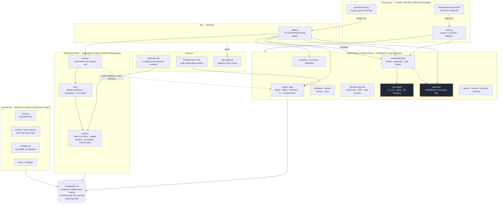
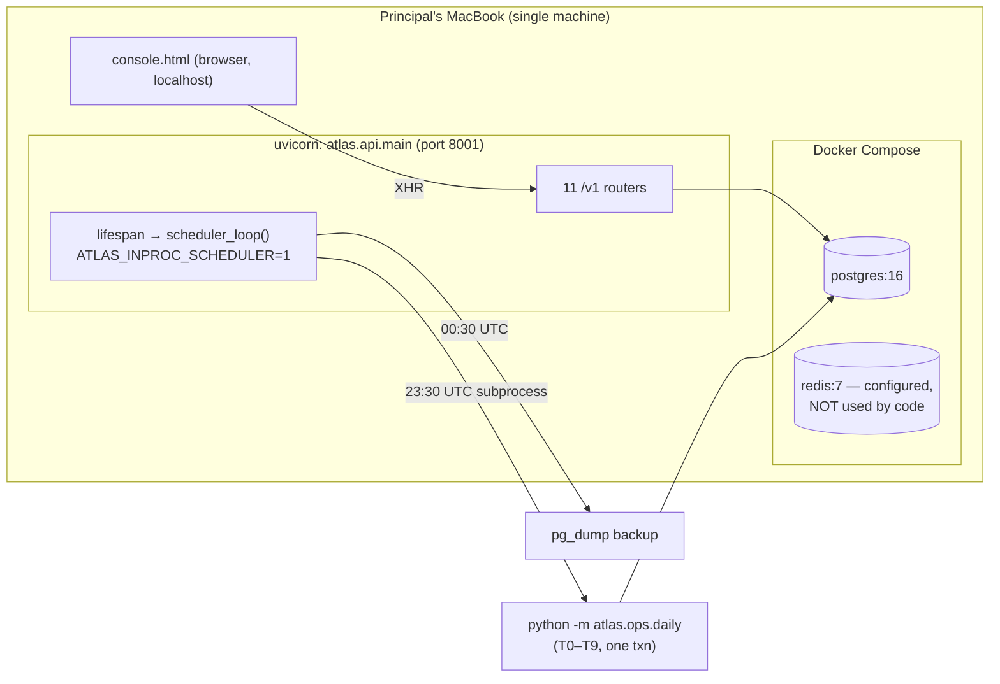
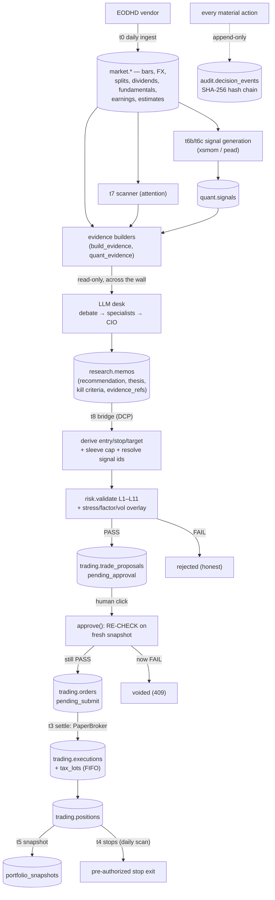
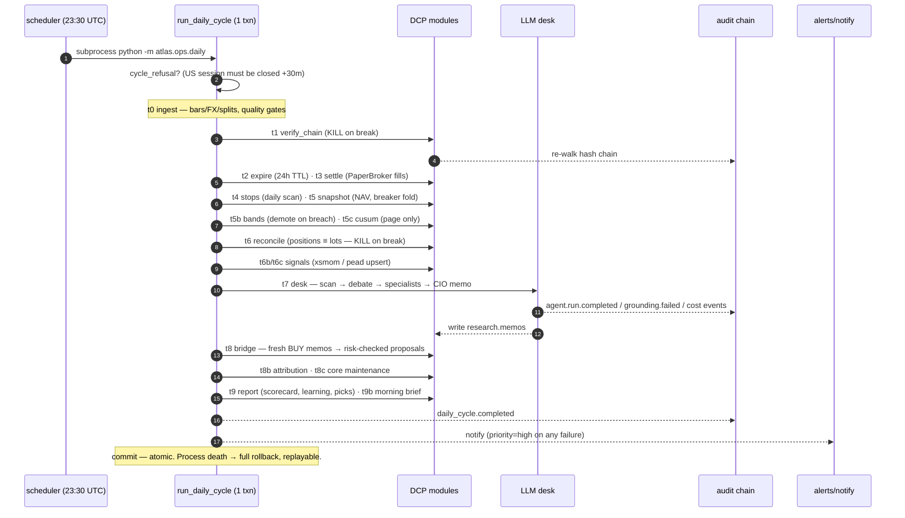

# 02 — System Architecture

**Atlas AI Capital** · paper-mode research/simulation system · ~months old · one Principal + AI pair · single machine
**Scope of this document:** the *as-built* architecture, verified against source. Where the signed design docs (`docs/architecture/01`, `07`) describe something the code does not implement, this document trusts the code and flags the gap explicitly (see [§12 Design-vs-Code Drift](#12-design-vs-code-drift-read-this)).

> Reviewer's note: This is a paper-only simulator. There is **no broker connection**, **no real capital**, and **no live trading** (it is an unbuilt, human-gated future phase). Nothing here is production-grade. Read [§13 Weaknesses / Debt / Open](#13-weaknesses--debt--open) before drawing any maturity conclusion.

---

## 1. What the system is, in one screen

Atlas simulates the *decision discipline* of a hedge fund over a hypothetical A$100k long-only US+India-ADR equity book. Its spine is a single structural idea: **split the machine into a plane that owns every number and a plane that only reasons in words, and wall them apart so the reasoning plane can never touch money.**

- **Deterministic Compute Plane (DCP)** — `atlas/dcp/**` (~26k LOC). Pure Python over Postgres + vendor bars. Owns ingestion, indicators, signals, backtesting, the risk engine, sizing, the trade lifecycle, the paper broker, reporting. Same inputs → same outputs, replayable under an injectable clock.
- **Reasoning Plane (the "desk")** — `atlas/agents/**` (~3.7k LOC). LLM roles (debate, specialists, CIO) that read DCP-built evidence and emit **memos only** — a recommendation enum, thesis, kill criteria, dissent, and evidence references. No agent output is ever a sizing, pricing, or execution number.
- **The bridge** — `atlas/dcp/trading/bridge.py`. The *single* deterministic path from a memo to a sized, stop-derived, risk-checked proposal. It lives in the DCP, imports no agent code, and derives every number from vendor bars alone.
- **Control surface** — one FastAPI process (`atlas/api/main.py`, port 8001) serving a single-file HTML console. The same process *is* the scheduler that fires the nightly T0–T9 cycle.
- **Audit spine** — an append-only SHA-256 hash chain (`audit.decision_events`) that every material action writes to.

Everything safety-critical (risk limits, stops, reconciliation) runs with **zero LLM dependencies** by construction.

---

## 2. The two-plane wall (the load-bearing decision)

The wall is not a convention — it is a test that fails the build. `tests/unit/test_boundaries.py` walks the AST of every module and asserts two import rules:

```python
# tests/unit/test_boundaries.py:24
def test_dcp_never_imports_agents():
    bad = [(f, m) for f, m in _imports("dcp") if m.startswith("atlas.agents")]
    assert not bad, ...

# tests/unit/test_boundaries.py:29
def test_agents_never_import_risk_or_execution():
    bad = [(f, m) for f, m in _imports("agents")
           if m.startswith(("atlas.dcp.risk", "atlas.dcp.execution"))]
    assert not bad, ...
```

**Verified empirically (2026-07-20):** `grep` across the tree finds *zero* crossings in either direction. The compute plane never imports agents; agents never import `dcp.risk` or `dcp.execution`. Agents *do* import other DCP modules — but only read-only evidence builders (`dcp.market_data`, `dcp.indicators`, `dcp.backtest.quant_evidence`, `dcp.signals.*.generate.extract_*_evidence`). The agent can *read* the compute plane's facts; it cannot reach the veto or the broker even in code.

The wall has three enforcement layers, each independent:

| Layer | Mechanism | Evidence |
|---|---|---|
| **Import isolation** | AST boundary test | `tests/unit/test_boundaries.py` |
| **No agent numbers** | Pydantic schema rejects execution-shaped numerics in narrative; a BUY with no evidence refs is a `ValueError` | `atlas/agents/schemas/memo.py:14` (`_EXEC_NUMBER` regex), `:35` (`constitution_gates`) |
| **Grounding cage** | Every numeric token in a narrative must appear *verbatim as a standalone token* in cited evidence, else the run fails closed | `atlas/agents/runtime/grounding.py:78` (`grounding_violations`) |

The schema is described in code as "a security control, not a convenience: an agent output that fails these models is a failed run, full stop" (`atlas/agents/schemas/memo.py:1`).

> **[IMPLEMENTED]** — the wall is real, tested, and empirically clean. This is the strongest part of the system.

---

## 3. Component diagram



The red-bordered `risk` and `execution` boxes are the two modules the reasoning plane is forbidden to import.

---

## 4. Repository structure (as-built)

```
atlas/
├── core/                 # shared kernel — imports nothing else from atlas/
│   ├── clock.py          # injectable time (SystemClock / FrozenClock)
│   ├── audit.py          # hash-chain math (pure, unit-testable)
│   ├── audit_repo.py     # Postgres-backed append-only log (advisory-locked)
│   ├── workflow.py       # WorkflowRunner: resumable checkpointed node graph
│   ├── config.py         # pydantic-settings, env-injected (ATLAS_*)
│   └── db.py             # SQLAlchemy session_scope()
│
├── dcp/                  # ★ DETERMINISTIC COMPUTE PLANE ★ (~26k LOC, 119 files)
│   ├── market_data/      # ingest, adjustment, calendars, FX, fundamentals,
│   │   └── adapters/      #   earnings, estimates · eodhd.py + fixture.py
│   ├── indicators/       # pure functions (wilder_atr, sma, rolling_return)
│   ├── signals/          # xsmom/ (approved) · pead/ (suspended) + registry
│   ├── scanner/          # v1.py — attention ranking (ADR-0007), not alpha
│   ├── backtest/         # 7.4k LOC gauntlet: null-model, DSR, walk-forward
│   ├── risk/             # ★ engine.py (L1–L11), sizing, stress, breakers ★
│   ├── trading/          # bridge · proposals · exits · bands · core_allocation
│   ├── execution/        # paper.py (PaperBroker) — only 172 LOC, no live broker
│   ├── portfolio/  reporting/  research/  features/  learning/  factory/
│   └── scorecard.py
│
├── agents/               # ★ REASONING PLANE ★ (~3.7k LOC, 25 files)
│   ├── runtime/          # llm.py (httpx) · runner.py · grounding.py · budget.py
│   │                     #   registry.py · untrusted.py
│   ├── roles/            # debate.py · specialists.py · cio.py · committee.py
│   ├── schemas/          # memo.py · debate.py · specialist.py · roles.py
│   ├── prompts/          # constitution.md + per-role templates (hashed)
│   ├── desk.py           # the callable the daily cycle runs
│   ├── live_run.py  shadow_compare.py  evals/
│
├── api/                  # FastAPI app
│   ├── main.py           # 11 routers + /console + in-proc scheduler lifespan
│   └── routers/          # system market portfolio audit quant factory
│                         #   research risk trading learning reporting
│
├── ops/                  # daily.py (T0–T9) · scheduler.py · alerts.py
│                         #   analyze.py · screen.py · recipes.py · ingest_picks.py
├── tools/                # verify_chain · activate_universe · derive_bands · doctor …
├── dashboard/            # console.html (the real UI) + dossier.html
│                         #   + overview.py/pages/ (Streamlit REMNANTS, unused by main)
└── fxlab/                # FX research sandbox (3/3 gauntlet FAIL — graveyard)

migrations/               # 34 alembic migrations (raw SQL, 0001..0032+)
docs/architecture/ (9)  docs/adr/ (17 signed)  docs/reports/ (22)
tests/  unit/ integration/ constitution/  (1,454 test fns by def-count; ~1,515 collected w/ parametrization, 36.5k LOC)
```

**Note the divergences from `docs/architecture/07`:** there is **no `atlas/workflows/` package** (orchestration is `core/workflow.py` + `ops/daily.py`), **no `atlas/api/auth.py`**, and the `dashboard/` Streamlit files (`overview.py`, `pages/`) are dead remnants — the live UI is the single `console.html` file. See [§12](#12-design-vs-code-drift-read-this).

---

## 5. The AI desk (reasoning plane) in detail

### 5.1 Roles that actually exist

`docs/architecture/01 §3.2` enumerates ~13 agent roles (scanner, analyst, macro, sector specialists, quant research, quant validation, CIO, CRO, stress, PM, attribution, trader, compliance). **The code implements a much smaller set:**

| Role | File | Status | Notes |
|---|---|---|---|
| Bull/Bear debate (+ rebuttals) | `atlas/agents/roles/debate.py` | **[IMPLEMENTED]** | 4 LLM calls; adversarial; advisory only, opens no gate (`debate.py:3`) |
| Specialist panel (quality/growth/macro) | `atlas/agents/roles/specialists.py` | **[IMPLEMENTED]** | runs only for signal-lane names, to protect budget (`desk.py:126`) |
| CIO committee memo | `atlas/agents/roles/cio.py` | **[IMPLEMENTED]** | the only role that emits the actionable `CommitteeMemo` |
| Deterministic scanner | `atlas/dcp/scanner/v1.py` | **[IMPLEMENTED]** | *not an LLM* — attention ranking, lives in the DCP |
| Sentiment analyst | — | **[PLANNED — NOT BUILT]** | deferred (needs social-media corpus) |
| CRO / stress / PM / attribution / trader / compliance agents | — | **[PLANNED — NOT BUILT]** | narrated by deterministic code where needed; no LLM role exists |

The "CRO veto" in the design is, in code, simply the risk engine; there is no CRO LLM. The design's org chart is aspirational; the built desk is **debate → (specialists) → CIO memo**, per symbol.

### 5.2 The cage around every LLM call

Every role call goes through `run_agent` (`atlas/agents/runtime/runner.py:224`), which enforces, in order:

1. **Prompt pinning** — the constitution is prepended to every template and the pair is SHA-256 hashed; the hash is recorded per run (`runner.py:199` `load_template`). Prompts are code (invariant 5).
2. **Budget breaker** — `spend_and_check` sums today's `research.agent_runs.cost_usd` and raises `BudgetExhausted` past the global $10/day cap (`atlas/agents/runtime/budget.py`), then a per-surface watermark ($6 nightly / $3 analyze / $3 shadow) via `budget_surface` (`runner.py:169`). The global cap always wins. (Those are the `SURFACE_BUDGET_DEFAULTS_USD` code defaults; per ground truth the Principal raised analyze to **$5** for the current run via `ATLAS_BUDGET_ANALYZE` — the running value may differ from the $3 default.)
3. **Per-model pricing, fail-closed** — a hard-coded, dated rate table (`runner.py:56`); an unpriced model bills at the *highest* legacy rate ($15/$75) so the breaker can never under-count.
4. **Schema validation** — `output_model.model_validate`; on failure, up to `SCHEMA_MAX_ATTEMPTS=3` (1 call + 2 retries), each re-prompting with the recorded violation text via a hashed retry template.
5. **Grounding verification** — `grounding_violations` (`grounding.py`); an ungrounded number takes the schema-fail path and emits an `agent.grounding.failed` audit event.
6. **Transient vs cage failure semantics** — HTTP 429/5xx/timeout back off and retry in place, then surface as `TransientLlmFailure` (a per-symbol skip, not a verdict); everything else is a cage hold (`runner.py:112` `_is_transient`).
7. **Untrusted-content wrapping** — external text (news) is fenced as data via `wrap_untrusted` so it cannot act as instructions (`roles/debate.py:86`).

Adversarial coverage lives in `tests/constitution/` (12 test files: grounding, memo-evidence, debate red-team, budget sub-caps, desk-failure semantics, …).

### 5.3 Models and transport

- **No Anthropic SDK.** The client is a hand-rolled `AnthropicClient` over `httpx` (`atlas/agents/runtime/llm.py`), plus an `OpenAICompatClient` for a LAN/local model. Per-role model routing: `ATLAS_MODEL_<ROLE>` → `ATLAS_MODEL_DEFAULT` → built-in default `claude-sonnet-4-6` (`registry.py:31,46`).
- Clients are cached per `(role, model, key, url)` to stop connection-pool leaks (a real defect fixed 2026-07-14, documented in `registry.py:9`).
- **[EXPERIMENTAL]** Shadow-mode model comparison (`shadow_compare.py`) runs logged-but-non-actionable; a model switch is a Principal registry decision.

---

## 6. The DCP (compute plane) in detail

### 6.1 Risk engine — `atlas/dcp/risk/engine.py`

The most rigorously tested module (the only one at **100% branch coverage**, `make cov-risk`). `validate` (`engine.py:256`) evaluates **every** L-rule with no short-circuit so a FAIL explains itself completely, against a *worst-case pro-forma* portfolio (existing holdings + approved-but-unfilled orders as if all execute):

| Rule | Meaning (limit_set v2 `small_aum`) |
|---|---|
| L1 | max single stock 8% |
| L2 | max ETF 15% / core-index ETF 60% (allowlisted SPY/INDA only) |
| L3 | max sector 25% (Broad ETFs exempt) |
| L4 | India sleeve ≤ 30% (with ADR/ETF look-through) |
| L5 | min cash 10% |
| L6 | risk/trade ≤ 1% (DD1 halves it) |
| L7 | aggregate open (stop-based) risk ≤ 6% |
| L8 | pairwise-correlation concentration (0.8 threshold, 12% combined-weight) |
| L9 | ≤ 2 new positions/day |
| L10 | ≤ 5% of 20-day ADV (unknown ADV → fail closed) |
| L11 | ≤ 85% non-AUD exposure |

Sizing (`size_position`, `engine.py:406`) is the binding minimum of the L6 risk budget, the L1/L2 weight cap, and the L10 liquidity cap, floored to whole lots, with a A$2,000 minimum economic position. **Size is an output of risk, never conviction.** Drawdown breakers DD1/DD2/DD3 latch — `next_breaker_state` (`engine.py:59`) enforces the latch (agents cannot clear it), while the **dual-confirmation** resumption rule (≥1h gap between the two human confirmations) lives in `risk/clearance.py`, not in `engine.py`. A property test proves the **unwired** vol-target scaler never exceeds `MAX_GROSS = 0.80`; the *live* wired gross gate (`gross_step_gate`, `vol_target.py`) instead caps deployment at `1 − L5` = **0.90** under limit-set v2 (10% cash floor), so the book can deploy up to ~90% gross, not 80%.

**[NOT IMPLEMENTED]:** VaR, CVaR, explicit beta targeting, a portfolio optimizer (equal-weight only), intraday/live market-risk monitoring. Stops are pre-authorized exits scanned **daily** (T4) — there is no intraday stop monitoring.

### 6.2 The bridge — `atlas/dcp/trading/bridge.py`

The sole memo→proposal path (ADR-0006). For each fresh non-shadow committee BUY memo (≤48h old), it:

- derives `entry` = latest EODHD close (fail-closed on staleness);
- derives `stop` = `max(entry − 2·ATR(14), entry·0.90)` and `target` = `entry + 2R` (`derive_prices`, `bridge.py:357`) — ATR from *exactly* the last 15 vendor sessions, any NULL in-window → skip;
- resolves evidence refs to **real** `quant.signals` UUIDs (a signal-shaped ref with no row fails the memo closed — refuses to fabricate lineage, `bridge.py:236`);
- applies scope guards (open position, live proposal/order, earnings-print imminent within 2 sessions, re-entry cooling within 10 sessions) — each recorded as a typed skip;
- applies the **sleeve budget cap** (ADR-0017: momentum 40% of NAV, PEAD 0%) as an *outer whole-share cap* passed into `build_proposal` that can only shrink the risk-engine size, never grow it;
- calls `build_proposal`, which sizes → validates L1–L11 → applies stress/factor/vol overlays → persists.

A risk FAIL is an **honest recorded outcome** (`state='rejected'`, verdict on the report), never an error. One `trading.bridge.completed` audit event per run carries the full ref→uuid mapping so lineage stays reconstructible.

> The `atlas/agents/desk.py:8` module docstring still claims "the memo->proposal bridge is deliberately absent." **That comment is stale** — the bridge is built, signed (ADR-0006), and wired into the cycle (`ops/daily.py` t8). Flagged in [§12](#12-design-vs-code-drift-read-this).

### 6.3 Paper broker — `atlas/dcp/execution/paper.py`

`PaperBroker.submit` (`paper.py:143`) fills an order at the **next session's open price** from stored vendor bars, with the backtester's `CostModel` bps applied (10 bps/side: 5 commission + 5 slippage), and returns `None` (stays pending) until the bar, its open time, and its fill-date FX are all ingested. No wall clock anywhere — replaying a day yields byte-identical fills.

**This is optimistic vs real markets:** next-open at the printed open price, a **flat 10 bps** cost with *no* spread, market-impact, or borrow modelling, and no partial-fill/queue dynamics. Reconciliation is paper-vs-paper (we *are* the broker).

---

## 7. Services & runtime topology

There is essentially **one process**. `docker-compose.yml` defines only `db`, `redis`, and `api` (no separate `worker`/`scheduler`/`dashboard` services the design imagined).



Key facts (all code-verified):

- **The API process is the scheduler.** With `ATLAS_INPROC_SCHEDULER=1` (the gate at `api/main.py:43`), `main.py`'s lifespan starts `scheduler_loop()` via `asyncio.create_task` (`api/main.py:46`), a **wall-clock 30-second tick** that fires the cycle at 23:30 UTC and a backup at 00:30 UTC (`ops/scheduler.py:158`). Ticking (not one long `asyncio.sleep`) is deliberate — monotonic sleep pauses when the laptop lid closes and silently skips fires (three such misfires observed live, `scheduler.py:147`).
- **The cycle runs as a subprocess** for crash isolation and an honest exit code; it streams `@@CYCLE` JSON progress lines the console animates (`scheduler.py:69`).
- **Redis is configured but unused.** `redis_url` exists in `config.py` and compose runs a container, but **no code imports a Redis client** — the "Redis Streams event bus" of the design does not exist. The event bus in practice is the Postgres audit chain (Postgres is the sole source of truth).
- **Backups have never run.** launchd is TCC-blocked from `~/Documents` (exit 127); the in-process scheduler's backup is the only path, and per ground truth the first-ever backup was only scheduled after the fact.
- **The compose services publish to `0.0.0.0`, not loopback.** `docker-compose.yml` publishes `db` (`ports: ["5432:5432"]`), `redis` (`["6379:6379"]`) and `api` (`["8000:8000"]`), and the `Dockerfile`/compose `api` command binds `uvicorn … --host 0.0.0.0`. Docker binds published ports to the host's `0.0.0.0` by default, so the documented `docker compose up -d db redis` workflow (CLAUDE.md:29) makes the **literal-password Postgres and passwordless Redis reachable on every host/LAN interface, not `127.0.0.1`**. The Mac *API* runs separately via `make api` (`uvicorn … --port 8001`, no `--host` → uvicorn's loopback default), but the container image's shipped default is a `0.0.0.0` API bind. See 14_SECURITY §1/§4.1/§5.

---

## 8. Data flow



**Two lanes converge at proposals:** the *agent lane* (memo → bridge, discretionary, one name at a time, no averaging down) and the *core-allocation lane* (`t8c`, ADR-driven rebalancing of the passive core — though ADR-0017 has since retired the ETF core, leaving the book satellite-only). Both go through the identical risk gate.

---

## 9. Sequence — the nightly T0–T9 cycle

`run_daily_cycle` (`ops/daily.py:317`) assembles 17 nodes into a `WorkflowRunner` graph and runs them in **one Postgres transaction** under `run_id = daily-<date>`. Node order encodes policy: gates before trading; **settle before stops** (a position entered this cycle is stop-protected the same cycle); snapshot after all fills; chain verified before the book is touched. Fail-soft nodes (desk, bridge, bands, attribution, learning…) page but never undo the settled book; a **chain break or reconciliation break is a KILL** (raises immediately).



A subtle but important property: the desk's LLM calls (t7) happen **inside** the single day-long transaction, so the process holds one Postgres connection/transaction open across potentially minutes of external API latency. This is called out as a real concern in `llm.py:20` and is a debt item ([§13](#13-weaknesses--debt--open)).

---

## 10. Sequence — memo → bridge → proposal → approval → fill

```mermaid
sequenceDiagram
    autonumber
    participant CIO as CIO memo (agent)
    participant BR as bridge (DCP)
    participant RE as risk engine
    participant DB as Postgres
    participant P as Principal (console)
    participant PB as PaperBroker

    CIO->>DB: research.memos (BUY, evidence_refs, kill criteria) — words only
    Note over BR: t8 — the ONLY memo→proposal path
    BR->>DB: candidate? non-shadow BUY, ≤48h, not already bridged
    BR->>BR: entry=latest close; stop=max(entry−2·ATR14, entry·0.90); target=+2R
    BR->>DB: resolve evidence_refs → REAL quant.signals uuids (else fail closed)
    BR->>BR: scope guards (open pos / live order / earnings / re-entry cooling)
    BR->>BR: sleeve cap (momentum 40% NAV → whole-share cap)
    BR->>RE: build_proposal → size_position (§4) → validate L1–L11 + overlays
    alt risk PASS
        RE->>DB: trade_proposals state=pending_approval (+ risk_check_id), 24h TTL
    else risk FAIL (honest)
        RE->>DB: trade_proposals state=rejected (+ FAIL check) — terminal
    end
    Note over P: proposal appears in console approval queue
    P->>DB: POST /v1/trading/proposals/{id}/approve {acknowledged_risks:true}
    DB->>DB: verify pending_approval & not expired
    DB->>RE: RE-RUN risk check on FRESH snapshot/prices/limits (no grandfathering)
    alt re-check still PASS
        DB->>DB: approvals + orders (pending_submit), audit: proposal.approved (actor=human)
    else re-check now FAIL
        DB->>DB: state=voided; 409 RISK_RECHECK_FAILED (commits the void)
    end
    Note over PB: t3 next cycle
    PB->>DB: fill at next session OPEN + 10bps; executions + FIFO tax_lots
    PB->>DB: positions opened; snapshot marks NAV
```

Three things a hostile reviewer should note as genuinely enforced:

1. **The re-check is authoritative** (`proposals.py:912` `approve`). The console cannot rubber-stamp a stale proposal; a now-FAIL *commits the void* before returning 409. Fresh prices, fresh limits, no grandfathering (Doc 04 §2.2).
2. **`acknowledged_risks` is required** but is the *only* gate — there is no login, token, or scope check (see security below). (`ApproveBody.acknowledged_risks`, `trading.py:141`.)
3. **Structural FK constraint:** a proposal cannot sit in `pending_approval` without a risk-check reference (`pending_approval_requires_check`, enforced in DB; `proposals.py:757`).

---

## 11. Technology stack (as-built, not as-designed)

| Layer | Built | Designed (docs) but **not** built |
|---|---|---|
| Language | Python 3.12, typed | — |
| API | FastAPI + Pydantic v2 (`api/main.py`) | — |
| Orchestration | `core/workflow.py` `WorkflowRunner` (resumable checkpoints) + `ops/daily.py` | **LangGraph** (never used) |
| Scheduler | In-process asyncio tick loop in the API process | separate scheduler/worker services |
| UI | Single-file `console.html` (2,264 lines, inline JS/CSS) served by FastAPI | **Streamlit** (dep declared, files are dead remnants) |
| DB | PostgreSQL 16, 9 schemas, 34 raw-SQL alembic migrations | — |
| Event bus | Postgres audit hash chain | **Redis Streams** (Redis configured, unused) |
| LLM transport | Hand-rolled `httpx` client (Anthropic Messages API + OpenAI-compat) | Anthropic SDK |
| Audit | SHA-256 hash chain, advisory-locked appends (`audit_repo.py`) | — |
| Time | Injectable `Clock` (`core/clock.py`) | — |
| Testing | pytest + hypothesis; 1,454 test fns by `def test_` count (~1,515 collected w/ parametrization); 100% branch coverage on `dcp/risk` only | import-linter (replaced by AST test); global coverage gate |
| CI | GitHub Actions `ci.yml`: ruff → mypy → pytest → migration check, on push/PR | multi-stage pipeline w/ backtest-regression & nightly constitution jobs |
| Secrets | Plaintext `.env` via pydantic-settings; DB password default `atlas_local_only` | Docker secrets, DB roles (`agent_reader`/`dcp_writer`/`audit_writer`) |
| Auth | **None** on the API | dashboard auth + step-up token + live-arming 2FA |

CI note: `ci.yml` **does** run `pytest` against a Postgres service on every push/PR (the "no CI" worry in ground truth is partly overstated — it runs the suite; what it lacks is backtest-regression, constitution-nightly, and any deploy stage). mypy runs but is strict only on `core`/`dcp`/`fxlab` (configured in `pyproject.toml`), not `api`/`ops`/`agents`.

---

## 12. Design-vs-Code drift (read this)

The signed architecture docs (`01`, `06`, `07`) predate the build and describe a substantially different, more elaborate system. **Trust the code.** Material divergences:

| Design doc says | Code reality | Severity |
|---|---|---|
| LangGraph state-graph orchestration | `WorkflowRunner` hand-rolled checkpoint runner | cosmetic (functionally equivalent) |
| Streamlit dashboard | Single `console.html`; Streamlit files are dead | low (main.py notes the deviation) |
| Redis Streams event bus | Redis unused; Postgres audit chain is the bus | medium (design overstates infra) |
| `atlas/workflows/` package, `atlas/api/auth.py` | Neither exists | low |
| ~13 agent roles incl. CRO/PM/compliance/attribution *agents* | ~3 LLM roles (debate/specialists/CIO) + deterministic scanner | **high** — the agent org is largely aspirational |
| DB roles `agent_reader`/`dcp_writer`/`audit_writer`; agents "literally cannot write risk limits" | Migration 0001 builds **two** least-privilege `NOLOGIN` roles — `atlas_audit_writer` (INSERT-only on `audit.decision_events`, `0001_initial.py:113,120`) and `atlas_agent_reader` (SELECT, actively maintained with grants across ~14 migrations: 0001–0004, 0010, 0013–0016, 0019, 0020, 0024, 0025, 0027, 0029, 0031, 0033). The third designed role (`dcp_writer`) is **not built** (grep: none). But the app connects as schema-owner `atlas` (`config.py:8`) and **never `SET ROLE`s** (grep across `atlas/`+`migrations/`: none), so the scaffold is **present-but-inert at runtime** — the wall is actually enforced by *import isolation + schema*, not by DB grants | **medium** — the least-privilege layer is **built and fully granted but never assumed at runtime**, so it provides zero runtime defense-in-depth: it is *inert*, not "absent" (the earlier "single DB role / layer absent (high)" claim was factually wrong), and `dcp_writer` alone is genuinely missing |
| Dashboard auth, step-up token, live 2FA | No auth of any kind | **high** (see §12.1) |
| `desk.py` docstring: "bridge deliberately absent" | Bridge built (ADR-0006), wired into t8 | doc/comment staleness |
| `bridge.py:88-99` docstring: sleeve = "momentum 10% + PEAD 10%" (ADR-0014) | Live `SLEEVE_BUDGET_FRACTION` (`bridge.py:230`) = **40% / 0%** (ADR-0017) | doc/comment staleness — the file self-contradicts; the doc reports the live 40%/0% |

### 12.1 Security posture — stated plainly

- **The API has no authentication or authorization whatsoever.** No `Depends`, `Security`, bearer, or API-key check exists in any router (verified by grep). No login, no session, no RBAC, **no CORS configuration** (no `add_middleware`). The only "gate" on approving a trade is a boolean `acknowledged_risks` in the request body (`trading.py:141`). `trading.py:15` openly defers step-up/scope "to the auth phase." This is tolerable *only* because it is a single Principal on a localhost console with no real capital — it would be disqualifying for anything networked or live.
- **Secrets in plaintext `.env`** (Anthropic + EODHD keys, DB creds), DB password a literal default `atlas_local_only` (`config.py:8`). No secrets manager, no TLS on the API, no encryption at rest. Repo is public on GitHub (`.env` gitignored). Nothing loads `.env` into `os.environ` automatically — a manual restart dropped the Anthropic key and produced 401s (ground truth).
- **Live "arming" is designed but unbuilt.** `trading_mode` defaults to `paper`; live is gated behind human arming that does not exist yet.

---

## 13. Weaknesses / Debt / Open

**Concentration (existential to the "fund"):** one validated strategy (`xsmom-pit-tr`), one funded sleeve (40% momentum, rest cash — the ETF core was retired by ADR-0017), one data vendor (EODHD, single-vendor lock-in), one machine (the Principal's MacBook), one Principal. The entire invested book rests on a single concentrated top-5 momentum backtest whose headline +737% travels with a large drawdown (its own demotion band is −40%); the DSR/null/walk-forward are the real evidence, not the return. As of ground truth the book is **100% cash**.

**Fidelity of the paper simulation:** next-open fills at the printed open, **flat 10 bps** cost with no spread/impact/borrow, no partial fills, daily-granularity stops (no intraday monitoring), paper-vs-paper reconciliation. Backtest/paper share the cost convention, which is honest, but the convention itself is optimistic.

**Research blocked by data:** EODHD provides **no point-in-time fundamentals** and none for pre-2018 delistings, so value/quality factor families are **impossible to build honestly and are not built**. A vendor decision (Sharadar SF1) is open, awaiting the Principal. **Direct India (NSE/NIFTY 50) is also data-blocked:** EODHD has **zero NSE coverage**, so the India sleeve is **ADR/ETF-only** (INDA and US-listed ADRs); a direct-NSE vendor procurement is an open Principal decision.

**Operational fragility (the weak spot):** single machine; launchd supervision is dead (TCC-blocked → the "redundant" scheduler and backups never ran; zero backups taken historically); iCloud syncs `~/Documents` and can create conflict-copies under heavy writes. A Linux migration is recommended and deferred. Monitoring is an optional ntfy webhook (`ATLAS_ALERT_URL`) that degrades to stderr when unset.

**Architectural debt found in the code itself:**
- The nightly cycle runs **all 17 nodes in one transaction**, holding a Postgres connection open across the desk's minutes-long LLM latency (`llm.py:20`, `ops/daily.py`). Long lock/connection hold; a mid-cycle failure rolls back the whole day (correct, but coarse).
- `console.html` is a **2,264-line single file** with inline JS/CSS — a maintainability hotspot. (The stale "2,770" figure that circulated is `console.html` 2,264 + `dossier.html` 506 summed.)
- **Injectable-time leak:** the budget breaker's `spend_and_check` uses SQL `CURRENT_DATE` when no `day` is passed (`budget.py:16`), and the runner calls it without a day — a wall-clock read inside a constitutional control, a minor violation of invariant 6 (the ops layer is a documented exception, but this sits in the agent runtime).
- Streamlit/`workflows`/Redis remnants and stale docstrings (the `desk.py` "bridge absent" comment) mislead a reader who trusts comments over code.

**Testing gaps:** no performance/load/stress tier; global coverage is not measured (only `dcp/risk` at 100% branch); mypy strict excludes `api`/`ops`/`agents`. The suite passes (~65s) but several real bugs were found and fixed *this week* (flaky-suite ghosts, SPY resolution tiebreak, test-DB column-budget leak, retry-desync) — the codebase is actively churning.

**Experimental / measured-never-applied (do not mistake for live capability):** the learning loop (Brier-scored conviction weights computed and displayed, applied nowhere; Tier-1 activation needs a future Principal signature and ~60 sessions of labels), the opportunity-screen edge trial, source-pick grading, the PEAD forward experiment, and the estimate-revisions archive are all research surfaces that reach **no capital** by invariant 2. The **Research Factory** phases 1–2 (recipe backtests over the family grid, family definitions) are built and run, but **machine-authored hypotheses (phase 3) and the adoption-to-capital pipeline are [PLANNED — NOT BUILT]** — the factory measures candidate recipes; nothing promotes a factory output into a signed sleeve automatically.

---

## 14. What is genuinely strong (for balance)

The wall (§2), the append-only audit hash chain (`core/audit.py`, tamper- and deletion-detecting, advisory-locked), injectable time enabling deterministic replay, the fail-closed grounding cage, the 100%-branch-covered risk engine with the FAIL-is-terminal / re-check-at-approval discipline, and the "honest failures are deliverables" culture (a graveyard of documented strategy rejections where gates were never weakened) are real, code-enforced, and unusual for a system this young and this small. The architecture's *spine* is sound; its *breadth* (agent org, infra, security, ops redundancy) is largely aspirational or absent.
