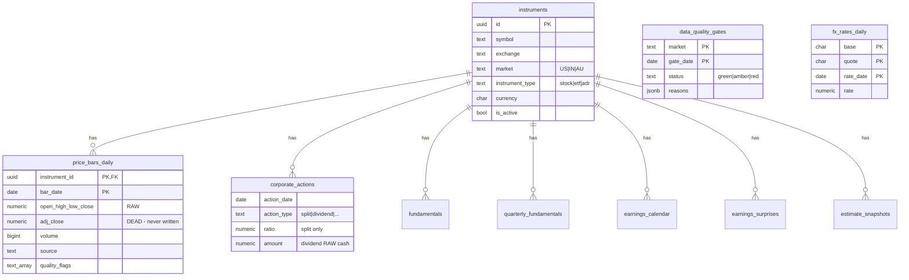
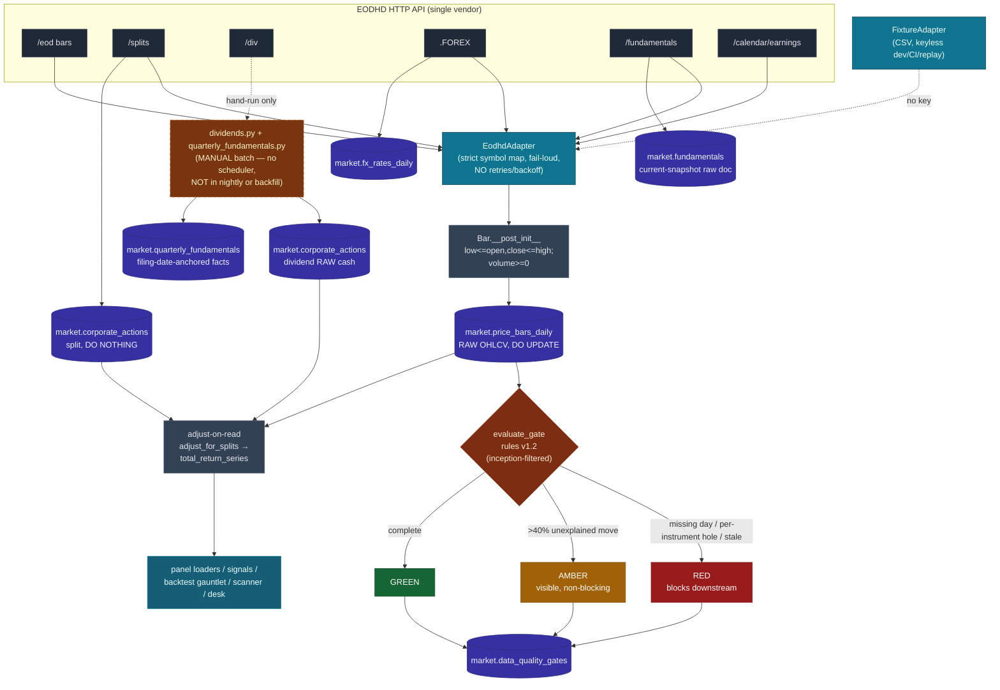

# 03 — Data Pipeline

**Scope:** Every market-data source, the full ETL (ingest → adjust-on-read → quality gate → store), corporate-actions handling, survivorship treatment, missing-value semantics, and the two headline data risks. Paper-mode research system, ~months old, one Principal + AI pair, single machine.

**Audience:** senior engineers + quant researchers. **Posture:** adversarial self-review. Claims are anchored to code with clickable paths; capabilities are tagged. Where behaviour is asserted but not empirically confirmed here, it is flagged ASSUMPTION.

---

## 0. TL;DR — the two things a committee should not miss

1. **Single-vendor lock-in.** EODHD "All-In-One" ($99/mo) is the *only* live market-data source: daily bars, splits, dividends, FX, current fundamentals, earnings calendar/surprises, and analyst-estimate snapshots all come from one HTTP API behind one API key (`atlas/dcp/market_data/adapters/eodhd.py`). The only alternative adapter is a **CSV fixture reader** for keyless dev/CI/replay (`atlas/dcp/market_data/adapters/fixture.py`) — it is *not* a redundant data source. There is no second vendor, no cross-vendor validation, and no failover. A vendor outage, a silent tick error, or a licensing change stalls or corrupts the entire plane. Cross-vendor tick disagreement is structurally undetectable; the only bad-data catch is a **±40% close-to-close AMBER heuristic** (`quality.py:50`).

2. **The PIT-fundamentals gap.** EODHD delivers **current-snapshot** fundamentals with **no restatement vintage chain** (one figure per quarter, silently overwritten on restatement) and **no fundamentals at all for pre-2018 delistings** (`docs/reports/pit-fundamentals-vendor-decision.md`). This blocks a *survivorship-free, deep-history* value/quality factor panel. A vendor decision (Sharadar SF1 recommended, ~$69/mo) is **OPEN, awaiting the Principal**. **Nuance the ground-truth file overstates (see §14):** EODHD's quarterly `Financials` blocks *do* carry `filing_date`, so a **partial**, filing-date-anchored quarterly fundamentals store *was* built (`quarterly_fundamentals.py`, migration `0026`) and a GP/A quality signal *was* run on it (and failed the null gate). "No filing dates / value+quality unbuildable" is too strong; the honest statement is narrower and in §11/§14.

Everything else in this document is detail supporting or bounding those two facts.

---

## 1. Data-source inventory

| Source | Adapter | What it provides | Update cadence (as used) | Live-tag |
|---|---|---|---|---|
| **EODHD "All-In-One"** | `EodhdAdapter` | Daily OHLCV bars, splits, cash dividends, FX (`.FOREX`), earnings calendar, current fundamentals doc, quarterly financial statements, analyst estimates, historical index membership | Nightly incremental (bars/FX/splits), weekly (fundamentals/earnings staleness throttle), daily (estimate archive) | [IMPLEMENTED] |
| **CSV fixtures** | `FixtureAdapter` | Same interface, read from `tests/fixtures/**` CSV/JSON | On demand (deterministic) | [IMPLEMENTED] |
| Sharadar SF1 / Intrinio / Tiingo / FMP / SimFin | — | *True* PIT fundamentals incl. delisted names | — | [PLANNED — NOT BUILT] — decision open, `pit-fundamentals-vendor-decision.md` |
| NSE (India direct) | — | Indian equities | — | [PLANNED — NOT BUILT] — EODHD has zero NSE coverage; India is ADR-only |

**Adapter selection** is by presence of the API key: `adapter_from_settings()` returns `EodhdAdapter` when `ATLAS_EODHD_API_KEY` is set, otherwise the fixture reader (`atlas/dcp/market_data/adapters/__init__.py:25`). Both satisfy the same `MarketDataAdapter` Protocol (`adapters/base.py:12`), so every downstream job is vendor-agnostic by construction — the one genuine structural hedge against lock-in.

### EODHD — provider facts

| Attribute | Value | Evidence |
|---|---|---|
| Base URL | `https://eodhd.com/api` | `adapters/eodhd.py:19` |
| Auth | `api_token` query param (plaintext key from `.env`) | `eodhd.py:92` |
| Transport | single `httpx.Client`, **30 s timeout**, `raise_for_status()` | `eodhd.py:76`, `:93` |
| **Retries / backoff / rate-limit handling** | **NONE** — one request, raise on non-2xx | `eodhd.py:90-95` |
| Cost | **$99/mo** All-In-One (fundamentals-only tier $59.99) | `pit-fundamentals-vendor-decision.md` [31] |
| Licensing | internal research, no redistribution assumed; a fund entity may be pushed to a **separate professional track** — **OPEN** | vendor report §3 item 8 |
| Update frequency | end-of-day (not intraday); FOREX final at **22:00 UTC** | `daily.py:87` |
| Latency / SLA | **not modelled in code**; no SLA, no health check | ASSUMPTION — no measurement exists |
| Reliability | **fail-soft per instrument** (vendor error → recorded, run continues, exit 2 alerts) | `daily.py:257`, `:307`, `:347` |

**Endpoints consumed** (all `fmt=json`):

| Method | EODHD endpoint | Purpose | Code |
|---|---|---|---|
| `fetch_bars` | `/eod/{code}` | daily OHLCV | `eodhd.py:97` |
| `fetch_splits` | `/splits/{code}` | split ratios | `eodhd.py:108` |
| `fetch_dividends` | `/div/{code}` | cash dividends (`unadjustedValue`) | `eodhd.py:119` |
| `fetch_earnings_calendar` | `/calendar/earnings` | report dates | `eodhd.py:143` |
| `fetch_fundamentals` | `/fundamentals/{code}` | whole vendor doc (stocks/ETFs/index) | `eodhd.py:176` |
| `fetch_fx` / `fetch_fx_series` | `/eod/{base}{quote}.FOREX` | FX close | `eodhd.py:189` |

**Symbol translation** is strict and fail-loud. Canonical symbols map to vendor codes (`AVGO` → `AVGO.US`, `NDIA` → `NDIA.AU`) via `vendor_symbol()`; an unknown exchange **raises** rather than silently defaulting to `.US` (`eodhd.py:36`), and a bare pass-through of an unmapped symbol is **refused** (`eodhd.py:87`) — both are documented review findings guarding against fetching the wrong listing's prices. Dual-listed symbol collisions refuse rather than last-row-wins (`eodhd.py:51`, `:66`).

### Fixture adapter — dev/CI/replay only

Reads `tests/fixtures/bars/{symbol}.csv`, `splits.csv`, `dividends.csv`, `earnings.csv`, `fundamentals/{symbol}.json`, `fx.csv` (`adapters/fixture.py`). Same `LookupError`-on-missing-fundamentals contract as the vendor (`fixture.py:91`), same closed-vocabulary normalisation of earnings timing flags (`fixture.py:83`). It exists so the daily cycle, `make replay DATE=…`, and the whole test suite run **without a key and deterministically** (`replay.py`). It is not a data source — it carries only what a test author put there.

---

## 2. Storage model (`market.*` and one `validation.*` table)

All tables are Postgres, created by alembic migrations (never edited in place — `0005+` add, never mutate). Prices/dividends/splits are stored **RAW**; adjustment happens **on read** (§4).



Table-by-table:

| Table | Migration | Key facts / write discipline |
|---|---|---|
| `market.instruments` | `0001` | `UNIQUE(symbol, exchange)`; `is_active` gates every tradable surface; delisted/validation names carried `is_active=FALSE` |
| `market.price_bars_daily` | `0001` | PK `(instrument_id, bar_date)`; RAW OHLCV. **`upsert_bar` is `ON CONFLICT DO UPDATE`** — bars are *overwritten*, not append-only (`ingest.py:44-49`). **`adj_close` column exists but is never written** — dead column, all adjustment is on-read. |
| `market.corporate_actions` | `0001`, natural-key unique `0005` | splits + dividends share the table; **`ON CONFLICT DO NOTHING`** on `(instrument_id, action_date, action_type)` — append-only-ish, so a *corrected* split ratio would NOT overwrite (`ingest.py:56`, `:72`) |
| `market.fx_rates_daily` | `0001` | PK `(base, quote, rate_date)`; `DO UPDATE` on conflict |
| `market.data_quality_gates` | `0001` | PK `(market, gate_date)`; one gate per market per day; `DO UPDATE` (re-eval overwrites) |
| `market.fundamentals` | `0012` | append-style snapshot of the **whole raw vendor doc** (`jsonb`); `UNIQUE(instrument_id, as_of)`, `DO NOTHING` |
| `market.quarterly_fundamentals` | `0026` | filing-date-anchored income/balance facts; `CHECK(filing_date > fiscal_period_end)`; append-only `DO NOTHING` — partial-PIT (§11/§14) |
| `market.earnings_calendar` | `0018` | report dates + closed-vocab `when_time`; supersede-on-refresh for future forecasts |
| `market.earnings_surprises` | `0021` | EPS actual/estimate for PEAD; append-only immutable facts |
| `market.estimate_snapshots` | `0028` | daily analyst-estimate archive (ADR-0011 forward PIT); append-only; **research-only, feeds no signal yet** |
| `validation.index_membership` | `0015` | **sealed** PIT S&P 500 membership (no `atlas_agent_reader` grants); survivorship leg (§8) |

Note the **provenance column** (`source`) on every ingest table records the adapter class name (`EodhdAdapter` / `FixtureAdapter`), and the panel loaders filter `source = 'EodhdAdapter'` to keep fixture rows out of real backtests (`real_run.py:63`). This is the only lineage tagging — there is no per-row vendor request id, response hash, or fetch timestamp on bars (only `ingested_at DEFAULT now()`, which violates the injectable-clock spirit but is not audit-load-bearing).

---

## 3. The ETL: ingest → adjust-on-read → quality gate → store

The pipeline is **read-side adjustment**: the vendor's raw numbers land untouched, corporate actions are recorded beside them, and every consumer re-derives adjusted/total-return series at load time. The rationale is explicit and correct for an append-only audit regime: the vendor's own `adjusted_close` is *retroactively rewritten by every future split/dividend*, so storing it would silently mutate history; RAW close + recorded actions **replay deterministically** (`backfill.py:24-30`).



### Entry points — two automatic, plus hand-run batches

- **Deep backfill** (`backfill.py`) — deliberate, `--end` explicit for determinism, `--from` for deep-history or `--years` (ADR-0004 default 2y). Fetched in bounded ~5-year chunks (`CHUNK_DAYS=1826`, `backfill.py:79`) so a 16-year range never rides one giant response; idempotent on natural keys. Writes gates using rules v1.2. **Fetches splits + bars only** (`backfill.py:153`, `:157`) — no dividends.
- **Nightly incremental** (`daily.py`) — each ACTIVE instrument advances independently from **its own latest stored bar** (`daily.py:239`), so one lagging name never re-fetches the market. This is the job the in-process scheduler runs at 23:30 UTC as part of the T0–T9 cycle. **Fetches splits + bars (+ FX + fundamentals + earnings + estimates); it does NOT fetch dividends or quarterly fundamentals** (`_ingest_market`, `daily.py:254-256`).
- **Hand-run batches — NOT on any cadence.** Dividends (`dividends.py`) and quarterly fundamentals (`quarterly_fundamentals.py`) are ingested *only* by manually invoking `python -m atlas.dcp.market_data.dividends` / `…quarterly_fundamentals`. Neither automatic entry point above touches them, and **nothing schedules them** — no Makefile target, no launchd plist, no cron (grep-confirmed). So "two entry points" understates the operational surface: the total-return inputs behind the SPY-TR approval bar depend on a batch a human must remember to re-run (see §4, §8b, §12). The dividends module's own docstring records that *"no dividend was ingested anywhere in the system"* before it was written.

### Completed-session discipline (no look-ahead, structural)

A session may be requested/stored **only once its exchange-calendar UTC close is at or before the injected clock's `now()`** (`last_completed_session()`, `calendars.py:81`; `incremental_sessions()`, `daily.py:142`). A session still in progress yields a partial bar — "look-ahead poison for anything replaying 'as of' that day." Bars outside the completed window are dropped even if the vendor returns them (`daily.py:263`, `backfill.py:158`). This complements the backtest invariant that strategies see only `bars[:i+1]`.

---

## 4. Corporate actions & the adjust-on-read convention

### Split adjustment — `adjustment.adjust_for_splits` (`adjustment.py`)

Pure, deterministic, property-tested. Bars strictly **before** a split's effective date have prices divided by the ratio and volume multiplied; multiple splits **compound**; a `split_adjusted` quality flag is appended (`adjustment.py:14-37`). Consumed everywhere a price series is used — `load_adjusted_obars` (`real_run.py:57`, the central backtest loader), xsmom signal generation (`signals/xsmom/generate.py:218`), momentum/volatility features (`features/momentum.py:91`), the scanner (`scanner/v1.py:302`), the scorecard, and the desk regime block (`desk_context.py:89`). One adjustment rule, ~10 call sites, no divergence.

### Dividends — RAW cash, split-adjusted on read

Stored as the vendor's `unadjustedValue` (raw declared cash per share by ex-date) **in preference to** the vendor's split-adjusted `value`, which is retroactively rewritten. The claim is *prefers*, not *never*: the adapter **falls back to `value` when `unadjustedValue` is absent or non-positive** — "only a fallback for old rows that lack it" per its own docstring (`eodhd.py:131-134`; `Dividend` docstring `models.py:64`). Non-positive/absent amounts are then dropped as vendor noise; `Dividend` refuses `amount <= 0` by construction (`models.py:75`). On read, `adjust_dividends_for_splits` applies the *same* split rule as prices, so `D/C` is invariant to the adjustment basis (`total_return.py:56`).

**Cadence caveat — dividends are NOT auto-refreshed (operational debt, ties to §7/§12).** No automatic job ingests dividends. The nightly cycle (`daily.py` — splits + bars + FX + fundamentals + earnings) and the deep/symbol backfill (`backfill.py` — splits + bars) both skip them; dividends land *only* when a human hand-runs `python -m atlas.dcp.market_data.dividends` (`dividends.py`), and nothing schedules a re-run. Because ADR-0009's binding benchmark is SPY **total return** and the entire TR machinery above reads `market.corporate_actions` dividend rows that only this manual batch populates, **any dividend paid after the last hand-run is silently absent, and the TR series (and the SPY-TR approval bar it feeds) degrades over time until a human re-runs the batch.**

### Total return — CRSP-style ex-date reinvestment (`total_return.py`)

ADR-0009's binding benchmark is **SPY total return**, so a dedicated loader turns split-adjusted prices + split-adjusted ex-date dividends into a TR series: cumulative factor `F(i) = Π (1 + D_e/C_e)` over ex-dates, multiplying opens and closes alike (`total_return.py:111-148`). Honesty accounting is explicit — dividends before the first bar (`dropped_before`), after the last bar (`dropped_after`), and off-calendar rolls (`rolled`) are all **counted, never silently discarded** (`total_return.py:100-109`). Reinvestment at ex-date close (not payment date) is stated as a deliberate, immaterial-at-daily-resolution deviation from S&P's convention.

### Weaknesses in corporate-actions handling

- **Only splits and cash dividends are handled.** The `action_type` CHECK permits `bonus`, `rights`, `symbol_change` (`0001:53`) but **no code ingests or adjusts for them**. Spin-offs, mergers-with-stock-consideration, rights issues, and ticker changes are silently absent — a real source of adjustment error on the delisted panel.
- **Corrected corporate actions don't update.** `DO NOTHING` on the natural key means if the vendor later fixes a wrong split ratio, the stale ratio persists (`ingest.py:56`).
- **No dividend-type discrimination** (regular vs special vs return-of-capital) — all cash distributions are reinvested identically.

---

## 5. Survivorship handling

Two very different regimes, and this distinction matters for any factor claim:

### The tradable universe is NOT survivorship-free

`seeds/universe.json` (512 entries) is the **current** S&P 500 as of the last reconstitution (ADR-0016, semi-annual `activate_universe --reconcile`). It is a point-in-time-*current* membership snapshot, not a historical panel. Any backtest run over the *tradable* universe inherits survivorship bias. The daily/backfill gates and the scanner/desk all filter `is_active` (`ingest.py:130`, `fx.py:32`), so delisted names are invisible there by design.

### The momentum gauntlet IS survivorship-free — via a sealed side panel

`validation.index_membership` (`index_membership.py`, migration `0015`) reconstructs **point-in-time S&P 500 membership** from EODHD's `GSPC.INDX` → `HistoricalTickerComponents`, one row per ticker that ever was a constituent with nullable `StartDate`/`EndDate` and `IsActiveNow`/`IsDelisted` flags.

- **Membership-interval rule** (single source of truth, fail-closed): member on day D iff `usable AND (start IS NULL OR start<=D) AND (end IS NULL OR end>D)` — end-exclusive (`index_membership.py:123`).
- **Fail-closed usability** (`index_membership.py:116`): a null `StartDate` is usable *only* for a current member (treated as member-from-window-start); a null `StartDate` on a **departed or delisted** row is an *unknowable interval* and is **EXCLUDED ENTIRELY** and counted. These rows also demonstrably carry **ticker-reuse confusion** (the vendor's `ALTR` row names Altair Engineering against Altera's 2015 index exit), so no interval from them is trustworthy.
- **Reliability bound, documented:** vendor `EndDate`s are sparse before ~2012 (earliest 2008-09-16), so **no evaluation window may start before `WINDOW_START = 2012-07-01`** (`index_membership.py:64`); the runner refuses earlier windows. Price history starts `2010-07-01` so the first rebalance has a full 252-session formation window.
- **Delisted names are carried as `is_active=FALSE` validation instruments**, seeded and backfilled via the same mechanism, **fail-soft per symbol** — delisted tickers may 404 at the vendor; each failure is recorded and reported, never fatal, split delisted-vs-departed in the audit payload (`index_membership.py:356-376`). Honest coverage numbers are the deliverable.

**Consequence stated plainly:** the survivorship-free capability is real but **narrow** — it exists only for the S&P 500 momentum backtest, starts at 2012, is sealed from agents, and its delisted coverage is bounded by (a) EODHD serving prices for dead tickers (fail-soft, incomplete) and (b) the excluded null-start rows. It does **not** extend to fundamentals (§11) or to any tradable decision surface.

---

## 6. Quality gates — RED / AMBER, rules v1.2 (`quality.py`)

`evaluate_gate()` writes one gate per market per day; **RED blocks all downstream workflow for that market** (Doc 01 principle). `RULES_VERSION = "1.2"`.

| Condition | Status | Code |
|---|---|---|
| Any expected trading day with no bars | **RED** | `quality.py:100-107` |
| Any expected instrument missing bars on an expected day (one name's bars must not mask another's hole) | **RED** | `quality.py:109-116` |
| Stale feed — latest bar older than as-of | **RED** | `quality.py:127-130` |
| Symbol in `expected_symbols` but absent from `inceptions` (no stored bars at all — the "needs-backfill" state) | **RED**, every day (fail-closed) | `quality.py:88-95` |
| Day-over-day close move **> 40%** with no matching corporate action | **AMBER** (non-blocking) | `quality.py:50`, `:132-142` |

**Inception filtering (v1.2):** a symbol is expected on day D only from its **earliest STORED bar** onward (`inception_map`, `quality.py:61`), so a deep backfill to 2010 does not paint dishonest REDs for names listed later (INDA 2012, AVGO 2009). The self-referential edge is documented and accepted: a real vendor hole at the very start of a listed instrument's history is indistinguishable from a late listing; from the first stored bar onward the gate is fully strict.

**Non-trading-day carry-forward** (`ingest.py:90`, `_non_trading_day_gate`): a weekend/holiday **carries the previous session's status forward** instead of writing a false GREEN — the latest-gate view reads only the newest row per market, so a weekend GREEN after a red Friday would silently unblock downstream work. This was flagged "review finding, critical."

**Per-symbol refinement at backtest time** (`real_run.py:79`, `assert_symbol_data_clean`): a backtest refuses if any RED gate's reasons implicate *the tested symbol*, AND the tested symbol must have a bar on **every** exchange session in the window — a direct completeness proof stricter than the market-wide gate.

### Gate weaknesses (adversarial)

- **The only content validation is the ±40% close-to-close AMBER heuristic.** No detection of: zero/negative volume spikes beyond `Bar` post-init, stuck/duplicate prices, intraday OHLC anomalies beyond `low<=open,close<=high` (`models.py:27`), decimal-shift errors under 40%, or the classic "vendor returns yesterday's price twice." A subtle bad tick (say a 15% wrong close) passes GREEN.
- **AMBER is non-blocking and easy to miss** — it never stops a run; it relies on a human reading `reasons`.
- Gates are **per-market**, not per-instrument rows in a table — coverage is a single aggregate status; you cannot query "which instruments are AMBER today" without parsing `reasons` JSON.

---

## 7. The nightly incremental cycle in detail (`daily.py`)

```mermaid
sequenceDiagram
    autonumber
    participant CK as Clock (injected)
    participant D as run_daily_ingest
    participant EO as EodhdAdapter
    participant DB as Postgres market.*
    participant AU as audit.decision_events

    CK->>D: now() (aware UTC)
    loop each market US, AU
        D->>DB: SELECT active instruments + latest stored bar
        loop each instrument
            D->>EO: fetch_splits + fetch_bars (latest+1 .. last_completed)
            EO-->>D: rows (or raise → recorded failure, continue)
            D->>DB: record_split (DO NOTHING) + upsert_bar (DO UPDATE)
        end
        D->>DB: evaluate_gate per session (from STORED bars) + carry-forward
    end
    D->>EO: fetch_fx_series (extend each stored pair to last completed weekday)
    D->>DB: upsert_rate ; weekday gap = FAILURE
    D->>EO: fetch_fundamentals (ACTIVE, stale > 7d) → append snapshot
    D->>EO: refresh_earnings (stale) ; snapshot_estimates (daily, once-daily guard)
    D->>AU: append market.daily_ingest.completed (counts, failures)
    D-->>CK: exit 2 if any RED / missing weekday FX / vendor failure
```

Key properties: **gates evaluate from STORED bars, not just this run's fetches** (`_stored_bars`, `daily.py:160`) — a freshly-fetched bar is judged alongside neighbours already in the DB; an incomplete stored row is treated as MISSING (fail-closed, `daily.py:170`). An instrument with **no stored bars is never silently deep-backfilled** here — it is reported `needs_backfill` and reds every gated day until a human runs the deliberate 1y-capped backfill (`daily.py:248`). The whole thing is a **no-op on a second same-day run** (idempotent upserts + injected-clock staleness).

**Fundamentals / earnings / estimates ordering** is deliberate: estimates run **last**, fail-soft per instrument, so a vendor failure there can never touch bars/FX/fundamentals/earnings (`daily.py:369`). Fundamentals use a **7-day staleness throttle** (`FUNDAMENTALS_STALE_DAYS`, `daily.py:91`) — weekly cadence with daily opportunity; estimates are **daily** because the vendor overwrites that block in place (a missed day is lost forever, ADR-0011).

**What the nightly cycle does NOT refresh** (the sequence above lists everything it fetches — note two absences): **dividends and quarterly fundamentals**. `_ingest_market` calls only `fetch_splits` + `fetch_bars` (`daily.py:254-256`); there is no `fetch_dividends` and no `quarterly_fundamentals` call anywhere in `daily.py`. Both stores are hand-run batches on no automatic cadence (§4, §8b), so the total-return series silently ages until a human re-runs `python -m atlas.dcp.market_data.dividends`. This is the single most consequential gap in the nightly job because the SPY-TR approval bar depends on those dividend rows (§12).

---

## 8. Fundamentals — current snapshots, the PIT gap, and the injection cage

Three distinct fundamentals stores, at three maturity levels:

### 8a. Current-snapshot doc — `market.fundamentals` [IMPLEMENTED]

The **whole raw vendor document** stored as `jsonb`, append-style, one per instrument per fetch date, refreshed weekly (`daily.py:322`, migration `0012`). This is a **current** snapshot — the vendor overwrites restated fundamentals in place, with no vintage. Coverage per ground truth: ~526 names.

### 8b. Quarterly financial FACTS — `market.quarterly_fundamentals` [PARTIAL — nascent PIT]

This is the subtle one. EODHD's `Financials.Income_Statement.quarterly` / `Balance_Sheet.quarterly` blocks carry a **`filing_date`** — the knowability anchor. `quarterly_fundamentals.py` reads only `grossProfit`, `totalRevenue`, `totalAssets`, merges by fiscal-period-end, and stores a row **iff** `filing_date` is strictly after the period end and ≥1 metric is finite. The migration enforces `CHECK(filing_date > fiscal_period_end)` (`0026:75`).

**Manual cadence — same debt as dividends:** this store is **never** refreshed by the nightly cycle (`daily.py` has no `quarterly_fundamentals` call). It updates *only* when a human hand-runs `python -m atlas.dcp.market_data.quarterly_fundamentals` (`--members` for all PIT members), and nothing schedules it. So the GP/A quality input does **not** auto-refresh as new filings land — a committee must not assume it tracks current disclosures.

Probed, documented data-convention findings (not assumed — "the PEAD lesson"):
- Figures are **as-reported** in every live probe (AAPL 2018-12-31 matches the original 10-Q exactly), **BUT** the vendor keeps **one figure per quarter** — a later restatement silently overwrites it, and the append-only store simply freezes whatever was served at first fetch. So this is *filing-date-anchored* but **not a restatement vintage chain**.
- `filing_date` is **degenerate** (`== fiscal_period_end`, a physically impossible filing day) on a **large minority** of quarters: AVGO 46/78 (all of 2012–2017), AAPL 34/163, ATVI 14/125. Trusting these would inject weeks of look-ahead, so they are **dropped fail-closed and counted** (`degenerate_filing`, `quarterly_fundamentals.py:172`).
- Release-stage rows are incomplete and **freeze that way** (append-only never re-reads the vendor's later enrichment) — an honest, documented limitation.

This store feeds `signals/quality/v1.py` (Novy-Marx GP/A). It is the reason the ground-truth blanket "no filing dates / value+quality unbuildable" is imprecise (§14).

### 8c. Forward estimate archive — `market.estimate_snapshots` [EXPERIMENTAL — accruing, wired to nothing]

ADR-0011: EODHD's `Earnings.Trend` consensus is a *current* snapshot the vendor overwrites, so Atlas records it **itself, daily from now forward** to accrue a true PIT revisions history (`estimate_snapshots.py`, migration `0028`). Only near-period fiscal ends `[today-120, today+400]` are kept. **BOUNDARY, stated in the module:** "RESEARCH-ONLY, AND NOT EVEN THAT YET" — it feeds no signal, no evidence block, no desk integration; it has been accruing only since ~2026-07-15, so it holds a handful of sessions.

### 8d. The PIT-fundamentals gap (headline — `pit-fundamentals-vendor-decision.md`)

The decision-ready report is unambiguous: EODHD is **ruled OUT for fundamentals** on two disqualifier axes —
1. **No true PIT** — restated values overwritten in place, no as-reported/version history (the 8b caveat, generalised); and
2. **Delisted gap** — **pre-2018 delistings carry EOD price only, no fundamentals at all**, poisoning roughly the first half of a 2012+ window.

Recommendation: **Sharadar SF1** (~$69/mo personal seat) — the only candidate passing both disqualifiers on corroborated evidence — with Intrinio ($150) as the true-PIT fallback if Sharadar's professional-license class blocks the personal seat. **Retain EODHD as the price/calendar/membership backbone.** The decision is **OPEN, awaiting the Principal**; until then a survivorship-free deep-history **value** panel (E/P, B/P, FCF yield) is **NOT buildable honestly and is NOT built**, and even **quality** (GP/A) is limited to the thin, partial-PIT, survivor-biased 8b store.

### 8e. Prompt-injection cage on fundamentals text [IMPLEMENTED — a genuine strength]

The raw vendor doc is **hostile input** (free-text description, officer names, URLs — a prompt-injection surface). `fundamentals.py` enforces structurally, and unit-tests with a malicious fixture, that **only numeric values and closed-vocabulary fields** reach an agent evidence body: `_number()` rejects anything not a plain decimal literal (`fundamentals.py:62`); the only readable facts are an explicit whitelist `_STOCK_FACTS`/`_ETF_FACTS` (`fundamentals.py:159`); sector names must match a closed taxonomy (`fundamentals.py:55`); currency must be ISO-4217-shaped. Numbers render as plain decimals so the grounding verifier can match a memo's cited digits verbatim. Earnings evidence goes further — **ISO dates and session counts only, zero vendor prose** (`earnings.py` header). This is defense-in-depth for the two-plane wall and is well-executed.

---

## 9. Earnings, FX, and calendars

- **Earnings calendar** (`earnings.py`, migration `0018`): report dates + closed-vocab `BeforeMarket`/`AfterMarket`; window `[today-200, today+200]`; supersede-on-refresh deletes rescheduled future forecasts so a phantom print never lingers; dates only, no surprise figures stored.
- **Earnings surprises** (migration `0021`): EPS actual/estimate + `report_date` (the look-ahead anchor) for the PEAD experiment; append-only immutable facts, RAW EPS split-adjusted on read.
- **FX** (`fx.py`): base→AUD for every non-AUD active-instrument currency (`required_pairs`, `fx.py:29`); EODHD FOREX is final at 22:00 UTC; a **weekday gap is a failure** (FOREX holidays are rare enough a human should look), and a required pair with no stored history at all is a failure, not a silent skip. Single-hop pairs only — **no triangulation**; if EODHD lacks a direct `XXXAUD.FOREX`, there is no fallback path.
- **Calendars** (`calendars.py`): wraps `exchange_calendars` (XNYS for US, XASX for AU) with **fixed deterministic bounds `2006-01-03 .. 2030-12-31`** — the library's wall-clock-relative defaults were a review finding (a query could work today and crash tomorrow); bounds are bumped deliberately in review (`calendars.py:21-39`). Timezone-correct session boundaries in UTC (`session_close_utc`, `local_date`) so XASX being east of UTC and DST shifts are the calendar's problem, never naive arithmetic.

---

## 10. Assumptions vs verified behaviour

| Statement | Status | Basis |
|---|---|---|
| RAW-store + adjust-on-read replays deterministically | **VERIFIED** (design + property tests) | `adjustment.py`, `backfill.py:24` |
| Split adjustment / dividend reinvestment math correct | **VERIFIED** (property + golden tests referenced) | `adjustment.py`, `total_return.py` |
| Fail-closed gates + carry-forward prevent false GREEN | **VERIFIED** (unit tests cited in docstrings) | `quality.py`, `ingest.py:90` |
| No look-ahead via completed-session rule | **VERIFIED** (structural) | `calendars.py:81`, `daily.py:142` |
| Quarterly fundamentals are as-reported | **PARTIAL / ASSUMPTION** — true in 3 probed names (AVGO/AAPL/ATVI); no guarantee, restatement overwrites silently | `quarterly_fundamentals.py` header |
| EODHD update latency / SLA | **UNVERIFIED** — not measured anywhere in code | — |
| Vendor tick correctness | **UNVERIFIED** — only the ±40% heuristic guards it; single vendor, no cross-check | `quality.py:50` |
| ~2.47M bars, 511 active + inactive PIT names | **ASSUMPTION** — per ground-truth `wc`; not re-counted here (no DB access) | ground-truth §Data plane |
| Sharadar/Intrinio delisted+PIT coverage | **UNVERIFIED** — vendor marketing + third-party corroboration; needs a trial key | `pit-fundamentals-vendor-decision.md` §3 |

---

## 11. Single-vendor lock-in — stated prominently

Every live datum in Atlas — prices, splits, dividends, FX, fundamentals, earnings, estimates, and even the survivorship panel's membership — originates from **one HTTP API behind one key**. Consequences:

- **No redundancy / no failover.** An EODHD outage stalls the nightly cycle (fail-soft per instrument, but every instrument fails together on an auth or platform outage). The Anthropic-key incident (a manual restart dropped the key → 401s) is the same failure mode waiting on the data side.
- **No cross-vendor validation.** A wrong tick under 40% is undetectable. There is no second source to diff against; the whole notion of "data quality" reduces to internal-consistency + the AMBER heuristic.
- **Coverage ceilings are vendor ceilings.** No NSE (kills India-direct), pre-2018 delisted fundamentals gap (kills survivorship-free value/quality), no intraday, no corporate-action types beyond split/dividend.
- **Licensing risk is unresolved.** Internal-research use is assumed permitted, but a fund entity may be pushed to a professional track (`pit-fundamentals-vendor-decision.md` §3 item 8) — OPEN.
- **The one real hedge:** the `MarketDataAdapter` Protocol (`adapters/base.py`) means a second vendor is a new adapter class, not a pipeline rewrite — exactly the seam the recommended `SharadarAdapter` would slot into.

---

## 12. Weaknesses / Debt / Open

**Hard gaps (blockers):**
- **PIT-fundamentals gap** — no restatement vintages, no pre-2018 delisted fundamentals. Survivorship-free deep-history **value** is *not built*; **quality** (GP/A) exists only on the thin partial-PIT store (8b) and failed its null gate. Vendor decision **OPEN** (`pit-fundamentals-vendor-decision.md`).
- **Single-vendor lock-in** — §11; no redundancy, no cross-check, no failover.

**Content-validation debt:**
- Only a **±40% close-to-close AMBER** guards data content. No zero-volume, stuck-price, duplicate-bar, or sub-40% decimal-shift detection.
- **Corporate-action coverage is splits + cash dividends only.** `bonus`/`rights`/`symbol_change` are permitted by schema but **never ingested or adjusted for** — a real error source on the delisted panel (spin-offs, stock mergers).
- Corrected corporate actions **don't update** (`DO NOTHING`).

**Transport / operational debt:**
- **Dividends and quarterly fundamentals are ingested only by hand-run batches** (`python -m atlas.dcp.market_data.dividends` / `…quarterly_fundamentals`) — no nightly job, no backfill path, no scheduler, no Makefile/launchd/cron target (grep-confirmed). Because ADR-0009's SPY **total-return** approval bar reads the `market.corporate_actions` dividend rows only this manual batch writes, the TR series silently ages between hand-runs (§4, §7, §8b). This is the highest-consequence operational gap in the data plane.
- **No retries, no backoff, no rate-limit handling** in `EodhdAdapter` — one request, `raise_for_status()`, 30 s timeout. A transient 429/503 is a hard per-instrument failure.
- **`price_bars_daily.adj_close` is a dead column** (schema present, never written) — misleading to a new reader.
- **`upsert_bar` overwrites** (`DO UPDATE`) — a silently-changed vendor bar overwrites the prior value with no record of the old number; only the run-level audit event is emitted, not the diff.
- **`ingested_at DEFAULT now()`** on bars uses DB wall-clock, not the injected clock — minor, non-audit-load-bearing, but inconsistent with invariant 6.

**Scope / maturity:**
- **Tradable universe is survivorship-*biased*** (current S&P 500 snapshot); the survivorship-free panel is sealed to the momentum gauntlet and starts at 2012.
- **PIT membership** carries ticker-reuse confusion and excludes null-start departed/delisted rows (data loss, fail-closed but incomplete); `EndDate` sparse pre-2012.
- **Estimate-revisions archive** is research-only, wired to nothing, days old.
- **India** is ADR-only; **NSE-direct blocked** (vendor coverage = zero).
- **FX** is single-hop, no triangulation fallback.

**Open decisions (Principal):** PIT-fundamentals vendor (Sharadar SF1 recommended); professional-license class confirmation; whether to backfill corporate-action types beyond split/dividend; second-vendor procurement for redundancy.

---

## 13. Capability tag summary

| Capability | Tag |
|---|---|
| EODHD daily bars / splits / dividends / FX ingest | [IMPLEMENTED] |
| Fixture adapter (keyless dev/CI/replay) | [IMPLEMENTED] |
| Adjust-on-read (splits + total return) | [IMPLEMENTED] |
| Quality gates RED/AMBER, rules v1.2, fail-closed | [IMPLEMENTED] |
| Nightly incremental cycle + deep backfill | [IMPLEMENTED] |
| Current-snapshot fundamentals + injection cage | [IMPLEMENTED] |
| PIT S&P 500 membership (survivorship-free momentum panel) | [PARTIAL] — sealed, 2012+, incomplete delisted coverage |
| Quarterly fundamentals (filing-date-anchored GP/A) | [PARTIAL] — no restatement vintage, survivor-biased |
| Earnings calendar / surprises | [IMPLEMENTED] / [EXPERIMENTAL] (PEAD is a forward experiment) |
| Estimate-revisions forward archive | [EXPERIMENTAL] — accruing, wired to nothing |
| True PIT value/quality panel (delisted, restatement-safe) | [PLANNED — NOT BUILT] |
| Second vendor / cross-validation / failover | [PLANNED — NOT BUILT] |
| Corporate actions beyond split/dividend | [PLANNED — NOT BUILT] |
| Retries / rate-limit handling / vendor SLA monitoring | [PLANNED — NOT BUILT] |
| India NSE-direct | [PLANNED — NOT BUILT] (vendor blocked) |

---

## 14. Cross-document inconsistency flagged

`00_GROUND_TRUTH.md` (line 74) states EODHD "provides **NO** point-in-time fundamentals (restated in place, **no filing dates**)" and (line 76) that "value/quality are **IMPOSSIBLE** to build honestly and are **NOT built**." The **code contradicts the "no filing dates" absolute**: EODHD's quarterly `Financials` blocks *do* carry `filing_date`, and `atlas/dcp/market_data/quarterly_fundamentals.py` + migration `0026` build a **filing-date-anchored, partial-PIT** quarterly fact store (with a `CHECK(filing_date > fiscal_period_end)` constraint) that feeds a **GP/A quality signal** — which *was* built and backtested (and failed the null model, p=0.387, per the graveyard). The **accurate, narrower** statement — which the vendor-decision report itself makes — is: EODHD lacks a **restatement vintage chain** and lacks **pre-2018 delisted fundamentals**, which blocks a *survivorship-free, deep-history* value/quality panel; it does **not** lack filing dates outright, and *quality* is partially built on survivors. This document uses the narrower, code-supported framing throughout (§8b, §8d). The two headline risks (lock-in, PIT gap) are unchanged; only the "no filing dates / nothing built" phrasing is over-broad.

---

*Nothing in this document is investment advice. Atlas is paper-mode only; no real capital, no broker connection, one Principal + AI, single machine.*
