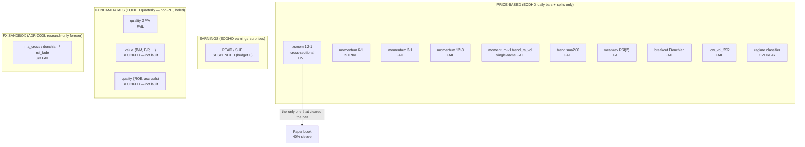
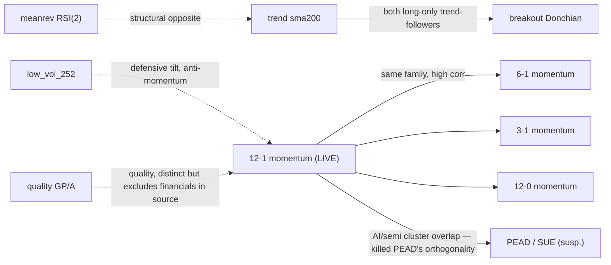

# 04 — Factor / Signal Library (Adversarial Review Artifact)

**Scope.** Every signal, factor, and feature Atlas has *written code for* — live, dead,
suspended, or blocked. This document exists to be attacked. It prefers code evidence over
docstring intent, tags each capability, and states plainly what is not built. All figures are
**paper-mode, simulated, hypothetical A$100k** on a single machine, months old. Nothing here is
investment advice; no real capital has ever been at risk.

**Reading convention (status tags).**

| Tag | Meaning |
|---|---|
| **[LIVE]** | Wired into the nightly cycle; generates signals a paper trade can rest on. |
| **[SUSPENDED]** | Approved to paper, then budget cut to 0% by signed ADR. Still generates signals; deploys no capital. |
| **[GRAVEYARD]** | Ran through the unmodified gauntlet, **FAILED** (or STRIKE), verdict recorded verbatim, never deployed. |
| **[BLOCKED]** | Cannot be built honestly today — a hard data dependency is missing. Not built. |
| **[OVERLAY]** | A classifier/context signal, not a tradable factor on its own. |
| **[SANDBOX]** | Research-only forever by ADR; no path to capital. |

**The one-sentence honest summary.** Atlas has **exactly one factor deployed to paper** —
cross-sectional 12‑1 price momentum (`xsmom-pit-tr`) — and after ADR‑0017 (2026‑07‑20) the
**entire invested book is policy-allocated to that single factor** (40% sleeve *cap*, remainder
cash). Every other factor Atlas built is dead, suspended, or blocked. **Read this carefully:** the
40% is an ADR‑0017 *target*, not realized exposure — as of 2026‑07‑20 the sleeve holds **zero
filled positions and the book is ~100% cash** (core proposals expired unapproved; AMD+INTC
approved 2026‑07‑18 with fill pending). The concentration is therefore **latent** — it arms the
moment the sleeve fills — but it is the headline risk of this whole library, not a footnote.

---

## 0. Map of the library



**Count.** Nine price-based signals/features, one earnings signal, one fundamentals signal, two
unbuilt fundamentals families, three FX sandbox candidates. **One is live.** Verified against the
trial registry: **51 registered trials across 9 lineages** (momentum 23, pead 7, breakout/trend/
meanrev 4 each, fxlab 3, quality 2, low‑vol 2, momentum+pead impl 2).

---

## 1. The plumbing every factor shares (read this before the factor sections)

Atlas deliberately runs a **single portfolio-construction template** and swaps only the *ranking
signal*. This is a genuine strength (it isolates the signal as the only variable) and an
adversarial target (the same template's flaws — flat costs, monthly granularity — hit every
factor identically).

**1.1 The two signal shapes.** There are two structurally different implementations:

- **Cross-sectional portfolio factors** (`xsmom`, `pead`, `quality`, factory `momentum_*` /
  `low_vol_252`): rank the whole eligible universe descending, hold the winner **decile**
  (`winner_count(n) = max(10, n // 10)`, `atlas/dcp/backtest/xsmom_pit_run.py:171`),
  equal-weight, monthly rebalance, deterministic alphabetical tie-break. These are the ones that
  reach the gauntlet and can be approved.
- **Single-name event signals** (`momentum/v1` `trend_rs_vol`, `trend`, `meanrev`, `breakout`):
  emit a per-symbol `Intent(stop, target, time_stop)` on the latest bar; the backtest engine
  runs each symbol independently with **exits frozen at entry**. Trailing-exit logic is
  approximated by re-evaluating every N bars via the engine time-stop, and *each refresh pays a
  full round-trip of costs* — a conservative, cost-adding artifact stated in every module
  docstring (e.g. `atlas/dcp/signals/trend/v1.py:9-16`). **All four single-name signals are in the
  graveyard.**

**1.2 The gauntlet (the bar every factor is judged against).** Imported unmodified from
`atlas/dcp/backtest/` (ADR‑0002). A factor **PASSES** only if it clears all of:

1. **Beat SPY buy-and-hold total return**, absolute (ADR‑0009 — the binding benchmark).
2. **Monkey null p ≤ 0.05**: 1000-path seeded MC drawing the same number of names uniformly from
   the *identical eligible set* with the *identical construction*. This is the sharpest test —
   it asks "does the ranking beat random draws from the same universe?"
3. **Deflated Sharpe ≥ 0.90** at the **true trial count** (ADR‑0016 lineage-scoped after
   migration 0032).
4. **Purged + embargoed walk-forward**, k=4, horizon=40, embargo=10.

A pre-committed **kill-only trial** (evaluation start 2016‑01‑01) can only *demote*, never
validate — it strips the biased 2012‑2015 early-membership window.

**1.3 No parameter search.** Every module docstring asserts **textbook parameters, zero search**
and cites the literature. The only "search" that exists is the factory's *closed, bounded* grid
(§3), and even there each cell burns a counted trial and inflates the lineage's deflation penalty.
The `mom-6-1` STRIKE (§3.1) is the receipt that this discipline bites.

**1.4 Shared data spine.** All price factors read `market.price_bars_daily` (source
`EodhdAdapter`) with `market.corporate_actions` splits applied point-in-time (`action_date ≤ t`).
Contiguity is fail-closed: a gap anywhere in the formation window drops the name for that
rebalance (`atlas/dcp/features/momentum.py:86`). **Single vendor, single data plane — a lock-in
risk that hits every factor** (see §8).

---

## 2. [LIVE] Cross-sectional momentum 12‑1 — the only deployed factor

**Identity.** `family=xsmom`, `name=jt_12_1_top10`, v1.0.0.
**Implementation.** `atlas/dcp/signals/xsmom/v1.py` (math), `atlas/dcp/signals/xsmom/generate.py`
(production signal generation), `atlas/dcp/backtest/xsmom_pit_run.py` (gauntlet runner),
`atlas/dcp/features/momentum.py` (stored PIT feature `momentum_12_1`).
**State.** `quant.strategies` row `xsmom-pit-tr` at state **`paper`** (ADR‑0010). After ADR‑0017
this is the **40%-of-NAV** momentum sleeve — the whole invested book *by policy*. As of
2026‑07‑20 the sleeve is **unfilled and the book is ~100% cash**: 40% is the ADR‑0017 cap, not
realized exposure (core proposals expired; AMD+INTC approved 2026‑07‑18, fill pending).

### 2.1 Definition & formula

Rank each eligible name by the **12‑1 formation return**:

```
formation_return(s, t) = close(s, t - SKIP) / close(s, t - LOOKBACK) - 1
                       = close(s, t-21) / close(s, t-252) - 1
```

on split-adjusted closes. `LOOKBACK=252`, `SKIP=21`, `SEASONING=252` (`atlas/dcp/signals/xsmom/v1.py:27`).
Twelve months of formation, **most recent month skipped**. Sort descending, ties alphabetical,
hold the winner **decile** equal-weight, rebalance monthly (`v1.py:47-62`).

**Two construction subtleties an auditor should catch:**
- The raw `xsmom_v1()` function returns a fixed top‑**10** (`v1.py:58`, `TOP_N=10`), but the
  **validated and production path uses the decile rule** `winner_count(n)=max(10, n//10)` imported
  from the runner (`generate.py:122-129`). On the ~500-name S&P 500 that is ~**50 names**, not 10.
- **The live book deploys only the top‑5 of that decile** (`SLEEVE_MAX_NAMES=5`,
  `generate.py:86`, Principal decision 2026‑07‑16) because a 10%/decile split at A$100k NAV falls
  below the §4 minimum position. The strategy stays *validated on the full decile*; the top‑5
  form was separately validated (§2.4).

### 2.2 Rationale & supporting research (as cited in code)

Cited verbatim in `v1.py:1-13`: **Jegadeesh & Titman (1993)**, "Returns to Buying Winners and
Selling Losers", *Journal of Finance* 48(1). The skip-month follows **Jegadeesh (1990)** /
**Asness (1994)** to dodge one-month reversal. 252/21 sessions are the trading-day equivalents of
12/1 months; monthly rebalance is their holding convention. Long-only per the Atlas mandate (no
loser short leg). This is the single most-replicated anomaly in the equities literature — an
honest choice for the one factor you deploy.

### 2.3 Expected behaviour (decile validation, `docs/reports/xsmom-pit-total-return-2026-07.md`)

Full window 2012‑07‑02 → 2026‑07‑10, total return:

| metric | value |
|---|---|
| strategy TR | **+737.31%** |
| SPY TR (binding) | +593.89% |
| margin | +143.43% |
| null p | 0.000 |
| deflated Sharpe | 0.999 **at n_trials=1** |
| walk-forward | 4/4 folds positive |
| max drawdown | **−36.91%** |
| kill test (2016 start) | **PASS** (+377.32% vs +364.98%, margin +12.34%) |

> **Cross-reference note (DSR figure).** This table follows the approval report
> `xsmom-pit-total-return-2026-07.md`, which records **DSR 0.999 at n_trials=1** (report §gate
> verdict, trial `413a61b6…`). `00_GROUND_TRUTH.md` and `CLAUDE.md` both quote **0.995** for the
> same run — a stale figure carried from an earlier artifact regeneration. Per the trust-the-code
> rule the report value governs; the 0.999-vs-0.995 discrepancy is flagged here, not hidden.

### 2.4 The honest caveats (these travel with the +737% always)

1. **The headline is a concentrated momentum backtest.** Its own demotion band is **−40%**
   (ADR‑0010); at the ADR‑0017 40% sleeve that is ≈ **−16pp of NAV** in a momentum crash before
   the band demotes — but note this is the *policy-maximum* exposure: the sleeve is currently
   unfilled (book ~100% cash), so this drawdown risk is **latent until it fills**. High return
   travels with large drawdown. **The DSR / null / walk-forward are the evidence — not the +737%.**
2. **Endpoint fragility (decile form).** The decile beat SPY at only **8 of 25** month-end
   endpoints, all in the final months — at 2026‑03‑31 it was still trailing SPY. A robust edge
   should not need a particular month to end on. (The **deployed** top‑5 form — `xsmom-impl500-tr`,
   top‑5 of the full PIT S&P 500 — is markedly less fragile: it **beats SPY at 25/25** endpoints AND
   passes the *full gate* at **25/25** — see below, but the *validated object* is the decile. The
   superseded S&P‑100 approximation `xsmom-impl-tr` passed the full gate at only 21/25; do not carry
   that stale count forward. Note the decile's 8/25 is a beat-SPY count, not a full-PASS count.)
3. **Early-window membership undercount.** 2012‑2015 rides a biased S&P 500 membership undercount
   that flatters the head start; the kill test (2016 start) is the honest read. It still passed,
   which is the real defense.
4. **The n_trials=1 deflation is generous — and in tension with the factory's lineage
   accounting.** `xsmom-pit-tr` deflates its Sharpe against **its own family count (n=1)**. The
   factory's *other* momentum-lineage runs (§3 — the 6‑1/3‑1/12‑0 **variants**, related but not
   the 12‑1 math itself) are deflated against the whole **`momentum` lineage (n=18…23)** under
   ADR‑0016. Crucially, the canonical (252,21) member is the phase‑1 12‑1 definition **reused by
   import** (`families/momentum.py:51,159`), so the 12‑1 itself was **never separately
   re-gauntletted at the high lineage count** — there is no `recipe-mom-12-1` report. So the
   flagship's DSR=0.999 is computed against a far smaller multiple-testing penalty than a
   *hypothetical* factory re-run of the identical math would face. **This is the most material
   methodological tension in the library** and a hostile committee will press it: had the approved
   strategy been counted at the full momentum-lineage trial count, its deflated Sharpe would be
   lower (the `mom-6-1` full window at n=18 was 0.921, barely above the 0.90 bar).
   **Correction — the lineage-count penalty is NOT hypothetical for the form the book
   actually trades; it is a documented FAIL.** An earlier draft of this point claimed the
   higher-count penalty was "hypothetical, not a run that exists." That is false. ADR‑0016
   (§"The counting defect this ADR also resolves", lines 30–32) performed exactly this
   recomputation on the **deployed** live form `xsmom-impl500-tr`: at the **momentum LINEAGE
   count (15 prior related trials)** its kill leg scores **DSR ≈ 0.85 < 0.90** and, verbatim,
   "would not clear the bar." It is live only because it was scored at n_trials=1 under the
   family convention in force when it ran and was **grandfathered ("no retroactive
   re-judgment of past verdicts")** — the same ADR that switched all FUTURE runs to lineage
   counting. What genuinely does *not* exist is a separate re-gauntlet of the 12‑1 **decile
   flagship** math at high lineage count (no `recipe-mom-12-1` report); but the deployed
   **top‑5** form's lineage-count kill is a run that exists and fails, so the honest read is
   that the deployed sleeve's multiple-testing-honest deflated Sharpe sits **below the 0.90
   bar** — not "still likely clears." The asymmetry is not merely real; for the traded
   construction it is disqualifying under the gate now in force.

**Implementable top‑5 form — CURRENT live-form evidence** (`xsmom-impl500-tr`,
`docs/reports/sp500-impl-variant-2026-07.md`): +2235.12% vs SPY TR +593.76%, p=0.000, DSR 0.999,
**25/25 endpoints beat SPY AND 25/25 full PASS**, max DD **−42.74%**, 2016 kill PASS (+991.82% vs
+364.89%, p=0.001, 24/25 beat, DSR 0.995). Post‑ADR‑0016 (2026‑07‑18) the live universe is the
**full ~511‑name S&P 500 with NO liquidity screen**, and the live ranker trades
top‑`SLEEVE_MAX_NAMES` (=5) by rank off that active set with no ADV filter
(`xsmom/generate.py:324‑343` — `WHERE … i.is_active … AND s.rank <= :maxn`). ADR‑0016 calls this
run "exactly the post‑expansion live form" verbatim, so `xsmom-impl500-tr` — **not** the S&P‑100
approximation below — is the construction the book actually trades. The ADR‑0006 stop overlay /
staggered entries / sub-account frictions are still **NOT modeled** (report §caveats).

**Superseded pre‑expansion approximation — do NOT cite as the deployed book** (`xsmom-impl-tr`,
`docs/reports/implementable-variant-2026-07.md`): +2201.86% vs SPY +593.76%, p=0.000, DSR 0.999,
**25/25 beat SPY, only 21/25 full PASS**, max DD **−51.97%** (deeper). This validated cleanly but
on an **S&P 100 *approximation*** (top-100 by trailing dollar volume, because a true PIT S&P 100
does not exist at the vendor; current-list overlap 68/101) — the live form *before* ADR‑0016
expanded the universe. The wider full‑500 tail *diversifies* the extreme drawdown (−42.74% vs
−51.97%). Its −52% drawdown and 21/25 count are the **wrong evidence** for the deployed sleeve;
use `xsmom-impl500-tr` and reconcile with Doc 08 §7.

### 2.5 Limitations

- **Concentration is total** post-ADR‑0017 (one factor, one sleeve, one machine, one vendor).
- **Flat 10 bps/side cost** (5 commission + 5 slippage), no spread / impact / borrow. Decile
  turnover ~63%/rebalance; the top‑5 form ~69%. Real momentum crowding / impact is unmodeled.
- **Monthly granularity.** Stops are pre-authorized, scanned daily (T4), derived by ADR‑0006
  (2×ATR or −10% floor) — but no intraday/daily stop *monitoring* of the momentum sleeve; the
  strategy rebalances monthly.
- **Long-only** — the short (loser) leg of J&T is out of scope, so it captures only half the
  documented spread and is fully exposed to market beta.
- **India sleeve untested by construction** (ADRs only; direct NSE blocked, §8).

### 2.6 Overlapping factors

12‑1 momentum overlaps its own family grid (6‑1, 3‑1, 12‑0 — all correlated by construction), and
critically **overlaps PEAD/SUE**: both concentrated into the same 2022‑2026 **AI/semiconductor
cluster** (the `pead-sue` report names MU, AMD, AMAT, …). That overlap is exactly why PEAD failed
its orthogonality claim
(§4). Momentum is *not* diversified by PEAD — they are the same trade in different clothing over
this window.

### 2.7 Data dependencies

`market.price_bars_daily` (EODHD daily closes), `market.corporate_actions` (splits, dividends for
TR). Requires ≥ 253 contiguous US sessions per name. Delisted names carried in the PIT panel
(survivorship-free). No fundamentals, no earnings — **the cleanest data footprint in the library**,
which is precisely why it is the one that survived.

---

## 3. Factory momentum grid — the bounded, counted search [3 GRAVEYARD]

**Implementation.** `atlas/dcp/factory/families/momentum.py`, driven by the `RecipeSpec` grammar
(`atlas/dcp/factory/spec.py`) and the closed catalog (`atlas/dcp/factory/features.py`). The grid
is `MOMENTUM_GRID = ((252,21),(126,21),(63,21),(252,0))` (`families/momentum.py:52`). `(252,21)`
**is** the live `momentum_12_1` reused by import (identity, not a twin). The other three are the
mined variants — all ran through the same gauntlet from the **feature store** (equivalence to the
production math is golden-pinned).

This is the closest Atlas has to an alpha-search process, and it is deliberately caged: a bounded
grammar (`spec.py:73-88`), costs **fixed at 10 bps** (not a free parameter, `spec.py:77,155`),
`lineage` **bound** to the feature's declared line so a novel name can't reset the deflation count
(`spec.py:164-172`, ADR‑0016), and a required pre-registered economic rationale + kill date.

### 3.1 momentum 6‑1 (`momentum_6_1`, lookback 126 / skip 21) — **[GRAVEYARD, STRIKE]**

`docs/reports/recipe-mom-6-1-top5.md`. Research: Jegadeesh‑Titman intermediate-horizon continuation.

| trial | window | strat TR | SPY TR | null p | DSR (n) | verdict |
|---|---|---|---|---|---|---|
| full | 2012→2026 | +2616.32% | +583.17% | 0.000 | 0.921 (18) | **PASS** |
| kill | 2016→2026 | +976.12% | +357.80% | 0.001 | **0.767 (19)** | **FAIL** |

**This is the single most important graveyard entry for the committee's confidence in the
process.** The full window PASSED, but the *pre-committed* 2016 kill leg FAILED on deflated Sharpe
(0.767 < 0.90 at the lineage-scoped n=19). By the demote-only protocol this is a **STRIKE** — a
demotion momentum‑12‑1 itself did **not** incur. Turnover 111%/rebalance (higher than 12‑1) is
part of why the fresher signal doesn't clear once the head-start window is stripped. **Verdict: not
deployed.** This is the deflation penalty working as designed.

### 3.2 momentum 3‑1 (`momentum_3_1`, 63 / 21) — **[GRAVEYARD, FAIL]**

`docs/reports/recipe-mom-3-1-top5.md`. Research: short-horizon continuation (Chan‑Jegadeesh‑
Lakonishok 1996). Full window +713.33% vs SPY +583.17% but **null p=0.055 (fails), DSR 0.677 at
n=20**; kill leg fails everything (p=0.338, DSR 0.387, doesn't beat SPY). Turnover **156%/rebalance**
— the noisiest, fastest-decaying, most cost-exposed member. Literature predicted degradation vs
12‑1; the counted test confirmed it. **Not deployed.**

### 3.3 momentum 12‑0 (`momentum_12_0`, 252 / 0, no skip) — **[GRAVEYARD, FAIL]**

`docs/reports/recipe-mom-12-0-top5.md`. A pre-registered **skip-month ablation** (Jegadeesh 1990).
Full window +1625.01%, beats SPY 25/25 endpoints, **but DSR 0.818 at n=22 (fails)**, and the
kill leg fails (DSR 0.658 at n=23). Max DD −53.85% — the worst of the grid, exactly because
including the most-recent month re-admits short-term reversal. **The skip is load-bearing**, as the
literature says; the ablation is now evidence, not assumption. **Not deployed.**

### 3.4 What the grid proves

The grid is the demonstration that Atlas's process **rejects plausible junk**: **all three
non-canonical momentum cells died** (three of the four grid cells; the fourth, (252,21), is the
live 12‑1 identity), two of them despite enormous headline returns, killed by the null model and
the lineage-scoped deflated Sharpe. That is the intended function of the gates.

---

## 4. [SUSPENDED] PEAD / SUE — earnings surprise, the failed "orthogonal" factor

**Identity.** `family=pead-sue`, `name=foster_olsen_shevlin_sue_top_decile`, v1.0.0.
**Implementation.** `atlas/dcp/signals/pead/v1.py` (SUE math + PIT view),
`atlas/dcp/signals/pead/generate.py` (production), `atlas/dcp/features/sue.py` (stored feature
`sue_foster_olsen_shevlin`).
**State.** Approved to paper (ADR‑0013), then **budget cut to 0%** (ADR‑0015, 2026‑07‑18). The
`quant.strategies` row stays `paper`: signals still generate and reach the committee, but its BUY
memos **size to zero** at the bridge — a live forward experiment with no capital.

### 4.1 Definition & formula

Standardized Unexpected Earnings, Foster‑Olsen‑Shevlin form (`pead/v1.py:11-16`):

```
SUE_i = (epsActual_i - epsEstimate_i) / stdev( surprise over the prior 8 reported quarters )
```

`STANDARDIZE_WINDOW=8` quarters, `STANDARDIZE_MIN=4` (else ineligible — no raw-surprise fallback),
`STALENESS_SESSIONS=63` (~one quarter drift window). Rank descending, hold the winner decile
equal-weight, monthly (`pead/v1.py:73-89`). A secondary `surprise_pct` variant exists for the
adversarial cross-check.

### 4.2 Rationale & research (cited)

`pead/v1.py:5-9`: **Ball & Brown (1968)**, **Bernard & Thomas (1989)** (post-earnings-announcement
drift), SUE per **Foster, Olsen & Shevlin (1984)**, *The Accounting Review*. Requested by an
external review as the one *orthogonal* factor to momentum — clean, PIT-backtestable, not
price-based.

### 4.3 No-look-ahead is structural (a genuine strength worth crediting)

The report_date gates knowability; an after-market print is tradable only the **next** session
(`effective_index` = `bisect_right`, `pead/v1.py:138-145`); SUE standardization uses **strictly
prior** reports only; and an event with `effective_index > t` is **physically unreachable** by the
accessor (`EarningsView.live`, `pead/v1.py:170-191`). Flip a future report's numbers arbitrarily
and the ranking at t is byte-identical — pinned by a structural test. There is also a documented
**split-safety correction** (2026‑07‑15): the vendor stores EPS backward-split-adjusted to a
single basis, so an earlier on-read re-adjustment *double-adjusted* and manufactured a phantom
first-post-split spike; that path was removed (`pead/v1.py:43-54`). Good forensic honesty.

### 4.4 Expected behaviour vs the two damning verdicts

**Decile (`docs/reports/pead-sue-total-return-2026-07.md`):** full window +616.75% vs SPY
+591.02%, p=0.000, DSR 0.997 **at n_trials=2** — a **PASS on the full-window gate only**, but:
- the **pre-committed 2016 kill FAILS** (+362.92% vs SPY +363.05% — loses by 13 bps → STRIKE);
- beats SPY at only **4 of 25** endpoints, all terminal;
- driven by the **same AI/semiconductor cluster as momentum** → **not the orthogonal diversifier
  it was recruited to be.**

**Implementable top‑5 (`pead-impl-tr`):** **FAIL, null p=0.132** — at top‑5 the SUE ranking is
**statistically indistinguishable from drawing 5 names at random from the same recently-reported
large-cap set**; 3/25 endpoints; 2016 kill also fails (p=0.139). ADR‑0015 §Context records this
verbatim.

### 4.5 Why it is suspended, not buried

The decile *technically* passed the full-window gate, so it isn't a clean graveyard entry — but
every robustness lens (kill leg, endpoint concentration, orthogonality, and above all the top‑5
implementable null test) says the edge does not survive the book's actual shape. ADR‑0015 cut its
budget to 0 while keeping the paper record accruing, so a future forward scorecard could
*re-earn* a budget by signed ADR. **Honest disposition: this factor does not currently carry
information the fund can trade at its real concentration.**

### 4.6 Limitations, overlaps, data deps

- **Overlaps momentum heavily** (same cluster) — the defining failure.
- **Top-5 concentration destroys the signal** — the decile's diversification was doing the work.
- **Data:** `market.earnings_surprises` (EODHD Earnings::History): `eps_actual`, `eps_estimate`,
  `report_date`, `before_after_market`, `surprise_pct`. 60,109 reports on record, 637 members with
  ≥1 surprise, 53 delisted (survivorship-free). This is the one earnings dataset the vendor
  supplies cleanly enough to backtest.

---

## 5. Fundamentals factors — quality FAILED, value/quality-broad BLOCKED

### 5.1 [GRAVEYARD] Quality — Novy‑Marx gross profitability (GP/A)

**Identity.** `family=quality-gpa`, `name=novy_marx_gpa_top_decile`.
**Implementation.** `atlas/dcp/signals/quality/v1.py` (+ `quality_pit_run.py`).
**Formula** (`quality/v1.py:9`):

```
GP/A_i = (trailing 4 quarters of grossProfit) / (most recent totalAssets)
```

`TRAILING_QUARTERS=4`, `STALENESS_SESSIONS=252`, `CONSECUTIVE_SPAN_DAYS=300` (consecutiveness
guard). **Research:** **Novy‑Marx (2013)**, "The Other Side of Value", *JFE* 108(1)
(`quality/v1.py:5-7`).

**Verdict (`docs/reports/quality-gpa-total-return-2026-07.md`): FAIL.** Full window +369.75% vs
SPY +593.76%, **null p=0.387** (random same-universe portfolios do as well — the sharpest possible
rejection), beats SPY at **0/25** endpoints. The kill leg is worse (p=0.716). Long-only GP/A does
not clear the absolute bar and carries no information vs random on this universe. **Not deployed.**

**Fail-closed data honesty (and its cost).** The signal is *knowable at the latest of its four
input filings*, tradable the next session (`bisect_right`). Crucially: the vendor stamps
`filing_date ≤ fiscal period end` on a large minority of quarters (physically impossible — e.g.
**all of AVGO 2012‑2017**); those rows are **dropped at ingestion** rather than trusted, because
trusting them injects weeks of look-ahead. Affected names go signal-less until four consecutive
*anchorable* quarters accrue. This is correct, but it means even the FAIL verdict is measured on a
**coverage-holed universe** — the honest handling of bad vendor metadata *reduces* the sample.

### 5.2 [BLOCKED — NOT BUILT] Value and broad quality

**Not built. Stated plainly.** Value (book/market, earnings/price, cash-flow yield) and broad
quality (ROE, accruals, ROA, F-score) require **point-in-time fundamentals** — restated figures
with filing dates, and coverage of pre-2018 delistings. **EODHD provides neither**: fundamentals
are restated in place with no filing-date archive, and there are no fundamentals for pre-2018
delistings (`docs/reports/pit-fundamentals-vendor-decision.md`). The GP/A `filing_date ≤ period
end` defect above is a symptom of the same gap. A vendor decision (Sharadar SF1, ~$69/mo) is
**OPEN**, awaiting the Principal. **Until then value and broad quality are impossible to build
honestly and are therefore not built.** This is the single largest research blocker in the fund —
it is why the entire "fundamentals" column of the factor map is empty but for one dead entry. The
`low_vol` family docstring makes the discipline explicit: fundamentals families "remain blocked on
honest point-in-time statement data and are NOT smuggled in through today's payloads"
(`atlas/dcp/factory/families/low_vol.py:21-25`).

---

## 6. [GRAVEYARD] The single-name price signals (all four dead)

These predate the cross-sectional design. Each emits a per-symbol `Intent` and was run
symbol-by-symbol. All FAILED decision-grade on the full 2010→2026 history. They share the
"exits frozen at entry, re-eval every N bars, each refresh pays full costs" engine mapping.

### 6.1 momentum-v1 `trend_rs_vol` (single-name absolute momentum) — FAIL

`atlas/dcp/signals/momentum/v1.py`. **Naming trap for reviewers:** its `SPEC` is
`family=momentum, name=trend_rs_vol` (`v1.py:13`) — a single-name trend/relative-strength/volume
entry, **entirely distinct** from both cross-sectional `xsmom` and the `trend` sma200 signal below.
**Definition:** long when `close > SMA20 > SMA50` AND 20‑day return > 0 AND `volume ≥ SMA20(vol)`;
stop `2×ATR14`, target `4×ATR14`, 40‑bar time stop (`v1.py:35-37`). (Note it uses simple-mean
`atr()`, not the Wilder ATR the production ADR‑0006 stops use.)
**Research:** internal "IPD S1" spec; classic trend-following idioms, no external citation.
**Verdict (`docs/reports/decision-grade-momentum-v1.md`): FAIL** on SPY (+7.77% vs B&H +544%,
p=0.923, DSR 0.182) and AVGO (+106% vs +19,477%, p=0.126, DSR 0.443). Random entries do as well.
Also failed the 1‑year window earlier (`first-real-backtest-momentum-v1.md`). **The founding
graveyard entry** — proof the gates reject the fund's own first idea.

### 6.2 trend `sma200_hysteresis` — FAIL

`atlas/dcp/signals/trend/v1.py`. Long when `close > SMA200×1.02`, exit below `×0.98` (2%
hysteresis band), re-eval every 21 bars. **Research:** **Faber (2007)** 10-month SMA timing;
**Siegel** band filter (`trend/v1.py:3-8`). **Verdict:** 4/4 symbols FAIL
(`docs/reports/candidate-strategies-2026-07.md`). Trend beat its null on QQQ/AVGO (p=0.009 / 0.000)
and hit DSR ~0.99 — **but never beat buy-and-hold** (the binding bar): +150% vs SPY +544%, +402%
vs QQQ +1401%, etc. A long-only 200-day filter under-participates in a secular bull; it fails the
*absolute* test even where it's statistically real. Honest, informative graveyard entry.

### 6.3 meanrev `connors_rsi2` — FAIL

`atlas/dcp/signals/meanrev/v1.py`. Buy when `RSI(2) < 10` AND `close > SMA200`; exit at
`RSI(2) ≥ 70` or after 10 bars; no protective stop (per source). The exit is posted as an *exact*
next-bar price target derived from Wilder RSI internals (`meanrev/v1.py:36-41`) — a neat structural
mapping. **Research:** **Connors & Alvarez (2008)** (`meanrev/v1.py:4-8`). **Verdict:** 4/4 FAIL;
SPY actually **loses money** (−9.74%), p=0.974. Short-horizon mean reversion is the weakest family
tested — high hit rate (68‑74%) but negative/negligible edge after costs and vs B&H.

### 6.4 breakout `donchian_55_20` — FAIL

`atlas/dcp/signals/breakout/v1.py`. Turtle System 2: enter on a 55‑day high, exit on a 20‑day low
(monotonic-deque state replay, `breakout/v1.py:36-63`). **Research:** **Faith (2007)**, "Way of the
Turtle"; Donchian (`breakout/v1.py:5-8`). **Verdict:** 4/4 FAIL; beats its null on AVGO (p=0.001)
but never beats B&H and never clears DSR≥0.90. Classic trend-breakout under-participation, same
shape as `trend`.

**Cross-family note.** `trend` and `breakout` are both long-only trend-followers and are highly
correlated by construction; `meanrev` is their structural opposite (buys weakness). None cleared
the absolute bar. The candidate-strategies run added **12 trials at once** (4 symbols × 3 families),
inflating the **`trend` / `meanrev` / `breakout` lineage** deflation counts (4 each) — **not**
momentum, whose lineage was untouched by this run (registry 7 → 19 trials).

---

## 7. [GRAVEYARD] Low-volatility, [OVERLAY] regime, [SANDBOX] FX

### 7.1 Low-volatility `low_vol_252` — FAIL (both legs)

**Implementation.** `atlas/dcp/factory/families/low_vol.py`, math in
`atlas/dcp/features/volatility.py`. **Formula** (`volatility.py:1-8`):

```
low_vol_252 = - pstdev( close[i]/close[i-1] - 1  over 252 sessions ) * sqrt(252)
```

**Negated** so the grammar's rank-descending puts the *lowest*-vol names first (the sign is part
of the pinned formula, `low_vol.py:5-8`). **Research:** **Ang‑Hodrick‑Xing‑Zhang (2006)**,
**Baker‑Bradley‑Wurgler (2011)**, **Frazzini‑Pedersen (2014)** (`low_vol.py:11-15`). Its own
docstring pre-registers the likely failure: *the literature's claim is risk-adjusted, so a long-only
absolute-return top‑5 against SPY total return can honestly fail* (`low_vol.py:16-19`).

**Verdict (`docs/reports/recipe-lowvol-252-top5.md`): FAIL both legs.** Full window +189.49% vs
SPY +583.17%, **null p=0.791**, DSR 0.986 (passes DSR, fails everything else); kill leg
+113.94%, p=0.759, DSR 0.887. **0/25 endpoints beat SPY** in both. The DSR clears but the null and
the absolute bar both reject — a clean example of why Atlas requires *all* gates, not any one.
Note the mild specification mismatch (an adversary should raise it, and the docstring pre-empts it):
low-vol is a **risk-adjusted** anomaly being judged on an **absolute** long-only bar, so this FAIL
does not refute the anomaly — only its long-only top‑5 expression against SPY TR.

### 7.2 [OVERLAY] Regime classifier v1

`atlas/dcp/signals/regime/v1.py`. Labels each day **bull / bear / high_vol / neutral** from
`SMA(100)` trend and 20-day annualized vol vs its expanding median (`VOL_MULT=1.6`); `high_vol`
overrides direction. **Strictly causal** (day t uses ≤ t only, `regime/v1.py:2-5`). This is a
context/overlay classifier, **not a tradable factor** and not part of any live sizing path I can
evidence from the signal code — it stays **[OVERLAY]**: built, but its wiring-to-capital is
unverified from the signal code alone.

### 7.3 [SANDBOX] FX — three candidates, 3/3 FAIL, research-only forever

`docs/reports/fxlab-eurusd-2026-07.md` (engine under `atlas/fxlab/`, outside `dcp/signals`).
`ma_cross`, `donchian`, `rsi_fade` on EUR/USD daily, long/short in {−1,0,+1}. Benchmark is **zero**
(ADR‑0008 — nothing to hold in FX; **no profit target exists**, the Principal's "$50/day" framing
was explicitly refused). All three FAIL: returns −19.5% / −20.0% / +7.6%, nulls 0.51 / 0.60 / 0.20,
DSR 0.10 / 0.08 / 0.35. Locked to research-only forever — no path to the risk engine, bridge, or
approval queue without a new signed ADR. Include for completeness; it is not a fund factor.

---

## 8. Data-dependency matrix (what each factor needs, and where it breaks)

| Factor | Status | Data source | Hard dependency | Break point |
|---|---|---|---|---|
| xsmom 12‑1 | **LIVE** | `price_bars_daily`, `corporate_actions` | ≥253 contiguous US sessions | single vendor; monthly stops |
| momentum 6‑1/3‑1/12‑0 | GRAVEYARD | same | same | lineage-deflation / null |
| momentum-v1 trend_rs_vol | GRAVEYARD | same | SMA/ATR warmup | fails vs random & B&H |
| trend / breakout | GRAVEYARD | same | 200 / 55-bar warmup | never beats B&H |
| meanrev RSI(2) | GRAVEYARD | same | 200-bar warmup | negative edge |
| low_vol_252 | GRAVEYARD | same | 253-session window | null p=0.79 |
| PEAD / SUE | **SUSPENDED** | `earnings_surprises` | ≥4 prior quarters, ≤63-session freshness | top-5 null p=0.132; overlaps momentum |
| quality GP/A | GRAVEYARD | `quarterly_fundamentals` | 4 consecutive filed quarters + assets | null p=0.387; vendor filing-date defect |
| value / broad quality | **BLOCKED** | — (needs PIT fundamentals) | filing dates + delisted coverage | **vendor has neither → not built** |
| FX (3) | SANDBOX | EODHD FX bars | 200-bar warmup | 3/3 FAIL, ADR-0008 |

**Single-vendor lock-in.** Every row above reads **EODHD** ("All-In-One", $99/mo). There is no
second market-data source. A vendor outage, a silent restatement, or a coverage gap propagates to
every factor at once. The fixture adapter is dev-only.

---

## 9. Factor-overlap / correlation view (adversarial)



**The material overlap fact:** the two factors that got furthest (momentum, PEAD) are **not
independent** — they crowd into the same 2022‑2026 AI/semiconductor names. The book is therefore
even less diversified than "one live factor" implies: the *next* candidate (PEAD) that might have
diversified it turned out to be the same trade. `low_vol` and `quality` are the only genuinely
anti-/orthogonal-to-momentum lines Atlas tested, and both failed.

---

## 10. Weaknesses / Debt / Open

- **One live factor, whole book on it.** ADR‑0017 (2026‑07‑20) allocated 40% of NAV to
  `xsmom-pit-tr` as policy and retired the ETF core; there is **no fallback sleeve**. But **as of
  2026‑07‑20 that sleeve is unfilled — the book is already ~100% cash** (core proposals expired;
  AMD+INTC approved 2026‑07‑18, fill pending), so the 40% is a target/cap and the concentration is
  *latent, not active*. Once a momentum sleeve is filled, a breach of its −40% / 126‑session −25pp
  bands demotes it to suspended and **the book returns to 100% cash**. Concentration of
  *validation* is the deepest risk in this library.
- **Deflation-count asymmetry (flagship vs factory).** `xsmom-pit-tr` deflated at **n_trials=1**;
  the factory's *other* momentum-lineage runs (the 6‑1/3‑1/12‑0 **variants**, not the 12‑1 itself)
  deflate at **n=18…23** (ADR‑0016 lineage-scoped). The canonical 12‑1 is the phase‑1 identity
  reused by import and was never separately re-gauntletted at the high count, so the larger penalty
  it *would* face is hypothetical. The flagship faced a smaller multiple-testing penalty than a
  factory re-run of the same math would. It likely still clears at the higher count, but the
  inconsistency is real and a hostile committee will press it.
- **Momentum's headline is fragile by endpoint.** The *validated decile* (`xsmom-pit-tr`, the +737%
  headline) beat SPY at only 8/25 month-ends (all terminal). The **deployed** top‑5 form —
  `xsmom-impl500-tr`, top‑5 of the full PIT S&P 500, "exactly the post‑expansion live form"
  (ADR‑0016) — is stronger: it beats SPY at **25/25 endpoints and passes the full gate at 25/25**
  (+2235.12%, max DD −42.74%, DSR 0.999). The earlier `xsmom-impl-tr` (S&P‑100 approximation, only
  21/25 PASS, deeper −51.97% DD) is the **superseded pre‑expansion** form — do not cite it as the
  live book (Doc 08 §7 uses `impl500-tr`; reconcile to it). Either construction leaves the ADR‑0006
  stop overlay / staggered entries / real frictions **unmodeled**.
- **Flat 10 bps cost model, monthly granularity.** No spread / market-impact / borrow; momentum
  grid turnover runs 63‑156%/rebalance. The high-turnover members (3‑1 at 156%) would degrade
  further under realistic costs — but they already failed, so this bites hardest for any *future*
  higher-turnover candidate.
- **PEAD is a dead end dressed as a forward experiment.** Its top‑5 form is indistinguishable from
  random (p=0.132); it overlaps momentum; it exists now only to accrue a paper scorecard. Do not
  read "still on paper" as "still promising."
- **Fundamentals are structurally absent.** Quality GP/A failed *and* was measured on a coverage-
  holed universe (vendor filing-date defect → fail-closed drops). **Value and broad quality are not
  built at all** — blocked on PIT fundamentals, pending an open, unfunded vendor decision. Half the
  standard factor zoo is simply missing.
- **Single-name signal engine is a coarse approximation.** Trailing exits are frozen at entry and
  re-evaluated monthly, each refresh paying full round-trip costs — conservative, but it means the
  four dead single-name signals were never tested at their intended (finer) exit granularity.
- **Naming hazard.** `momentum/v1.py`'s signal is named `trend_rs_vol` under family `momentum`,
  colliding conceptually with both `xsmom` and the separate `trend` signal. Easy to misread in
  audit.
- **Regime classifier's live wiring is unverified** from the signal code alone — treat as built
  but not evidenced-to-capital.
- **Single data vendor for the entire library** (EODHD). No redundancy.

---

## 11. Bottom line for the committee

Atlas's factor library is **narrow, mostly a graveyard, and honest about it.** One factor —
textbook 12‑1 cross-sectional momentum — cleared an unmodified, adversarial gauntlet (null model,
lineage-deflated Sharpe, purged walk-forward, absolute beat-SPY-TR bar) in both its decile and
implementable top‑5 forms, and it is the only thing deployed. Everything else is a recorded FAIL
(momentum-v1, trend, meanrev, breakout, low-vol, quality GP/A, three FX candidates, three of four
momentum grid cells), a suspended dead-end (PEAD), or an unbuilt blocked family (value, broad
quality). The graveyard is the asset here: the `mom-6-1` STRIKE and the PEAD top‑5 null failure are
proof the gates reject plausible, high-headline junk. The liability is the mirror image of that
discipline — **the fund has found exactly one thing it is willing to trade, and now bets its whole
invested book on it.**

*All results simulated, paper-mode, hypothetical A$100k, single machine, one Principal. Nothing
herein is investment advice.*
