# 05 — "Scoring Engine": Ranking, Sizing, Conviction, and the Surfaces That Never Reach Capital

**Audience:** senior engineers + quant researchers on an adversarial review committee.
**Scope:** everything in Atlas that *looks like* a scoring/ranking/sizing engine, what it actually is, and — critically — which pieces touch capital and which do not.
**Mode reminder:** paper-only, ~months old, one Principal + AI pair, single machine. Nothing here is investment advice; no real capital; no broker.

---

## 0. The headline you must not miss

> **There is no classic multi-factor weighted scoring engine in Atlas.**

If you came looking for a `score = w1·value + w2·quality + w3·momentum + …` cross-section that gets ranked and turned into weights, it does not exist as a path to capital. What actually moves (paper) capital is far simpler and, frankly, far narrower:

1. **Ranking → capital** is a **single validated signal**: 12‑1 cross‑sectional momentum, sorted **descending**, deterministic tie‑break, then **equal-weight the top‑5**. One factor. One number per name (the formation return). No weights, no composite. `atlas/dcp/signals/xsmom/generate.py:122`.
2. **Sizing** is **deterministic sleeve-budget arithmetic + a risk-engine §4 formula**, *not* a score. The position size is an output of the **risk** plane (risk budget ÷ per-share risk, capped), then shrunk by an equal-split sleeve envelope. Conviction, health, "attractiveness" — none of them enter the quantity. `atlas/dcp/trading/bridge.py:329`, `atlas/dcp/risk/engine.py:406`.

Two things in the codebase genuinely resemble "scoring" — a **health-score composite** (factor percentiles) and an **opportunity screen** (whole-universe ranking on that composite). Both are **MEASURED, NEVER APPLIED**: by the system's own invariant #2, they reach no sizing/pricing/execution. They are research aids on the reasoning side of the wall.

A third thing — **conviction** (LOW/MEDIUM/HIGH) — is an agent label, evidence-gated, graded against outcomes, and **applied nowhere** in sizing. A fourth — the **calibration / learning loop** — computes Brier-scored conviction weights nightly and **stores them without consuming them**.

The rest of this document proves each of those claims from code, tags every capability, and lists the debt.

### Capability tag legend
`[IMPLEMENTED]` runs in the daily cycle · `[PARTIAL]` built but narrow/caveated · `[EXPERIMENTAL]` accruing, not actionable · `[MEASURED-NEVER-APPLIED]` computed + displayed, reaches no capital by invariant · `[PLANNED — NOT BUILT]` · `[PLACEHOLDER]`.

---

## 1. What reaches capital vs. what does not — the one table that matters

| Surface | File | Produces | Reaches capital? | Tag |
|---|---|---|---|---|
| **xsmom 12‑1 ranking** | `atlas/dcp/signals/xsmom/generate.py` | descending formation-return rank, top‑N winners | **YES** — via the desk/bridge lane | `[IMPLEMENTED]` |
| **Top‑5 sleeve cut** | `generate.py:86,339` (`SLEEVE_MAX_NAMES=5`) | which winners the sleeve may trade | **YES** | `[IMPLEMENTED]` |
| **Sleeve-budget sizing** | `bridge.py:329` (`_sleeve_name_budgets`) | per-name AUD envelope, equal split | **YES** (as an outer cap) | `[IMPLEMENTED]` |
| **Risk §4 sizing** | `risk/engine.py:406` (`size_position`) | share quantity from risk budget | **YES** — this *is* the size | `[IMPLEMENTED]` |
| **Health-score composite** | `research/health_score.py` | 0–100 composite + 1–5 rating from 5 pillars of factor percentiles | **NO** | `[MEASURED-NEVER-APPLIED]` |
| **Opportunity screen** | `research/opportunity_screen.py` | whole-universe ranking on the health composite | **NO** | `[MEASURED-NEVER-APPLIED]` |
| **Conviction (LOW/MED/HIGH)** | `agents/schemas/memo.py:24`, `roles/cio.py` | a categorical label on a memo | **NO** (never sizes) | `[IMPLEMENTED]`, display + gate only |
| **Calibration weights (Brier)** | `learning/calibration.py`, `learning/recalibrate.py` | per-conviction/source/specialist weights ∈ [0.5, 1.5] | **NO** (stored, not consumed) | `[MEASURED-NEVER-APPLIED]` |
| **Source-pick / screen edge** | `research/source_picks.py`, `research/opportunity_screen.py:156` | forward excess-vs-SPY-and-dartboard grades | **NO** | `[EXPERIMENTAL]` |

The "NO" column is guaranteed by **two different, unequal mechanisms** — the doc is careful not to conflate them:

- **Conviction (an agent-produced number)** is fenced *structurally*: invariant #2 + the two-plane wall (`tests/unit/test_boundaries.py`, which forbids `dcp → agents` and `agents → dcp.risk/dcp.execution`) + the Pydantic schema (a BUY without DCP evidence refs is a validation error — `agents/schemas/memo.py:37`). An agent number physically cannot reach the sizing plane.
- **The health-score composite and opportunity screen (DCP-computed numbers)** are *not* wall-protected: they are pure `dcp/research/*` code on the same plane as sizing, consumed today only by `api/routers/research.py` and `ops/screen.py` (grep-confirmed — no other importer). `test_boundaries.py` says nothing about them, and nothing test-enforced stops a future DCP module (e.g. `bridge.py`) from importing `health_score`/`opportunity_screen` into sizing. Their "never reaches capital" status rests on **the absence of any call site into sizing + research-only discipline**, not on a structural barrier. Treat this row's guarantee as a *convention that must be re-checked on every change*, not a wall.

---

## 2. The real path to capital (the "scoring engine", honestly)

```mermaid
flowchart TD
    subgraph DCP["DCP compute plane (deterministic, no agent import)"]
        A["quant.strategies row<br/>xsmom-pit-tr @ state 'paper'"]
        B["generate_signals()<br/>rank_winners: sort by (-return, symbol)<br/>keep winner_count(n) = max(TOP_N=10, n//10)"]
        C["quant.signals rows<br/>rank, formation_return, valid_until"]
        A --> B --> C
    end
    subgraph DESK["Reasoning plane (agents — memos ONLY)"]
        D["active_signal_symbols():<br/>top-5 by rank enter the desk's priority lane"]
        E["CIO committee_memo()<br/>recommendation=BUY, conviction=LOW/MED/HIGH<br/>evidence_refs cite the signal UUID"]
        C -.->|SIGNALS evidence block| D --> E
    end
    subgraph BRIDGE["bridge.py (DCP again — the ONLY memo→trade path)"]
        F["_sleeve_name_budgets():<br/>per_name_aud = (NAV*0.40 - committed)/n"]
        G["derive_prices(): stop = max(entry-2·ATR, 0.90·entry)"]
        H["size_position() §4:<br/>qty = min(risk_budget/per_share_risk, L1 8% cap, L10 ADV cap)"]
        I["qty = min(§4 qty, sleeve_cap)<br/>sleeve cap only SHRINKS"]
        E --> F --> H --> I
        G --> H
    end
    I --> J["trade_proposal (state pending_approval or rejected)<br/>Principal approves → PaperBroker next-open fill"]

    style E fill:#3a2a1a,stroke:#c80
    style H fill:#1a2a3a,stroke:#08c
    style I fill:#1a2a3a,stroke:#08c
```



Note what is **not** on this diagram: no weighted score, no attractiveness index, no conviction→size link. Conviction is on a memo the CIO writes; it never crosses into `F`/`H`/`I`.

### 2.1 The ranking: one factor, descending — `[IMPLEMENTED]`

The formation return is the *entire* cross-sectional signal:

```
formation_return = close[t-SKIP] / close[t-LOOKBACK] - 1    (split-adjusted)
```
with `LOOKBACK=252`, `SKIP=21` imported from the validated recipe (`atlas/dcp/signals/xsmom/v1.py`, referenced at `generate.py:80`). Ranking is a plain sort, with an explicit deterministic tie-break:

- `rank_winners()` sorts `(-return, symbol)` and keeps `winner_count(n_eligible) = max(TOP_N, n_eligible // 10)` — `generate.py:122-129`. The decile rule is **imported** from `xsmom_pit_run` (`generate.py:72`) precisely so the operational ranker can never drift from the approved backtest.
- Eligibility is fail-closed: a name must have a vendor close on **every** of the last `WINDOW = LOOKBACK+1 = 253` US sessions (`generate.py:89, 174, 213`). A gap anywhere excludes it for that rebalance. No-look-ahead is structural: every query is capped at the signal session (`generate.py:36-37`, `bar_date <= session`).

This is momentum-only. There is **no** value/quality/growth blend, **no** z-scoring, **no** weighting scheme. It is a single sorted column.

> ⚠️ **Validation-vs-production fidelity gap (found in code):** the production ranker computes a **split-adjusted PRICE return** — `_formation_returns` calls `adjust_for_splits` only, with **no dividend reinvestment** (`generate.py:218-222`, `c_skip / c_form - 1`). But the approved artifact is **`xsmom-pit-tr`**, whose `+737.31%` vs SPY-TR headline comes from the backtest's **`--total-return` mode**, where the entire panel — *including the ranking key* — is transformed at load time with each dividend reinvested at its ex-date close (`xsmom_pit_run.py:48-53, 553`, `market_data/total_return.py`). So the live capital path ranks on price return while the strategy was **validated on total-return formation**. For most (non-paying or thin-yield) names price ≈ TR and the winner sets coincide, but for dividend-heavy names the two rankings can diverge — the deployed signal is not bit-for-bit the one that cleared the gauntlet. (§3.3 correctly flags this exact price-vs-TR gap for the health-score momentum pillar; it applies equally to the real capital-path ranker.)

### 2.2 Rank → tradable set: top‑5, and *why* — `[IMPLEMENTED]`

The strategy is *validated* on the full winner decile, but the *tradable* set is capped at 5:

```python
SLEEVE_MAX_NAMES = 5   # generate.py:86
```
The comment (`generate.py:86-88, 334-338`) states the reason plainly: at A$100k NAV, a 10%-sleeve/decile split (~A$1,000/name) falls below the §4 `MIN_POSITION_AUD = A$2,000` floor (`risk/engine.py:22`), so the live sleeve trades only its **top-5 by rank**. `active_signal_symbols()` enforces this with `s.rank <= :maxn ORDER BY s.rank` (`generate.py:339-340`). This is a **Principal decision (2026‑07‑16)**, not a fitted parameter. The strategy stays validated on the decile; the cap governs only what deploys. Equal weight across those five is implicit — nothing ranks *among* the five for sizing purposes; they split the sleeve envelope equally (§2.3).

**ASSUMPTION flag:** "equal-weight top‑5" is realized *through* the sizing math, not asserted as a portfolio-optimizer decision. There is no optimizer — the ground truth confirms "equal-weight only; no portfolio optimizer" (`00_GROUND_TRUTH.md`, risk section). Whether five names is the right concentration for a −40% demotion-band strategy is a **known open risk** (§10), not a tuned choice.

### 2.3 Sizing is arithmetic, not a score — `[IMPLEMENTED]`

Two deterministic stages, both on the DCP side of the wall, neither reading any agent number:

**Stage A — sleeve envelope (`bridge.py:329-354`).** For each signed satellite *family* with BUY candidates tonight:
```
per_name_aud = (NAV * SLEEVE_BUDGET_FRACTION[family] - committed_family) / n_candidates
```
computed **once** at run start as a snapshot (`bridge.py:334-342`). `NAV` is the risk engine's worst-case pro-forma book NAV (`_build_book`, `bridge.py:350`). `committed_family` sums the family's open positions **plus** its live unfilled proposals (`_sleeve_committed_aud`, `bridge.py:294-326`) — both terms only *enlarge* the committed base, so the envelope can only shrink sizing, never inflate it. `n_candidates` counts every BUY name attributed to the family (a name in two sleeves eats a slot in each — `bridge.py:346-347`). The per-name AUD slice becomes a **whole-share cap** `floor(per_name / (entry·FX))` (`bridge.py:548-550`).

**Stage B — risk §4 (`risk/engine.py:406-438`).** The actual quantity is the *minimum* of three risk caps:
```python
candidates = {"L6": raw_size,        # nav * risk_per_trade / per_share_risk_aud
              "L1/L2": weight_cap,    # weight limit (8% stock / 15% ETF) * nav / (entry*fx)
              "L10": liquidity_cap}   # max_pct_adv * adv_20d
size = candidates[min(...)]           # engine.py:425-427
```
then floored to lots, and rejected outright if the resulting AUD value `< MIN_POSITION_AUD` (`engine.py:434`). The sleeve cap from Stage A is applied last, as `qty = min(size.qty, sleeve_max_qty)` in `build_proposal` (`proposals.py:732-733`) — the docstring is explicit that it "can only ever SHRINK the size … never grow it" (`proposals.py:711-718`).

The module docstring's one-line summary is the cleanest statement of the invariant: *"the agent chose WHAT to propose, the DCP alone chooses THE NUMBERS"* (`bridge.py:4-6`); and `engine.py:8`: *"Position size is an OUTPUT of risk, never an input from conviction."*

**There is no scoring anywhere in this.** No weight is a function of a memo, a conviction, a health score, or a rank *among the five*. Rank decides *membership* (top-5); risk + budget decide *size*.

### 2.4 Why the 40% sleeve weight exists — ADR‑0017 — `[IMPLEMENTED]`

The one "weight" that looks like a scoring parameter is `SLEEVE_BUDGET_FRACTION`:
```python
SLEEVE_BUDGET_FRACTION = {           # bridge.py:230-233
    "xsmom-pit-tr": Decimal("0.40"),  # momentum sleeve (ADR-0017)
    "pead-sue-tr":  Decimal("0.00"),  # PEAD SUSPENDED (ADR-0015)
}
```
This is **not** a fitted or optimized weight. Per **ADR‑0017 (signed 2026‑07‑20)** (`docs/adr/0017-satellite-heavy-reallocation.md`):

- The Principal directed "no ETFs — individual stocks only," retiring the former 70% SPY/INDA index core — **the ETF core never executed** (every core proposal expired unapproved). The invested book has consequently been ~all cash; the one exception is a pair of discretionary single-name approvals (AMD + INTC, 2026‑07‑18) whose fill was still pending at the next cycle, so as of this writing no sleeve or core position has actually filled.
- Among the alternatives, the Principal chose **satellite-heavy**: scale the *one* gauntlet-validated single-stock strategy and hold the rest in cash.
- **40%** was chosen "from a menu bounded by the signed risk limits" — top‑5 × **8.0%/name = exactly the L1 single-stock cap** (ADR‑0017 §1). It is a policy number, sized to the risk cage, not to a backtest objective function.

The ADR signs the **costs** explicitly (this is the honest part): a 40% sleeve on a strategy whose demotion band is −40% implies ≈ **−16pp of NAV** in a momentum crash before demotion; ~60% cash means the book "structurally lags SPY in up years — the sleeve must outrun SPY by ≈ 1.5× annually for the book to merely match it"; and "the entire invested book now rests on ONE validated strategy" (ADR‑0017 §Costs). **This is the concentration risk of the whole system in one constant.**

> ⚠️ **Cross-document inconsistency (found in code):** the `bridge.py` *module docstring* still describes the **retired ADR‑0014 regime** — "the active satellite is momentum 10% + PEAD 10% of NAV … far past the signed 10% sleeve" (`bridge.py:88-99`) — while the live constant and its adjacent comment implement **ADR‑0017's 40%** (`bridge.py:216-233`). The same stale "10% sleeve" prose survives in a comment in `generate.py:334-338`. The code is correct (0.40); the docstrings are stale. Per the ground-truth rule, trust the code. This is real doc-debt a hostile reviewer will catch.

---

## 3. Scoring-shaped surface #1 — the health-score composite — `[MEASURED-NEVER-APPLIED]`

This is the closest thing Atlas has to a classic multi-factor score, and it **reaches no capital**. `atlas/dcp/research/health_score.py`.

### 3.1 What it computes
Five pillars, each the **mean of its factor percentiles** vs. every active US single name (`health_score.py:73-79`):

| Pillar | Factors (`_PILLARS`) | Direction |
|---|---|---|
| Relative Value | earnings/EBITDA/book/sales **yields** (inverted multiples) | higher = cheaper |
| Profitability | ROE, gross/operating/profit margin | higher better |
| Growth | revenue & earnings YoY growth | higher better |
| Cash Flow | FCF yield, FCF margin | higher better |
| Price Momentum | trailing 1‑yr **price** return (raw, split-excluded, **no dividends**) | higher better |

Each factor is percentiled against the universe distribution (`_percentile`, `health_score.py:185-187` — fraction at or below), pillars average their factor percentiles, the composite averages the pillars (`health_score.py:247`), and a 1–5 quintile rating is attached (`_rating`, `health_score.py:190-192`). Missing factors are skipped, a pillar with no factor is `None`, and the composite averages only pillars that computed (`health_score.py:24-26, 237-247`) — fail-soft, never a fabricated 0.

### 3.2 Where it goes (and does not)
- **Consumed only** by the per-name dossier via the API (`compute_health_score` at `api/routers/research.py:333`) and, transitively, by the opportunity screen (§4). It is a display artifact.
- The module states its own doctrine: *"Percentiles are relative ranks, not predictions — this is a descriptive health read, MEASURED and NEVER APPLIED (it reaches no sizing / pricing / execution)"* (`health_score.py:24-26`).

### 3.3 The honesty flags a committee will push on
1. **"Point-in-time" is only partly true.** The header claims PIT (`health_score.py:28-35`) and *does* bound the snapshot by `as_of <= as_of` (`health_score.py:130`) and momentum closes by date. **But** the fundamentals *values* come from EODHD, which per the ground truth provides **no true PIT fundamentals** ("restated in place, no filing dates"; snapshots only started accruing ~2026‑07). So on the value/profitability/growth/cash-flow pillars, a *recent* historical `as_of` falls back to a **current/restated** snapshot — i.e., **look-ahead bias** on four of the five pillars. Worse, and sharper: because those snapshots only *began accruing ~2026‑07*, an `as_of` before then has **no snapshot at all** — `_universe_fundamentals`'s inner `JOIN LATERAL (… WHERE f2.as_of <= :on ORDER BY f2.as_of DESC LIMIT 1) … ON true` (`health_score.py:129-131`) simply yields no row for that name, so it drops out of the fundamentals scan entirely (fail-soft). Historically the four fundamental pillars are therefore **largely UNCOMPUTABLE, not merely biased** — there is often nothing to restate. The momentum pillar is genuinely PIT (raw closes). **This composite is not safely backtestable as a factor today** (biased where fundamentals exist, blank where they don't), which is exactly why it has never been proposed as a strategy.
2. **The momentum pillar is a *price* return, not total return** (`health_score.py:15-16`), diverging from the ADR‑0009 total-return convention the strategy was *approved* on. (Note: this is **not** unique to the health read — as §2.1's fidelity caveat shows, the live capital-path ranker *also* computes a split-adjusted price return, not TR, so total return is the approval basis but not literally "used everywhere in the capital path.") Fine for a descriptive read; a divergence to track if either ever governs capital.
3. **Percentile ≠ probability.** The composite is an equal-weight average of ranks. There is no evidence any pillar predicts forward returns; the module says so.

---

## 4. Scoring-shaped surface #2 — the opportunity screen — `[MEASURED-NEVER-APPLIED]`

`atlas/dcp/research/opportunity_screen.py`. This is the health composite applied to the **whole universe** and sorted.

- `screen_opportunities()` scores every active US single name with the same pillar rule (`_score_name`, `opportunity_screen.py:46-78`), sorts on the **full-precision** composite (`composite_raw`) with instrument id as a deterministic tiebreak (`opportunity_screen.py:100-109`), and enriches only the top‑`_TOP_N=25` with Atlas's own valuation verdict + fragility markers (`opportunity_screen.py:118-143`). Sorting on the rounded 0.1 composite was explicitly rejected in review because it would collapse ~500 names into 1001 buckets and let a healthier name lose rank to a tie (`opportunity_screen.py:69-73`).
- The doctrine is repeated verbatim: *"MEASURED, NEVER APPLIED … It reaches NO sizing / pricing / execution, and a systematic rule built on this ranking (buy the top‑K, say) would have to clear the full gauntlet (null model, deflated Sharpe, walk-forward) and a signature before a cent moves"* (`opportunity_screen.py:7-12`).
- **The one honest experiment attached to it:** `snapshot_board_picks()` (`opportunity_screen.py:156-194`) records the board's top‑K as `research.source_picks` under `SCREEN_SOURCE = "atlas-opportunity-screen"`, so the existing `grade_picks` / `source_edge_report` machinery can answer, after months, whether the screen's leaders **beat SPY and a dartboard** at 5/10/20/60 sessions. This is `[EXPERIMENTAL]` — accruing, not yet actionable. The dartboard baseline (`atlas/dcp/scorecard.py:210-230` — note this lives at `atlas/dcp/scorecard.py`, *not* under `research/`) is the correct adversarial control: `edge = outperform_rate − dartboard_baseline`; near-zero means the screen "cannot filter signal out of noise" (`source_picks.py:324-328`). No edge has been demonstrated; the machinery to *measure* one exists.

**Bottom line:** the screen is a candidate board for the Principal to eyeball. It is deterministic, zero model-spend, and by construction cannot move capital. Any future promotion requires the full gauntlet + a signed ADR — the same bar every graveyard strategy faced.

---

## 5. Conviction (LOW / MEDIUM / HIGH) — evidence-gated, graded, **never sizes** — `[IMPLEMENTED]`

Conviction is the only "score" the LLM emits, and it is deliberately fenced.

### 5.1 What it is
A categorical field on the committee memo: `Literal["LOW", "MEDIUM", "HIGH", "N/A"]` (`agents/schemas/memo.py:24`; identical on the specialist schema `agents/schemas/roles.py:43`). The CIO prompt defines the levels *operationally* — HIGH = "the evidence would have to be materially wrong for this call to miss"; MEDIUM = "a reasonable committee member could weigh the dissent higher"; LOW = "one plausible development flips it" (`prompts/cio/committee_memo.md:10-17`).

### 5.2 The gates on it (this is where it earns its keep)
Conviction is **evidence-gated at the schema boundary**, which is a hard validation control (a failed model = a failed run):
```python
# agents/schemas/memo.py:41-42
if not self.evidence_available and self.conviction in ("MEDIUM", "HIGH"):
    raise ValueError("conviction capped at LOW without evidence")
```
Plus: a `BUY` with no `evidence_refs` or no evidence is rejected (`memo.py:37-40`); every directional memo needs ≥2 kill criteria and a non-empty dissent (`memo.py:43-46`); and — importantly for a "score" — the narrative/kill fields are scanned for execution-shaped numbers and rejected if found (`memo.py:14-19, 51-64`), so conviction cannot smuggle a size or price into prose.

### 5.3 Where conviction goes
- **Persisted** on `research.memos` (`roles/cio.py:78-85`).
- **Displayed**: the console and dossier render it, and the trading API relabels it `"confidence"` on the proposal view (`api/routers/trading.py:126`) — a UI rename, not a computation.
- **Graded** against outcomes by the learning loop (§6) and by the eval harness's `conviction_conformance` metric (`agents/evals/metrics.py:763`), which fails a HIGH label stapled to a hedge-saturated thesis ("mood, not conviction").
- **NOT used** anywhere in sizing, pricing, or execution. Grep confirms: no call site multiplies a quantity, weight, or price by conviction. The bridge never reads it; `size_position` never receives it.

**VERIFIED BEHAVIOUR:** conviction is a gated, graded *label*. **ASSUMPTION being avoided:** it is *not* a probability that scales anything — the `CONVICTION_PROB` map (§6) exists only for Brier scoring, not for sizing.

---

## 6. Calibration / learning loop — the "confidence calibration" that is measured and never applied — `[MEASURED-NEVER-APPLIED]`

This is the piece most likely to be mistaken for an adaptive scoring system. It is not adaptive in production — it is a nightly *measurement*.

### 6.1 The mechanics
`atlas/dcp/learning/calibration.py` maps conviction → implied probability and Brier-scores realized outcomes:
```python
CONVICTION_PROB = {"LOW": 0.55, "MEDIUM": 0.65, "HIGH": 0.75}   # calibration.py:11
BASELINE_BRIER  = 0.25                                           # uninformative 0.5 forecast
WEIGHT_MIN, WEIGHT_MAX = 0.5, 1.5                                # clip
SHRINKAGE_K = 30                                                 # ~30 outcomes to earn half the shift
```
`conviction_weight()` (`calibration.py:34-43`) converts a Brier edge into a weight via `raw = 1 + GAIN·edge`, shrinks it toward 1.0 by `n/(n+K)` so small samples barely move, and clips to `[0.5, 1.5]` "so no agent can be silenced or made dominant by the loop." `recalibrate.py` assembles three row families nightly — `conviction:<LEVEL>`, `specialist:<role>`, `source:<tag>` (`recalibrate.py:18-32`) — and persists snapshots.

### 6.2 The critical fact: nothing consumes the weights
The module header is unambiguous:

> *"SURFACING ONLY (v1) … nothing in the codebase consumes a conviction weight today, and wiring a consumer would touch the agents plane. v1 therefore computes and stores; APPLICATION is a Principal decision … Because no behavior changes, these snapshots are measurements, not Tier‑1 adjustments — `learning.adjustments` stays empty."* (`recalibrate.py:8-16`)

The nightly entry point `run_learning()` labels matured outcomes then snapshots calibration and "Nothing here changes any behavior anywhere … weights are computed and stored, never applied" (`learning/loop.py:8-11, 35-40`). The console says the same to the operator: *"Brier-scored conviction weights (clipped 0.5–1.5) are computed and stored but NOT applied anywhere: activation is a Principal decision (Article 10, Tier 1). A measurement, not yet a behavior."* (`console.html:259`). The learning API router repeats it (`api/routers/learning.py:3`).

**VERIFIED BEHAVIOUR:** the loop is a closed measurement circuit. Activation needs a Principal signature and ~60 sessions of matured labels (per `README`/ground truth). Today it is decorative-but-honest: it tells you whether the desk's HIGH calls actually beat its LOW calls, and does nothing with the answer.

### 6.3 Thresholds & calibration status — is it calibrated?
No. The `CONVICTION_PROB` map (0.55/0.65/0.75) is an **assumed prior**, not an empirically fitted mapping — it was chosen, not learned. The loop *measures* how wrong that assumption is (via Brier), but because it is never applied, the assumed probabilities never get corrected in any live path. **ASSUMPTION vs VERIFIED:** the probability ladder is an assumption; the Brier scores computed against it are verified computations on whatever labels exist (which, months in, are thin). **Correcting a tempting causal error:** the sparsity is **not** because the book is ~100% cash. Memo-outcome labels are graded from *directional memos vs forward excess-return* (`scorecard.py` labeling), **independent of whether any trade filled** — a REJECT or an unfilled BUY is still a gradable directional call. The real drivers of thinness are **memo cadence + the 20/60-session maturation lag + system age**, not capital deployment. Either way it is a small-sample regime where the shrinkage toward 1.0 dominates by design.

---

## 7. Thresholds & constants inventory (the magic numbers a reviewer will demand)

| Constant | Value | Where | Provenance |
|---|---|---|---|
| `LOOKBACK` / `SKIP` | 252 / 21 | `signals/xsmom/v1.py` → `generate.py:80` | validated recipe (ADR‑0010) |
| `winner_count(n)` | `max(TOP_N=10, n//10)` | `xsmom_pit_run.py:171-176`, imported at `generate.py:72` | validated recipe (decile floored at v1 `TOP_N=10`) |
| `SLEEVE_MAX_NAMES` | 5 | `generate.py:86` | Principal 2026‑07‑16 (MIN_POSITION floor) |
| `SLEEVE_BUDGET_FRACTION[xsmom]` | 0.40 | `bridge.py:231` | **ADR‑0017** |
| `SLEEVE_BUDGET_FRACTION[pead]` | 0.00 | `bridge.py:232` | ADR‑0015 (null p=0.132) |
| `STOP_ATR_MULT` / `STOP_FLOOR` | 2× / 0.90 | `bridge.py:167-168` | ADR‑0006 |
| `TARGET_R_MULT` | 2R | `bridge.py:169` | ADR‑0006 (recorded, not executed) |
| `ATR_PERIOD` / `ATR_WINDOW` | 14 / 15 | `bridge.py:165-166` | ADR‑0006 |
| `EARNINGS_GUARD_SESSIONS` | 2 | `bridge.py:154` | risk-wiring bundle 2026‑07‑18 |
| `REENTRY_COOLING_SESSIONS` | 10 | `bridge.py:163` | Doc 03 prohibited activities |
| `MEMO_MAX_AGE` | 48h | `bridge.py:140` | staleness policy |
| §4 `MIN_POSITION_AUD` | A$2,000 | `risk/engine.py:22` | Doc 04 §4 |
| L1 stock / L2 ETF weight cap | 8% / 15% | `risk/engine.py:420-422` | limit set v2 |
| L10 max %ADV | 5% | `engine.py:423` | limit set v2 |
| `CONVICTION_PROB` | 0.55/0.65/0.75 | `calibration.py:11` | **assumed**, unfitted |
| `WEIGHT_MIN/MAX`, `SHRINKAGE_K`, `GAIN` | 0.5/1.5, 30, 4.0 | `calibration.py:13-15` | ADR‑0003 |
| Health pillars | 5 equal-weight | `health_score.py:73-79` | measured-never-applied |
| Screen `_TOP_N` | 25 (enrich); pick top‑K 20 | `opportunity_screen.py:38,156` | research aid |
| Edge horizons | 5/10/20/60 sessions | `PICK_HORIZONS`, `research/source_picks.py:53` | experiment (distinct from memo-outcome `HORIZONS=(20,60)` at `scorecard.py:126`) |

Every capital-path number here traces to a **signed ADR or a recorded Principal decision**. None is a fitted hyperparameter of a scoring model — because there is no scoring model on the capital path.

---

## 8. Confidence & explainability

**Confidence.** The system exposes exactly one confidence-like signal on the capital path: the memo's `conviction`, surfaced as `"confidence"` in the trading UI (`trading.py:126`). It is categorical, evidence-gated, graded, and does not size anything. There is **no numeric probability, no VaR/CVaR, no beta, no expected-return estimate** attached to a proposal (ground truth: VaR/CVaR/beta not implemented). "Confidence" here means "the CIO's defensibility label," not a calibrated probability.

**Explainability** is genuinely strong *because* the system is simple:
- **Ranking** is a single sorted column with a stated tie-break; you can reproduce any winner set from `quant.signals` (rank, formation_return) — and the `extract_signal_evidence` block renders the exact rank/return/validity as a citable, verbatim-grounded string (`generate.py:346-386`).
- **Sizing** is a `min()` over three named caps plus an equal-split envelope; the binding constraint is recorded (`SizeDecision.binding_constraint`, `engine.py:426-437`) and the full price snapshot (entry/stop/fx/nav) is persisted on the risk check (`proposals.py:774-776`).
- **Lineage**: the bridge writes the full `ref → uuid` evidence mapping into the `trading.bridge.completed` audit event (`bridge.py:571-582`), so every proposal reconstructs to the signal and memo that justified it, on an append-only hash chain.
- **Health/screen** explainability: per-pillar and per-factor percentiles are all retained in the returned structure (`health_score.py:236-245`), so a "why is this name healthy" question is fully decomposable — but again, it explains a number that touches no capital.

The flip side: explainability is easy here precisely because there is **nothing sophisticated to explain**. A committee should read "highly explainable" as "deliberately minimal," not "richly modeled."

---

## 9. Assumptions vs. verified behaviour (explicit)

| Claim | Status | Basis |
|---|---|---|
| No number from an LLM reaches sizing/pricing/execution | **VERIFIED** | schemas + two-plane wall + boundary tests; grep shows no conviction→size call site |
| Sizing is `min(risk caps)` ∩ equal-split sleeve envelope, deterministic | **VERIFIED** | `engine.py:406-438`, `bridge.py:329-354`, `proposals.py:732-733` |
| Sleeve cap can only shrink §4 size | **VERIFIED** | code + docstring `proposals.py:711-718`; the engine re-validates the capped qty |
| The invested book rests on one strategy (concentration) | **VERIFIED** | ADR‑0017; `SLEEVE_BUDGET_FRACTION` has one funded family |
| Health score is genuinely point-in-time | **PARTLY FALSE** | momentum leg PIT; fundamental legs use restated/current EODHD snapshots (no filing-date PIT) → look-ahead where a recent snapshot exists, and **uncomputable** for any `as_of` before snapshots began accruing ~2026-07 (inner LATERAL yields no row → name drops from the scan) |
| Conviction is a calibrated probability | **FALSE (assumption)** | `CONVICTION_PROB` is chosen, not fitted; loop measures error but never applies it |
| Learning loop adapts behaviour | **FALSE** | `recalibrate.py:8-16` — surfacing only; `learning.adjustments` empty |
| Opportunity screen has demonstrated edge vs. dartboard | **UNPROVEN** | machinery exists (`source_picks.py`), no result claimed; thin labels |
| Equal-weight top‑5 is an optimized portfolio choice | **FALSE** | no optimizer exists; it is a floor-driven cap + equal split |

---

## 10. Weaknesses / Debt / Open

- **One factor, one strategy, one sleeve, 40% of NAV.** The entire "scoring→capital" path is a single 12‑1 momentum signal at a 40% weight whose own demotion band is −40% (≈ −16pp NAV in a crash; ADR‑0017 §Costs). This is the system's dominant risk and it lives in **one constant** (`bridge.py:231`).
- **Stale docstrings contradict the live weight.** `bridge.py:88-99` and `generate.py:334-338` still describe the retired **10%** ADR‑0014 sleeve; the code implements **40%** (ADR‑0017). A hostile reviewer will read the docstring first and catch the contradiction. Doc-debt, code is correct.
- **No classic multi-factor engine exists** — stated as a strength of honesty, but it also means there is **no diversification of alpha sources** reaching capital. Value/quality are unbuildable today (no PIT fundamentals; the single biggest research blocker, `00_GROUND_TRUTH.md`).
- **Health-score composite is not honestly backtestable** as-is: 4 of 5 pillars ride restated/current fundamentals. It is correctly quarantined as measured-never-applied, but that also means the most "scoring-engine-like" artifact can never be promoted until a PIT-fundamentals vendor is procured (open Principal decision).
- **Conviction probabilities are unfitted** (0.55/0.65/0.75) and the loop that would correct them is deliberately inert. Matured directional labels are still sparse — driven by memo cadence + the 20/60-session maturation lag + system age (**not** the cash book: labels grade directional memos vs forward excess independent of fills) — so even the *measurement* is low-power right now (shrinkage dominates).
- **No optimizer, no expected-return model, no VaR/CVaR/beta, no capacity analysis.** Equal weight is the entire portfolio-construction story. Fine for 5 names at A$100k paper; a genuine gap for any scale-up claim.
- **Sizing is snapshot-at-run-start** (`bridge.py:334`): a proposal built later in the same run doesn't shrink a sibling's slice. Intentional (conservative, under-deploys) but means intra-run ordering affects which names get their full slice if the envelope is tight.
- **The screen's "edge" is a promise, not a result.** The dartboard-baseline grading is correctly specified; no positive edge has been demonstrated, and it may never be. Treat it as instrumentation, not signal.

---

## 11. One-paragraph verdict for the committee

Atlas has **no scoring engine** in the multi-factor sense, and it does not pretend to on the capital path: ranking is one momentum column sorted descending, membership is the top‑5, and sizing is a deterministic `min()` of risk caps inside an equal-split sleeve envelope whose only tunable is a policy weight (40%, ADR‑0017) pinned to the L1 cap. The genuinely score-shaped artifacts — a 5‑pillar health composite and the universe-wide opportunity screen — are quarantined as **measured-never-applied** by the two-plane wall and invariant #2, and the "confidence" you can see (conviction) is an evidence-gated label that is *graded but never sizes*, while the learning loop that would calibrate it computes and stores weights it deliberately refuses to consume. The honesty is real; so is the fragility: **all invested capital rests on one validated factor at a high weight, with no second alpha source able to reach the book until PIT fundamentals unblock value/quality.**
