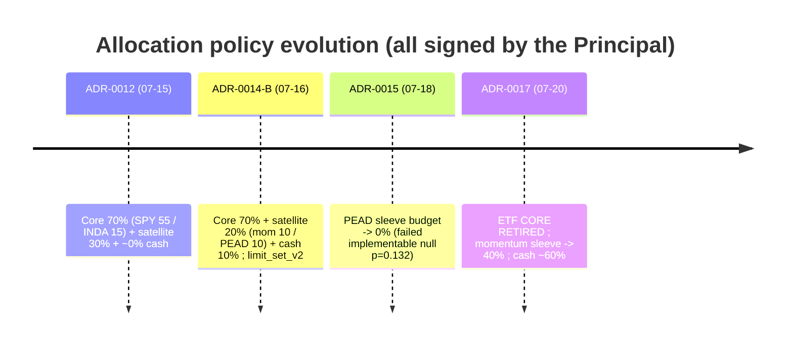
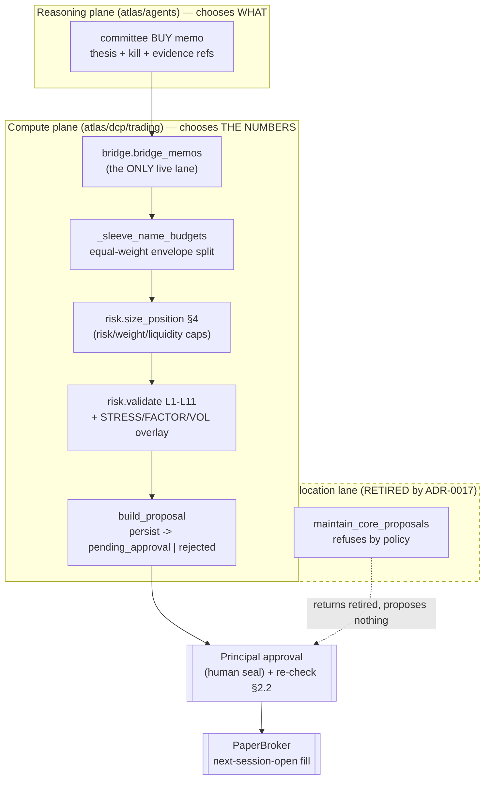
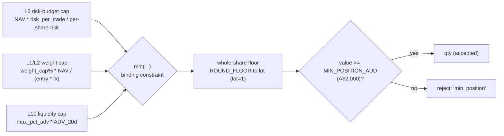
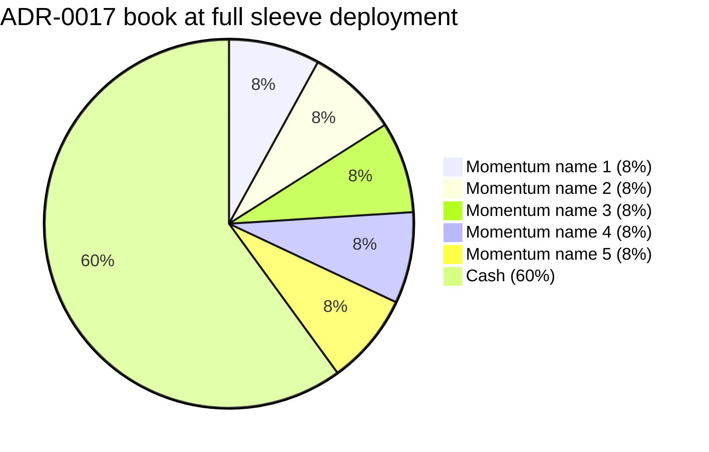

# 06 — Portfolio Construction

> Scope: how Atlas turns a signed strategy + a nightly research memo into a sized,
> constrained, cash-managed book. Position sizing, diversification and concentration
> constraints, liquidity, turnover/rebalance cadence, cash management, and the
> (deliberate) absence of portfolio optimization.
>
> **Read this first.** Atlas is a **paper-mode research/simulation system**, months
> old, one Principal + an AI pair, single machine, no broker connection. Nothing here
> is investment advice; no real capital moves. Every capability below is tagged
> `[IMPLEMENTED] / [PARTIAL] / [EXPERIMENTAL] / [PLANNED — NOT BUILT] / [PLACEHOLDER]`.
> Where a claim is an assumption rather than verified behaviour, it says so.

Primary sources read for this document (cite these, not intent):
`atlas/dcp/trading/bridge.py`, `atlas/dcp/trading/core_allocation.py` (**RETIRED**),
`atlas/dcp/trading/proposals.py`, `atlas/dcp/risk/engine.py` (sizing §4),
`atlas/dcp/portfolio/snapshot.py`, `atlas/dcp/portfolio/attribution.py`,
`atlas/dcp/trading/bands.py`, `atlas/tools/seed_limit_set_v2.py`,
`docs/adr/0012`, `0014`, `0015`, `0017`.

---

## 0. TL;DR for the committee

- **There is no portfolio optimizer.** No mean-variance, no risk-parity, no
  Black-Litterman, no beta targeting, no factor-neutralisation. Allocation is
  **equal-weight within a sleeve, subject to hard risk caps.** Stated plainly in the
  risk facts and confirmed in code: `size_position` is a chain of *caps* (risk-budget,
  weight, liquidity) with the **minimum** binding — `atlas/dcp/risk/engine.py:425-427`.
  `[IMPLEMENTED]` (as equal-weight); optimizer `[PLANNED — NOT BUILT]`.

- **The invested book rests on ONE *sleeve-budgeted* strategy — but a second,
  unvalidated path exists.** As of ADR-0017 (signed 2026-07-20) the sleeve-budgeted book
  is **satellite-heavy, no ETFs**: momentum sleeve `xsmom-pit-tr` at **40% of NAV**, PEAD
  suspended at 0%, remainder (~60%) cash. The former 70% SPY/INDA index core is
  **retired** (`atlas/dcp/trading/core_allocation.py:358`, `CORE_RETIRED = "ADR-0017"`).
  This is a concentration decision the Principal signed with the costs read back verbatim
  (`docs/adr/0017-satellite-heavy-reallocation.md:35-54`). **Caveat (see §3.5):** the 40%
  envelope binds *only* memos attributed to a signed sleeve family. A committee BUY memo
  **not** so attributed — e.g. the AMD+INTC discretionary approvals — gets
  `sleeve_cap = None` and is sized by the L1–L11 risk engine **alone**, up to **8%/name**,
  entirely *outside* the 40% momentum envelope (`bridge.py:530-534`). So an *unvalidated*
  single-name book can be layered on top of the gauntlet-passed sleeve, bounded only by
  L1/L3/L7/L9/L11 (and the 90% gross VOL ceiling), not by any backtest.

- **The book is currently ~100% cash** (per ground-truth, 2026-07-20). Core proposals
  historically always expired unapproved; the core is now retired; a satellite entry
  requires a fresh BUY memo that survives every scope guard and risk check. Two
  discretionary approvals (AMD+INTC, 2026-07-18) were pending a fill at the next cycle —
  **and this is an unresolved tension** a hostile reviewer will probe: as of the
  2026-07-20 ground-truth date those approvals are two days old, so if they filled the
  book is *not* 100% cash. This document ran **no live DB query** (see §10), so it cannot
  say whether the fills executed, the proposals were voided/expired, or they remain
  pending; the committee should reconcile against the live ledger.
  `[VERIFIED via facts + code path; AMD/INTC fill status UNRESOLVED here]`.

- **Two allocation lanes ever existed**, both routed through the *same* risk engine:
  1. the **agent/bridge sleeve lane** (`bridge.py`) — the only live lane;
  2. the **core-allocation lane** (`core_allocation.py`) — deterministic ETF
     target-weight rebalancer, now **retired by policy** but kept as reference code.

- **Position size is an output of risk, never of conviction.** The LLM desk chooses
  *what* to propose; the DCP chooses *every number* (`bridge.py:1-8`, invariant 2).

---

## 1. The book shape (ADR evolution 0012 → 0014 → 0015 → 0017)

Portfolio construction policy is entirely governed by signed ADRs. There have been
**four signed allocation policies in five days** (ADR-0012 → 0014 → 0015 → 0017) — i.e.
three rewrites of the original — and this churn is itself a finding (see §11). The
current effective policy is **ADR-0017**.



### 1.1 Current target allocation (ADR-0017, effective)

| Sleeve | Target | Per-name target | Mechanism | Code | Status |
|---|---|---|---|---|---|
| Momentum `xsmom-pit-tr` (top-5, monthly) | **40% NAV** | **8.0% NAV** = exactly the L1 single-stock cap | agent/bridge sleeve lane | `bridge.py:230-233` | `[IMPLEMENTED]` |
| PEAD `pead-sue-tr` | **0.00** (suspended) | — | membership recorded, sizes to honest zero | `bridge.py:232`, `bridge.py:540-544` | `[IMPLEMENTED]` (as a zero) |
| ETF index core (SPY 55 / INDA 15) | **RETIRED** | — | `maintain_core_proposals` refuses by policy | `core_allocation.py:358,436-439` | `[RETIRED]` |
| Cash | **~60% nominal**, ≥10% floor (L5) | — | residual; no explicit cash-sleeve object | implicit (NAV − holdings) | `[IMPLEMENTED]` |

`SLEEVE_BUDGET_FRACTION` is the single source of truth for sleeve sizing
(`bridge.py:230-233`):

```python
SLEEVE_BUDGET_FRACTION: dict[str, Decimal] = {
    "xsmom-pit-tr": Decimal("0.40"),   # momentum sleeve (ADR-0017)
    "pead-sue-tr":  Decimal("0.00"),   # PEAD sleeve SUSPENDED (ADR-0015)
}
```

> **Governance note the reviewer should test:** editing these two numbers is described
> as "an ADR change" (`bridge.py:229`), but it is enforced by *code review discipline
> only* — `SLEEVE_BUDGET_FRACTION` is a plain Python constant. This is weaker than the
> `risk.limit_sets` path — but that path is itself not as strong as one might assume, and
> the honest contrast is narrower. `risk.limit_sets` is a **versioned DB row + audit event
> + a seed tool that refuses to re-run**, plus an **optional** dual-confirm timing CHECK
> (`dual_confirm_gap`) that only enforces a ≥1h gap **when `confirmation_b` is set** — and
> the tool stamps `confirmation_a` while leaving `confirmation_b` NULL, so **a single
> confirmation is permitted and is what was actually used** (`seed_limit_set_v2.py:19-26`).
> Nothing about it is cryptographic. The real gap is *DB-governed + audited* (limit sets)
> vs *plain constant, no DB row, no audit event* (sleeve budget): a one-line diff to this
> dict re-levers the entire invested book, silently. `[HONESTY FLAG]`.

### 1.2 Why cash is ~60%, and what that costs

Cash is a **residual**, not an optimised allocation: whatever the 40% momentum sleeve
does not deploy (after L1/L3/liquidity/whole-share friction) sits in cash, floored at
10% by L5. ADR-0017 states the cost honestly and the Principal signed it
(`docs/adr/0017-satellite-heavy-reallocation.md:36-43`):

- **Cash drag**: "with ~60% cash, the BOOK structurally lags SPY in up years — the
  sleeve must outrun SPY by ≈ 1.5× annually for the book to merely match it."
- **Crash cushion**: the same 60% cash bounds a momentum crash to ≈ **−16pp of NAV**
  (40% sleeve × the strategy's own −40% demotion band) before the band demotes it.

This is a **barbell**: one concentrated momentum sleeve + a large idle cash reserve.
It is the opposite of a diversified multi-sleeve book, and the ADR names it as such
("Concentration of validation… the entire invested book now rests on ONE validated
strategy", `0017:52-54`).

---

## 2. Architecture: two allocation lanes, one risk engine



Key invariants that shape construction (from `bridge.py:1-8` and the risk facts):

- **Two-plane wall**: `dcp/**` never imports `agents/**`; the bridge takes an
  injectable `Clock` only and emits one audit event per run.
- **No agent numbers**: a BUY memo without DCP evidence refs is a validation error; the
  agent's conviction never becomes a share count.
- **Risk FAIL is terminal**: a `build_proposal` FAIL lands the proposal in `'rejected'`
  with the check recorded and **no override path** (`proposals.py:748-753`).
- **The bridge is the ONLY live caller of `build_proposal`** for the agent lane
  (pinned by `tests/unit/test_policy_conformance.py`, per `bridge.py:60-62`).

### 2.1 The core-allocation lane (RETIRED — read before dismissing)

`core_allocation.py` is a **fully-built, tested, and now switched-off** deterministic
rebalancer. It is worth understanding because (a) it is still the reference
implementation a future signed ADR would revive, and (b) it demonstrates the *only*
place Atlas ever did true target-weight portfolio construction.

- `plan_core_rebalance(...)` — a **pure function**: NAV + target weights + current book
  → integer-share buy/sell legs, acting only when a leg drifts outside the ±5pp band,
  whole shares only, never over-allocating, leaving a documented per-leg cash residual
  (`core_allocation.py:112-162`). This is the closest the codebase comes to an
  allocator, and it is *equal-to-target*, not optimised. `[IMPLEMENTED but RETIRED]`.
- `build_core_proposals(...)` — persists those legs and runs each through the **same**
  imported risk engine (`core_allocation.py:53-59, 297-330`). BUY legs run full L1–L11;
  SELL legs take the Doc 04 §5 exit treatment.
- The core is **rebalanced, not stopped**: every leg carries `stop_loss NULL`, and the
  risk engine treats a `is_core` holding as **zero L7 open risk** while its market
  exposure is governed by the weight rules (`core_allocation.py:22-27`,
  `engine.py:173-192`). This is the `is_core` positive marker (migration 0023).
- **Retirement is a constant, not a flag**: `CORE_RETIRED = "ADR-0017"`
  (`core_allocation.py:358`). When set, `maintain_core_proposals` returns a report with
  `retired=<ref>` and proposes nothing, every night, honestly
  (`core_allocation.py:436-439`). Reviving the core "means editing THIS constant in
  review, never a runtime flag" (`core_allocation.py:355-357`). `[HONESTY FLAG]`: same
  as §1.1 — this is review-discipline governance, not a signed-DB gate.

> **Documented dead-code caveat**: the entire drift-band + regeneration machinery below
> `CORE_RETIRED` (`core_allocation.py:333-491`) is unreachable in production while the
> constant is set. It stays tested (`retired=None` in tests). A reviewer should treat it
> as latent surface, not live behaviour.

---

## 3. Position sizing — the §4 pipeline (the load-bearing math)

**All live sizing goes through `risk.size_position` (`engine.py:406-438`).** Size is
computed as the **minimum of three caps**, then floored to whole shares, then floored
to a minimum economic value. There is no volatility-scaling of *weight*, no conviction
multiplier, no optimiser — the only "signal" input is the stop distance (which sets the
risk-budget cap).



### 3.1 The three caps (verbatim from code)

`engine.py:416-427`:

| Cap | Formula | Meaning |
|---|---|---|
| **L6 risk-budget** (`"L6"`) | `raw_size = (nav * risk_per_trade(breaker)) / ((entry − stop) * fx)` | The 1%-of-NAV per-trade risk rule turned into a share count. **DD1 halves it** (`engine.py:106-110`). |
| **L1/L2 weight** (`"L1/L2"`) | `weight_cap = (weight_cap_pct * nav) / (entry * fx)` | Single-name 8% (stock) or 15% (ETF). This is what makes the "8%/name cap edge" real. |
| **L10 liquidity** (`"L10"`) | `liquidity_cap = max_pct_adv * max(adv_20d, 0)` | ≤5% of 20-day ADV. |

```python
candidates = {"L6": raw_size, "L1/L2": weight_cap, "L10": liquidity_cap}
binding = min(candidates, key=lambda k: candidates[k])
size = candidates[binding]
```

The **binding constraint is recorded** on the `SizeDecision` (`engine.py:398-403`,
`437-438`) — so every proposal explains which rule sized it. This is a genuinely good
audit property. `[IMPLEMENTED]`.

### 3.2 The 8%/name cap edge (why the momentum sleeve runs *under* 40%)

Under ADR-0017 the per-name target is **8.0% of NAV = exactly the L1 cap**
(`bridge.py:216-224`, `0017:23-25`). This produces predictable friction the ADR names
honestly (`0017:44-51`):

- **Sizing shaves entries to fit.** The weight cap is a `ROUND_FLOOR` whole-share
  computation (`engine.py:429-430`), so a name at the 8% edge rounds *down* — the
  realised weight is ≤ 8%, never exactly 8%.
- **Appreciation drifts names *above* 8%.** "L1 gates NEW proposals; it does not
  force-trim drift — drift resolves at the next monthly rebalance" (`0017:44-47`).
  **There is no drift-trimming mechanism in the code** — the risk engine only gates new
  BUYs; nothing sells a winner back to 8%. `[VERIFIED absence]`, `[HONESTY FLAG]`.
- **Effective sleeve will often run under 40%** because of both effects plus L3 sector
  refusals (§4.2). "The book holding less than target is the cage working, never a
  defect" (`0017:47-51`).

### 3.3 Whole-share floor and minimum-position floor

- **Whole shares only**: `lots = (size / lot_size).to_integral_value(ROUND_FLOOR); qty
  = int(lots) * lot_size` (`engine.py:429-430`). `lot_size` defaults to **1** and — a
  finding — **is never passed a non-default value on any live path**. Both callers
  (`proposals.build_proposal` at `proposals.py:726-729` and the API preview at
  `api/routers/risk.py:253-258`) omit it. India lot-size handling is therefore **latent
  and unwired** (moot today: India is reachable only via US-listed ADRs traded in whole
  shares; direct NSE is blocked — no vendor coverage). `[PARTIAL / latent]`.
- **Minimum economic position**: `MIN_POSITION_AUD = Decimal("2000")`
  (`engine.py:22`). A sized position worth < A$2,000 is **rejected** (`min_position`,
  `engine.py:434-436`) rather than opened — this prevents dust positions but also means
  a name that only fits a tiny slice simply does not trade.

### 3.4 The sleeve-budget overlay (the second cap, ADR-0014 mechanics)

The bridge applies a **second, outer cap** on top of §4 sizing so a sleeve's *aggregate*
exposure stays inside its signed envelope. It can only **shrink** the §4 size, never
grow it (`proposals.py:711-718, 731-733`; `bridge.py:526-555`).

Mechanism (`bridge.py:329-354`):

1. At run start, count the candidate BUY names attributed to each funded family `F`
   (via signal-lineage join — §5.1). Call it `n`.
2. Per-name AUD slice: `per_name_aud = (NAV * SLEEVE_BUDGET_FRACTION[F] −
   committed_F) / n` (`bridge.py:352-354`).
3. Whole-share cap: `sleeve_cap = floor(per_name_aud / (entry * fx))`
   (`bridge.py:545-550`).
4. Final qty: `qty = min(size_position(...).qty, sleeve_cap)` (`proposals.py:732-733`).

**Nuance the committee should note (from the arithmetic):** for the top-5 momentum
sleeve, whether the sleeve cap or L1 binds depends on **how many BUY memos the desk
emits that night**:

| Candidate names `n` | Sleeve slice per name | vs L1 8% | Binding | Aggregate deployed |
|---|---|---|---|---|
| 5 | 40%/5 = 8% NAV | tie | either | ~40% (target) |
| 2 | 40%/2 = 20% NAV | L1 tighter | **L1 8%** | ~16% (under) |
| >5 (hypothetical) | <8% NAV | sleeve tighter | **sleeve** | ~40% |

So the **realised sleeve weight is a function of desk output**, not a fixed 40%. Fewer
memos → more idle cash. This is conservative-by-construction ("aggregate stays UNDER
budget", `bridge.py:340-342`) but means the 40% target is a *ceiling shared five ways*,
rarely a floor. `[VERIFIED behaviour]`.

`committed_F` (`_sleeve_committed_aud`, `bridge.py:294-326`) sums the family's **open
positions** (market value) **plus its live unfilled proposals** (reserved value) — a
conservative superset that closes a cross-cycle over-commit hole (yesterday's still-
pending sleeve proposal counts against today's budget). Both terms only *enlarge* the
committed base, so the remaining envelope can only *shrink* sizing.

### 3.5 The non-sleeve discretionary path — sized OUTSIDE the envelope

There are really **two sizing sub-paths through the same bridge**, and only one of them
sees the sleeve budget:

1. **Sleeve-budgeted sub-path.** A memo whose evidence refs resolve to a signed sleeve
   family (`_sleeve_families` returns non-empty) gets the equal-weight `sleeve_cap` of
   §3.4 as an *outer* cap — its aggregate stays inside the 40% envelope. This is the
   validated `xsmom-pit-tr` momentum path.
2. **Non-sleeve discretionary sub-path.** A committee BUY memo **not** attributed to a
   signed sleeve family gets `sleeve_cap = None` and is sized by the **L1–L11 risk engine
   alone** (`bridge.py:530-534` — "non-sleeve memos are sized by risk alone (cap None)").
   Its per-name ceiling is the plain **L1 8% of NAV**; nothing ties it to the 40% momentum
   envelope. The **AMD+INTC approvals (2026-07-18) are exactly this path.**

**Why this matters:** the "the invested book rests on ONE strategy" framing (§0, §9)
describes the *sleeve-budgeted* sub-path only. The discretionary sub-path can layer
*unvalidated* single names — each ≤ 8% (L1), collectively bounded only by L3 (25%/sector),
L7 (6% aggregate open risk), L9 (2 new/day), L11 (85% non-AUD) and the **L5-derived 90%
gross VOL ceiling** (§8) — on top of the sleeve. These are discretionary bets that have
**not** passed the backtest gauntlet the momentum sleeve did, so they are arguably a
*distinct* risk (unvalidated, un-gauntletted names) rather than an extension of the
validated strategy. The doc treats them separately for this reason. `[VERIFIED behaviour;
HONESTY FLAG]`.

---

## 4. Diversification and hard constraints (L1–L11)

Diversification in Atlas is **entirely constraint-driven** — there is no explicit
diversification objective (no ENC/effective-N target, no correlation-minimisation). The
book is diversified only to the extent the caps force it, over-and-above equal-weight.
Values below are `limit_set_v2` (`small_aum`), the active signed set
(`seed_limit_set_v2.py`, `engine.py:113-148`).

| Rule | Value (v2) | What it constrains | Portfolio-construction effect | Code |
|---|---|---|---|---|
| **L1** max stock weight | **0.08** | single non-ETF name | The per-name ceiling; = the 8% sleeve target | `engine.py:291-293` |
| **L2** max ETF weight | 0.15 (0.60 for allowlisted SPY/INDA) | single ETF | Moot post-ADR-0017 (no ETFs) | `engine.py:95-104, 279-288` |
| **L3** sector exposure | **0.25** | GICS sector aggregate | **The real diversifier for a momentum sleeve** — see §4.2 | `engine.py:296-305` |
| **L4** India sleeve | 0.30 | India-exposed (market IN or ADR look-through) | **Now moot** — no India positions post-0017 | `engine.py:309-317`, `proposals.py:221-222` |
| **L5** min cash | **0.10** | cash floor | Hard floor under the ~60% residual cash | `engine.py:319-324` |
| **L6** risk/trade | **0.01** | per-trade stop-out loss | Sets the L6 sizing cap (DD1 → 0.005) | `engine.py:326-331, 106-110` |
| **L7** aggregate open risk | **0.06** | sum of stop-out losses | Bounds total downside across stopped satellite names | `engine.py:333-340, 173-192` |
| **L8** correlation | 0.80 threshold / 0.12 combined weight | pairwise concentration | Blocks two highly-correlated names both large | `engine.py:342-357` |
| **L9** new positions/day | 2 | discretionary entries/day | Throttles agent-lane build-out | `engine.py:359-368` |
| **L10** liquidity | **0.05** of ADV | position vs ADV_20d | Third sizing cap; **unknown ADV fails closed** | `engine.py:370-378, 423` |
| **L11** non-AUD exposure | 0.85 | FX (non-base-currency) | Caps unhedged US exposure of the book | `engine.py:380-390` |

### 4.1 Country constraint (L4 India 30%) — now moot

L4 caps India-exposed value at 30% of NAV, with **look-through**: `market == "IN" OR
"IN" in economic_exposure` (`proposals.py:221-222`). Post-ADR-0017 there are **no India
positions** (the INDA ETF core is retired and direct NSE is blocked — EODHD has zero NSE
coverage), so L4 is a **dormant guard**: it will fire only if a future ADR reintroduces
India exposure. `[IMPLEMENTED but currently inert]`.

### 4.2 Sector constraint (L3 25%) — the binding diversifier for momentum

For a top-5 cross-sectional momentum sleeve, the names **frequently cluster in one
sector** (momentum crowds). L3 (25% GICS sector cap) is therefore the constraint that
actually forces diversification: "momentum's top-5 frequently share a sector; L3 (25%)
will then shave or refuse the 4th/5th name" (`0017:49-51`). Mechanically, L3 is a
post-trade check on `sector_value + proposal.cost_aud` (`engine.py:296-305`); it does
**not resize** — it **rejects** the marginal name whose sector would breach 25%. With
5 names at 8% each = 40%, up to three same-sector names fit (24%); the 4th same-sector
name (32%) fails L3 and lands `'rejected'`. **Consequence: a heavily one-sector momentum
signal deploys fewer than 5 names and holds more cash.** `[VERIFIED behaviour]`.

> Diversified ETFs are exempt from L3 as `_BROAD_SECTOR = "Broad"` (`engine.py:23,
> 297-307`). Moot post-0017 (no ETFs).

### 4.3 Correlation (L8) — pairwise, threshold-gated, not a covariance model

L8 is **not** a covariance/optimisation input. It is a pairwise guard: for each existing
holding whose 90-day correlation with the candidate **exceeds 0.80**, if the *combined*
weight exceeds **0.12**, the proposal fails (`engine.py:342-357`). This is a coarse
concentration tripwire, not a diversification objective — it cannot express "reduce
portfolio variance", only "don't hold two nearly-identical names both large". Correlation
data quality/availability is a dependency (a `None` corr is skipped, i.e. treated as
uncorrelated — `engine.py:347`). `[IMPLEMENTED as a tripwire]`.

### 4.4 L9 batched-rebalance semantics — ADR text vs engine code

ADR-0014 says a batched core/satellite rebalance should count as **one** authorized
action, with discretionary agent entries staying capped at 2/day (`0014:24`). But the
**engine's L9 is a flat `new_positions_today + 1 <= cap` check** (`engine.py:359-368`);
the "batched = one action" semantics live in the *book-builder's* counting, not in L9
itself. Post-0017 the core lane is retired, so this nuance is largely academic — but a
reviewer tracing L9 should know the "one authorized action" concept is **not** a
first-class engine primitive. `[PARTIAL — semantics split across layers]`.

---

## 5. Sleeve attribution, dual-winners, and suspended sleeves

### 5.1 The lineage join (how a name is attributed to a sleeve)

A memo is attributed to a signed strategy **family** via its evidence refs → embedded
`quant.signals` UUID → `quant.strategies.family` (`bridge.py:259-291`). The signal-ref
grammar is strict: `dcp:signal:<xsmom|pead>:<uuid>:<date>`, and a **signal-shaped ref
whose row is missing fails the memo closed** — "refusing to fabricate signal lineage"
(`bridge.py:236-254`). This is the same join `bands.py` uses for demotion, so
attribution is consistent across sizing and monitoring. `[IMPLEMENTED]`.

### 5.2 Dual-winner names (a name in two sleeves)

If a name is a top-5 in **both** momentum and PEAD, it occupies a budget slot in **both**
sleeves and is sized under the **tighter** slice (`bridge.py:270-291, 546-548`). This
under-deploys the aggregate slightly (conservative, never over). Today PEAD is at 0%
budget, so a dual-winner "deploys under momentum's slice alone" — a zero-budget sleeve
must not veto a funded one (`bridge.py:534-544`, `0015:34-37`).

### 5.3 Suspended sleeve (PEAD) — sizes to an honest zero

A memo whose **only** funded sleeve is suspended is a **recorded skip**, not a 0-qty
proposal (`bridge.py:540-544`): "sleeve(s) … suspended at zero budget (ADR-0015) — memo
recorded, no capital". PEAD keeps generating signals, memos, and scorecard grades as a
**forward experiment** deploying no capital (`0015:23-42`). `[EXPERIMENTAL]`.

---

## 6. Cash management

- **Cash is a residual object, not an allocation.** There is no cash-sleeve dataclass;
  cash = ledger cash net of pending order costs (`proposals.py:389-390, 449-451`), and
  NAV = holdings + cash (`portfolio/snapshot.py:32-62`). `[IMPLEMENTED]`.
- **L5 10% floor** is enforced at both sizing and validation: `cash_after =
  (cash − cost) / nav >= 0.10` (`engine.py:319-324`). A BUY that would breach the floor
  fails L5 → `'rejected'`.
- **~60% nominal cash** is the *consequence* of a 40% sleeve with under-deployment
  friction (§3.2, §4.2), not a targeted reserve. ADR-0017 accepts the cash drag
  explicitly (`0017:39-43`).
- **No cash yield / sweep / money-market modelling.** Idle cash earns nothing in the
  simulation. `[PLANNED — NOT BUILT]`.
- **FX**: cash and NAV are in base currency AUD; each holding is FX-translated per
  `fx_to_aud` (`snapshot.py:32-62`, `bridge.py:545`). L11 caps aggregate non-AUD
  exposure at 85%. FX is a daily rate, not intraday. `[IMPLEMENTED, daily granularity]`.

---

## 7. Turnover, rebalancing, and no-averaging-down

### 7.1 Cadence

- **Momentum is monthly, top-5** (`xsmom-pit-tr`, 12-1 cross-sectional momentum). The
  sleeve turns over on the monthly signal-generation cadence (`t6b` in the daily cycle);
  the backtest gauntlet used monthly rebalance + next-open execution.
- **The core was quarterly-or-±5pp-drift** (`core_allocation.py`, ADR-0012) — retired.
- **Proposal TTLs**: agent proposals expire after **24h** (`PROPOSAL_TTL`,
  `proposals.py:798-811`); core proposals had a **72h** TTL because "hold the market" is
  a standing policy (`core_allocation.py:79-89`) — retired.

### 7.2 Rebalancing is entry-gated, not weight-rebalanced

**There is no periodic re-weighting to target.** The engine gates *new* proposals; it
does **not** trim winners or top-up laggards to restore equal-weight (§3.2). The only
target-weight rebalancer that ever existed was the (now retired) core lane. So "monthly
rebalance" means "the monthly signal picks a new top-5 and the bridge sizes the new
entries" — **existing positions drift freely between rebalances** and are only reset when
they exit (stop/signal-drop) and new names enter. `[HONESTY FLAG — no drift control]`.

### 7.3 No averaging down (structural)

The open-position scope guard is the policy's call site: a memo for a symbol with an
**open position** is **always a recorded skip** (`bridge.py:398-416`), so the agent lane
**structurally cannot add to an existing position** at any price
(`bridge.py:59-67`). The add-on merge branch in `_record_fill` (`proposals.py:1301-1340`)
is therefore **unreachable through the agent lane** — it exists only for the (retired)
core top-up path and refuses cross-origin folds fail-closed. `[IMPLEMENTED]`.

### 7.4 Re-entry cooling and earnings guard (turnover brakes)

Two additional guards reduce churn/adverse entries (`bridge.py:419-467`):

- **Re-entry cooling** (`REENTRY_COOLING_SESSIONS = 10`): a name stopped out < 10 XNYS
  sessions ago is blocked *unless* the memo post-dates the stop-out (the policy's own
  "new committee memo" exception, Doc 03).
- **Earnings guard** (`EARNINGS_GUARD_SESSIONS = 2`): a known future earnings print
  within 2 XNYS sessions blocks entry — the position would enter at next open and face
  the print almost immediately. **Missing calendar data is no block** (fail-open on
  absence, by design). `[IMPLEMENTED]`.

---

## 8. Portfolio optimization — NONE (stated plainly)

**Atlas has no portfolio optimizer.** This is not an omission in this document; it is
the design. Confirmed against code and the risk facts:

| Optimisation technique | Status | Evidence |
|---|---|---|
| Mean-variance / Markowitz | `[PLANNED — NOT BUILT]` | no covariance matrix anywhere; L8 is a pairwise tripwire |
| Risk parity / ERC | `[PLANNED — NOT BUILT]` | sizing is min-of-caps, `engine.py:425-427` |
| Black-Litterman / views blending | `[PLANNED — NOT BUILT]` | no prior/posterior machinery |
| Explicit beta targeting | `[PLANNED — NOT BUILT]` | risk facts: "NOT IMPLEMENTED: … explicit beta targeting" |
| Factor-neutralisation / factor model | `[PLANNED — NOT BUILT]` | `check_factor_overlap` is an overlap *cap*, not a factor optimiser |
| VaR / CVaR objective | `[PLANNED — NOT BUILT]` | risk facts: "NOT IMPLEMENTED: VaR, CVaR" |
| Kelly / conviction sizing | `[PLANNED — NOT BUILT]` (deliberately) | size is output of risk, never conviction (`engine.py:8`) |
| Transaction-cost-aware optimisation | `[PLANNED — NOT BUILT]` | flat 10bps/side cost model; no impact/optimisation |

**What Atlas does instead:** equal-weight within a sleeve (each of the 5 momentum names
targets the same 8% of NAV), then let hard caps (L1/L3/L10/L5) + whole-share flooring
shave the result. The "portfolio" is the emergent set of names that survive the caps —
there is no objective function being maximised. `[IMPLEMENTED as equal-weight]`.

There **is** a policy-overlay block downstream of §4 sizing — STRESS §7, FACTOR §12, and
a VOL gross-cap (`proposals.py:738-746`) — but these are **veto overlays** (they can fail
a proposal), **not optimisers** (they never re-weight to improve an objective). The
**live wired** VOL gross ceiling (`gross_step_gate`) **tracks L5**: the caller passes
`gross_cap = 1 − active L5 cash floor`, so under `limit_set_v2` (L5 = 0.10) the live
ceiling is **0.90**, i.e. the book may deploy up to **90% gross, not 80%**
(`proposals.py:738-740`, `vol_target.py:13-19`). The `MAX_GROSS = 0.80` constant
(`vol_target.py:35`) is a **dormant v1-era default** kept only for the *unwired* Tier-1
scaler `target_gross_exposure` — "the wired gate never reads it" (`vol_target.py:17-19`).
So the property-test that gross never exceeds 0.80 constrains the **unwired scaler**, not
the live deployment ceiling. This matters for the concentration/capacity question: the
90% gross headroom (not 80%) is what a stacked discretionary book (§3.5) could fill.
`[HONESTY FLAG — earlier drafts conflated the two constants]`.

**And do not over-credit the VOL gross ceiling as a second control.** Its gross-LEVEL arm is
**algebraically the L5 cash floor restated**, not an independent overlay. In the unlevered,
long-only pro-forma book the NAV identity forces `gross_after + cash_after = 1` exactly
(pending-buy cost and this proposal's cost cancel between the two numerators —
`proposals.py:389-390,449-451,691-692`; `engine.py:319-324`; `snapshot.py:52`), so
`gross_after ≤ 1 − L5` **is** `cash_after ≥ L5`, boundary included. The only exposure
protections `gross_step_gate` adds beyond L1–L11 are the **10%/day step cap** (`MAX_STEP`) and the
**DD2/DD3 gross-freeze**; the "90% ceiling" itself is L5. (Exact up to sub-cent per-holding
rounding, ~1e-7 of NAV — see 07 §8.4 for the derivation.)

---

## 9. Diversification math today (the concentration picture)

Given the ADR-0017 book, the *fully-deployed* momentum sleeve is:

- **5 names × 8% = 40% invested, 60% cash.**
- Effective number of positions (ENC) at full deployment ≈ **5** in the risky sleeve;
  across the whole book, the single largest *risk* concentration is the shared momentum
  factor, not any one name.
- **The dominant concentration is single-strategy, not single-name.** No cap in L1–L11
  constrains "% of book behind one *strategy*" — L1 caps a *name*, L3 a *sector*, but the
  entire 40% sleeve shares one signal and one demotion band. The only backstop is the
  **strategy demotion band** (ADR-0010): DD −40% from sleeve peak or trailing-126-session
  excess-vs-SPY-TR < −25pp → machine-executed, **latching** demotion to `'suspended'`
  (`bands.py:1-12, 84-87`), after which the book goes to cash "there is no fallback
  sleeve" (`0017:62-64`). `[IMPLEMENTED]`, but note it is a **daily** check on a **−40%**
  band — a slow, wide backstop, not intraday risk control.
- **A second monitoring layer exists** beside the two demotion bands: a **CUSUM drift
  detector** (`bands.py` `CUSUM_KEY`/`CUSUM_EVENT`, `check_cusum`; t5c in the daily cycle)
  that replays live-minus-backtest daily excess against the backtest's own mean/σ and
  **latches + pages** on a breach. It is **alert-only** — it emits a
  `quant.strategy.cusum_breach` audit event and notifies, but does **not** auto-demote
  ("auto-demote-on-CUSUM requires its own signed ADR criterion first", `bands.py:329-340`).
  So it sharpens *detection* of live/backtest divergence but does not itself de-risk the
  book. `[IMPLEMENTED, alert-only]`.
- **The picture below assumes zero discretionary names.** It counts only the
  sleeve-budgeted momentum book; any non-sleeve discretionary approvals (§3.5) add
  further, *unvalidated* concentration outside this pie, up to L1 8%/name.



---

## 10. Assumptions vs verified behaviour

| Claim | Basis | Confidence |
|---|---|---|
| Sizing = min(L6, L1/L2, L10) then whole-share floor then A$2k min | code read, `engine.py:406-438` | **VERIFIED** |
| Sleeve cap only ever shrinks §4 size | code read, `proposals.py:731-733`; `bridge.py:526-555` | **VERIFIED** |
| Momentum = 40%, PEAD = 0%, core retired | code read `bridge.py:230-233`, `core_allocation.py:358`; ADR-0017 | **VERIFIED** |
| Book currently ~100% cash | ground-truth facts (2026-07-20), consistent with code path | **ASSUMED from facts** (no live DB query run here) |
| Realised sleeve weight depends on # of BUY memos/night | derived from `_sleeve_name_budgets` arithmetic | **VERIFIED (logic)**, empirical distribution **UNTESTED** |
| No drift-trimming of winners back to 8% | absence of any sell-to-target code + ADR-0017:44-47 | **VERIFIED (absence)** |
| `lot_size` never non-1 on live path | both callers omit it (`proposals.py:726-729`, `risk.py:253-258`) | **VERIFIED** |
| Demotion band actually latches on real data | `bands.py` logic read; never fired in production | **ASSUMED (untriggered)** |
| No portfolio optimizer of any kind | code-wide absence + risk facts | **VERIFIED** |

**Empirical evidence still needed:** (a) the realised distribution of sleeve weight vs
the 40% target across real desk nights; (b) an end-to-end run showing 5 momentum memos
sizing to ~40% aggregate under live limits; (c) any evidence the −40% demotion band
behaves as designed under a real drawdown (it has never fired); (d) the current fill
status of the AMD+INTC discretionary approvals (2026-07-18) — unresolvable here without a
live ledger query, and in direct tension with the ~100%-cash claim (§0). These are
simulation artifacts a hostile committee will (rightly) ask to see.

---

## 11. Weaknesses / Debt / Open

- **Concentration is the headline risk.** One validated strategy, one 40% sleeve, one
  demotion band, no fallback sleeve, ~60% idle cash. The invested book is a single
  momentum bet. ADR-0017 signs this consciously, but it is the opposite of a diversified
  construction and the +737%-headline backtest carries a −40% drawdown band
  (concentrated top-5 momentum). `[HONESTY FLAG]`.
- **No portfolio optimizer, no drift control, no re-weighting.** Equal-weight-into-caps
  only; winners drift above 8% with nothing trimming them until they exit; the 40% target
  is a shared ceiling, frequently under-filled. Rebalancing is entry-gating, not
  weight-rebalancing.
- **Sleeve budget governance is weaker than limit-set governance.**
  `SLEEVE_BUDGET_FRACTION` and `CORE_RETIRED` are plain Python constants changed by code
  review; `risk.limit_sets` is at least a versioned DB row + audit event + a
  non-re-runnable seed tool. Note the limit-set path is not as strong as "dual-confirm"
  implies: its `dual_confirm_gap` CHECK is **optional** and the v2 set was signed with a
  **single** confirmation (`seed_limit_set_v2.py:19-26`). Still, a one-line diff to the
  sleeve dict re-levers the book with **no DB row and no audit trail** — a real asymmetry.
- **Four allocation policies in 5 days** (ADR-0012→0014→0015→0017 — three rewrites of the
  original). Rapid, honest, and signed — but a reviewer should read it as *young, unstable
  policy*, not settled doctrine. Several docstrings lag the code (see cross-doc
  inconsistency below).
- **Large volume of retired/dead surface.** `core_allocation.py` (≈490 lines) is fully
  built, tested, and switched off by a constant; the fill-merge/averaging-down branch is
  unreachable via the live agent lane. Latent surface a maintainer must keep straight.
- **Daily-granularity, wide backstops.** The only single-strategy backstop is a **daily**
  check on a **−40%** band; stops are pre-authorised daily-scanned exits (2×ATR or −10%
  floor), no intraday/live monitoring. No VaR/CVaR/beta/optimiser (all `[PLANNED — NOT
  BUILT]`).
- **Cost realism.** Flat 10bps/side cost model, no slippage/impact/spread/borrow; paper
  fills at next-session **open price** (optimistic). Any capacity/impact question for the
  40% sleeve is unmodelled.
- **`lot_size` is latent/unwired** — India lot handling exists in the signature but never
  fires; direct-NSE is vendor-blocked anyway.
- **PIT fundamentals gap** blocks value/quality sleeves entirely, so a diversifying second
  factor is not merely unbuilt — it is currently un-buildable honestly (see the data-plane
  facts). The single-strategy concentration is partly forced by this.

---

## 12. Cross-document inconsistencies noticed

1. **`bridge.py`'s own sleeve-budget docstring is stale relative to its code.** The module
   docstring block still describes "sleeve budget (ADR-0014, option B — the active
   satellite is momentum 10% + PEAD 10% of NAV)" (`bridge.py:88-100`), while the live
   constant directly below is ADR-0017's **40% / 0%** (`bridge.py:230-233`). Same file,
   contradictory allocation numbers. The code is authoritative (per ground-truth rule);
   the docstring lags one ADR behind.
2. **`core_allocation.py`'s header still presents the core as the active default** ("The
   core (default SPY 55% + INDA 15% of NAV) is NOT an agent recommendation…",
   `core_allocation.py:1-8`) even though `CORE_RETIRED = "ADR-0017"` retires it 350 lines
   later. Documented as intentional (reference implementation), but a fast reader will
   mis-read the book shape.
3. **`CLAUDE.md` project status is a full policy generation behind.** It still describes
   the book as "70/10/20" and "index-core 70/10/20 (ADR-0012/0014/0015)" with no mention
   of ADR-0017's satellite-heavy 40%/cash book. `README`/status docs need the ADR-0017
   update the ADR itself calls for (`0017:60-61`).
