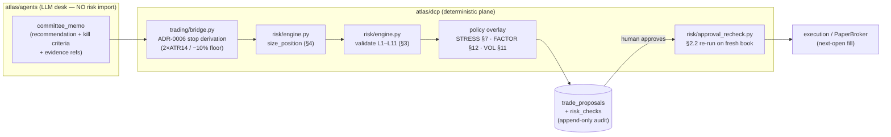
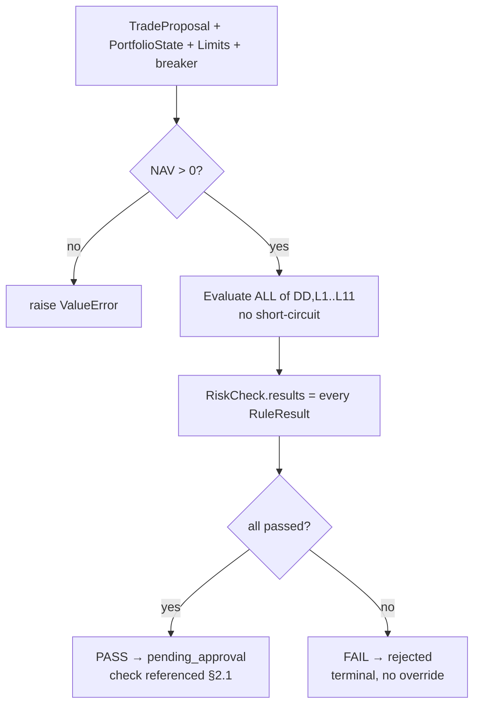
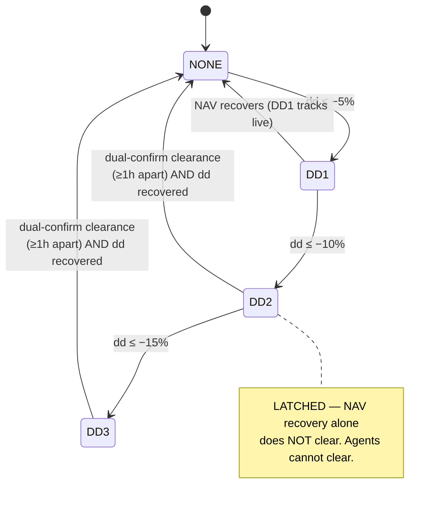

# 07 — Risk Management

**Atlas AI Capital · Review package · As of 2026-07-20**
**Scope: paper mode only. Hypothetical A$100k. No real capital, no broker, no live trading.**

> This document describes the *risk* subsystem: what it enforces, how it is wired, where it
> stops, and what it does **not** do. It is written for an adversarial reviewer. Weaknesses,
> dead code paths, and unenforced claims are surfaced in-line, not buried. Every claim is
> anchored to a source file; where a claim rests on the ground-truth brief rather than code I
> can execute here, it is flagged as such.

**Capability tags used throughout:** `[IMPLEMENTED]` `[PARTIAL]` `[EXPERIMENTAL]`
`[PLANNED — NOT BUILT]` `[PLACEHOLDER]` `[DEAD PATH]`.

---

## 0. TL;DR for the committee

- The risk engine (`atlas/dcp/risk/engine.py`) is the strongest-engineered part of the codebase:
  a pure-function, fully-itemised, non-short-circuiting L1–L11 limit checker with deterministic
  §4 sizing and latched DD1–DD3 breakers. It is the only module in the repo held to **100% branch
  coverage** (`make cov-risk`). **[IMPLEMENTED]**
- The design principle is genuinely enforced: **size is an *output* of risk, never an input from
  conviction**; a FAIL is terminal with no override path in code; agents hold no write path to
  `risk.*`. **[IMPLEMENTED]**
- The four "policy overlay" controls — stress §7, factor-overlap §12, vol-target §11, plus the
  approval-time re-check §2.2 — are real code but each has a **material caveat**: two of them are
  effectively non-binding in the current single-strategy configuration, one contains a **leaked
  mutation-testing sentinel that silently disables its momentum arm**, and the §2.2 re-check does
  **not** re-run the overlay gates on the fresh book.
- Whole categories are **NOT BUILT**: VaR, CVaR, explicit beta targeting, any portfolio
  optimizer (the book is equal-weight / target-weight only), intraday or live market-risk
  monitoring, and capacity analysis. Stops are **daily-bar** pre-authorized exits — there is no
  live stop monitoring.
- **100% branch coverage is the `atlas/dcp/risk` *package* only.** The *wiring* that invokes these
  gates (`atlas/dcp/trading/proposals.py`, `bridge.py`, `core_allocation.py`) is **not** under
  that bar, and that is exactly where the live defects sit.

---

## 1. Where risk sits in the system

Risk is part of the **deterministic compute plane** (`atlas/dcp`). The hard architectural wall
(CLAUDE.md invariant 1, `tests/unit/test_boundaries.py`) forbids the LLM agents from importing
`atlas.dcp.risk` at all. Agents emit *memos*; a deterministic bridge turns a memo into a sized,
stop-derived, risk-checked proposal. **No LLM-produced number ever reaches the risk engine as a
sizing/pricing input** (CLAUDE.md invariant 2).



The philosophy is stated verbatim in the engine docstring (`atlas/dcp/risk/engine.py:1-9`):
*"Risk is a structural property, not an opinion… A FAIL is terminal for the proposal
(Constitution 3.2): there is no override path in code, and agents hold no write permission on
risk.* tables. Position size is an OUTPUT of risk, never an input from conviction."*
This is not marketing — it is matched by the code (see §3, §4). **[IMPLEMENTED]**

The policy this engine implements is `docs/architecture/04-risk-management-policy.md` (108 lines).
The engine comments repeatedly cite "Doc 04 §N", and the mapping is faithful.

---

## 2. The veto model — how a check is evaluated

`validate(proposal, state, limits, breaker) -> RiskCheck` (`engine.py:256-393`).

Key structural properties, all verified in code:

1. **No short-circuit.** Every rule is always appended to `results`, even when it is `n/a`
   (`engine.py:263`, and the itemised `RuleResult` appends throughout). A FAIL therefore
   *explains itself completely* — a reviewer sees every rule's value/limit, not just the first
   breach. `RiskCheck.passed = all(r.passed for r in results)` (`engine.py:392`).
2. **Worst-case pro-forma.** The base state is existing holdings **plus** approved-but-unfilled
   pending orders, "as if they all execute" (`PortfolioState`, `engine.py:219-227`;
   `cash_aud` is documented as already net of pending order costs).
3. **Itemised result shape** matches Doc 05 §4: `{rule, value, limit, passed, detail}`
   (`RuleResult`, `engine.py:229-238`). Qualitative rules leave `value/limit = None`.
4. **NAV must be positive** or `validate` raises (`engine.py:261-262`) — no silent divide.
5. **FAIL is terminal.** In the caller (`proposals.py:744-756`), a failing check lands the
   proposal in `rejected`; there is no flag that flips it back. CLAUDE.md invariant 3
   ("Risk FAIL is terminal") is enforced by test suite, not convention.



---

## 3. Position limits L1–L11 (with values)

Limits live in the versioned DB table `risk.limit_sets` (created in migration
`migrations/versions/0001_initial.py:70-82`) and are loaded per-run by
`load_active_limit_set(session, on)` (`engine.py:140-148`), which orders by `version DESC` and
**raises** if no set is effective on the date ("risk cannot run"). Values are parsed into a frozen
`Limits` dataclass (`engine.py:71-137`).

### 3.1 The active values

| # | Rule | v1 value (`seeds/limit_set_v1.json`) | v2 delta (ADR-0014, `atlas/tools/seed_limit_set_v2.py`) | Where evaluated |
|---|---|---|---|---|
| **L1** | Max single-stock weight (at cost) | **8%** | unchanged | `engine.py:290-293` (stock/ADR) |
| **L2** | Max single-ETF weight | **15%** | +core-index carve-out **60%** for `{SPY, INDA}` only | `engine.py:279-288`, `l2_cap_for` `:95-104` |
| **L3** | Max sector exposure (GICS; "Broad" ETFs exempt) | **25%** | unchanged | `engine.py:296-307` |
| **L4** | Max India sleeve (incl. ADR/ETF look-through) | **30%** | unchanged | `engine.py:309-317` |
| **L5** | Min cash reserve | **20%** | **→ 10%** | `engine.py:319-324` |
| **L6** | Max risk per trade (entry−stop × size) | **1%** of NAV | unchanged | `engine.py:326-331`; DD1 halves to 0.5% (`risk_per_trade` `:106-110`) |
| **L7** | Max aggregate open risk (Σ risk-to-stops) | **6%** of NAV | unchanged (core-awareness is an engine change, not a value) | `engine.py:333-340` |
| **L8** | Correlation concentration | corr threshold **0.8**, combined-weight cap **12%** | unchanged | `engine.py:342-357` |
| **L9** | Max new positions / day | **2** | unchanged | `engine.py:359-368` |
| **L10** | Liquidity: position ≤ **5%** of 20-day ADV | 5% | unchanged | `engine.py:370-378` |
| **L11** | Unhedged FX: non-AUD ≤ **85%** of NAV | 85% | unchanged | `engine.py:380-390` |

> **Doc-vs-code drift to note:** `docs/architecture/04-risk-management-policy.md:22-34` still lists
> L5 = **20%** and L9 institutional-default = 3. The signed v2 set (`atlas/tools/seed_limit_set_v2.py:57`,
> which *derives* v2 from the active v1 via `v2_limits()` — the deltas are applied, not stored as a
> static seed file) drops L5 to **10%**; the code honours whatever row is in `risk.limit_sets`. Per the ground-truth
> brief the **active set is v2** (`small_aum`, L5=10%). I cannot query the running DB from here, so
> "v2 is active" rests on the brief, not on code I executed — flagged as `ASSUMPTION`.

### 3.2 Concentration (L1 / L3) and the "one bet" problem

- **L1** caps any single stock at 8% of NAV *at cost*, evaluated on the post-trade candidate
  weight that includes any existing position in the same symbol (`engine.py:274-277`).
- **L3** caps any GICS sector at 25%. Crucially, L3 only prices the **proposal's own sector**
  (`engine.py:297-305`) — a book already over-concentrated in an *unrelated* sector is not caught
  by L3 on a new buy. (The §12 factor guard *does* itemise every sector — see §6 — which is the
  intended backstop, but see the defect there.)
- Honest context: the fund's real concentration risk is **structural, not a limit-value problem**.
  Per ground truth, after ADR-0017 the entire invested book rests on **one strategy**
  (`xsmom-pit-tr`), sized at 8%/name (the L1 cap). The limits bound *per-name* and *per-sector*
  concentration; they do **not** bound *single-strategy* concentration, which is the dominant risk.

### 3.3 The L2 core-index carve-out is now vestigial

ADR-0014 added `l2_core_index_etf_weight = 0.60` and `core_index_etf_allowlist = {SPY, INDA}`
(`engine.py:86-104`, `atlas/tools/seed_limit_set_v2.py:58-59`) to let a 55% SPY passive core clear L2.
Per ground truth, **ADR-0017 (2026-07-20) retired the ETF core entirely** (no ETFs held). The 60%
carve-out therefore still exists in the active limit set but governs an allocation that no longer
exists — **dormant/vestigial config**. `[TECH DEBT]`

> **Sizer-vs-validator ETF-cap asymmetry (`[TECH DEBT]`):** the carve-out is honoured only on the
> *validate* path. `validate` applies `l2_cap_for(symbol)` (the 60% allowlist cap) at `engine.py:284`,
> but `size_position` caps ETF weight with the plain `l2_max_etf_weight` (15%) at `engine.py:420-422`
> and never consults the carve-out. So the sizer and the validator disagree on the ETF cap: an
> allowlisted core ETF would be *sized* against 15% yet *validated* against 60%. The direction is
> conservative (the sizer under-sizes, never over-sizes) and it is moot post-ADR-0017 (no ETFs held),
> but it is exactly the kind of internal inconsistency this document flags elsewhere — noted for
> completeness. The §4 pseudocode's "L1 or L2 weight" line glosses over this.

### 3.4 Liquidity (L10)

`engine.py:370-378`. Position qty must be ≤ `l10_max_pct_adv × adv_20d` (5% of 20-day ADV).
**Fails closed**: if `adv_20d <= 0` (no ADV data) the rule FAILs (`engine.py:371-372`). Doc 04
notes this is "trivially satisfied at this AUM; kept for scale-invariance" — true, but the
fail-closed branch is a real protection against a missing-data proposal. **[IMPLEMENTED]**

### 3.5 FX exposure (L11)

`engine.py:380-390`. Sums non-AUD holding value plus the proposal's cost if non-AUD, over NAV,
vs 85%. This is a **gross denomination cap, not a hedged-beta measure** — there is no FX
volatility or FX-beta model (Doc 04 §6 explicitly defers hedging to a Phase-6 consideration).
**[PARTIAL]** — bounds exposure, does not measure FX risk.

---

## 4. Position sizing (deterministic, §4)

`size_position(...)` (`engine.py:406-438`). The full §4 algorithm:

```
risk_budget    = NAV × risk_per_trade(breaker)         # L6, halved to 0.5% under DD1
per_share_risk = (entry − stop) × fx_to_aud
raw_size       = risk_budget / per_share_risk          # candidate "L6"
weight_cap     = (L1 or L2 weight × NAV) / (entry × fx) # candidate "L1/L2"; ETF uses plain
                                                        #   l2_max_etf_weight (15%), NOT the 60%
                                                        #   carve-out validate applies — see §3.3
liquidity_cap  = L10 × ADV                              # candidate "L10"
size           = min(L6, L1/L2, L10)                    # binding constraint recorded
qty            = round_down_to_lot(size)
reject if qty × entry × fx < A$2,000                    # MIN_POSITION_AUD (engine.py:22)
```

- **Size is bounded by the *minimum* of three independent caps** and the binding constraint is
  returned in `SizeDecision.binding_constraint` (`engine.py:425-427`) — auditable.
- **Guards:** non-positive nav/entry/fx/lot raise (`:411-412`); stop ≥ entry or stop < 0 returns
  a rejecting `SizeDecision` (`:413-414`); rounds-to-zero and sub-minimum-position both reject
  (`:431-436`).
- **Sub-cap:** the bridge can pass `sleeve_max_qty` into `build_proposal` (`proposals.py:705,
  732-733`) — an outer whole-share cap that can only **shrink** the §4 size (keeps a sleeve inside
  its signed budget envelope). It can never grow the position past what §4 sized. **[IMPLEMENTED]**
- **Equal-weight only.** There is no optimizer, no conviction scaling, no risk-parity. Doc 04 §4
  states this explicitly: "High conviction buys *thesis quality*, not extra size, in v1." This is
  a deliberate design choice, but it means the "portfolio optimizer" line item is **NOT BUILT**
  (see §11).

---

## 5. Drawdown circuit breakers DD1–DD3 (latched)

`engine.py:26-66`. Measured on NAV in AUD peak-to-trough vs the high-water mark
(`drawdown()` `:43-46`), marked daily.

| Level | Trigger | Automatic action (code) |
|---|---|---|
| **DD1** | −5% (`DD1_TRIGGER`, `:38`) | New-position L6 risk **halved** to 0.5% (`risk_per_trade` `:106-110`, applied in `validate` `:327` and `size_position` `:416`). Entries still allowed. |
| **DD2** | −10% (`:39`) | **No new positions.** `validate` emits a failing `DD` RuleResult (`engine.py:267-270`); VOL gate also forbids gross increase (`vol_target.py:45,60-63`). |
| **DD3** | −15% (`:40`) | **Full halt — exit-only.** Same DD FAIL path, tagged "exit-only". |

### 5.1 The latch is real and one-directional

`next_breaker_state()` (`engine.py:59-66`): DD2/DD3 **cannot step down on NAV recovery**. They
only descend through `human_cleared=True`, and even then only to the *computed* level for the
*current* drawdown — "you clear a latched memory of a drawdown, never a live one"
(`clearance.py:11-14`). The latch is folded over persisted NAV snapshots + confirmed clearances in
`proposals.py:_breaker_fold` (`:308-333`); the "current latched breaker" is book-independent
(never marks a live book) so a stale-price marking failure cannot lock the principal out of
resuming.



### 5.2 Dual-confirmation clearance

`clearance.py` implements the Doc 04 §5 "dual-confirmation human action":

- `request_clearance` (confirmation A) is valid only while the latched breaker is DD2/DD3, needs a
  **non-blank reason** (`:68-70`), and refuses a second pending request (`:75-81`).
- `confirm_clearance` (confirmation B) is refused before `requested_at + 1h` with error
  `DUAL_CONFIRM_TOO_SOON` (`:113-119`).
- **The ≥1h gap is also a DB `CHECK` constraint** (`migrations/versions/0011_breaker_clearances.py:42-43`),
  so even a hand-written UPDATE cannot confirm early. This is a genuinely robust,
  structurally-enforced control. **[IMPLEMENTED]**
- Both entrypoints take the lifecycle advisory lock so clearances serialise with snapshots/approvals
  (`clearance.py:63,98`). Every action is audited (`:88-95, :124-131`).

### 5.3 Strategy-level demotion bands (ADR-0010) — a *distinct* control

Not to be confused with DD1–DD3. `atlas/dcp/trading/bands.py` runs a **daily** tolerance-band check
on each *approved strategy's own sleeve*:

- Sleeve drawdown from its own peak worse than **−40%** → demote to `suspended`
  (`bands.py:6`, `DD_BAND_KEY` `:85`).
- Trailing **126-session** sleeve excess vs SPY total return below **−25.0 pp** → demote
  (`bands.py:7-8, 84`).
- Demotion is **machine-executed, latching, and never auto-re-promoted** — re-promotion is a
  Principal signature (`bands.py:9-12`, `UPDATE quant.strategies SET state='suspended'` `:296`).
- The excess band is **dormant until 126 sleeve sessions exist** (`bands.py:46-54`) and the whole
  check lives under `dcp/trading`, **not** `dcp/risk`, by deliberate choice (it flips a strategy
  state, it is not an order-path veto). **[IMPLEMENTED]** but note: with the book near-100% cash /
  a young sleeve, the excess band has almost certainly **never fired in anger** — this is
  unexercised in production. `[EXPERIMENTAL in effect]`

---

## 6. Factor exposure guard (§12) — real, but partly inert

`atlas/dcp/risk/factor_overlap.py`. Decomposes the pro-forma book into **market / sector /
momentum** NAV-weighted loadings and rejects a proposal that pushes any single loading past its
cap. Caps (`FactorCaps`, `:38-43`): **market 1.0, sector 0.25, momentum 0.5**.

Three honesty flags, in ascending severity:

1. **`[PLACEHOLDER]` caps.** The §12 caps are **hardcoded dataclass defaults**, *not* rows in
   `risk.limit_sets`. The module docstring says so plainly (`factor_overlap.py:8-13`): "v1 SEEDS
   pending formal registration in risk.limit_sets v2 … conservative engineering placeholders —
   do not read calibrated precision into them." So unlike L1–L11, these caps are **not versioned,
   not dual-confirmed, and change by editing code.**

   > **The "aligned with L3" claim is a hardcoded coincidence, not an enforced tie `[TECH DEBT]`.**
   > The docstring asserts the sector cap is "0.25 … aligned with L3" (`factor_overlap.py:11`), and
   > the live call site takes the dataclass default with **no `caps=` override** (`proposals.py:689`),
   > so the sector backstop is the literal constant **`FactorCaps.sector = Decimal("0.25")`**
   > (`factor_overlap.py:42,49`). But **L3's 0.25 lives in the versioned, dual-confirm-gated
   > `risk.limit_sets`** (v1 = 0.25 in `seeds/limit_set_v1.json:9`; v2 *inherits* it via
   > `dict(v1_limits)` in `seed_limit_set_v2.py:56` — v2 only touches L2/L5) and is read at
   > evaluation as `limits.l3_max_sector_exposure` (`engine.py:125,301-305`). **Nothing derives
   > `FactorCaps.sector` from the active limit set, and no test pins `FactorCaps().sector == active
   > L3`** — `test_factor_overlap.py:24-28` only pins the default against the *literal* `0.25`. The
   > two 0.25s are therefore **two independently-maintained numbers that happen to match**, not one
   > enforced value. This matters precisely because §3.2 leans on the §12 sector arm as the
   > *intended backstop* to L3's proposal-own-sector-only blind spot: the moment a signed limit set
   > changes L3 — the entire purpose of the versioned, dual-confirmed path — the §12 every-sector
   > backstop stays **stranded at 0.25**, silently desynced from the signed L3. A *tightening* of L3
   > would be quietly undercut by a now-looser §12 backstop; a *loosening* would leave §12 rejecting
   > trades the signed policy now permits. **Fix:** either derive `FactorCaps.sector` from
   > `limits.l3_max_sector_exposure` at the call site, or add a test asserting `FactorCaps().sector
   > == active L3` — until one of those exists, "aligned with L3" is documentation, not enforcement.

2. **Two of three arms cannot bind under the current config `[PARTIAL]`.** This is documented
   honestly in the wiring (`proposals.py:551-561, 658-670`):
   - **market_beta** is a *class-level* `Decimal(1)` for every holding (`proposals.py:682-687`) —
     no per-name regression betas exist. So market loading == gross exposure ≤ 1 ≤ cap 1.0; this
     arm can never bind until a real beta feed lands.
   - **sector** loadings are *real* GICS weights and itemise **every** sector (unlike L3) — this
     is the one live gating arm.
   - **momentum** is meant to be sleeve-membership (1.0 iff the name is attributed to a
     `MOMENTUM_FAMILIES` strategy).

3. **`[DEAD PATH]` — the momentum arm is silently disabled by a leaked mutation-testing sentinel.**
   This is a genuine defect, not a documented limitation. The attribution SQL in
   `proposals.py:_MOMENTUM_SIGNALS` (`:586-589`) and `_proposal_is_momentum` (`:617-623`) filters:

   ```sql
   ... JOIN quant.strategies st ON st.id = s.strategy_id
       WHERE st.family = ANY(:fams)
         AND st.state IN ('MUTANT_no_such_state')   -- ← matches NO rows, ever
   ```

   `'MUTANT_no_such_state'` is not a real strategy state (grep confirms it appears **only** on
   these two lines, `atlas` + `tests`). It is almost certainly a mutation-testing mutant
   (mutmut/cosmic-ray style) that leaked into committed source in commit `9408a20` ("Wire dormant
   risk policy into the proposal path…"). Consequences:
   - `_momentum_symbols()` always returns `∅`; `_proposal_is_momentum()` always returns `False`.
   - Every holding and every proposal is fed `momentum = Decimal(0)` (`proposals.py:683-688`).
   - **The §12 momentum loading is therefore always 0** — the momentum arm is inert regardless of
     actual sleeve membership.
   - The code comment two lines away (`proposals.py:597`) claims it uses *"the exact attribution
     join `_sleeve_committed_aud` and bands.py use, so the factor view and the sleeve ledger
     cannot disagree."* **It contradicts itself:** `bridge.py:_sleeve_committed_aud` (`:304-306`)
     and `bridge.py:_families_for_signals` (`:288`) use the **correct** filter
     `st.state IN ('paper','live')`. The two joins **do** disagree.
   - **Why it survived:** there is no behavioural test asserting a momentum name gets `momentum=1`
     through the wired path (grep for `_momentum_symbols` / `_proposal_is_momentum` in `tests/`
     returns nothing), and `make cov-risk` covers `atlas/dcp/risk`, **not** `proposals.py`. The
     mutant had no test to kill it.
   - **Practical blast radius today is low** (single momentum family, sleeve ≤ 40% NAV < 0.5 cap,
     so the arm would not bind even if correct) — but it is a **latent correctness hole**: add a
     second momentum family or grow the sleeve and the guard that is *supposed* to catch "two
     momentum names are one bet" would still read zero. Rated a real finding for the committee.

---

## 7. Correlation control (L8) + the correlations feed

**Rule (L8):** `engine.py:342-357`. For each existing holding whose 90-day correlation to the
candidate exceeds 0.8, if the **combined** NAV weight exceeds 12%, FAIL. A *missing* correlation
is treated as no-block by the pure rule — which would fail *open* — so the **feed fails closed**:

`atlas/dcp/risk/correlations.py`:
- 90-session pairwise Pearson of daily simple returns from `market.price_bars_daily`
  (`_CLOSES_SQL` `:77-84`), real-vendor bars only (`PRICE_SOURCE = "EodhdAdapter"` `:27`).
- **Fail-closed to `Decimal("1")`** (perfectly correlated, worst case) when overlap < 60 returns,
  non-positive closes, or zero variance (`:56-74`, docstring `:5-14`). This makes L8 bite exactly
  when the combined weight alone would breach the cap.
- **No look-ahead:** only bars with `bar_date <= end`, most-recent window
  (`correlations.py:12-15, 98-101`).

This is a well-built, fail-closed feed. **[IMPLEMENTED]** Caveat: it is a **single, static,
90-day Pearson** — no rolling regime awareness, no shrinkage estimator, no multi-horizon. Adequate
for a small book; not an institutional correlation model.

---

## 8. Volatility targeting (§11) — and a headline inconsistency

`atlas/dcp/risk/vol_target.py`. **Two functions with different fates:**

### 8.1 `gross_step_gate` — the WIRED gate `[IMPLEMENTED]`

Called in `build_proposal` via `_policy_overlay` (`proposals.py:695`). It enforces, on the
worst-case pro-forma book:
- post-trade gross ≤ `gross_cap`, where **`gross_cap = 1 − active L5 cash floor`**
  (`proposals.py:740`), and
- the day's cumulative committed gross increase ≤ `MAX_STEP` (0.10 of NAV), and
- **DD2/DD3 forbid any gross increase** (`vol_target.py:45,60-63`) — DD1 does **not** (entries
  allowed at halved L6, a deliberate Principal decision, `vol_target.py:42-45,105-114`).
- Itemises every breach, no short-circuit (`vol_target.py:59-74`).

### 8.2 `target_gross_exposure` — the UNWIRED scaler `[DEAD / NOT WIRED]`

`vol_target.py:78-96`. The Tier-1 vol-scaling proposer (scale gross toward a 10–12% realised-vol
target, ±10pp/day step, breakers dominate). The module docstring is explicit: it is *"the UNWIRED
Tier-1 scaler … the wired gate never reads it"* (`vol_target.py:16-19, 35`). **It has no live call
site** — nothing consumes its output to actually resize the book.

### 8.3 The inconsistency the committee should note

The ground-truth brief and CLAUDE.md describe vol-target as **"property-tested ≤ 0.80 gross"**.
That property (`test_vol_target.py:38-48`, `assert 0.0 <= g <= MAX_GROSS`, `MAX_GROSS = 0.80`)
tests **only the unwired `target_gross_exposure` scaler**. The **wired** `gross_step_gate` allows
gross up to **`1 − L5 = 0.90`** under limit_set v2 (`test_vol_target.py:59-69`, `CAP_V2 = 0.90`).

> **So the live, order-path volatility ceiling is 0.90, not 0.80.** The "≤ 0.80" figure refers to
> a function that is never invoked to size anything. Doc 04 §11 amendment (`04-...md:102`) also
> still says "max gross 0.80 (the L5 cash floor)" — stale, because v2 moved L5 to 10%. Not a
> safety hole (0.90 gross on an unlevered long-only A$100k paper book is conservative), but a
> **claim that does not match wired behaviour** — exactly what an adversarial reviewer will probe.

Also note `[PARTIAL]`: there is **no realised-volatility measurement anywhere in the order path**.
The "vol target" name is aspirational — the wired gate is a **gross-exposure + daily-step cap**,
not a volatility controller. True vol targeting would require the unwired scaler to be wired to an
actual realised-vol estimate and a resizing action. Neither exists in the live path.

Residual accepted at v1 land (documented, `proposals.py:664-670`): the VOL day-step is
*commitment-day* accounting, so two build-day cohorts filling at one session's open can realise up
to 2× `MAX_STEP`. Over-refusal / audit-honesty only, not a dangerous-trade path — but a real
edge-case in the cap's exactness.

### 8.4 The gross-CEILING arm is the L5 cash floor restated — it adds *no* independent control

The "vol targeting is a misnomer" point above is actually **stronger** than §8.3 lets on. The
gross-level arm of `gross_step_gate` (`gross_after ≤ gross_cap`) is **not** a second, independent
exposure control layered on top of L1–L11 — it is **algebraically identical to the L5 cash-floor
check**, restated. Proven against code, not asserted:

- In the worst-case pro-forma book, `gross_after = (Σ holdings.value_aud + proposal.cost) / nav`
  (`proposals.py:691-692`) with `gross_cap = 1 − l5_min_cash_reserve` (`:740`).
- L5 checks `cash_after = (state.cash_aud − proposal.cost) / nav ≥ l5_min_cash_reserve`
  (`engine.py:319-324`).
- The book is unlevered, long-only, so the NAV identity holds: `nav = ledger_cash + Σ open-position
  market value` (`proposals.py:389-390`, `snapshot.py:52`), while `state.cash_aud = ledger_cash −
  pending_cost` and `holdings` = open positions **plus** pending buys at cost (`:405-451`). Sum the
  two numerators — `pending_cost` and `proposal.cost` cancel — and you are left with
  `Σ open_market + ledger_cash = nav`. Therefore **`gross_after + cash_after = 1`**, so
  `gross_after ≤ 1 − L5` is the **same inequality** as `cash_after ≥ L5`, boundary (0.90 / 0.10)
  included.

> **So the only protections the wired "VOL" gate adds beyond L1–L11 are (i) the day-step cap
> (`MAX_STEP = 0.10` of NAV) and (ii) the DD2/DD3 gross-freeze.** The much-touted "0.90 live gross
> ceiling" is L5 wearing a different name — it can never fire when L5 passes, or pass when L5 fires.
> A committee should not count it as a distinct exposure control.

*Precision caveat (stated so the claim survives audit):* the identity is exact **up to sub-cent
per-holding rounding**. `compute_snapshot` quantizes each holding value to the cent
(`snapshot.py:46-52`) whereas `gross_after` and `pending_cost` use the raw `qty × price × fx`
products (`:371,:408,:691`), so the two arms can differ only within a band of order (cents / NAV) ≈
1e-7 at A$100k — far below any limit's precision. The "adds nothing" conclusion is unaffected: there
is no realistic book on which the gross arm and L5 disagree.

---

## 9. Stress testing (§7) — built, but effectively non-binding

`atlas/dcp/risk/stress.py`. A 6-scenario library (`SCENARIO_LIBRARY_V1`, `:56-79`): broad equity
crash (US −20%/India −25%), rates +150bp, India shock, sector collapse −35%, AUD +10%, liquidity
event (spreads 5×, −2% slippage). Pure multiplicative per-holding scenario math (`_holding_loss`
`:126-145`), reporting NAV impact, **distance-to-breaker**, and top-3 worst contributors
(`run_scenario` `:148-166`).

**The order-path gate** is `stress_marginal_gate` (`:178-199`), wired in
`proposals.py:677`: a proposal whose marginal effect pushes the **broad-equity-crash** pro-forma
loss beyond **−25% of NAV** FAILs (`STRESS_CRASH_LOSS_LIMIT = -0.25`, `stress.py:33`).

Two candour flags:

1. **`[PLACEHOLDER]` beta table.** `rate_beta_per_100bp` defaults to **0 for every holding**
   (`proposals.py:672-676`) — "the §7 beta table is data that does not exist yet, and per-name
   betas are never invented" (`proposals.py:539-544`). So the **rates_shock scenario is
   informational only** and never gates. The gated scenario (broad crash) has no rate leg, so this
   default cannot soften the gated number — but it means the reported stress *dashboard* understates
   rate risk.

2. **The gate is effectively unreachable in normal operation.** For an unlevered long-only book,
   holdings/NAV ≤ 1, so the crash loss is bounded by `25%×india_weight + 20%×rest < 25% of NAV`
   whenever the book is a legal lifecycle state (`proposals.py:545-550`). The FAIL branch binds
   only on a book *already* in breach of the cash identity, or if the scenario library deepens.
   **In practice the STRESS gate almost never bites** — it is wired "because the policy claims the
   gate, so the gate runs and records its numbers," which the code states outright. `[PARTIAL]` —
   honest scenario reporting; near-inert as an order veto.

There is **no** stress on *strategy* returns, no scenario/regime stress in the backtest gauntlet
as a gate, and no Monte-Carlo path stress beyond the monkey-null (ground truth §backtest). Stress
is a static factor-shock report, not a risk model. **[PARTIAL]**

---

## 10. Stop losses (ADR-0006) — daily bars, no live monitoring

Stops are **pre-authorized exits**, not a live risk monitor.

- **Derivation** (`atlas/dcp/trading/bridge.py`, ADR-0006): `stop = max(entry − 2×ATR(14),
  entry×0.90)` — 2×Wilder-ATR with a hard **−10% floor**; `target = entry + 2R`
  (`bridge.py:13-15, 165-168, 357-368`). ATR is over exactly the last 15 vendor sessions;
  **fewer than 15 → the memo is skipped (fail-closed)** (`bridge.py:385-392`). Every number is
  derived from vendor bars — no LLM input.
- **Scanning** (`atlas/dcp/trading/exits.py`): `scan_stop_exits` runs at cycle step **T4** against
  **ingested daily bars**. After a board overrule, it now scans **all** bars strictly after the
  position's scan floor (not just the latest), so a dip that healed intra-window is still caught
  (`exits.py:28-43`). Fill price = `min(stop, bar open)` — a gap-down fills at the open, a normal
  intraday touch fills at the stop (`exits.py:72-80`), with sell-side cost bps applied.

**The honest limitation, stated plainly:** there is **no intraday or live stop monitoring**. Stops
are evaluated at **daily granularity** against end-of-day vendor bars during the nightly cycle. A
name that trades through its stop and rebounds *within a day* is filled at that day's bar
mechanics, not at the moment of breach — and the daily bar "does not say WHEN intraday the low
printed" (`exits.py:80`). In paper mode with next-open PaperBroker fills this is internally
consistent, but it is **not** what a live desk with a broker-side stop order would experience.
**[PARTIAL]** — pre-authorized, daily-cadence; **no continuous risk monitoring.**

A re-entry cooling rule (`REENTRY_COOLING_SESSIONS`, ADR-0006) blocks re-entering a stopped-out
name within 10 XNYS sessions unless a fresh committee memo is the trigger (`bridge.py:50-57,
157-165`). **[IMPLEMENTED]**

---

## 11. Approval-time re-check (§2.2) — and its gap

`atlas/dcp/risk/approval_recheck.py`. At human-approval time the L1–L11 check is **re-run against
a fresh portfolio snapshot and current prices**; a now-FAIL **voids** the approval — **no
grandfathering** (`approval_recheck.py:34-42`; `approval_voided` even *raises* if the original was
not a PASS, catching a §2.1 violation loudly). Wired in `proposals.py:975`. **[IMPLEMENTED]**

> **Documented gap `[PARTIAL]`:** the §2.2 re-check re-runs **only `engine.validate` (L1–L11)**.
> The policy-overlay gates (STRESS §7, FACTOR §12, VOL §11) are evaluated at **build time only**
> and are **not** re-evaluated on the fresh book at approval (`proposals.py:572-578, 664-666`).
> The DD gate inside `validate` *does* re-run (so a breaker latching between build and approval
> still blocks a new position), but a book that drifts into, say, a §12 sector-loading breach
> between build and approval would **not** be caught at approval. The code flags this as a tracked
> follow-up rather than hiding it — good hygiene, real gap.
>
> **Narrowing correction (per §8.4):** the gap is smaller than "the whole VOL row is skipped at
> approval" implies. `recheck_at_approval` runs the full L1–L11 including **L5** (`approval_recheck.py:50`
> → `engine.py:319-324`), and by the §8.4 identity `gross_after = 1 − cash_after`, re-running L5 on the
> fresh book **is** re-checking the VOL gate's gross-LEVEL arm. What is genuinely *not* re-evaluated
> at approval is only the VOL gate's **day-step cap** and its DD2/DD3 freeze-arm (the DD *level* still
> re-runs via `validate`'s own DD gate), plus the STRESS and FACTOR overlays. So: gross-exposure level
> = re-checked; day-step + STRESS + FACTOR = not.

---

## 12. Wiring map — where each control actually fires

| Control | Module | Live call site | Status |
|---|---|---|---|
| L1–L11 | `risk/engine.py:validate` | `proposals.py:737` (build), `:975` (approval re-check) | `[IMPLEMENTED]` |
| §4 sizing | `risk/engine.py:size_position` | `proposals.py:726`, `api/routers/risk.py:253` (preflight) | `[IMPLEMENTED]` |
| DD1–DD3 fold | `engine.next_breaker_state` | `proposals.py:_latched_breaker :349` | `[IMPLEMENTED]` |
| DD clearance | `risk/clearance.py` | `api/routers/risk.py:134-153` | `[IMPLEMENTED]` |
| STRESS §7 | `risk/stress.py:stress_marginal_gate` | `proposals.py:677` | `[PARTIAL]` (near-inert) |
| FACTOR §12 | `risk/factor_overlap.py` | `proposals.py:689` | `[PARTIAL]` + momentum arm `[DEAD]` |
| VOL §11 gate | `risk/vol_target.py:gross_step_gate` | `proposals.py:695` | `[IMPLEMENTED]` (ceiling 0.90) |
| VOL §11 scaler | `risk/vol_target.py:target_gross_exposure` | — none — | `[NOT WIRED]` |
| §2.2 re-check | `risk/approval_recheck.py` | `proposals.py:975` | `[IMPLEMENTED]` (L1–L11 only) |
| Core-alloc buys | `trading/core_allocation.py` | routes through same `engine.validate` | `[IMPLEMENTED]` (now vestigial post-ADR-0017) |
| Strategy bands | `trading/bands.py` | daily cycle (t5b) | `[IMPLEMENTED]` (excess band unexercised) |

Two build-day overlay FAILs fail the whole check exactly like an L-rule
(`proposals.py:744-746` — `passed = check.passed and all(r.passed for r in overlay)`), preserving
invariant 3.

---

## 13. Test & coverage posture (be precise about the 100%)

- **`make cov-risk`** runs `pytest --cov=atlas.dcp.risk --cov-branch --cov-fail-under=100`
  (`Makefile:23`). This is **100% branch coverage on the `atlas/dcp/risk` *package*** — engine,
  stress, factor_overlap, correlations, vol_target, clearance, approval_recheck, seed_limits.
  It is the **only** module in the repo held to that bar (global coverage is not measured — ground
  truth §testing).
- **What that bar does NOT cover:** the wiring in `atlas/dcp/trading/proposals.py`,
  `bridge.py`, and `core_allocation.py` — which is precisely where the live risk gates are
  invoked, and where the §6 `MUTANT_no_such_state` defect and the §11 overlay-not-rechecked gap
  live. **100%-covered pure functions wired by under-tested glue.**
- Strong property-testing: `test_vol_target.py:38-48` (Hypothesis invariants on the scaler),
  `test_risk_engine.py`, `test_policy_conformance.py`. Golden-pin detail strings on gate output.
- The engine's own no-override guarantee is enforced by the boundary/constitution suites, not just
  by inspection.

---

## 14. NOT IMPLEMENTED — say it plainly

The following are **absent from the codebase** (verified by grep for `var/value-at-risk/cvar/
expected-shortfall/cvxpy/scipy.optimize/mean-variance/efficient-frontier/markowitz` — no hits in
`atlas/**`):

| Capability | Status | Note |
|---|---|---|
| **Value-at-Risk (VaR)** | `[PLANNED — NOT BUILT]` | No historical, parametric, or MC VaR anywhere. |
| **Conditional VaR / Expected Shortfall** | `[PLANNED — NOT BUILT]` | None. |
| **Explicit beta targeting** | `[PLANNED — NOT BUILT]` | `market_beta` is a hardcoded class constant `1.0` (`proposals.py:682-687`); there is no per-name beta feed, no portfolio-beta target, no beta-neutralisation. |
| **Portfolio optimizer** | `[PLANNED — NOT BUILT]` | Sizing is deterministic min-of-caps (§4); allocation is equal-weight / target-weight. No mean-variance, risk-parity, Black-Litterman, or any solver. |
| **Intraday / live market-risk monitoring** | `[PLANNED — NOT BUILT]` | All risk is evaluated at proposal build, approval, and the nightly T0–T9 cycle. No streaming prices, no live P&L risk, no intraday breaker. Stops scan daily bars only (§10). |
| **Capacity analysis** | `[PLANNED — NOT BUILT]` | No market-impact/capacity model; the backtest cost model is a **flat 10 bps/side** with no spread/impact/borrow (ground truth §backtest). L10 is the only liquidity nod. |
| **Per-name factor betas / real §12 caps in DB** | `[PLACEHOLDER]` | §12 caps are hardcoded dataclass defaults, not versioned `risk.limit_sets` rows (`factor_overlap.py:8-13`). |
| **Rate-beta table for §7 stress** | `[PLACEHOLDER]` | Defaults 0 for every holding; rates_shock is informational only (§9). |
| **True volatility targeting** | `[NOT WIRED]` | The scaler exists but is dead; the wired "VOL" gate is a gross+step cap, not a vol controller (§8). |
| **FX / borrow / hedging risk model** | `[PLANNED — NOT BUILT]` | L11 bounds gross non-AUD exposure; no FX vol, no hedge, no borrow cost (Doc 04 §6 defers to Phase 6). |
| **Live/arming risk path** | `[PLANNED — NOT BUILT]` | Paper mode only. Live trading + "arming" is an unbuilt future phase. |

---

## 15. Weaknesses / Debt / Open

**Correctness defects (real, ranked):**
1. **`MUTANT_no_such_state` leaked mutant disables the §12 momentum arm** (`proposals.py:589,621`).
   Momentum loading is always 0; the guard that is supposed to see "two momentum names as one bet"
   is inert, and the adjacent comment falsely claims parity with the sleeve join. Low blast radius
   today (single family, sub-cap), latent hole tomorrow. **No test kills it; not under `cov-risk`.**
2. **Vol ceiling claim mismatch:** "property-tested ≤ 0.80 gross" describes an **unwired** function;
   the live gate allows **0.90** (§8). Doc 04 §11 and the brief are stale.

**Structural / design limitations (by design, but real):**
3. **Single-strategy concentration is the dominant risk and is not bounded by any limit.** L1–L11
   bound per-name/per-sector; nothing bounds one-strategy exposure. Post-ADR-0017 the whole
   invested book is one momentum sleeve.
4. **Stops are daily-bar, no live monitoring** (§10) — optimistic vs a broker-side stop.
5. **STRESS gate is near-inert** for an unlevered long-only book (§9); rate-beta table is a
   placeholder.
6. **§2.2 re-check does not re-evaluate the overlay gates** on the fresh book (§11).
7. **§12 caps are hardcoded, not versioned/dual-confirmed** like L1–L11 (§6) — and the sector cap's
   "aligned with L3" claim is an **unenforced coincidence**: nothing ties `FactorCaps.sector` (0.25,
   hardcoded) to the active `limits.l3_max_sector_exposure`, and no test pins them equal, so a signed
   L3 change silently desyncs the every-sector backstop that §3.2 relies on to cover L3's blind spot.
8. **"vol targeting" is a misnomer** — no realised-vol measurement in the order path (§8).
9. **L2 core-index 60% carve-out is vestigial** post-ADR-0017 (§3.3).

**Verification gaps flagged for the reviewer:**
10. **"Limit set v2 is active" is an `ASSUMPTION`** from the brief — the repo seed is v1
    (L5=20%); v2 is applied by a one-shot tool. I could not query the running DB here.
11. Excess-vs-SPY demotion band (`bands.py`) is **unexercised** — dormant until 126 sleeve
    sessions and the book has been near-100% cash.
12. Coverage: **100% branch is the `dcp/risk` package only**; the invoking glue is not under any
    coverage bar, and that glue is where the live defects are.

**Bottom line.** The pure risk *engine* is the most disciplined code in the system — itemised,
fail-closed, no-override, latched, dual-confirmed, 100%-branch-covered. The **wiring and the
"policy overlay" around it are weaker**: two overlay gates are near-inert by construction, one
carries a dead momentum arm from a leaked test mutant, the vol ceiling does not match the
advertised number, and entire institutional categories (VaR/CVaR/beta targeting/optimizer/live
monitoring/capacity) are simply **not built**. For a months-old, single-Principal, paper-mode
research system this is a reasonable posture — provided nobody reads the risk engine's rigor as
covering the glue that surrounds it, or mistakes "the gate exists" for "the gate bites."
