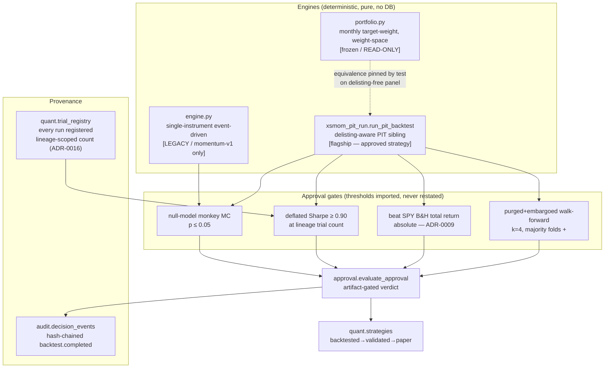
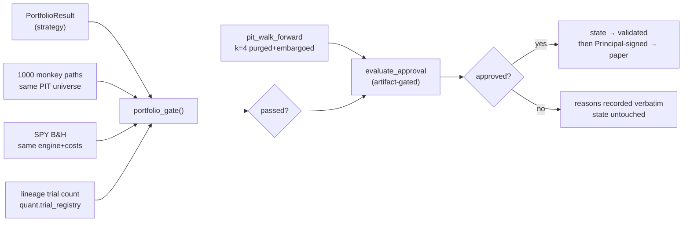

# 08 — Backtesting Gauntlet

> **Scope of this document.** The point-in-time backtest engines, cost model, look-ahead
> and survivorship defenses, the four approval gates (null-model, deflated Sharpe,
> beat-SPY, purged walk-forward), the bootstrap exhibits, and — stated plainly — what is
> *not* modeled. This is a **paper-mode research/simulation system**, months old, one
> Principal + AI pair, single machine. Nothing here is production-grade, and no claim below
> should be read as evidence a strategy will make money in live markets. Every number that
> matters is anchored to a source file and, where useful, a line.

**Capability tags used throughout:** `[IMPLEMENTED]` · `[PARTIAL]` · `[EXPERIMENTAL]` ·
`[PLANNED — NOT BUILT]` · `[PLACEHOLDER]`.

---

## 0. TL;DR for the committee

- There are **two distinct backtest engines** in the package. A legacy single-instrument
  event-driven engine (`atlas/dcp/backtest/engine.py`, "Phase 3 v1") that only ever
  validated the toy `momentum-v1` strategy on synthetic fixtures and one-year real data
  (which **failed** its gates). And a **portfolio target-weight engine**
  (`atlas/dcp/backtest/portfolio.py`) plus a **delisting-aware point-in-time sibling**
  (`run_pit_backtest` in `atlas/dcp/backtest/xsmom_pit_run.py`) that produced the **only
  approved strategy**, `xsmom-pit-tr`. The PIT sibling is where the real evidence lives.
- **Transaction costs are a single flat number: 10 bps per side (5 commission + 5
  slippage), applied to traded notional.** There is **no bid/ask spread, no market impact,
  no borrow, no financing, no ADV/participation cap, no capacity model** anywhere in the
  cost path. `CostModel` (`engine.py:39`) has exactly two fields. This is the single
  largest quantitative caveat in the whole gauntlet.
- **Rebalance granularity is monthly** (`month_end_indices`, `portfolio.py:139`).
  Execution is at the **next session's open** at the raw open price — an optimistic,
  frictionless fill.
- Look-ahead prevention is **structural, not by convention**: the strategy is handed a
  `PanelView` clamped at index `t` whose `close(s, i)` **raises** for `i > t`
  (`portfolio.py:113`). Survivorship is defeated by carrying **delisted names in the
  panel** and liquidating them at their final close.
- The approval bar is four gates: **1000-path monkey null (p ≤ 0.05)**, **deflated Sharpe
  ≥ 0.90 at the true lineage trial count**, **beat SPY buy-and-hold total return
  (absolute, ADR-0009)**, and a **purged + embargoed walk-forward, k=4, majority folds
  positive**. All four are enforced by artifact, not by argument (`approval.py`). **One
  caveat:** `evaluate_approval` takes a *fifth* required input, `oos_untouched_attested`
  (`approval.py:51,73-74`), that is **not** artifact-derived — it is an honor-system
  boolean a human sets with the `--attest-oos-untouched` CLI flag (§6.4). That one input is
  precisely "by argument," not by artifact.
- **The "deflated Sharpe" is a simplified variant** — it omits the skewness/kurtosis
  correction of the full Bailey–López de Prado DSR and assumes normal returns
  (`validation.py:17`). Call it what it is: an expected-max-of-N-noise-strategies
  penalty, not the full DSR.
- **"Monte Carlo" here means only two things**: the 1000-path monkey null, and a seeded
  **moving-block bootstrap of annual outcomes** used for a *reporting exhibit only* (never
  a gate). There is **no path-simulation Monte Carlo, no regime/scenario stress test, no
  formal cross-validation beyond the walk-forward, and no capacity analysis** — and the
  code says so.

---

## 1. Architecture: two engines, one gate vocabulary



**Layout** (`atlas/dcp/backtest/`, ~7,390 LOC):

| File | LOC (`wc -l`) | Role | Tag |
|---|---|---|---|
| `engine.py` | 119 | Single-instrument event-driven engine + `CostModel` | `[IMPLEMENTED]` (legacy) |
| `portfolio.py` | 262 | Monthly target-weight portfolio engine, weight-space accounting | `[IMPLEMENTED]` |
| `portfolio_validation.py` | 172 | Portfolio-level null / gate / walk-forward | `[IMPLEMENTED]` |
| `validation.py` | 98 | Single-instrument gates, `deflated_sharpe`, `null_model_gate` | `[IMPLEMENTED]` |
| `walkforward.py` | 76 | Purged + embargoed fold cutter (López de Prado) | `[IMPLEMENTED]` |
| `approval.py` | 132 | Artifact-gated approval + state transitions | `[IMPLEMENTED]` |
| `registry.py` | 70 | Trial registry, `trial_count` / `lineage_count` | `[IMPLEMENTED]` |
| `real_run.py` | 280 | momentum-v1 on real bars (the honest FAIL) | `[IMPLEMENTED]` |
| `xsmom_pit_run.py` | 1,516 | PIT S&P 500 engine + total-return mode (flagship) | `[IMPLEMENTED]` |
| `xsmom_run.py` | 863 | Round-2 universe run + bootstrap/calendar-year helpers | `[IMPLEMENTED]` |
| `impl_variant_run.py` | 1,467 | "Implementable" top-5 sleeve variants (xsmom PASS, PEAD FAIL) | `[IMPLEMENTED]` |
| `pead_pit_run.py` / `quality_pit_run.py` | 688 / 790 | PEAD & quality-GP/A PIT runners — both produced decision-grade **FAIL** verdicts (graveyard) | `[IMPLEMENTED]` |
| `band_derivation.py` / `quant_evidence.py` | 264 / 290 | Tolerance-band derivation (wired into `trading/bands.py`) & registry-driven desk evidence (wired into `agents/live_run.py`) | `[IMPLEMENTED]` |
| `candidate_run.py` | 303 | Factory / R&D candidate runner (trend / meanrev / breakout); no production importer | `[EXPERIMENTAL]` |

Folder total is **7,390 LOC** exactly (`cat atlas/dcp/backtest/*.py | wc -l`).

The two engines share **one cost model** (`CostModel`, imported everywhere), **one gate
vocabulary** (`validation.deflated_sharpe`, `null_model_gate`; `portfolio_validation`
imports the thresholds from the single source rather than restating them,
`portfolio_validation.py:53-55`), and **one walk-forward cutter** (`walkforward.purged_folds`).

---

## 2. The cost model — the flat 10 bps, stated in full

```python
# atlas/dcp/backtest/engine.py:39
@dataclass(frozen=True)
class CostModel:
    commission_bps: float = 5.0
    slippage_bps: float = 5.0
    def buy(self, px):  return px * (1 + (self.commission_bps + self.slippage_bps) / 10_000)
    def sell(self, px): return px * (1 - (self.commission_bps + self.slippage_bps) / 10_000)
```

**This is the entire transaction-cost model.** Confirmed by grep: no `spread`, `borrow`,
`impact`, `participation`, or `adv_cap` field exists anywhere in
`atlas/dcp/backtest/*.py`. `CostModel` is the only class of its kind in `atlas/dcp/`.

- **Single-instrument engine** charges the round-trip: `costs.buy(open)` on entry,
  `costs.sell(px)` on exit (`engine.py:78`, `engine.py:87-91`).
- **Portfolio / PIT engine** charges per side on **turnover**: `equity *= 1 - t_over *
  side_rate` where `side_rate = (commission_bps + slippage_bps) / 10_000 = 0.001` and
  `t_over = sum(|Δweight|)` over the union of names (`portfolio.py:222`, `:239`;
  `turnover`, `:202`). Each unit of |Δweight| is one side of a trade, charged once.
- **Forced liquidation of a delisted name pays the same per-side cost** as a chosen sell
  (`xsmom_pit_run.py:255-275`) — deliberately conservative (a forced exit is never made
  cheaper than a voluntary one), but still only the flat 10 bps.

### What the cost model does NOT include — `[PLANNED — NOT BUILT]` for all of these

| Missing friction | Status | Consequence |
|---|---|---|
| Bid/ask spread | Not modeled | Half-spread on illiquid / small-cap names understated; slippage is a *flat* 5 bps regardless of name |
| Market impact / non-linear slippage | Not modeled | Concentrated decile / top-5 trades assumed to fill without moving the price |
| ADV / participation cap | Not modeled (see §2.1) | No trade is ever rejected or split for size; capacity is unbounded in-sim |
| Borrow / short financing | N/A | Long-only book, so borrow is irrelevant — but note it, since it means the framework cannot price a short book at all |
| Cash / margin financing | Not modeled | "Cash earns nothing" (`portfolio.py:17`); no rate on idle cash either way |
| Taxes, dividends-withholding | Not modeled | Total-return mode reinvests gross dividends at the ex-date close |
| Commission minimums / ticket fees | Not modeled | Flat bps; a small-account minimum-commission drag is absent (explicitly flagged in `impl_variant_run.py:1078` as "small-account frictions beyond 10 bps/side NOT modeled") |

**Assessment.** 10 bps/side (≈ 20 bps round trip) is a plausible blended assumption for
large-cap US equities in size, and it is applied *identically to strategy, null, and both
benchmarks* so it does not bias the *comparison*. But it is optimistic for the
concentrated constructions that actually got approved (a top-decile or top-5 monthly
rebalance), and it is **structurally incapable** of penalizing a strategy for trading
illiquid names, because no liquidity data reaches the cost path.

### 2.1 The ADV number that exists but does not gate — `[PARTIAL]`

`impl_variant_run.py` computes a trailing 63-session mean-dollar-volume (`ADV_WINDOW = 63`,
`:165`, `:309-313`) — but it is used **only to rank/report**, and the runner explicitly
states there is **"no liquidity screen of any kind"** (`impl_variant_run.py:1171-1176`)
and that the whole point of that variant is to prove *structurally* that no liquidity data
is read into sizing. So even where ADV is available, it is not converted into an impact
cost or a capacity limit. Capacity analysis is **`[PLANNED — NOT BUILT]`** and named as
such in the ground-truth backtest section.

---

## 3. Engine mechanics

### 3.1 Single-instrument event-driven engine (`engine.py`) — `[IMPLEMENTED]`, legacy

Bar loop `for i in range(max(start_i,1), end_i)` (`engine.py:73`):

1. **Execute pending entry at today's open** — `pos_entry = costs.buy(b.open)`
   (`:77-81`). A signal on bar `i` therefore executes at bar `i+1`'s open (structural
   one-bar delay).
2. **Manage the open position** — exits are **pessimistic**: stop triggers on `b.low <=
   stop` and fills at the stop price; target on `b.high >= target`; else time-stop at
   close (`:83-98`).
3. **Ask the strategy** with `bars[:i+1]` only (`:104`).

**Exits:** stop / target / time-stop, all pre-specified in the `Intent` returned by the
strategy. **Metrics:** daily-return Sharpe annualized `× sqrt(252)` at a **zero risk-free
rate** (arithmetic mean of simple returns over **population** stdev, `statistics.pstdev`,
`:109` — no excess-return adjustment; see §6.2), max drawdown, hit rate, trade count.

This engine is a **research relic**: it only ever ran `momentum-v1`, which **failed** the
gates on real data (§7). Two honesty notes a reviewer should see:

- **Dead code:** `engine.py:94` computes a `day_ret` that is immediately overwritten by
  `:97` (and `:94` is even missing the `- 1.0`). Harmless but real debt.
- **Same-bar exit ambiguity + a boundary inconsistency:** stop is checked before target
  within a bar (cannot resolve intrabar order — standard OHLC limitation), and the
  `prev_mark` boundary differs between the exit path (`i-1 > pos_entry_i`, `:96`) and the
  hold path (`i-1 >= pos_entry_i`, `:100`). For a position exited on the session
  immediately after entry this books the mark against the entry price rather than the
  prior close. It is a narrow edge case in a legacy engine that produced no approved
  strategy, but it is a genuine accounting inconsistency, not a documented convention.

### 3.2 Portfolio target-weight engine (`portfolio.py`) — `[IMPLEMENTED]`, frozen

Accounting is in **weight space** (algebraically identical to share counts, immune to
negative-cash artifacts, `portfolio.py:14-19`). One rebalance step (`run_portfolio_backtest`,
`:209-262`):

```mermaid
sequenceDiagram
    participant S as Strategy
    participant V as PanelView(clamp=t)
    participant E as Engine
    Note over E: month-end session t (decision)
    E->>S: strategy(PanelView(prices, t))
    S->>V: close(s, i)  [raises if i > t]
    S-->>E: target weights {s: w}, gross ≤ 1, w ≥ 0
    E->>E: _validated_targets(...)  [long-only, no leverage, tradable]
    Note over E: next session t+1 (execution)
    E->>E: _drift(phase="to_open")   close[t]→open[t+1]
    E->>E: turnover = Σ|Δw|;  equity *= 1 - turnover*side_rate
    E->>E: weights ← targets
    E->>E: _drift(phase="open_close") open[t+1]→close[t+1]
    Note over E: non-rebalance sessions
    E->>E: _drift(phase="close") close[i-1]→close[i]
```

Key invariants, all **fail-closed**:

- **Long-only, no leverage** enforced at the target boundary: a negative weight, a
  non-finite weight, or gross > 1 + 1e-9 raises `ValueError` (`_validated_targets`,
  `:149-166`). No strategy output can create a short or leverage.
- **Tradable-at-decision:** a target on a symbol with no price at `t` raises (`:158-160`).
- **No phantom marks:** a held name that loses its price mid-window raises (`_price`,
  `:169-174`). This is *why* the delisting-aware sibling exists — the frozen engine
  refuses dead names by design (pinned by `test_holding_a_series_that_ends_fails_closed`,
  `test_portfolio_engine.py:208`).
- **Last-session-never-trades:** `month_end_indices` restricts rebalances to
  `[start_i, end_i-2]` so `t+1` is always a valid execution index; a month-end that is
  the window's final session never trades (`:139-146`, pinned by
  `test_month_end_indices_last_session_never_rebalances`).

Costs are charged on `to_open`-drifted turnover, then weights snap to target, then
`open_close` drift marks the execution day. The hand-pinned arithmetic test
(`test_portfolio_engine.py:70-94`) verifies every number on a 3-symbol / 2-rebalance
fixture, including that the only drawdown on a flat panel is the rebalance cost itself
(`-1/1050`).

### 3.3 Delisting-aware PIT sibling (`run_pit_backtest`, `xsmom_pit_run.py:278`) — `[IMPLEMENTED]`, flagship

Move-for-move identical accounting to `portfolio.py` (equivalence **pinned by test** on a
delisting-free panel, `test_matches_frozen_engine_without_delistings`,
`test_xsmom_pit_engine.py:128-157`), plus exactly two added behaviors:

1. **Forced liquidation** (`_liquidate_dead`, `:255-275`): a held name with no bar at
   session `i` is liquidated at its final available close (which *is* the `close[i-1]`
   mark the curve already carries — the conversion is value-neutral), pays the per-side
   cost on its drifted weight, survivors renormalize against post-cost equity, proceeds
   sit in cash until the next rebalance.
2. **Unfilled buy** (`:308-312`): a pending buy whose name dies between the decision close
   and the execution open simply does not fill; that weight stays in cash.

Both are hand-pinned on a 7-session fixture (`test_forced_liquidation_hand_pinned`,
`test_unfilled_buy_hand_pinned`, `test_xsmom_pit_engine.py:73-111`) with equity curves
verified to `abs=1e-12`.

---

## 4. Look-ahead prevention — structural, three layers

The ground-truth invariant #8 ("strategies receive only `bars[:i+1]`; structural, not by
convention") is enforced at three independent layers.

### 4.1 The clamp (`PanelView`, `portfolio.py:84-120`) — `[IMPLEMENTED]`

```python
def close(self, symbol, i):
    if i > self._t:
        raise ValueError(f"look-ahead: session {i} > view clamp {self._t}")
    if i < 0:
        return None
    return self._panel.closes[symbol][i]
```

The strategy is handed a `PanelView` that **physically cannot** read past `t` — a
look-ahead read is a raised exception, not a silent wrong answer. **Only closes are
exposed** (no opens): decisions are made on close information and executed at the next
open, so a strategy cannot even accidentally peek at the execution price. This is verified
adversarially by `test_no_look_ahead_is_structural`
(`test_portfolio_engine.py:145-170` and `test_backtest_engine.py:13-31`): mutating **all
future prices to garbage** must not change any decision at or before the cut, and must not
change the equity curve up to the cut — asserted equal.

### 4.2 Point-in-time index membership — `[IMPLEMENTED]`

The ranked universe at rebalance `t` is the S&P 500 **as it stood that day**, reconstructed
under a **fail-closed interval rule** (`market_data/index_membership.py`, migration 0015):
a ticker is a member on day `D` iff `(start IS NULL OR start <= D) AND (end IS NULL OR end
> D)` (end-exclusive). A null `StartDate` is usable **only** for current members;
everything else is excluded *and counted* (`pit_eligible`, `xsmom_pit_run.py:184-198`;
`is_member_on`). Eligibility additionally requires a price at `t` and `>= SEASONING (252)`
prior sessions of stored data — a close at `t - 252` proves exactly that history under the
panel's contiguity invariant. The join/leave/die/season cases are each pinned
(`test_pit_eligibility_joins_leaves_dies_seasons`, `test_xsmom_pit_engine.py:193-220`),
including that a name is gone **on** its end date (end-exclusive) and that a null-start
*delisted* row is excluded fail-closed and never appears anywhere.

Because vendor EndDates are sparse before ~2012, the evaluation window **starts
2012-07-01** (`WINDOW_START`); the runner refuses to evaluate earlier membership as
unreliable (`:640-642`, `:901-904`). The 252-session seasoning requirement means the first
formation window needs history *before* `WINDOW_START` (`:652-656`).

### 4.3 Split adjustment applied at read, capped at the bar — `[IMPLEMENTED]`

`adjust_for_splits` (`market_data/adjustment.py`) divides prices (and multiplies volume) for
bars **strictly before** a split's effective date: `if bar.bar_date < s.action_date`. A
split known at date `S` never retro-contaminates bars on or after `S` in a way that leaks
future information — the adjustment is a deterministic function of splits with
`action_date <= today`, and the panel is built from already-adjusted series. This is the
"split-cap-at-t" property. Total-return mode's dividend factor is likewise cumulative over
ex-dates `e <= i` only (`market_data/total_return.py`, `F(i) = Π_{e<=i}(1 + D_e/C_e)`).

**Assumption vs verified.** The clamp property is *verified* by adversarial future-mutation
tests. PIT membership correctness depends on the **vendor's** `HistoricalTickerComponents`
being itself point-in-time and correctly dated — that is an **assumption about EODHD's
data**, not something the tests can prove; the fail-closed exclusion of undated rows bounds
the damage but does not eliminate the dependency.

---

## 5. Survivorship prevention — `[IMPLEMENTED]`

Survivorship bias is defeated by **keeping dead companies in the panel**, not by filtering
to today's constituents:

- `load_pit_panel` (`xsmom_pit_run.py:472-604`) keeps series that **end early** — "dead
  companies are the point of this test" (`:427-431`). It counts, split living/delisted,
  every member with a missing or unusable series (`missing_series`, `excluded`,
  `included_delisted`), so the report can state delisted-name **coverage** honestly rather
  than assume it.
- A held name that dies mid-hold is **liquidated at its final close** (§3.3), not dropped
  from the record.
- **SPY rides in the panel for axis identity but carries no membership row**, so it can
  never enter the ranked universe (asserted, `:503-505`).

This is explicitly framed as **the definitive survivorship test** that settles a prior
chain: an S&P-100 run PASSed *conditionally* (magnitude inflated by survivorship, the
report quotes +4,584%) and a sector-ETF cross-check FAILed; the PIT run with dead names
included is what removes the bias for real (`xsmom_pit_run.py:826-838`). The honesty is
two-sided: the report states the S&P-100 magnitude "stays inflated by survivorship" even
where the *family* validates.

**Residual survivorship gaps a reviewer should press on:**

- **Missing-series delisted members are silently absent from ranking.** A delisted member
  whose bars EODHD never served (`missing_series`) cannot be ranked or held — it is
  counted in the coverage report but is a *de facto* survivorship hole for any month where
  it would have been eligible. The report surfaces the count; it does not correct for it.
- **Pre-2018 delistings have no fundamentals** (ground truth), which is why value/quality
  families cannot be built PIT at all — a survivorship-adjacent data gap, not a backtest
  bug, but it bounds what the gauntlet can ever evaluate honestly.

---

## 6. The four gates



### 6.1 Null model — the monkey / dartboard control — `[IMPLEMENTED]`

Two constructions, one idea ("if ranking carries no information it cannot beat random
selection over the same names"):

- **Single-instrument** (`null_distribution`, `validation.py:33-55`): random **entry
  days** with the *same* stop/target/time-stop machinery and costs; p = fraction of null
  paths with total return ≥ strategy.
- **Portfolio / PIT** (`pit_null_distribution`, `xsmom_pit_run.py:344-369`): at each
  rebalance, draw the **same count** of names (`winner_count` of the identical eligible
  set) uniformly without replacement from the **same PIT eligible set**, equal weight,
  through the **identical delisting-aware engine, costs, and delisting rule**. One RNG
  drives all paths sequentially; eligible sets cached per rebalance so every path faces the
  identical universe by construction.

**Production runs use `paths = 1000`** (`real_run.py:119`, `xsmom_pit_run.py:634`); note
the gate function's *default* is `paths = 200` (`validation.py:79`), used by the unit
tests. p ≤ 0.05 to pass. With 1000 paths the finest resolvable p is 0.001, so a reported
**p = 0.000 means literally 0/1000 monkeys beat the strategy** — a strong but discrete
statement, not a continuous tail estimate.

The monkey null is the mechanism the **overfit canary** test relies on to prove the gate
rejects junk: mine 68 in-sample rules on a random walk, take the best (>30% in-sample), and
the gate must kill it out-of-sample (`test_validation_gates.py:44-60`).

### 6.2 Deflated Sharpe — `[IMPLEMENTED]` but **simplified**

```python
# atlas/dcp/backtest/validation.py:17
def deflated_sharpe(sr_annual, n_days, n_trials):
    # "simplified Bailey/López de Prado; normal-returns assumption noted"
    if n_days < 30: return 0.0
    ...
    e_max = sqrt(1/n_days) * ((1-γ)·Φ⁻¹(1 - 1/N) + γ·Φ⁻¹(1 - 1/(N·e)))
    z = (sr_daily - e_max)·sqrt(n_days - 1)
    return Φ(z)
```

This computes the probability the observed Sharpe exceeds the **expected maximum of
`n_trials` noise strategies**, then reads it through a normal CDF. **It omits the
skewness/kurtosis correction of the full Bailey–López de Prado DSR** and assumes normal
returns — the docstring says so. For a concentrated momentum book with fat left tails, the
true DSR would be *lower* than this estimate; the simplified form is therefore **not
conservative** on that axis. A **second** non-conservatism: the Sharpe fed to the gate uses
a **zero risk-free rate** — it is the arithmetic mean of daily *simple* returns over
population stdev, `× √252`, with no excess-return adjustment (`engine.py:107-110`,
`portfolio.py:250-253`). Over the 2012→ window's nonzero cash rates, an `rf = 0` Sharpe
modestly **inflates** both the Sharpe and the DSR it feeds — the same direction as the
missing skew/kurtosis term, so the two effects compound. The committee should read
"deflated Sharpe 0.995" as "an expected-max-of-N penalty under a normal-returns, rf=0
assumption," not as the canonical DSR.

The **trial count is the load-bearing input**, and it is lineage-scoped (ADR-0016):
`lineage_count(session, "momentum")` counts every trial across every family name the
momentum research line has ever worn (`registry.py:63-70`), so renaming a variant can
never reset the multiple-testing penalty. `evaluate_approval` re-checks that the gate was
computed with **exactly** the current lineage count and refuses a gate deflated at a stale
count (`approval.py:64-67`) — stricter going forward, never retroactive. Legacy NULL-lineage
rows are counted nowhere and that gap is documented, not hidden (`registry.py:63-70`,
migration 0032).

### 6.3 Beat SPY buy-and-hold total return — `[IMPLEMENTED]`, absolute (ADR-0009)

The **binding** benchmark is SPY buy-and-hold **total return**, run through the *identical*
engine, costs, and next-open execution (`buy_and_hold_strategy`,
`portfolio_validation.py:99-105`; `portfolio_gate`, `:132-134`). "Beat" is **absolute**:
`result.total_return <= spy.total_return` is a failure reason. Equal-weight-all-eligible is
computed and reported alongside but is **informational, not binding** (`:90-96`, `:120-125`)
— it separates selection skill from the small-cap/equal-weight tilt.

Total-return mode (`--total-return`, `xsmom_pit_run.py:48-62`) transforms the *whole panel*
at load time so strategy, monkey null, equal-weight, and SPY all read one TR panel — the
convention is identical on both sides by construction. It **fails loudly** if SPY carries no
stored dividends (`:571-576`), because a TR benchmark without SPY's yield would re-create
the exact defect the mode exists to fix. This matters: an earlier price-return PASS was
found to violate ADR-0009's TR benchmark and was **suspended pending the TR re-score**
(`:48-62`) — a documented instance of the gate catching the fund's own prior result.

### 6.4 Purged + embargoed walk-forward — `[IMPLEMENTED]`, but read the caveat

`purged_folds` (`walkforward.py:25-38`) cuts `k` contiguous test blocks over the daily
session timeline; each fold's training set removes any day whose label window `[a-horizon,
b+embargo)` overlaps the test window — **purge** (label leaks forward) plus **embargo**
(serial correlation leaks backward). `leakage_free` is re-asserted per fold
(`:41-43`, asserted again in `walk_forward` / `pit_walk_forward`). Constants: **k=4,
horizon=40, embargo=10** (`real_run.py:37`, one line: `WARMUP, K_FOLDS, HORIZON,
EMBARGO = 60, 4, 40, 10`). Note the warmup differs by path: `real_run.py:37` pins a
fixed literal `WARMUP=60`, whereas the PIT flagship passes **warmup = the
evaluation-window start index** (`xsmom_pit_run.py:723`, `warmup=start_i`). For a
monthly strategy the true label horizon
is ~21 sessions + 1 execution ≈ 22, so **horizon=40 strictly dominates it** and the purge
is conservative (`portfolio_validation.py:22-30`). Coverage of the fold cutter is pinned:
every fold leakage-free across a grid of `(k, horizon, embargo)`, and folds tile the span
without overlap (`test_walkforward.py:12-31`).

Approval requires **majority folds positive**: `wf.positive_folds < len(folds)//2 + 1` is a
failure (`approval.py:70-71`) — for k=4, **3 of 4**. The approved `xsmom-pit-tr` scored 4/4.

> **The caveat that matters.** `xsmom v1` fits **no parameters** — it is the textbook
> Jegadeesh–Titman 12-1 recipe with zero sweeps. The docstring is explicit
> (`portfolio_validation.py:26-30`): for an unfitted strategy the walk-forward folds are
> **sub-period robustness checks, not out-of-sample parameter validation**. Purged
> walk-forward is designed to catch leakage from *fitting*; with nothing fit, it only tells
> you the effect showed up in each of 4 sub-periods. **The real defense against
> selection/meta-overfitting across the 51 registered trials is the deflated Sharpe at
> lineage count**, not the walk-forward. A hostile reviewer should weight the DSR and the
> monkey null far above the 4/4, and should note that 4 folds over one ~14-year window is a
> thin robustness sample.

### 6.5 The honor-system fifth input — `[IMPLEMENTED]`, but unverifiable

`evaluate_approval` has **five** required inputs, not four: alongside the gate report and
the walk-forward result it takes `oos_untouched_attested: bool` (`approval.py:51`), and a
`False` value is itself a rejection reason — *"OOS holdout not attested as untouched during
development"* (`approval.py:73-74`). Unlike the four gates, this input is **not** derived
from any artifact: it is satisfied by a human passing the `store_true` flag
`--attest-oos-untouched` on the approval CLI (`approve_xsmom_paper.py:83,115`;
`approve_pead_paper.py:72,102`). So the document's "enforced by artifact, not by argument"
framing has exactly one exception — the claim that the evaluation window was never peeked at
during development is an **unfalsifiable human attestation**, not something the code can
prove. A peeked-at holdout would still clear all four mechanical gates.

---

## 7. What actually ran — verdicts in ink

| Run | Engine | Data | Verdict | Source |
|---|---|---|---|---|
| `momentum-v1` (SPY, AVGO) | single-instrument | ~1yr real (EODHD) | **FAIL**, and flagged **not decision-grade** (ADR-0004 short window) | `real_run.py`, `docs/reports/first-real-backtest-momentum-v1.md` |
| `xsmom-pit` price-return | PIT sibling | 2012→ PIT S&P 500 | PASS on price-return — then **suspended**: violated ADR-0009's TR benchmark | `xsmom_pit_run.py:48-62` |
| **`xsmom-pit-tr`** total-return | PIT sibling | 2012→ TR panel | **PASS** — +737% vs SPY TR +594%, null p=0.000, DSR 0.995, WF 4/4 → state `paper` (ADR-0010) | `xsmom_pit_run.py`, ground truth |
| `xsmom-pit-tr-2016` | PIT sibling | 2016→ (pre-committed kill leg) | demote-only trial, can never validate | `xsmom_pit_run.py:151-168` |
| `xsmom-impl500-tr` (top-5, no liquidity screen) | impl variant | TR panel | **PASS** — +2235% vs SPY TR +594%, null p=0.000, max DD −42.74% (ADR-0016). **This is the construction the live sleeve actually trades** — see the caveat below | `impl_variant_run.py`, ADR-0016 |
| `pead-sue-tr` implementable top-5 | PEAD PIT | TR panel | **FAIL** the null (p=0.132) → sleeve budget 0 (ADR-0015) | `pead_pit_run.py`, ground truth |
| quality-GP/A, low-vol, trend/meanrev/breakout, FX | various | real | **FAIL** (graveyard, gates never weakened) | ground truth |

> **Validated construction ≠ deployed construction — the caveat a committee must not
> miss.** The **+737%** headline belongs to `xsmom-pit-tr`, the **winner-decile** form
> (~50 names; `winner_count = max(TOP_N=10, n_eligible // 10)`, `xsmom_pit_run.py:171-176`;
> "winner decile" per ADR-0010). But ADR-0017 **deploys** the sleeve as **top-5** (40% of
> NAV, `SLEEVE_MAX_NAMES=5`, `xsmom/generate.py:86`) — a **more concentrated** form whose
> own backtest is a **separate registered trial**, `xsmom-impl500-tr`, that returned
> **+2235%** with a **deeper −42.74% drawdown** (ADR-0016), *not* +737%. So the number the
> book is sold on (+737%, decile) is **not** the number for the construction the book
> actually runs (top-5). Both are gauntlet-PASSes and both share the identical engine, costs
> and null; but a reviewer citing "+737%" as the live sleeve's evidence is citing the wrong
> trial. The deployed top-5 form is more concentrated, higher-variance, and carries its own
> (also passing, but distinct) evidence file.

**Reproducibility.** Every run: seeded RNG (`seed=7` throughout), `FrozenClock` derived
from the last stored bar rather than the wall clock (`real_run.py:258-265`), a
`--window-end` pin that makes a run byte-identical even after later nightly ingests
(`impl_variant_run.py:1094`), one registered trial in `quant.trial_registry`, and a
hash-chained `quant.backtest.completed` audit event with the verbatim gate reasons
(`xsmom_pit_run.py:732-756`). Golden-pin regression tests freeze exact engine outputs
(`test_backtest_engine.py:40-47` pins total return / Sharpe / trade count / drawdown to
~16 digits).

---

## 8. "Monte Carlo", cross-validation, scenarios — precisely what exists

- **Monte Carlo, gate:** only the **1000-path monkey null** (§6.1). `[IMPLEMENTED]`
- **Monte Carlo, reporting-only:** a **seeded moving-block bootstrap of annual outcomes**
  (`block_bootstrap_annual`, `xsmom_run.py:538-561`) — 21-session blocks, 1000 draws of
  252 sessions, compounded; strategy and SPY draw *identical block positions* (paired
  draws) and the result is rendered as a percentile table for a **validated pass only**
  (house rule: "profit is a result to be discovered, never an input",
  `xsmom_pit_run.py:771-820`). **This is an exhibit, never a gate.** `[IMPLEMENTED]` as an
  exhibit. There is **no path-simulation / synthetic-return Monte Carlo** of the strategy
  itself. `[PLANNED — NOT BUILT]`
- **Verdict-vs-endpoint exhibit** (`ENDPOINT_MONTHS=24`, `xsmom_pit_run.py:158`,
  `:380-382`): the equity curve truncated at endpoint `E` exactly equals a run ended at `E`
  (because every decision reads only data `≤ t`), so the report rolls the final date back
  monthly to show the verdict is not an endpoint artifact. `[IMPLEMENTED]` exhibit.
- **Cross-validation:** **only** the purged walk-forward (§6.4). No k-fold CV, no
  combinatorial purged CV (CPCV), no nested CV. `[PLANNED — NOT BUILT]`
- **Regime / scenario stress on strategies:** **none.** A case-insensitive grep for
  `scenario|regime|stress|capacity|market impact` across `atlas/dcp/backtest/*.py` returns
  **zero matches** — no scenario/stress engine exists anywhere in the backtest package. (A
  regime *classifier* exists elsewhere in the quant plane for context, but it does **not**
  stress-test a strategy's returns.) `[PLANNED — NOT BUILT]`
- **Capacity analysis:** **none** (§2.1). `[PLANNED — NOT BUILT]`

---

## 9. Assumption vs verified — quick reference

| Claim | Status | Evidence / where it could break |
|---|---|---|
| Strategy cannot read the future | **VERIFIED** (structural) | `PanelView.close` raises; adversarial future-mutation tests |
| Costs applied identically to strategy/null/benchmarks | **VERIFIED** | one `CostModel`, one panel, pinned arithmetic tests |
| Delisted names carried and liquidated at final close | **VERIFIED** | hand-pinned to 1e-12 |
| PIT membership is genuinely point-in-time | **ASSUMPTION** (on EODHD) | depends on vendor `HistoricalTickerComponents` dating; undated rows fail-closed |
| 10 bps/side reflects real trading cost | **ASSUMPTION**, optimistic | no spread/impact/ADV; understated for concentrated/illiquid trades |
| Next-open fill at the raw open is achievable | **ASSUMPTION**, optimistic | PaperBroker fills at next-session open at the open price — no slippage vs the print |
| "Deflated Sharpe 0.995" is a rigorous DSR | **PARTIALLY TRUE** | simplified; omits skew/kurtosis; normal-returns assumption |
| Walk-forward 4/4 proves out-of-sample robustness | **PARTIALLY TRUE** | unfitted recipe → sub-period robustness only; DSR is the real overfitting defense |
| +737% is the headline result | **VERIFIED number, MISLEADING alone** | concentrated top-decile; large drawdown (own demotion band −40%); DSR/null/WF are the evidence, not the magnitude |
| +737% is the *deployed* sleeve's evidence | **FALSE** — wrong trial | +737% is the winner-**decile** (`xsmom-pit-tr`); the live sleeve trades **top-5** (`xsmom-impl500-tr`, +2235%, DD −42.74%, ADR-0016/0017) — a separate, more-concentrated trial |

---

## 10. Weaknesses / Debt / Open

**Modeling / methodology**

1. **Flat 10 bps/side is the entire cost model** — no spread, impact, ADV cap, borrow, or
   financing. Optimistic precisely for the concentrated constructions that got approved.
   (`engine.py:39`; friction table §2.)
2. **Paper fills at the next-session open at the open price** — no slippage vs the print,
   the most optimistic possible fill. Reconciliation is paper-vs-paper.
3. **Monthly rebalance granularity** and **daily-granularity stops** (stops are
   pre-authorized exits scanned once daily, ADR-0006) — no intraday path is simulated.
4. **Deflated Sharpe is simplified** — omits the skew/kurtosis term; not conservative for
   fat-tailed momentum. (`validation.py:17`)
5. **Walk-forward for an unfitted recipe is sub-period robustness, not OOS parameter
   validation**; only 4 folds over one window. Selection overfitting across 51 trials is
   guarded by the DSR-at-lineage-count alone. (`portfolio_validation.py:26-30`)
6. **No path Monte Carlo, no CPCV/nested CV, no regime/scenario stress, no capacity
   analysis** — all `[PLANNED — NOT BUILT]` and named as such.
7. **History depth is uneven** — the PIT panel reaches back to 2012-07 for momentum, but
   other families accept ~1yr windows (ADR-0004) that are explicitly *not decision-grade*.
8. **PIT membership correctness is an assumption about the vendor**, and **missing-series
   delisted members** are a residual survivorship hole (counted, not corrected). Pre-2018
   delistings have no fundamentals at all, so value/quality cannot be evaluated PIT.

**Code / engineering debt**

9. **Dead code** at `engine.py:94` (overwritten `day_ret`, missing `-1.0`).
10. **`prev_mark` boundary inconsistency** between the exit and hold paths in the legacy
    single-instrument engine (`engine.py:96` vs `:100`) for a same-day-after-entry exit —
    a genuine accounting edge case, though in an engine that produced no approved strategy.
11. **Gate default `paths=200` vs production `1000`** — a mismatch that is safe today (all
    real runs pass 1000 explicitly) but a foot-gun if a future caller forgets.
12. The large runners (`xsmom_pit_run.py` 1,516 LOC, `impl_variant_run.py` 1,467 LOC)
    carry heavy report-rendering logic inline with the engine logic — a maintainability
    hotspot, mirroring the console.html single-file debt noted elsewhere.

**Concentration**

13. The entire evidence base rests on **one strategy family (momentum), one data vendor
    (EODHD), one machine, one Principal**. The approved book is momentum-only; ADR-0017
    retired the ETF index core, so the invested book (when not 100% cash) is a single
    concentrated momentum sleeve. The backtest gauntlet is rigorous *within its
    assumptions*, but those assumptions have never been stress-tested against a second
    vendor, a second cost model, or a regime the 2012→ window did not contain.
14. **The deployed construction is not the one that carries the headline number.** The
    approval that put momentum into `paper` is the winner-**decile** `xsmom-pit-tr` (+737%,
    ~50 names). The live sleeve ADR-0017 actually trades is **top-5** — a separate,
    more-concentrated trial (`xsmom-impl500-tr`, +2235%, deeper −42.74% DD). Both pass the
    same gauntlet, but the deployed form is higher-variance than the one the +737% headline
    describes; the committee should evaluate the top-5 evidence file, not the decile's.

---

*Anchored to code read on 2026-07-20. Where this document and prose elsewhere disagree,
trust the files cited. Paper mode only; no real capital; nothing here is investment advice.*
