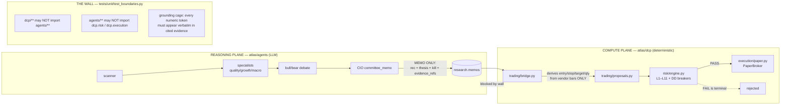

# 10 — Codebase Overview

**Scope:** structural map of the Atlas AI Capital repository — packages, classes,
responsibilities, complexity hotspots, duplication, dead code, and debt. Written for
senior engineers and quant researchers reviewing the system adversarially. Evidence is
cited to code (relative path + line where useful). Capability tags: **[IMPLEMENTED]**,
**[PARTIAL]**, **[EXPERIMENTAL]**, **[PLANNED — NOT BUILT]**, **[PLACEHOLDER]**.

> **Framing (do not lose this):** this is a **paper-mode research/simulation** system,
> months old, built by one Principal + an AI pair on a single MacBook. There is **no real
> capital, no broker connection, no live trading**. Nothing here should be read as
> production-ready. Weaknesses are surfaced deliberately, not defended.

---

## 0. TL;DR for the reviewer

- **~37,715 LOC of production Python** (measured `wc -l` 2026-07-20) across 8 top-level
  packages, plus a **2,264-line single-file HTML console** (`atlas/dashboard/console.html`)
  that is the sole human control surface.
- The design's spine is a **two-plane wall**: a deterministic compute plane
  (`atlas/dcp`, ~26.3k LOC) and an LLM reasoning plane (`atlas/agents`, ~3.8k LOC), with a
  **static-import boundary test** (`tests/unit/test_boundaries.py`) as the enforcement.
- Real engineering rigor lives in a few modules (risk engine, audit hash chain, grounding
  cage, the memo→proposal bridge). Real debt lives in a few others (the `backtest/` run
  scripts, `trading/proposals.py`, the console, and triplicated momentum/adjustment math).
- The single biggest *structural* risk is **concentration**: one validated strategy, one
  sleeve, one machine, one data vendor, one human. **As of 2026-07-20 the invested book is
  100% cash** — the 40% momentum sleeve is a *budget cap* with **zero filled positions** (core
  proposals expired unapproved; AMD + INTC approved 2026-07-18 are pending a fill), so that
  concentration is latent, not active. The single biggest *code* hotspots are
  `trading/proposals.py` (1,450 LOC) and the near-parallel `backtest/*_pit_run.py` scripts
  (~4k LOC of copy-adjacent research harness).

---

## 1. Repository topography

### 1.1 Top-level layout

```
atlas/                 production Python (~37.7k LOC)
├── core/        (347)  primitives: clock, audit hash-chain, config, db, workflow
├── dcp/       (26,308) COMPUTE PLANE — deterministic quant/risk/execution/data
├── agents/    (3,755)  REASONING PLANE — LLM desk (roles, runtime, schemas, evals)
├── api/       (2,473)  FastAPI control surface (11 routers) — port 8001
├── ops/       (2,065)  T0–T9 daily cycle, in-process scheduler, alerts, CLIs
├── tools/     (1,675)  operator CLIs (doctor, verify_chain, seed limits, approvals)
├── fxlab/       (896)  ISOLATED FX research sandbox (own DB schema, own boundary test)
└── dashboard/   (196)  console.html (served) + a DEAD Streamlit dashboard (196 LOC .py)
migrations/            34 raw-SQL Alembic migrations (0001..0034)
ops/                  launchd/systemd provisioning + pg_dump scripts (shell)
tests/         (~36k)  ~1,450–1,515 test functions across 215 files
docs/                 9 architecture docs, 17 signed ADRs, ~22 reports
```

LOC per package measured by `find … -name '*.py' -exec cat {} + | wc -l`.

### 1.2 `dcp/` subpackage LOC map (the bulk of the system)

| Subpackage | LOC | Files | Responsibility |
|---|---:|---:|---|
| `backtest/` | 7,390 | 17 | Gauntlet: PIT engine, null-model, deflated Sharpe, walk-forward, per-strategy run scripts |
| `market_data/` | 4,777 | 25 | EODHD ingest, calendars, splits/dividends, fundamentals, earnings, FX, universe/PIT membership |
| `trading/` | 3,435 | 6 | Proposal lifecycle, memo→proposal bridge, exits, bands, core allocation |
| `research/` | 2,159 | 8 | Dossiers, valuation models, health score, opportunity screen, source-pick edge trial |
| `signals/` | 1,570 | 19 | Strategy families: xsmom, pead, momentum, trend, meanrev, breakout, quality, regime |
| `factory/` | 1,513 | 7 | Research Factory: recipe grammar, feature catalog, family miners |
| `reporting/` | 1,146 | 3 | Daily core/satellite attribution, monthly report, morning brief |
| `risk/` | 1,123 | 9 | **The risk engine** (L1–L11, DD breakers, sizing, stress, factor overlap, clearance) |
| `features/` | 959 | 7 | PIT feature store (`quant.feature_values`), momentum/SUE/volatility computes, backfill |
| `learning/` | 853 | 7 | Measured-never-applied learning loop (calibration, drift, labeling, lessons) |
| `scanner/` | 334 | 2 | v1 attention scanner (candidate shortlisting for the desk) |
| `portfolio/` | 239 | 3 | Snapshot marking + monthly implementation-shortfall attribution |
| `execution/` | 172 | 2 | **PaperBroker** — next-session-open simulated fills (no real broker) |
| `indicators/` | 115 | 2 | Wilder ATR and friends |
| `scorecard.py` | 523 | 1 | Desk self-grading (memo outcomes vs SPY, append-only) |

---

## 2. The two-plane architecture (the spine)

Atlas's central claim is that **LLM output can never become a number that sizes, prices, or
executes a trade**. This is realized structurally, not by convention.



**Enforcement is a real test, and it is shallow-but-honest**
(`tests/unit/test_boundaries.py`): it `ast.parse`s every file under `atlas/dcp` and
`atlas/agents` and asserts on `ImportFrom`/`Import` module prefixes.

- `test_dcp_never_imports_agents` — no `atlas.dcp.*` file imports `atlas.agents.*`.
- `test_agents_never_import_risk_or_execution` — no `atlas.agents.*` file imports
  `atlas.dcp.risk` or `atlas.dcp.execution`.

**Honest limitations of the wall test** (a hostile reviewer should note these):

- It is a **static import check only**. It does not detect dynamic import
  (`importlib.import_module`), reflection, or data-level coupling (e.g. an agent reading a
  risk table via raw SQL). Nothing in the codebase does this today, but the test would not
  catch it.
- Agents **are** allowed to import the rest of `dcp` — and they do. `atlas/agents/live_run.py`
  imports from `dcp.backtest.quant_evidence`, `dcp.indicators.core`, `dcp.market_data.*`, and
  `dcp.signals.{pead,xsmom}.generate` (`live_run.py:28–37`) to assemble the evidence corpus.
  That is legal under the wall (only `dcp.risk`/`dcp.execution` are forbidden), but it means
  the reasoning plane is not hermetically sealed from the compute plane; it is sealed only
  from the veto/broker.
- `fxlab/` has its **own** parallel boundary test (`tests/unit/test_boundaries_fxlab.py`),
  indicating the wall pattern had to be re-asserted for the sandbox rather than generalized.

The **"no agent numbers"** invariant is realized at the Pydantic schema layer
(`atlas/agents/schemas/`) plus the **grounding cage** (`atlas/agents/runtime/grounding.py`,
§5.2). Agents emit `evidence_refs` (opaque pointers); the deterministic bridge resolves
those to real `quant.signals` UUIDs and derives every price/size itself.

---

## 3. Package-by-package walkthrough

### 3.1 `atlas/core` — primitives (347 LOC, 7 files) **[IMPLEMENTED]**

Small, load-bearing, clean.

- `clock.py` — the injectable time seam. Module docstring: *"No module in atlas/ may call
  `datetime.now()` directly."* `SystemClock.now()` is the single sanctioned wall-clock read
  (`clock.py:17`). See §6.1 for where this invariant is honored vs. bent.
- `audit.py` (115 LOC) — the **append-only hash chain** (invariant 4). `payload_hash` is
  `sha256(canonical_json)`; `link_hash(prev, p_hash, event_type, created_at)` chains events;
  `verify_chain` re-walks and raises `ChainVerificationError` on any payload tamper,
  prev-link mismatch, or non-monotonic seq (`audit.py:95`). Pure logic; persistence is in
  `audit_repo.py` so the chain math is unit-testable without Postgres. **Limitation:** this
  is a *self-contained* chain — an actor with full DB write access could rewrite every
  subsequent row and re-run the same math to forge a consistent chain. There is **no
  external anchoring/notarization**; tamper-evidence holds only against partial edits and an
  honest verifier.
- `config.py` (18 LOC) — pydantic-settings, `env_prefix="ATLAS_"`, `.env`. The DB URL
  defaults to a **plaintext literal password** `atlas_local_only` (`config.py`), and the
  **Anthropic key is NOT in this Settings object** — it is read directly from `os.environ`
  in `agents/runtime/registry.py:62`. Because `.env` is only parsed *into the Settings
  object*, not exported to `os.environ`, the agent runtime does **not** see the `.env`
  Anthropic key unless it is separately exported — the documented root cause of the "401
  after manual restart" incident.
- `db.py`, `audit_repo.py`, `workflow.py` (84 LOC — resumable-run checkpoints, ADR-0005).

### 3.2 `atlas/dcp` — the compute plane (26,308 LOC)

#### `dcp/risk/` — the risk engine (1,123 LOC, 9 files) **[IMPLEMENTED]** — *the best-engineered module*

`engine.py` (438 LOC) implements Doc 04 verbatim: `validate()` evaluates **every** rule with
**no short-circuit** so a FAIL explains itself completely (`engine.py:256`), returning an
itemised `RiskCheck`. Limit set is `Limits` (frozen dataclass, `engine.py:71`), loaded
versioned from `risk.limit_sets` (`engine.py:140`). Sizing (`size_position`, `engine.py:406`)
is deterministic and takes the **min** of L6 risk-budget, L1/L2 weight cap, and L10 liquidity
cap — *"Size is an output of risk, never conviction."*

Supporting files: `stress.py`, `factor_overlap.py`, `correlations.py`, `approval_recheck.py`,
`vol_target.py`, `clearance.py` (DD2/DD3 dual-confirm clearing), `seed_limits.py`. This is the
**only** module with **100% branch coverage enforced** (`make cov-risk`, Makefile:23).

*Reviewer-worthy nits inside the best module:*
- `size_position` computes the ETF weight cap from `l2_max_etf_weight` (0.15) directly
  (`engine.py:420`), whereas `validate()` uses the ADR-0014 core-index carve-out
  `l2_cap_for(symbol)` (up to 0.60, `engine.py:284`). So *sizing* and *validation* can apply
  **different ETF caps** for an allowlisted index-core ETF. This is now largely moot —
  ADR-0017 retired ETFs from the book — but the asymmetry is still in the code.
- **Not implemented** (stated plainly): VaR, CVaR, beta targeting, any portfolio optimizer
  (equal-weight only), intraday/live market-risk monitoring. Stops are pre-authorized exits
  scanned **daily** (T4), so effective stop granularity is one session, not intraday.

#### `dcp/trading/` — proposal lifecycle & the bridge (3,435 LOC, 6 files)

- **`proposals.py` (1,450 LOC) — the largest non-generated file in the repo and a genuine
  complexity hotspot.** It owns the full lifecycle: `build_proposal` (risk-check + persist),
  `approve` (with §3.2 fresh-snapshot re-check), `reject`, `cancel_order`, `settle_orders`,
  `_record_fill` (with FIFO lot disposal `_dispose_lots_fifo`), `snapshot`, plus the
  book-builder `_build_book` (worst-case pro-forma) and shared helpers (`_latest_close`,
  `_adv_20d`, `_ledger_cash`, `_policy_overlay`, `_breaker_fold`). 32 top-level defs in one
  module. It is the transactional heart of the trading plane and would benefit most from
  decomposition (lifecycle vs. book-building vs. fill/settlement vs. snapshot).
- **`bridge.py` (583 LOC) — the ONLY path from a memo to a proposal (ADR-0006).** Dense but
  well-documented (a ~110-line module docstring enumerating every guard). It: selects
  candidate BUY committee memos ≤48h old and non-shadow (`bridge.py:479`); derives entry =
  latest vendor close, stop = `max(entry − 2·ATR14, entry·0.90)`, target = 2R
  (`derive_prices`, `bridge.py:357`); resolves `evidence_refs` to **real** `quant.signals`
  UUIDs, failing closed on a signal-shaped ref with no row (`_resolve_signal_ids`,
  `bridge.py:236`); enforces scope/earnings/re-entry-cooling guards; and applies the
  **sleeve budget cap** that can only *shrink* the risk engine's size (`bridge.py:329`,
  `:526`). Every number comes from vendor bars; no LLM value reaches sizing.
  - **Internal doc drift (flag):** the module docstring still describes the sleeve as
    *"momentum 10% + PEAD 10% of NAV"* (`bridge.py:88`, `:96–99`), but the live constant is
    `SLEEVE_BUDGET_FRACTION = {"xsmom-pit-tr": 0.40, "pead-sue-tr": 0.00}` per ADR-0017
    (`bridge.py:230`). The code is correct (40%/0%); the prose above it is stale. A reviewer
    reading top-down will be misled by ~40 lines of outdated commentary.
- `exits.py` (423 LOC) — pre-authorized stop exits + discretionary close. `bands.py` (489) —
  ADR-0010 daily tolerance-band demotion check. `core_allocation.py` (490) — ADR-0014 index
  core top-ups; **largely dormant** now that ADR-0017 retired the ETF core, but still wired.

#### `dcp/backtest/` — the gauntlet (7,390 LOC, 17 files) — *the largest and most duplicated subpackage*

The *reusable* core is small and clean:
- `engine.py` (119 LOC) — event-driven single-instrument backtester; no-look-ahead is
  **structural** (strategy receives `bars[:i+1]`, entry at next open) (`engine.py:1`).
- `portfolio.py` (262) — delisting-aware portfolio engine (monthly rebalance, next-open).
- `validation.py` / `portfolio_validation.py` (172) — the three gates; **thresholds are
  imported from the single source, never restated** (`portfolio_validation.py:53` reads
  `P_MAX`/`DSR_MIN` off `null_model_gate`'s signature defaults — a deliberate
  can't-weaken-it-in-two-places design).
- `walkforward.py`, `approval.py` (132), `registry.py` (trial registry + lineage counting),
  `band_derivation.py`, `quant_evidence.py`.

The *bulk* is **seven one-shot research/CLI run scripts** totaling ~5,600 LOC:
`xsmom_pit_run.py` (**1,516**), `impl_variant_run.py` (**1,467**), `xsmom_run.py` (863),
`quality_pit_run.py` (790), `pead_pit_run.py` (688), `real_run.py`, `candidate_run.py`. All
carry `main()`/argparse and double as **report generators** (they emit the markdown
`docs/reports/*`). See §4.1 — this is the primary duplication hotspot in the codebase.

#### `dcp/market_data/` — the data plane (4,777 LOC, 25 files) **[IMPLEMENTED — single vendor]**

Adapters under `adapters/` (`eodhd.py`, `fixture.py`, `base.py`) — **EODHD is the only real
vendor**; `fixture.py` is the keyless-dev adapter. Ingest/backfill/daily, calendars
(XNYS/XASX), `adjustment.py` (split adjust-on-read), `dividends.py`, `total_return.py`,
`fundamentals.py` + `quarterly_fundamentals.py`, `earnings.py` + `earnings_history.py`,
`estimate_snapshots.py` (forward-PIT estimate archive), `fx.py`, `index_membership.py` +
`validation_universe.py` (PIT S&P 500 membership incl. delisted), `desk_context.py`,
`replay.py`, `quality.py`. **Critical gap (not a code bug — a data reality):** EODHD provides
no point-in-time fundamentals, which **blocks honest value/quality factors** — hence those
families are *not built* (see graveyard).

#### `dcp/signals/` — strategy families (1,570 LOC, 19 files)

One subpackage per family: `xsmom/` (the validated one), `pead/` (approved→suspended),
`momentum/`, `trend/`, `meanrev/`, `breakout/`, `quality/`, `regime/`. Each family is a
small `v1.py` (pure signal logic) plus, for the live ones, a `generate.py` that writes rows
to `quant.signals`. **Most of these families are in the graveyard** (FAILed gates); the code
remains as reproducible evidence, not live capital.

#### `dcp/features/`, `dcp/factory/`, `dcp/learning/`, `dcp/research/`

- `features/` (959) — PIT feature store (`store.py`, `quant.feature_values` with
  `dataset_version` pins), `momentum.py`, `sue.py`, `volatility.py`, `backfill.py`,
  `definitions.py`. **[PARTIAL — phase 1]**: the store exists and is populated; generators
  running *onto* the store is phase 2, not built.
- `factory/` (1,513) — Research Factory phase 1+2 **[PARTIAL]**: bounded `RecipeSpec`
  grammar (`spec.py`), closed feature catalog, `families/momentum.py` + `families/low_vol.py`
  miners, `recipe_run.py` (827) chokepoint with advisory locking. **Machine-authored
  hypotheses (phase 3) and any adoption pipeline are [PLANNED — NOT BUILT].**
- `learning/` (853) — `loop.py`, `calibration.py`, `drift.py`, `labeling.py`, `lessons.py`,
  `recalibrate.py`. **[EXPERIMENTAL — MEASURED, NEVER APPLIED].** `loop.py:10`:
  *"weights are computed and stored, never applied — activation is a Principal [decision]."*
  Brier-scored conviction weights are displayed and reach **no** sizing path.
- `research/` (2,159) — `valuation_models.py` (644), `stock_models.py`, `health_score.py`,
  `financials_panel.py`, `opportunity_screen.py`, `source_picks.py`, `autopsy.py`. **All are
  RESEARCH AIDS that reach no capital** (invariant 2); valuation models are explicitly
  educational, not price targets.

#### `dcp/execution/paper.py` (172 LOC) **[IMPLEMENTED — simulation only]**

The **PaperBroker**: fills at the **next session's open at the open price**. This is
**optimistic vs. real markets** (no queue position, no partial-fill realism beyond what's
modeled, no adverse selection). The committed `CostModel` is a **flat 10 bps/side** (5
commission + 5 slippage) with **no spread, market-impact, or borrow modeling**.

### 3.3 `atlas/agents` — the reasoning plane (3,755 LOC, 25 files)

```
agents/
├── roles/       scanner, specialists (quality/growth/macro), debate (bull/bear), cio
├── runtime/     runner, llm, registry, budget, grounding, untrusted
├── schemas/     memo, specialist, debate, roles  (Pydantic — the "no agent numbers" gate)
├── evals/       bundles, metrics(870), run   [EXPERIMENTAL — live-model eval harness, 1,387 LOC]
├── desk.py(191) shadow_compare.py(580) live_run.py
```

- **Roles [IMPLEMENTED]:** `cio.py` emits `committee_memo` (recommendation + thesis + kill
  criteria + dissent + `evidence_refs`). Prompts live in `atlas/agents/prompts/` (hashed and
  pinned per run — invariant 5).
- **Runtime [IMPLEMENTED]:** `registry.py` resolves models `ATLAS_MODEL_<ROLE>` →
  `ATLAS_MODEL_DEFAULT` → built-in `claude-sonnet-4-6` (`DEFAULT_MODEL` at `registry.py:31`;
  the fallback chain in `resolve_model` at `registry.py:48–50`), caching one
  client per `(role, model, api_key, url)` to avoid socket exhaustion. `llm.py` is the
  Anthropic HTTP client (split connect/read timeouts sized for `max_tokens=2500`,
  `llm.py:28`) plus an OpenAI-compatible local client and a deterministic test stub.
  `budget.py` enforces the **$10/day** global cost breaker with sub-caps. `runner.py` (346)
  carries the model→price table (`runner.py:57–63`), transient-retry classification, and
  `SCHEMA_MAX_ATTEMPTS`.
- **The grounding cage [IMPLEMENTED] — a genuine highlight** (`runtime/grounding.py`, 95
  LOC): every standalone numeric token in narrative fields must appear **verbatim** in the
  cited evidence bodies, else `grounding_violations` returns non-empty and the run fails
  closed. The tokenizer deliberately refuses digits embedded in identifiers (`SMA20`→ not
  `20`) on both sides (`grounding.py:38`), whitelisting only rule IDs (L1–L11/DD1–DD3) and
  four-digit years. This is the executable form of *"no fabricated numbers."*
- **Shadow comparison [EXPERIMENTAL]:** `shadow_compare.py` (sonnet-5 vs sonnet-4-6); a model
  switch is a Principal registry decision. **Blocked on API credits for completion.**
- **`evals/` [EXPERIMENTAL]:** 1,387 LOC of live-model eval harness (**committed** — 24 files
  tracked in git; `metrics.py` is 870 LOC and imports only `agents.evals.bundles`,
  `agents.runtime.grounding`, and `agents.schemas.memo`). It is landed but **not yet exercised
  end-to-end against a live model** — live-model evals are pending an Anthropic API key (P2).

### 3.4 `atlas/api` — the control surface (2,473 LOC, 14 files) **[IMPLEMENTED — but unauthenticated]**

`main.py` mounts 11 routers (`system`, `market`, `portfolio`, `audit`, `quant`, `factory`,
`research`, `risk`, `trading`, `learning`, `reporting`) and serves the console
(`/console`) + a standalone dossier page (`/console/dossier`). With
`ATLAS_INPROC_SCHEDULER=1` the API process *also* runs the daily cycle (`main.py:43`).

**Security posture — state plainly:** there is **no authentication or authorization on the
API**. No `Depends`-based auth, no session, no login, no RBAC, no CORS configuration, no TLS.
`trading.py`'s own docstring: *"single principal on a local console — §3.2's
step_up_token / scope plumbing is deferred to the auth phase; acknowledged_risks IS
enforced."* So the *only* human-gate on an approval is the `acknowledged_risks` flag
(mapped to `RISKS_NOT_ACKNOWLEDGED`, `trading.py:_value_error_response`). The
**server-side risk re-check on approval is real** (fresh snapshot, 409 on a now-FAIL) — the
console cannot rubber-stamp a stale PASS. Largest router: `research.py` (783 LOC).

### 3.5 `atlas/ops` — the operating cycle (2,065 LOC, 8 files) **[IMPLEMENTED — fragile deployment]**

- `daily.py` (734) — the **T0–T9 cycle** in one atomic checkpointed transaction/day: ingest →
  verify-chain → expire → settle → stops → snapshot → bands/CUSUM → reconcile → signals →
  desk → bridge → attribution → report/brief. `run_daily_cycle` (`daily.py:317`) is the
  orchestrator; `_reconcile` (`daily.py:220`) kills the run on any positions≡lots or cash
  break.
- `scheduler.py` — in-process scheduler (`ATLAS_INPROC_SCHEDULER=1`) firing the cycle at
  23:30 UTC and backup at 00:30 UTC. Wall-clock here is the **documented exception** to the
  clock invariant ("the ops layer deciding WHEN to run"; `scheduler.py` docstring).
- `alerts.py` — optional ntfy webhook (`ATLAS_ALERT_URL`); **unset → degrades to stderr**.
- CLIs: `analyze.py`, `screen.py`, `recipes.py`, `ingest_picks.py`.

### 3.6 `atlas/tools` — operator CLIs (1,675 LOC, 10 files) **[IMPLEMENTED]**

`doctor.py` (env diagnosis), `verify_chain.py` (nightly chain check; tamper+deletion tested),
`activate_universe.py` (418; ADR-0016 semi-annual reconcile), `seed_limit_set_v2.py`,
`derive_bands.py`, `repin_features.py`, `backfill_gics.py`, and two one-shot approval
scripts `approve_xsmom_paper.py` / `approve_pead_paper.py`.

### 3.7 `atlas/fxlab` — isolated FX sandbox (896 LOC, 5 files) **[EXPERIMENTAL — 3/3 FAIL, no capital]**

`candidates.py`, `engine.py`, `gauntlet.py` (411), `ingest.py`. Self-contained: its own DB
schema (`fxlab`, migration 0014), its own boundary test. All three FX candidates FAILed the
gauntlet; it deploys no capital and is walled off from the trading plane.

### 3.8 `atlas/dashboard` — the console + a dead Streamlit app (196 Python LOC)

- **`console.html` (2,264 lines) — the sole control surface, and a maintainability hotspot.**
  A single self-contained HTML file with inline CSS and ~70 inline JS functions/`fetch`
  calls, multiple `<style>` blocks (`console.html:10`, `:178`, and an embedded print/report
  template at `:1118`), and one large `<script>` block (`:380`–`:2262`). No build step, no
  modules, no tests. Everything — routing, rendering, all API calls — lives in this one file.
- `dossier.html` (506 lines) — a separate standalone stock-dossier page served at
  `/console/dossier`.
- **DEAD CODE:** `overview.py` + `pages/{1_Research,2_Quant,3_Market}.py` + `_client.py`
  (196 LOC total) are the **old Streamlit dashboard**, superseded by `console.html`.
  `streamlit` is imported *only* by these four files and **nothing runs or imports them** —
  `api/main.py` serves `console.html` directly. This is orphaned code that should be deleted
  or archived. (See §4.2.)

---

## 4. Complexity hotspots, duplication, and dead code (with file evidence)

### 4.1 Duplication — the real debt

**(a) Momentum "formation return" math is written THREE times.** The identical
`c_skip / c_form - 1.0` computation (Decimal closes → `adjust_for_splits` → `float()` legs →
divide) appears in:

1. `dcp/signals/xsmom/generate.py:_formation_returns` (`:218–222`) — the **production ranker**;
2. `dcp/features/momentum.py:compute_momentum` (`:88–96`) — the **stored PIT feature**;
3. `dcp/factory/families/momentum.py:_make_compute` (`:111–124`) — the **grid variants**.

This is **deliberate** (the docstrings say the math is replicated "operation for operation"
and pinned to byte-identity by equivalence tests — `features/momentum.py:1–14`). But
deliberate triplication is still triplication: a change to the split-adjustment convention
must be mirrored in three places or the equivalence tests break. #3 is essentially a
parameterized copy-paste of #2.

**(b) Split-adjusted-close loading is re-implemented per module.** The
"query bars ≤ through + query splits ≤ through + `adjust_for_splits`" pattern appears locally
in at least: `research/source_picks.py:_adjusted_closes` (`:79`),
`research/stock_models.py:_adjusted_bars` (`:33`), and `scorecard._load_series` (referenced
by `source_picks.py:87`), in addition to the three momentum computes above.
`source_picks.py:87` even admits it: *"Same shape as scorecard._load_series, kept local so
this measurement module owns its PIT boundary rather than depending on a private."* Each copy
carries its own no-look-ahead cap. There is no shared `adjusted_series(session, iid, through)`
helper; every consumer re-derives the PIT boundary.

**(c) The `backtest/*_pit_run.py` scripts share a near-parallel skeleton.**
`pead_pit_run.py` and `quality_pit_run.py` import the PIT harness from `xsmom_pit_run.py`
(panel loading, `run_pit_backtest`, null helpers) — good — but each **re-defines** its own
`verdict_vs_endpoint`, `_annual_distribution_lines`, `<family>_null_results`,
`<family>_pit_eligible`, `<family>_pit_strategy`, `<family>_equal_weight`, `render_*_report`,
and `main`. `verdict_vs_endpoint` and `_annual_distribution_lines` in particular are
copy-adjacent across all three files. Combined these three files are ~3,000 LOC, a large
fraction of which is parallel scaffolding and report rendering.

### 4.2 Dead / orphaned code

- **Streamlit dashboard** — `atlas/dashboard/overview.py`, `pages/1_Research.py`,
  `pages/2_Quant.py`, `pages/3_Market.py`, `_client.py`. Superseded by `console.html`;
  imported/launched by nothing. **Delete candidate.**
- **Repo-root artifacts** — `website.html` (73 KB), `support.js` (64 KB),
  `dashboard-snapshot.html` (23 KB) at the repository root are **referenced by no Python or
  ops code** (grep-verified). They appear to be marketing/snapshot cruft. **Archive/delete
  candidates.**
- **`core_allocation.py` (490 LOC)** and the L2 core-index ETF machinery in `risk/engine.py`
  are **dormant, not dead** — ADR-0017 retired the ETF core, so this code no longer runs in
  the live book but is still imported and tested. It should be explicitly labeled as
  retired-but-retained or removed.

### 4.3 Complexity hotspots (ranked)

| Rank | File | LOC | Why it's a hotspot |
|---:|---|---:|---|
| 1 | `dcp/trading/proposals.py` | 1,450 | 32 defs; the transactional core (build/approve/settle/fill/snapshot + book-builder) in one module |
| 2 | `dcp/backtest/xsmom_pit_run.py` | 1,516 | Harness **and** two report renderers **and** `main()` in one file; the import root for the other PIT runs |
| 3 | `dcp/backtest/impl_variant_run.py` | 1,467 | Live-book-shape validator; parallel harness |
| 4 | `dashboard/console.html` | 2,264 | Single-file UI, inline JS/CSS, no build/tests |
| 5 | `dcp/trading/bridge.py` | 583 | Dense guard logic; correct but with ~40 lines of **stale docstring** (10% vs 40% sleeve) |
| 6 | `dcp/risk/engine.py` | 438 | High logical density, but clean, itemised, 100%-covered |
| 7 | `agents/evals/metrics.py` | 870 | Large; [EXPERIMENTAL] eval harness (committed, not yet run against a live model) |

### 4.4 Naming collisions / navigability nits

- **Two `attribution.py`** — `dcp/portfolio/attribution.py` (177, monthly
  implementation-shortfall/cost-drag) and `dcp/reporting/attribution.py` (791, daily
  core/satellite beta/alpha). They are **complementary, not duplicates** (the reporting one
  embeds the portfolio one), but the shared filename forces readers to disambiguate by
  package on every reference.
- **Two "momentum" families** — `dcp/signals/momentum/` (single-instrument momentum-v1,
  graveyard) vs `dcp/signals/xsmom/` (cross-sectional, the validated one) vs
  `dcp/features/momentum.py` vs `dcp/factory/families/momentum.py`. Four "momentum" surfaces;
  a newcomer will conflate them.
- **`dcp/scorecard.py`** sits at the `dcp` top level (not under a subpackage) while
  everything else is packaged — a minor structural inconsistency.

---

## 5. How the invariants are actually enforced (evidence map)

| # | Invariant | Enforced by | Verified? |
|---|---|---|---|
| 1 | Two-plane wall | `tests/unit/test_boundaries.py` (static AST import scan) | **Test** — static only (§2) |
| 2 | No agent numbers | Pydantic schemas (`agents/schemas/`) + grounding cage (`grounding.py`) + bridge derives all numbers (`bridge.py`) | **Code + test** |
| 3 | Risk FAIL terminal | `risk/engine.py` has no override path; approve re-runs the check (`proposals.approve`) | **Code** |
| 4 | Audit append-only hash chain | `core/audit.py` + `tools/verify_chain.py` (nightly + CI fixtures) | **Code + test** — no external anchoring |
| 5 | Prompts are code | `agents/prompts/*` hashed + pinned per run | **Code** (assumption: hashing pins the exact template used) |
| 6 | Injectable time | `core/clock.py`; ops layer is the documented exception | **Mostly** — see §6.1 for a leak |
| 7 | Every backtest registers a trial | `backtest/registry.py`; deflated Sharpe uses lineage count (ADR-0016) | **Code + test** |
| 8 | No look-ahead | `backtest/engine.py` gives `bars[:i+1]`; structural | **Code** |

### 5.1 Clock invariant — where it leaks

`grep` for `datetime.now()` outside the clock shows the ops layer (legitimate exception:
`ops/scheduler.py`, `ops/daily.py`, `ops/analyze.py`, `ops/screen.py`, `ops/recipes.py`,
`ops/ingest_picks.py`) — expected. **But one leak sits in the API plane:**
`api/routers/research.py:230` uses `datetime.now(UTC).date()` as a fallback anchor date. It
is a minor default, not a ledger timestamp, but it is a `datetime.now()` call outside both
`core.clock` and the sanctioned ops layer — a strict reading of invariant 6 flags it.

### 5.2 Debt is documented in prose, not tagged

There are **zero** `TODO`/`FIXME`/`HACK`/`XXX`/`NotImplementedError` markers in
`atlas/**.py`. That is not the absence of debt — it means debt is encoded in **docstrings**
("deferred to the auth phase", "MEASURED, NEVER APPLIED", "SUSPENDED at zero budget"). This
is honest and readable in context, but it is **un-greppable**: a maintainer cannot
`rg TODO` to find the open items; they must read prose. Consider a machine-readable debt
register.

---

## 6. Testing & tooling posture (structural view)

- **~1,450–1,515 test functions** across 215 test files (grep of `def test_` yields ~1,454;
  CLAUDE.md cites 1,354 passing; the ground-truth package cites ~1,515). The exact number
  drifts run-to-run; treat as "≈1.5k." Strengths: determinism, golden pins, Hypothesis
  property tests, and a **75-test "constitution" red-team suite** proving the cage holds.
- **mypy `strict` covers `atlas/core`, `atlas/dcp`, `atlas/fxlab` only** (`pyproject.toml:41`).
  **`atlas/agents`, `atlas/api`, `atlas/ops`, `atlas/tools` are NOT strict-typed.**
- **Coverage is enforced at 100% branch on `dcp/risk` ONLY** (`make cov-risk`). Global
  coverage is **not measured or gated**.
- **CI exists and runs the suite** — `.github/workflows/ci.yml` runs `ruff`, `mypy`,
  `pytest`, and a migration apply-from-zero check on every push/PR against a Postgres
  service. (This **contradicts the ground-truth line** "No CI/CD pipeline that runs the suite
  on push" — see §7. Whether the runs are actually *green* is not verifiable from the repo
  alone, but the pipeline definitely executes the suite.)
- **No performance/load/stress test tier.** Migration-cycle tests can exhaust Postgres's
  1600-column budget, so the test DB self-heals by rebuild on upgrade failure — a workaround,
  not a fix.

---

## 7. Cross-document / code inconsistencies noticed

1. **`console.html` line count.** The task brief and multiple docs call it a
   *"single 2,770-line file."* Measured, `console.html` is **2,264 lines**; the 2,770 figure
   equals `console.html` (2,264) **+** `dossier.html` (506). The 2,770-line *single* file
   does not exist — there are two HTML files.
2. **CI claim.** Ground truth (`00_GROUND_TRUTH.md:144`) states *"No CI/CD pipeline that runs
   the suite on push."* The code contradicts this: `.github/workflows/ci.yml` runs `pytest`
   (plus ruff/mypy/migration check) on `push` and `pull_request`. Per the review rule
   ("trust the code"), the pipeline **does** run the suite; only its pass/fail status is
   unverified here.
3. **Sleeve-budget prose in `bridge.py`.** The module docstring (`bridge.py:88`) still says
   *momentum 10% + PEAD 10%*; the enforced constant is 40% / 0% (ADR-0017, `bridge.py:230`).
   Stale intra-file documentation.
4. **Migration count.** CLAUDE.md says *"34 alembic migrations (0001..0032 + a few)"*;
   the directory holds **34 files numbered 0001..0034**. Consistent in count, loose in the
   "..0032" phrasing.

---

## 8. Weaknesses / Debt / Open (the honest subsection)

**Concentration (structural, not code):**
- One validated strategy (`xsmom-pit-tr`), one sleeve (40% momentum is the ADR-0017 policy
  cap, **not** realized exposure — see below), one machine (the Principal's MacBook), one data
  vendor (EODHD), one human. Any single failure is systemic.
- **Current state (2026-07-20): the invested book is 100% cash.** The momentum sleeve holds
  **zero filled positions** — core proposals expired unapproved, and the only live approvals
  (AMD + INTC, 2026-07-18) are still pending a fill at the next cycle. The 40% figure is a
  budget/cap, not deployed capital; the concentration above is therefore latent, not active.

**Code debt:**
- `trading/proposals.py` (1,450 LOC) needs decomposition (lifecycle / book-building /
  fill-settlement / snapshot).
- Triplicated momentum math (`signals/xsmom/generate`, `features/momentum`,
  `factory/families/momentum`) and per-module split-adjusted-close re-implementations
  (`source_picks`, `stock_models`, `scorecard`, the momentum trio) — extract a shared PIT
  `adjusted_series` helper.
- Parallel `backtest/*_pit_run.py` scaffolding (~3k LOC across three files) — the report
  renderers and verdict helpers should be one shared module.
- `console.html` (2,264 lines, inline everything, no tests, no build).
- Dead code: Streamlit dashboard (196 LOC) + repo-root `website.html`/`support.js`/
  `dashboard-snapshot.html` (~160 KB).
- Dormant-but-retained ETF core machinery (`core_allocation.py`, L2 carve-out) post-ADR-0017.

**Deployment (the weak spot):**
- Single machine; Postgres in Docker; API process is the scheduler. **launchd supervision is
  TCC-blocked and has never run → the fund has taken zero backups to date.** iCloud syncs
  `~/Documents` and can create conflict-copies under heavy writes. Linux migration is
  recommended and deferred.
- No containerized app deploy, no orchestration, no HA, monitoring is one optional webhook
  that usually degrades to stderr.

**Security (the other weak spot):**
- **No API auth/authorization/RBAC/CORS/TLS** — the only human gate is an
  `acknowledged_risks` flag. Secrets in plaintext `.env`; DB password is a literal default;
  repo is public (`.env` gitignored). Key rotation is a standing TODO. Live-mode "arming" is
  **[PLANNED — NOT BUILT]**.
- Audit hash chain has **no external anchoring** — tamper-evident only against partial edits
  and an honest verifier.

**Modeling realism:**
- Flat 10 bps/side cost model; **no spread/impact/borrow**. PaperBroker fills at next-open
  **at the open price** (optimistic). Stops are **daily-granularity** pre-authorized exits;
  no intraday monitoring. Reconciliation is paper-vs-paper.
- **No PIT fundamentals** (EODHD gap) → value/quality factors are **impossible to build
  honestly and are not built**. Vendor decision (Sharadar SF1) is open with the Principal.

**Experimental / accruing (not actionable yet):**
- Learning loop (measured-never-applied), shadow model comparison (blocked on credits),
  PEAD forward experiment (0% budget), opportunity-screen/source-pick edge trials,
  estimate-revisions archive, Research Factory phase 3, feature-store phase 2 — all
  **[EXPERIMENTAL]/[PLANNED]**, correctly walled off from capital.

**Churn:** several bugs were found and fixed the same week this package was assembled
(flaky-suite ghosts, SPY resolution tiebreak, test-DB leak, retry-desync). The suite runs
green but the codebase is **actively churning**; `atlas/agents/evals/` (1,387 LOC, committed)
is a live-model eval harness landed but not yet exercised against a live model.

---

*Prepared for adversarial review. All LOC figures are `wc -l`/`find` measurements taken
2026-07-20 against the working tree; line-number citations reference the files as read
during preparation and may drift by a few lines under active development.*
