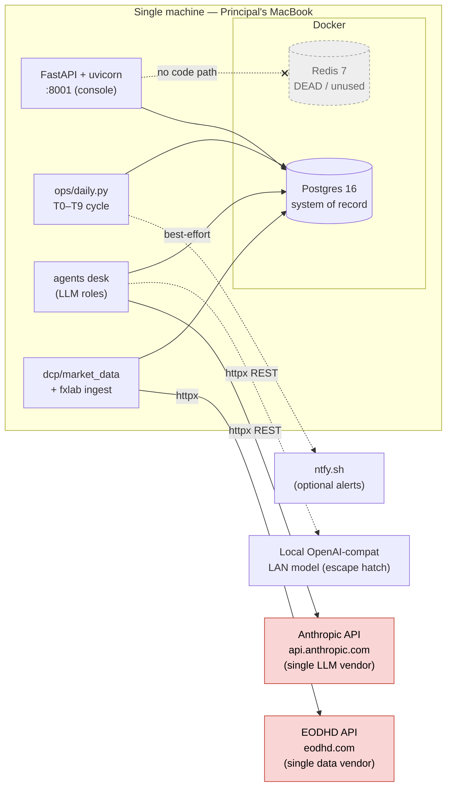

# 12 — Dependencies (Third-Party Libraries, Infrastructure, and Vendors)

**Scope.** Every external dependency Atlas pulls in — Python libraries, infrastructure
services (Postgres, Redis, Docker), and the two paid external vendors (EODHD for market
data, Anthropic for the LLM desk). For each: *why it exists, how critical it is, what could
replace it, and where it creates lock-in.* This is an adversarial review artifact: I have
prioritised surfacing weaknesses (a declared-but-dead Redis dependency, a single-vendor data
plane, a single-vendor LLM plane, no dependency lockfile, a local/CI Python-version skew)
over reassurance.

**Evidence base.** `pyproject.toml`, `docker-compose.yml`, `Dockerfile`, `.github/workflows/ci.yml`,
`Makefile`, `atlas/core/config.py`, and a full `grep` sweep of imports and outbound HTTP hosts
across `atlas/`. Installed versions were read from the project virtualenv (`.venv`,
**Python 3.14.4**) via `importlib.metadata`.

**Status legend:** `[IMPLEMENTED]` in active use · `[PARTIAL]` used shallowly / one path ·
`[EXPERIMENTAL]` present but not load-bearing · `[PLACEHOLDER / DEAD]` declared but not used
by app code · `[PLANNED — NOT BUILT]` referenced in docs, absent from code.

---

## 0. TL;DR — the dependency risk table

| Dependency | Role | Criticality | Lock-in | Headline finding |
|---|---|---|---|---|
| **EODHD** (vendor) | ALL market data | **Critical / SPOF** | **High** | Single data vendor, **two** integration points; no PIT fundamentals (blocks value/quality) |
| **Anthropic** (vendor) | LLM research desk | High (desk only; never sizes) | Medium | Single LLM vendor, but a real OpenAI-compatible escape hatch exists; **no `anthropic` SDK — raw REST over httpx** |
| **Postgres** | System of record, audit chain | **Critical / SPOF** | **High** | Deep coupling: schemas, advisory locks, hash-chain SQL, `information_schema` |
| **Redis** | (declared) cache/event bus | **None — DEAD** | None | `redis>=5.0` declared + docker service + config default, **zero `import redis`**; the "Redis Streams event bus" is doc-only, never built |
| SQLAlchemy | DB access layer | Critical | Low (shallow) | Used as Core + raw `text()` SQL (98 files); **0 ORM models** — easy to leave, but the raw SQL is Postgres-specific |
| Alembic | Migrations | Critical | Low | 34 raw-SQL migrations; `alembic check` can't run (no ORM metadata) |
| psycopg[binary] | Postgres driver | Critical | Low | Used only via the SQLAlchemy URL (0 direct imports) |
| FastAPI / Starlette / uvicorn | Read-mostly API + console host | High | Low–Med | Console is the sole control surface; **no auth** (see doc 09/16) |
| pydantic / pydantic-settings | Schemas + config/secrets | **Critical** | Medium | The "no agent numbers" invariant is enforced by pydantic schemas |
| httpx | HTTP client for **both** vendors + alerts | High | Low | The one client library talking to Anthropic, EODHD, ntfy |
| exchange_calendars | XNYS/XASX trading calendars | High | Low–Med | Not in the review's stated list, but load-bearing for no-look-ahead scheduling |
| streamlit[dashboard] | Secondary read-only dashboard | Low / optional | None | A **second, older** dashboard distinct from `console.html`; likely stale |
| pytest / hypothesis / pytest-cov / ruff / mypy | Test + quality gates | High (dev) | Low | Strong property/golden testing; global coverage NOT gated |
| Docker / docker-compose | Local Postgres+Redis; app image | Med (dev) | Low | The **running app** is a bare `uvicorn` on the Mac, not the compose app |
| **(absent) numpy / scipy / pandas** | — | — | — | **Not dependencies.** All statistics are hand-rolled in pure-Python `Decimal` |
| **(absent) lockfile** | — | — | — | No `requirements.txt` / `uv.lock` / `poetry.lock`; all deps are unpinned `>=` floors |

---

## 1. Declared dependency manifest (`pyproject.toml`)

The complete declared surface (`pyproject.toml:6-21`):

```toml
dependencies = [
    "fastapi>=0.115",
    "pydantic>=2.8",
    "pydantic-settings>=2.4",
    "sqlalchemy>=2.0",
    "alembic>=1.13",
    "psycopg[binary]>=3.2",
    "redis>=5.0",
    "uvicorn>=0.30",
    "httpx>=0.27",
    "exchange_calendars>=4.5",
]
[project.optional-dependencies]
dev = ["pytest>=8.0", "pytest-cov>=5.0", "hypothesis>=6.100", "ruff>=0.5", "mypy>=1.10"]
dashboard = ["streamlit>=1.36"]
```

Three structural observations before the deep dives:

1. **No `anthropic` and no `openai` package.** The LLM plane is a hand-written REST client
   over `httpx` (§7). The word "anthropic SDK" in the review spec is a misnomer — there is
   no SDK; there is a ~13-line POST to `https://api.anthropic.com/v1/messages`.
2. **No `numpy` / `scipy` / `pandas`.** A quant backtest gauntlet (`atlas/dcp/backtest`,
   ~7,390 LOC) with a 1000-path monkey-null, deflated Sharpe, and percentile logic — all
   implemented in **pure-Python `Decimal`**. numpy/pandas are present in the venv only
   *transitively* — required by `exchange_calendars` (a **core, non-optional** dep:
   `numpy>=1.26.4`, `pandas>=1.5.0`) as well as by streamlit, so they are not removable by
   dropping the dashboard extra; the sole textual hit in the codebase is a comment
   describing the percentile convention (`atlas/dcp/backtest/xsmom_run.py:565`). This is a
   deliberate determinism choice with a real performance cost (§12).
3. **Every version constraint is an unbounded `>=` floor and there is no lockfile.** This is
   a supply-chain and reproducibility gap discussed in §11.

### 1.1 Declared vs. actually-installed (version skew)

Resolved from `.venv` (Python **3.14.4**) on 2026-07-20:

| Package | Declared floor | Installed | Notes |
|---|---|---|---|
| fastapi | `>=0.115` | 0.139.0 | |
| starlette | (transitive) | 1.3.1 | FastAPI's ASGI core; not imported directly |
| pydantic | `>=2.8` | 2.13.4 | |
| pydantic-settings | `>=2.4` | 2.14.2 | |
| sqlalchemy | `>=2.0` | 2.0.51 | |
| alembic | `>=1.13` | 1.18.5 | |
| psycopg | `>=3.2` | 3.3.4 | `[binary]` extra |
| redis | `>=5.0` | 8.0.1 | **installed but never imported** |
| uvicorn | `>=0.30` | 0.51.0 | |
| httpx | `>=0.27` | 0.28.1 | |
| exchange_calendars | `>=4.5` | 4.13.2 | |
| pytest | `>=8.0` | 9.1.1 | |
| pytest-cov | `>=5.0` | 7.1.0 | |
| hypothesis | `>=6.100` | 6.156.6 | |
| ruff | `>=0.5` | 0.15.21 | |
| mypy | `>=1.10` | 2.2.0 | |
| streamlit | `>=1.36` | 1.59.1 | dashboard extra |
| python-dotenv | (transitive) | 1.2.2 | **present, not used** (§10) |
| numpy | (transitive) | 2.5.1 | not imported by app code |
| pandas | (transitive) | 3.0.3 | not imported by app code |
| **anthropic** | — | **NOT INSTALLED** | no SDK (§7) |
| **openai** | — | **NOT INSTALLED** | OpenAI-compat path is also raw httpx (§8) |
| **scipy** | — | **NOT INSTALLED** | stats are hand-rolled |

> **Version-skew flag.** `requires-python = ">=3.12"` (`pyproject.toml:5`), but the developer
> venv is **3.14.4**, while both CI (`.github/workflows/ci.yml`) and the `Dockerfile` pin
> **3.12**. So the Principal develops and runs the daily cycle on an interpreter the CI never
> exercises. On floors this loose, minor/major upgrades (e.g. pydantic 2.8→2.13, mypy
> 1.10→2.2, ruff 0.5→0.15) land silently on `pip install`. VERIFIED from metadata; the
> *behavioural* risk of the 3.12/3.14 split is an ASSUMPTION — no evidence either way that
> anything breaks, precisely because nothing tests 3.14. One **graph-level** divergence is
> concrete, though: the installed pandas 3.0.3 resolves `numpy>=2.3.3` under Python ≥3.14
> (the dev venv) but only `numpy>=1.26.0` under 3.12 (CI/Docker), so even the transitive
> dependency graph differs between the interpreter the Principal runs and the one CI tests.

---

## 2. External egress map (who Atlas actually talks to)

A `grep` for every `http(s)://` literal in `atlas/**.py`, reduced to hosts, returns the
*entire* outbound surface of the system:

| Host | Reached by | Purpose | Required? |
|---|---|---|---|
| `https://eodhd.com` | `atlas/dcp/market_data/adapters/eodhd.py:19`, `atlas/fxlab/ingest.py:42` | **All** market data + FX | Yes (unless fixture adapter) |
| `https://api.anthropic.com` | `atlas/agents/runtime/llm.py:65` | LLM completions for the desk | Only when the desk runs |
| `https://ntfy.sh` | `atlas/ops/alerts.py:4` (docstring example) | Optional operator push alerts | No (unset → stderr) |
| `http://localhost` | `atlas/dashboard/_client.py`, local LLM URL | Intra-host API / local model | Local only |

That is the whole list. Two paid third parties (EODHD, Anthropic), one optional best-effort
webhook (ntfy), and localhost. Note `investing.com` "source picks" (`atlas/dcp/research/source_picks.py`,
`atlas/ops/ingest_picks.py`) is a **manual data ingest** (argparse CLI / console trigger), not
a live network vendor — it never appears in the egress map.



---

## 3. Web / API layer — FastAPI, Starlette, uvicorn

### FastAPI `>=0.115` (installed 0.139.0) — `[IMPLEMENTED]`
- **Why:** the API (`atlas/api`, ~2,473 LOC, 14 files) that serves the single-file console
  (`atlas/dashboard/console.html`) and read-mostly endpoints. Imported across 12 files.
- **Criticality:** High — the console is *the sole control surface* (approvals, arming,
  trading actions). But the surface is intentionally thin/read-mostly.
- **Replacement:** Starlette directly, Litestar, or Flask would all serve this shape. FastAPI's
  pydantic integration is the main pull; migrating would mean re-wiring request validation.
- **Lock-in:** Low. Standard ASGI patterns.
- **⚠ Cross-cut (see docs 09/16):** the API has **no authentication/authorization** — no login,
  session, RBAC, or CORS config. `acknowledged_risks` is enforced but step-up-token/scope is
  "deferred to the auth phase." That is a security posture issue, not a dependency issue, but it
  is the FastAPI surface that is exposed.

### Starlette (transitive, 1.3.1) — `[IMPLEMENTED, indirect]`
- FastAPI's ASGI foundation. **Zero direct imports** in `atlas/` — pulled in by FastAPI. No
  independent decision surface; it upgrades with FastAPI.

### uvicorn `>=0.30` (installed 0.51.0) — `[IMPLEMENTED]`
- **Why:** the ASGI server that runs the app: `uvicorn atlas.api.main:app` (`Makefile` `api`
  target → port **8001** locally; `Dockerfile`/`docker-compose.yml` → port 8000).
- **Note:** invoked as a **process**, essentially never imported (only a mention in
  `atlas/dashboard/overview.py`). The API process also *is the scheduler*
  (`ATLAS_INPROC_SCHEDULER=1`) that drives the daily cycle — so uvicorn's lifetime is the
  fund's uptime. No process supervisor is actually working (launchd is dead — doc 16).
- **Replacement:** hypercorn/granian/gunicorn-with-uvicorn-workers, trivially.
- **Lock-in:** None.

---

## 4. Data-access layer — SQLAlchemy, Alembic, psycopg

### SQLAlchemy `>=2.0` (installed 2.0.51) — `[IMPLEMENTED but shallow]`
- **Why:** connection/engine/session management and query execution. Used in 99 files.
- **How, precisely:** as **Core + raw SQL**. A sweep finds `text(` in ~98 files, `Session`/
  `sessionmaker` in ~86, and **zero** declarative ORM (`declarative_base` / `DeclarativeBase`
  / `Mapped[...]` = 0 hits). Atlas hand-writes SQL and uses SQLAlchemy for pooling, sessions,
  and `text()` execution — not as an ORM.
- **Criticality:** Critical (every plane reads/writes Postgres through it).
- **Lock-in (two-sided):**
  - *Off SQLAlchemy:* **Low** — because there are no ORM models, swapping to raw psycopg or
    another query layer is mechanical.
  - *Off Postgres:* **High** — the raw SQL is Postgres-specific (schemas, advisory locks for
    the factory chokepoint, hash-chain triggers/queries, `information_schema` probes). See §5.
- **Replacement:** psycopg directly; or an ORM if models were ever introduced (they never were).

### Alembic `>=1.13` (installed 1.18.5) — `[IMPLEMENTED]`
- **Why:** schema migrations. 34 migrations (`migrations/`, `alembic.ini`, `migrations/env.py`),
  numbered 0001..0034. New tables require a new migration (project rule; applied migrations are
  never edited).
- **Sharp edge (from `.github/workflows/ci.yml`):** migrations are *raw SQL with no ORM
  metadata*, so `alembic check` (autogenerate-diff) **cannot** run. CI's only migration
  assertion is "apply cleanly from zero and land on `(head)`." There is no drift detection
  between the live schema and the migration history beyond that.
- **Lock-in:** Low (Alembic is a thin runner over the raw SQL). Replaceable by any migration
  runner, or bare `psql -f`.

### psycopg[binary] `>=3.2` (installed 3.3.4) — `[IMPLEMENTED, indirect]`
- **Why:** the DBAPI driver behind the `postgresql+psycopg://…` URL (`atlas/core/config.py:8`).
  **Zero direct imports** — used purely through SQLAlchemy's dialect.
- **`[binary]` caveat:** the psycopg maintainers recommend the binary wheel for development and
  building `psycopg[c]` (or the system libpq) for production, because the bundled binary libpq
  can lag security fixes. Fine for paper mode; note it for any production hardening.
- **Replacement:** psycopg2 or asyncpg (would require SQLAlchemy dialect/URL change).
- **Lock-in:** Low at the driver level.

---

## 5. Postgres 16 — the system of record — `[IMPLEMENTED]` · **Critical SPOF**

- **Why:** the source of truth for every plane. **Eleven** application schemas, created across
  the migration history and verified live via `pg_namespace`:
  `market, quant, trading, research, audit, learning, reporting, risk, fxlab, validation, workflow`
  (`validation.index_membership` holds PIT membership; `workflow.*` holds the resumable
  desk-run checkpoints). Note the health probe undercounts them: `atlas/tools/doctor.py:57-59`
  enumerates only **seven** (`market, risk, trading, audit, learning, quant, research`) in its
  `>= 16 tables` check, and `docker-compose.yml` enumerates none — so neither cited artifact is
  the authoritative schema list. It holds ~2.47M market-data rows,
  the append-only **audit hash-chain** (`audit.decision_events`), the trial registry, the
  feature store, and all lifecycle state.
- **Criticality:** **Maximum.** There is one Postgres instance, in one Docker container, on one
  machine. It is the single largest availability SPOF in the system. Compounding this
  (doc 16): **launchd-scheduled `pg_dump` backups never ran** (macOS TCC blocks launchd from
  `~/Documents`), so the fund has effectively had **no durable backups** — the DB volume is the
  only copy.
- **Deep lock-in.** Atlas uses Postgres-specific features that make a database swap expensive:
  - multi-schema namespacing (eleven schemas);
  - **advisory locks** for the research-factory "one name, one experiment" chokepoint;
  - the audit hash-chain SQL;
  - `information_schema` introspection in `doctor.py`;
  - a self-healing test harness that rebuilds the test DB when migration-cycle tests exhaust
    **Postgres's 1600-column-per-table budget** (a Postgres-specific limit).
- **Replacement:** realistically none without significant rework. Postgres is the correct choice;
  the risk is *operational* (single instance, single machine, no working backups), not
  *technological*.

---

## 6. Redis 7 — **`[PLACEHOLDER / DEAD]`** — declared, never used

This is the clearest "dead/misleading dependency" in the tree, and the review explicitly asked
me to confirm it by grep. I did.

**What exists:**
- `redis>=5.0` in `pyproject.toml:13` (installed: 8.0.1).
- A `redis:7` service in `docker-compose.yml:11-13`, and `ATLAS_REDIS_URL` env on the api
  service.
- A config default `redis_url: str = "redis://localhost:6379/0"` (`atlas/core/config.py:9`).
- A doctor fix-string `"docker compose up -d db redis"` (`atlas/tools/doctor.py:44`).
- Architecture docs describing a **Redis Streams event bus** with a transactional-outbox
  pattern (`docs/architecture/01-…:142-149`, `06-api-design.md:101-105`,
  `05-database-design.md:272`).

**What does not exist:**
- **Zero `import redis` anywhere in `atlas/`.** The only two `redis` string hits in the package
  are the config default and the doctor fix-string above. No client is ever constructed; no
  stream is ever produced or consumed; `redis_url` is read by nothing.

**Verdict.** `[PLANNED — NOT BUILT]` at the design level, `[PLACEHOLDER / DEAD]` at the
dependency level. The event bus is Postgres-only today (`audit.decision_events` is written
transactionally; there is no relay). Recommendation: either delete `redis` from `pyproject`,
the compose file, and the config (removing a running container and an unused attack surface),
or build the event bus the docs promise. Leaving it declared invites a reviewer (correctly) to
conclude the architecture docs describe a system that was not built.

---

## 7. Anthropic — the LLM vendor — `[IMPLEMENTED]` · single-vendor, **no SDK**

### 7.1 There is no Anthropic SDK
The review spec says "anthropic/httpx." In reality the `anthropic` PyPI package is **not a
dependency and not installed**. The entire integration is a hand-written REST client
(`atlas/agents/runtime/llm.py:53-75`):

```python
class AnthropicClient:
    def complete(self, prompt, *, max_tokens):
        r = self._client.post(
            "https://api.anthropic.com/v1/messages",
            headers={"x-api-key": self._key, "anthropic-version": "2023-06-01",
                     "content-type": "application/json"},
            json={"model": self._model, "max_tokens": max_tokens,
                  "messages": [{"role": "user", "content": prompt}]})
        r.raise_for_status()
        ...
```

**Implications for a reviewer:**
- **Upside:** no SDK to track for CVEs; transport is fully injectable (`client: httpx.Client | None`)
  which is why the desk is deterministically testable with `StubClient` (`llm.py:106`).
- **Downside:** the API version is a hard-coded string `"2023-06-01"` (`llm.py:66`). Prompt
  caching, streaming, tool-use, the messages-batch API, extended thinking, and structured
  outputs are all forgone — the desk uses a single non-streaming completion. There is no
  automatic model-migration handling; the default model is a hard-coded `"claude-sonnet-4-6"`
  (`atlas/agents/runtime/registry.py:31`).

### 7.2 Where it is used, and the guardrails around it
- **Roles:** scanner, five specialist analysts, and the CIO `committee_memo` (`atlas/agents/roles/`).
  Models resolve per-role via `ATLAS_MODEL_<ROLE>` → `ATLAS_MODEL_DEFAULT` → built-in default
  (`registry.py:46-50`).
- **Criticality:** Medium, and *bounded by design*. The LLM produces **memos only**. Invariant 2
  ("no agent numbers") means no LLM output ever sizes/prices/executes; a deterministic bridge
  (`atlas/dcp/trading/bridge.py`) turns a signed-strategy BUY memo into a sized proposal. So an
  Anthropic outage degrades *research throughput*, not trade correctness. The system runs the
  quant/risk/paper-trading planes without the LLM at all.
- **Cost breaker:** `daily_llm_budget_usd = 10.0` global (`atlas/core/config.py:13`) plus nightly
  sub-caps (analyze/shadow). A runaway spend is capped.
- **Grounding cage:** every numeric token in narrative must appear verbatim in cited evidence or
  the run fails closed (`agent.grounding.failed`); `SCHEMA_MAX_ATTEMPTS=3` then hold.
- **Transport hardening (real incident, documented in code):** `registry.py:9-20` records a
  connection-pool leak (one `httpx.Client` per role per symbol, ~45 leaked sockets per cycle),
  fixed by caching one client per `(role, model, key, url)`. `llm.py:11-38` records a 60s read
  timeout that turned healthy long generations into 3× retries; fixed with a 180s read / 10s
  connect split. These are honest, in-code post-mortems — a strength.

### 7.3 Vendor lock-in — Medium, with a genuine escape hatch
Lock-in is *real but mitigated* by `OpenAICompatClient` (§8). Because the desk depends only on a
2-method `LlmClient` Protocol (`llm.py:49-50`, `complete(prompt, *, max_tokens) -> LlmResult`),
any provider exposing chat-completions can be dropped in. Switching Anthropic → OpenAI/Gemini
would mean writing one ~15-line client class, not touching the desk. The **operational** risk
(the "Anthropic key incident": a manual restart dropped `ATLAS_ANTHROPIC_API_KEY` → 401s, because
the key is read straight from `os.environ` at `registry.py:62` and nothing auto-loads `.env` into
the process env — §10) is a bigger day-to-day hazard than provider lock-in.

---

## 8. The OpenAI-compatible escape hatch — `OpenAICompatClient` — `[IMPLEMENTED, cold]`

- **Why it exists:** ADR-0005 pattern 4 — route a role to a **local** model on the LAN (e.g. a
  3090 box) by prefixing the model string with `local/`; the public `build_client`
  (`registry.py:66-88`) delegates to the `_construct_client` helper (`registry.py:53-63`),
  which builds an `OpenAICompatClient` pointed at `ATLAS_LOCAL_LLM_URL` (constructed at :60-61).
- **How:** a POST to `{base}/v1/chat/completions` (`llm.py:90-103`) — again raw httpx, no
  `openai` package (not installed). Same `LlmClient` Protocol, so it is a true drop-in.
- **Status:** `[IMPLEMENTED]` in code and unit-tested via injected transport, but there is **no
  evidence it is wired to a live local model** in the running system (no `ATLAS_LOCAL_LLM_URL`
  default; it raises if the prefix is used without the URL — `registry.py:56-59`). Treat it as a
  *proven-in-code, cold-in-production* escape hatch — it materially lowers Anthropic lock-in but
  has not been exercised against real capital-adjacent output. ASSUMPTION flagged.

---

## 9. httpx `>=0.27` (installed 0.28.1) — `[IMPLEMENTED]` · the one HTTP client for everything

- **Why:** the single HTTP client library, used for **both** external vendors and alerts:
  - Anthropic + local LLM (`atlas/agents/runtime/llm.py`, `registry.py`, `runner.py`);
  - EODHD market data (`atlas/dcp/market_data/adapters/eodhd.py:14`) and FX (`atlas/fxlab/ingest.py:34`);
  - ops alerts to ntfy (`atlas/ops/alerts.py:59` — the `httpx.post`; :37 is the `import`);
  - the streamlit dashboard's API client (`atlas/dashboard/_client.py:7`).
- **Criticality:** High — it is on the path to every external system. But it is a commodity; the
  code uses only `Client`, `get/post`, `Timeout`, and typed exceptions.
- **Replacement:** `requests` / `urllib3` / `aiohttp`. Low lock-in; the transport-injectable
  pattern (`client: httpx.Client | None`) is the load-bearing design, not httpx itself.

---

## 10. pydantic / pydantic-settings — `[IMPLEMENTED]` · **critical to a hard invariant**

### pydantic `>=2.8` (installed 2.13.4)
- **Why:** schema validation across the agent I/O boundary (`atlas/agents/schemas/`). This is not
  incidental — **Invariant 2 ("no agent numbers") is enforced by pydantic**: a BUY memo without
  DCP evidence refs is a *validation error*, not a convention. pydantic is therefore part of the
  safety spine, not just DTO plumbing.
- **Criticality:** Critical. **Lock-in:** Medium — replacing pydantic would mean re-expressing the
  constitution's schema constraints in another validator (attrs+cattrs, msgspec). Doable, but it
  touches a safety invariant, so it is a reviewed change.

### pydantic-settings `>=2.4` (installed 2.14.2)
- **Why:** loads config/secrets from env with the `ATLAS_` prefix and an `.env` file
  (`atlas/core/config.py:5-6`, `env_file=".env", extra="ignore"`). Holds `database_url`,
  `redis_url` (unused), `trading_mode`, `eodhd_api_key`, `daily_llm_budget_usd`, etc.
- **⚠ Secrets posture (see doc 16):** secrets live in a plaintext gitignored `.env`; the DB
  password default is a literal `atlas_local_only` (`config.py:8`, `docker-compose.yml`). No
  secrets manager, no encryption at rest.
- **⚠ Split config surface — root cause of the "key incident."** The Anthropic key is **not**
  read through pydantic-settings. `Settings` never declares it; instead the agent runtime reads
  `os.environ.get("ATLAS_ANTHROPIC_API_KEY")` directly (`registry.py:62`, `shadow_compare.py:299`,
  and `atlas/ops/daily.py:695`).
  pydantic-settings *would* load `.env` for the `Settings` model, but the agent path bypasses it,
  and **`python-dotenv` (installed 1.2.2, transitive) is never called** — no `load_dotenv` exists
  anywhere in `atlas/`. `.env` reaches the process only via the `Makefile`'s `-include .env` +
  `export` (`Makefile:2-3`). Start the API any other way (a bare `uvicorn` restart) and
  `ATLAS_ANTHROPIC_API_KEY` is simply absent → 401. This is a genuine configuration-consistency
  bug, not just an ops slip.

---

## 11. Supply chain & reproducibility — **`[GAP]`** no lockfile, unpinned floors

- **No lockfile of any kind.** No `requirements.txt`, `uv.lock`, `poetry.lock`, `pip-tools`
  output, or hashes exist in the repo (verified by `ls`). Every runtime constraint is an
  **unbounded `>=` floor** (`pyproject.toml:6-21`).
- **Consequence:** `pip install -e .` (Dockerfile line 7; CI `pip install -e ".[dev]"`) resolves
  **whatever is latest** at build time. Two builds a week apart can pick up different major
  versions of pydantic, mypy, ruff, streamlit, etc. — with no record of what shipped. The version
  drift already visible in §1.1 (pydantic 2.8→2.13, mypy 1.10→2.2, fastapi 0.115→0.139) is exactly
  this happening in slow motion.
- **No dependency scanning / SBOM / Dependabot.** `.github/workflows/ci.yml` runs lint/type/test
  only; there is no `pip-audit`, no Dependabot config, no SBOM generation.
- **Recommendation:** commit a hash-pinned lockfile (uv or pip-tools), add upper bounds or renovate
  automation, and add `pip-audit` to CI. For a system that touches paid vendor keys and (eventually)
  capital, unpinned transitive dependencies are the standard supply-chain foothold.

---

## 12. The absent scientific stack — a deliberate design choice worth flagging

- **numpy / scipy / pandas are not *direct* dependencies.** scipy is not installed at all;
  numpy 2.5.1 / pandas 3.0.3 are pulled in **transitively** — required by `exchange_calendars`
  (a CORE, non-optional dep: `numpy>=1.26.4`, `pandas>=1.5.0`) as well as by streamlit — and
  **neither is imported by any Atlas module** (the lone hit is a comment at `xsmom_run.py:565`).
  (So dropping the `[dashboard]`/streamlit extra would *not* remove numpy/pandas.)
- **What that means:** the backtest gauntlet, the null-model, deflated Sharpe, percentiles, and
  the risk engine's statistics are **hand-implemented in pure-Python `Decimal`**. This buys
  bit-for-bit determinism and golden-pin testability (a real strength for an audit-first,
  reproducible-replay system) and avoids a large, churny dependency surface.
- **The cost:** pure-Python `Decimal` math over ~2.47M rows and 1000-path monkey-null simulations
  is **orders of magnitude slower** than a vectorised numpy/scipy implementation, and re-derives
  numerically-sensitive routines (percentile interpolation, Sharpe deflation) that scipy provides
  and validates. There is also no performance/load test tier (doc 16) to bound how this scales as
  the universe (currently ~506 active S&P names) or history grows. This is a scalability/maintenance
  liability, not a correctness one — but a hostile committee will ask why a quant fund re-derived
  scipy.stats by hand.

---

## 13. Testing & quality-gate dependencies (`[dev]`) — `[IMPLEMENTED]`

| Tool | Floor / installed | Role | Notes |
|---|---|---|---|
| pytest | `>=8.0` / 9.1.1 | ~1,515 tests, ~75s (measured **74.6s** this session — see doc 15 §2; the earlier "~65s" note is **stale/superseded**, ±~15% run-to-run) | Isolated to an `atlas_test` DB (self-healing bootstrap) |
| hypothesis | `>=6.100` / 6.156.6 | Property tests | e.g. "vol-target never > 0.80 gross"; strong on the risk engine |
| pytest-cov | `>=5.0` / 7.1.0 | Coverage | **Only** gate is `make cov-risk` = 100% branch coverage on `atlas/dcp/risk`; global coverage is **not** measured or enforced |
| ruff | `>=0.5` / 0.15.21 | Lint | `ruff check atlas tests` in CI |
| mypy | `>=1.10` / 2.2.0 | Types | **strict**, but only on `atlas/core`, `atlas/dcp`, `atlas/fxlab` (`pyproject.toml:38-46`). `atlas/api`, `atlas/ops`, `atlas/agents` are **not** strict-gated |

- **CI exists and runs the suite** — see §14. **Criticality:** High for development integrity;
  these are the gates the project's "never weaken a gate" ethos rests on.
- **Gaps to state plainly:** no performance/load/stress tier; global coverage unmeasured;
  three large subpackages (api/ops/agents) outside strict typing.

---

## 14. Infrastructure & build — Docker, Compose, Dockerfile, CI

### Docker + docker-compose — `[IMPLEMENTED for local dev]`
- `docker-compose.yml` defines `db` (postgres:16), `redis` (redis:7, **unused**), and an `api`
  service (`build: .`, port 8000). The **actually-running** system is *not* this compose app: the
  fund runs a bare `uvicorn … --port 8001` on the Mac (Makefile `api` target; port 8000 is taken
  by another project on this machine per CLAUDE.md). Compose is used to run Postgres (and a Redis
  nobody talks to) for local dev.
- **`Dockerfile`:** `python:3.12-slim`, copies source, `pip install --no-cache-dir -e .`, runs
  uvicorn on 8000. Single-stage; **runs as root** (no non-root user); **no lockfile** so image
  contents are non-reproducible; the built image is not actually the deployment vehicle (no
  containerized app deploy, no orchestration, no HA — doc 16).

### CI — `.github/workflows/ci.yml` — `[IMPLEMENTED]`  ⚠ contradicts a ground-truth note
- On `push` and `pull_request`: spins up postgres:16, sets `ATLAS_DATABASE_URL` at job level,
  `pip install -e ".[dev]"`, then **`ruff check` → `mypy` → `pytest` → migration check**
  (`alembic upgrade head` + assert `(head)`).
- **This is a CI pipeline that runs the full suite on push** — directly contradicting the
  ground-truth/limitations claim that "No CI/CD pipeline… runs the suite on push." (See the
  cross-document inconsistency at the end.) What is genuinely absent is **CD**: no deploy step, no
  coverage gate, no redis service (further confirming Redis is unused), no dependency scan, and no
  matrix — CI validates only Python **3.12**, while the dev machine runs **3.14**. Whether the
  latest push is actually **green** could not be verified from the repo alone (requires GitHub
  Actions run history) — VERIFIED that the workflow exists and is well-formed; NOT VERIFIED that it
  is passing.

---

## 15. exchange_calendars `>=4.5` (installed 4.13.2) — `[IMPLEMENTED]` · load-bearing, not in the spec list

- **Why:** wraps XNYS / XASX exchange calendars so the rest of the plane speaks plain `date`s
  (`atlas/dcp/market_data/calendars.py:13`): `is_trading_day`, `previous/next_trading_day`,
  `session_open/close_utc`, `last_completed_session`, `trading_days_between`. This underpins the
  T0–T9 daily cycle timing and — importantly — the **no-look-ahead** invariant (only completed
  sessions are actionable).
- **Criticality:** High and quietly structural. A wrong calendar would silently corrupt
  rebalance/execution timing and PIT membership.
- **Replacement:** `pandas_market_calendars`, or a hand-maintained holiday table. Low–Medium
  lock-in: the wrapper (`calendars.py`) isolates it behind ~10 plain-`date` functions, so a swap
  is contained — but the correctness bar is high, so it is a reviewed change.
- **Note:** this dependency was omitted from the review's stated dependency list; it deserves the
  same scrutiny as the others because it gates execution timing.

---

## 16. streamlit[dashboard] `>=1.36` (installed 1.59.1) — `[EXPERIMENTAL / likely stale]`

- **Why:** an **optional** read-only dashboard (`atlas/dashboard/overview.py` +
  `pages/1_Research.py`, `2_Quant.py`, `3_Market.py`), a thin API client over httpx
  (`_client.py`).
- **Key clarification:** this is **not** the primary control surface. The real console is
  `atlas/dashboard/console.html` — a single **2,264-line** inline-JS/CSS file served by
  **FastAPI** (`atlas/api/main.py:36`, `wc -l`-verified), with no streamlit involved. (FastAPI
  also serves a *second* inline HTML surface, `atlas/dashboard/dossier.html` — 506 lines, wired
  at `main.py:37`/:69; the two together sum to 2,770, the stale figure a prior draft reported
  as the console's line count.) The streamlit app is a *third, older* viewer (files dated
  earlier; the console.html was updated 2026-07-20). It is behind a separate `[dashboard]` extra
  and a `Makefile dashboard` target, and almost certainly lags the console.
- **Criticality:** Low / optional. **Lock-in:** None. **Recommendation:** decide whether the
  streamlit dashboard is still wanted; if not, drop the extra to trim the dependency surface.
  (Note: this would **not** remove numpy/pandas — those are also required transitively by the
  core `exchange_calendars` dep, so they stay installed regardless.)

---

## 17. Vendor lock-in — the two that matter

### 17.1 EODHD — single market-data vendor — **High lock-in, Critical SPOF**
- **What it provides (the whole data plane):** daily bars (~2.47M rows), FX, dividends
  (total-return capable), splits/corporate actions, *current* fundamentals snapshots (~526 names),
  earnings calendar, earnings surprises, estimate snapshots. Adapter:
  `atlas/dcp/market_data/adapters/eodhd.py` (`fetch_bars`, `fetch_splits`, `fetch_dividends`,
  `fetch_earnings_calendar`, `fetch_fundamentals`, `fetch_fx[_series]`). Base URL
  `https://eodhd.com/api` (`eodhd.py:19`). ~$99/mo "All-In-One" tier.
- **Two integration points, not one.** Beyond the market-data adapter, `atlas/fxlab/ingest.py`
  has its **own** `FxlabEodhdClient` for EURUSD (`ingest.py:42-52`). So EODHD is wired in twice;
  a migration touches both.
- **The critical data gap (biggest research blocker in the whole system):** EODHD provides **no
  point-in-time fundamentals** — financials are restated in place, with no filing dates, and no
  fundamentals for pre-2018 delistings. This makes honest **value/quality factor families
  impossible to build**, so they are **not built**. A vendor decision (Sharadar SF1 ~$69/mo, or
  Intrinio, recommended) is **open**, awaiting the Principal
  (`docs/reports/pit-fundamentals-vendor-decision.md`).
- **Also blocked:** direct NSE (India) data — EODHD has **zero NSE coverage**, so India exposure
  is ADR-only. A second vendor is required to ever trade NSE directly.
- **Lock-in reality:** High but bounded by the adapter seam. All vendor-specific quirks (`.US`/`.AU`
  suffix mapping, `unadjustedValue` vs `value` dividend handling, the `earnings` wrapper key) live
  inside `eodhd.py`; the rest of the plane consumes canonical `Bar`/`Dividend`/`Split` models. A
  replacement vendor means a new adapter implementing the same methods **plus** a full
  re-backfill and re-validation of every gate — non-trivial, but not a rewrite.
- **Mitigation present:** a keyless **fixture adapter** is used when `eodhd_api_key` is empty
  (`config.py:14`), enabling deterministic dev/replay without the vendor. Good for testing; it
  does not reduce production lock-in.

### 17.2 Anthropic — single LLM vendor — **Medium lock-in, mitigated**
Covered in §7–§8. Summary: single vendor, hard-coded default model and API version, no SDK; but
(a) the LLM never touches numbers/sizing (blast radius is research only), (b) cost is capped, and
(c) a real OpenAI-compatible escape hatch exists behind the same `LlmClient` Protocol. Provider
migration cost ≈ one small client class. The sharper risk is *operational* key-loading (§10), not
strategic lock-in.

---

## 18. Weaknesses / Debt / Open

- **Redis is dead weight.** `[PLACEHOLDER/DEAD]` — declared in `pyproject`, run as a container,
  defaulted in config, documented as an event bus — and imported by nothing. Either build the
  Redis Streams outbox the architecture docs promise, or delete the dependency, the service, and
  the config. Today it is misleading surface area.
- **No lockfile, unbounded `>=` floors, no dependency scanning/SBOM.** Builds are non-reproducible;
  major-version drift is already visible (pydantic, mypy, ruff, fastapi). Highest-leverage
  supply-chain fix.
- **Two single-vendor SPOFs.** EODHD (all data; no PIT fundamentals → value/quality unbuildable;
  no NSE) and Anthropic (all LLM). EODHD lock-in is the more consequential and the PIT-fundamentals
  vendor decision is a *blocking* open item.
- **Postgres is a single-instance SPOF with (until now) no working backups** — a data-durability
  hole (the dependency is right; the operations around it are not).
- **Config surface is split**, and the Anthropic key bypasses pydantic-settings and dotenv →
  the recurring 401 "key incident." Consolidate secret loading.
- **Local/CI Python skew:** dev on 3.14.4, CI + Docker on 3.12; nothing tests the interpreter the
  Principal actually runs.
- **CI without CD or breadth:** the suite runs on push (good), but there is no deploy, no coverage
  gate, no dependency audit, no Python matrix, and green-status on the latest commit is unverified
  from the repo.
- **Absent scientific stack is a scalability bet:** pure-Python `Decimal` stats (no numpy/scipy)
  are deterministic and testable but slow at scale and re-derive numerically-sensitive routines,
  with no performance test tier to bound them.
- **Streamlit dashboard is probably stale**, kept alive only by the `[dashboard]` extra. (Dropping
  it would trim the surface but would **not** remove numpy/pandas — those are also required
  transitively by the core `exchange_calendars` dependency.)
- **Dockerfile runs as root, single-stage, unpinned** — fine for paper mode, unacceptable for any
  production image.

---

## Cross-document inconsistency noticed

**`.github/workflows/ci.yml` contradicts the "no CI" claim in the ground-truth / limitations
docs.** `00_GROUND_TRUTH.md:143-144` (and the checklist in `16_KNOWN_LIMITATIONS.md`) state
"No CI/CD pipeline that runs the suite on push … 'CI green' claimed in an ADR but verify." The
repo **does** contain a working CI workflow that, on every `push` and `pull_request`, stands up
Postgres and runs `ruff → mypy → pytest → alembic upgrade head`. The accurate statement is: **CI
exists and runs the full suite on push; CD does not exist** (no deploy, no coverage gate, no
dependency scan, Python 3.12-only). Whether the *latest* run is green is separately unverifiable
from the repo (needs GitHub Actions history) — so the ADR's "CI green" is plausible but
unconfirmed here, whereas the flat "no CI pipeline" assertion is false as written.
