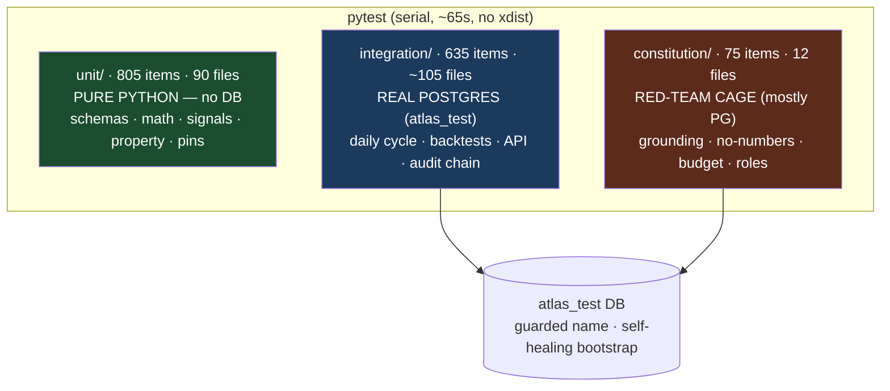
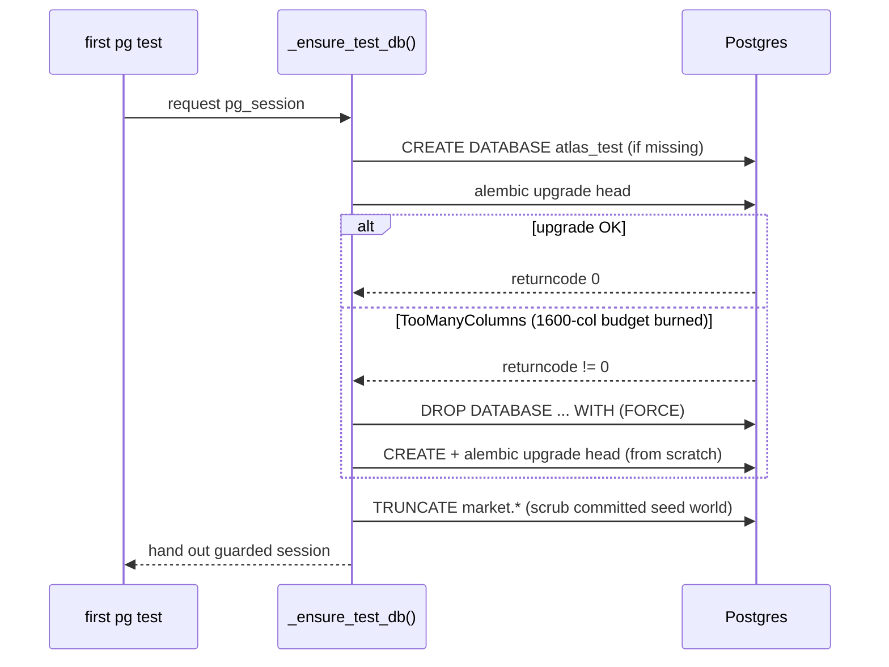

# 13 — Testing, Type-Checking & Test Reliability

> Adversarial review artifact. Paper-mode research/simulation system, months old, one
> Principal + AI pair, single machine. This document describes what the test suite
> **actually does** and — with equal weight — **what it does not do**. Where a claim is an
> assumption rather than verified behaviour, it is tagged. Every count below was measured on
> the working tree at review time, not taken from prose.

---

## 0. TL;DR for the committee

| Dimension | Status | Evidence |
|---|---|---|
| Total collected tests | **1,515** (pytest items) | `pytest --collect-only` sum |
| Distinct `def test_*` functions | **1,454** | grep; delta = parametrize expansion |
| Split (collected) | unit **805** · integration **635** · constitution **75** | collect-only per dir |
| Property-based tests (Hypothesis) | **5 `@given`**, in **3 files** | all in risk/snapshot |
| Golden/regression pins | pervasive idiom (~139 `golden`, 77 `_pin` refs) | e.g. `tests/unit/test_backtest_engine.py:40` |
| Determinism primitives | `FrozenClock` (441 refs), null seed `seed=7` | `tests/conftest.py`, `atlas/dcp/backtest/candidate_run.py:89` |
| Branch coverage | **100% on `atlas/dcp/risk` ONLY** (`make cov-risk`) | `Makefile` `cov-risk` target |
| **Global line/branch coverage** | **NOT MEASURED, NOT ENFORCED** | no `.coveragerc`, no `--cov` in `addopts` |
| Type checking | mypy `strict` on **core + dcp + fxlab only** | `pyproject.toml:38-41` |
| **api / ops / agents / tools / dashboard mypy** | **NOT strict-gated** | absent from mypy `files` |
| Performance / load / stress / chaos / failover tests | **NONE** | no locust/benchmark dep; no such tier |
| CI that runs the suite on push | **YES** — ruff+mypy+pytest+migration on push/PR | `.github/workflows/ci.yml` (postgres:16 service; runs bare `pytest`, so no coverage gate in CI — see §11) |
| Parallel execution | **NO** — serial, ~65s wall | no xdist in deps/config |
| Test DB isolation | Hard-guarded `atlas_test*`, self-healing bootstrap | `tests/conftest.py:31,60,134` |
| Suite stability this week | **3 flaky root-causes found + fixed**; 2 hygiene leaks; 1 retry-desync class | commits `5e0f323`, `75a78e9` |

**One-line reliability verdict:** the suite is a *correctness-and-invariant* harness — strong
on determinism, architectural boundaries, and the LLM "cage" — but it is **not** a
performance, resilience, or production-operability harness, and its coverage is **measured in
exactly one module**. Treat green as "the logic I wrote tests for still behaves", not "the
system is safe to run unattended".

---

## 1. Inventory & the count reconciliation (state it plainly)

There are two legitimate numbers and they differ; the review package headline of **1,515**
is the pytest-collected item count. Both are reproduced here so the committee can audit:

```
pytest --collect-only -q  → 1515 items   (unit 805 / integration 635 / constitution 75)
grep 'def test_'          → 1454 funcs   (unit 754 / integration 625 / constitution 75)
```

The 61-item gap is `@pytest.mark.parametrize` expansion (12 parametrize decorators across 9
files). **Note the internal inconsistency in the ground-truth facts file**: it prints the
headline "~1,515 test functions" but its own per-dir breakdown (754 / 625 / 75) sums to
**1,454** — those are function *definitions*, not collected *items*. This document uses
1,515 for "tests run" and 1,454 for "test functions authored". `CLAUDE.md` now reads
"1515 passing" (`CLAUDE.md:25`) — it was **1354 at an earlier snapshot** and has since been
updated to 1515 (the count climbed 1354 → 1486 → 1498 → 1515 over the churn described in
§10). So the prose caught up; the residual drift is that `CLAUDE.md`'s 1515 is the
*collected-item* count while the ground-truth file's per-dir breakdown still sums to 1,454
*function definitions* (see the cross-document note below).

**Directory = test class (a real, enforced split):**

| Dir | Files | Backing | What it is |
|---|---|---|---|
| `tests/unit/` | 90 test files | **Pure Python, no DB** (0 files touch `pg_session`/`clean_audit`) | Pure functions, Pydantic schemas, sizing math, signal generators, calendars, indicators, property tests, golden pins |
| `tests/integration/` | ~105 `*_pg.py` | **Real Postgres** (`atlas_test`), TRUNCATE fixtures | End-to-end: daily cycle, backtest runs, API routers, audit chain, migrations, backfill, evidence corpus |
| `tests/constitution/` | 12 test files, **75 tests** | Mostly Postgres (`clean_audit`) | Red-team "cage" suite: proves LLM agents cannot escape their constraints |

`119` test files carry `requires_pg` / `pg_session` / `clean_audit`. **All of them are in
integration + constitution; the unit tier is DB-free by construction.** Practical
consequence: with Postgres down, the unit tier still runs but ~120 files **skip** (via
`requires_pg = pytest.mark.skipif(not _reachable(), ...)`, `tests/conftest.py:57`). A green
unit run on a machine with no DB is therefore **not** a green suite — a real hazard for a
casual "I ran the tests" claim.



---

## 2. The constitution / red-team suite — the crown jewel (and its limits)

This 75-test suite is the most important thing in the repo from a safety standpoint: it
tests **the cage, not the animal**. Every test scripts a *misbehaving* model via a
`StubClient` and asserts the deterministic runtime **fails closed**. It never calls a real
LLM — so it verifies the *guardrails*, not model quality.

| File | Tests | Invariant exercised |
|---|---|---|
| `test_specialists.py` | 14 | Specialist analyst roles, schema + persistence |
| `test_grounding.py` | 11 | **Grounding cage**: a number not in cited evidence fails closed (`agent.grounding.failed`) |
| `test_redteam_v1.py` | 9 | BUY-without-evidence rejected; execution-shaped numbers rejected; conviction cap |
| `test_desk_failure_semantics.py` | 8 | Desk failure modes (fail-closed vs hold) |
| `test_debate_redteam.py` | 7 | Bull/bear debate cannot smuggle numbers |
| `test_budget_subcaps.py` | 5 | LLM $/day budget breaker + sub-caps |
| `test_memo_source.py` | 5 | Memo source attribution |
| `test_roles_v1.py` | 6 | Role wiring, prompt pinning |
| `test_debate_persistence.py` | 3 | Debate rounds persisted to audit |
| `test_memo_evidence.py` | 3 | Evidence-ref integrity |
| `test_pricing_runner.py` | 2 | Pricing runner boundary |
| `test_shadow_mode.py` | 2 | Shadow-mode comparison harness |

**What it genuinely proves (verified behaviour):**

- **Invariant 2 (no agent numbers).** `test_redteam_v1.py` scripts a `BUY` memo with a
  fabricated evidence ref and asserts `AgentRunFailed`, with **every** attempt logged as
  `schema_fail` in `research.agent_runs`. It also rejects `"Enter at $172.40 with stop at
  158.90"` — execution-shaped numbers in narrative.
- **The grounding verifier is boundary-aware, and the red team pins the historical bypass
  dead.** `test_grounding.py` documents a real defect that was fixed: substring matching let
  a narrative `20` ground against `SMA20`, and `26` ground against the `26` inside
  `2026-07-10`. The verifier now compares **set membership over a shared boundary-aware
  tokenizer**; `test_redteam_bare_20_grounded_only_by_sma20_now_kills` and
  `test_redteam_date_component_leak_is_dead` are regression pins that would re-fire if the
  bypass returned. This is exactly the kind of adversarial self-testing that survives hostile
  review.
- **Fail-closed is counted, not assumed.** Tests assert exactly `SCHEMA_MAX_ATTEMPTS` (=3,
  `atlas/agents/runtime/runner.py:102`) grounding-failure audit events before the run holds —
  so a silent short-circuit that "passed" on attempt 1 would be caught.

**What it does NOT prove (be explicit):**

- It does **not** evaluate real-model output quality — no live Anthropic calls in the suite
  (live-model evals are pending an API key per `CLAUDE.md`). The cage is tested against a
  *stub adversary the authors wrote*; an unforeseen real-model failure mode outside the
  scripted adversaries is not covered.
- The adversary is only as creative as the test author. This is a fundamental limit of
  red-team-by-fixture: it pins **known** escapes shut, not unknown ones.

---

## 3. Architectural-boundary tests (Invariant 1) — cheap, strong, structural

`tests/unit/test_boundaries.py` parses every `.py` under `atlas/dcp` and `atlas/agents` with
`ast` and asserts import direction:

- `test_dcp_never_imports_agents` — the compute plane may never depend on the LLM plane.
- `test_agents_never_import_risk_or_execution` — agents can never reach the veto/broker
  (`atlas.dcp.risk`, `atlas.dcp.execution`).

This is a **static, whole-tree** check (it walks the actual import graph, not a sample), so
the two-plane wall is enforced structurally rather than by convention. Strong. Its blind
spot: it matches on module-path prefixes, so an indirect reach via a third module, or a
dynamic `importlib` call, would not be caught. No evidence such an evasion exists; flagging
the theoretical gap.

Adjacent invariant tests:
- **Invariant 4 (audit append-only hash chain):** `tests/unit/test_audit_chain.py` proves
  payload tamper is detected (`test_payload_tamper_detected`), deletion breaks the link
  (`test_deletion_detected_via_link_break`), unknown actors are rejected, and canonicalisation
  is key-order-independent. Integration side: `test_verify_chain_pg.py` exercises the nightly
  `verify-chain` tool against a live chain.
- **Invariant 5 (prompts are code):** prompt/template hashing is exercised by
  `test_specialist_prompts.py`, `test_question_template.py`, and `test_runner_failure_semantics.py`.

---

## 4. Property-based tests (Hypothesis) — narrow but sharp

Hypothesis is a dev dependency (`hypothesis>=6.100`) and is used in **exactly 3 files, 5
`@given` blocks** — all in the risk/snapshot area:

| File | Property proven |
|---|---|
| `tests/unit/test_vol_target.py` | For all `(current_gross, realised_vol, target_vol, breaker)`: output gross ∈ `[0, MAX_GROSS]`, step-bounded to `MAX_STEP`, and **never scales up in a DD1/2/3 breaker state** |
| `tests/unit/test_risk_engine.py` | (3 blocks) breaker state machine **never de-escalates without a human**; a §4-sized position **validates on a fresh book** (sizing fn ↔ validator agree); sizing never exceeds caps |
| `tests/unit/test_snapshot.py` | (1 block) snapshot invariant |

This is the "property tests prove no input sizes past a cap" claim, and it is **real** —
`test_property_engine_approved_size_validates_on_fresh_book` closes the loop between the
sizing function and the validator across a generated input space. **Honest scoping:**
property testing is confined to the risk engine. The backtest gauntlet, the bridge, the
signal generators, and the portfolio engine are covered by **example-based** golden pins, not
property search — so their edge-case space is only as wide as the examples chosen.

---

## 5. Golden pins & determinism

**Golden pins.** The dominant regression idiom (~139 `golden` references, 77 `_pin`). A
golden pin freezes a numeric output so *any* drift in engine/strategy/fixture behaviour
fails loudly. Canonical example:

```python
# tests/unit/test_backtest_engine.py:40
def test_golden_regression_pins():
    r = run_backtest(regime_series(), momentum_v1, CostModel(), start_i=60, end_i=1200)
    assert r.total_return == pytest.approx(1.0200745813149137)
```

Pins are spread across ~50 files, including the load-bearing artifact runs
(`test_xsmom_signals_pg.py`, `test_low_vol_family_pg.py`, `test_trial_lineage_pg.py`) and the
evidence corpus (`test_quant_evidence_pg.py`, `test_earnings_evidence_pg.py`). **Weakness of
the idiom:** a golden pin proves *stability*, not *correctness* — if the pinned number was
wrong when frozen, the pin faithfully protects the wrong number. It is a change-detector, not
an oracle.

**Determinism primitives.**
- `FrozenClock` (Invariant 6, injectable time) is used **441 times** across the suite — every
  timestamp-sensitive test injects a fixed clock rather than reading `datetime.now()`. This
  is what makes the daily-cycle and audit-chain tests reproducible.
- The **null-model seed is `seed=7`** everywhere (`candidate_run.py:89`,
  `impl_variant_run.py`, `pead_pit_run.py`, `portfolio_validation.py`), with the monkey-null
  using a seeded `random.Random(seed)` so `(seed, paths)` fully determines the 1,000-path
  distribution. This is why the "+737% vs SPY, p=0.000, DSR 0.995" artifact is
  bit-reproducible — a genuine strength for auditability.
- `make replay DATE=…` gives a deterministic daily-cycle replay → gate=green, used as a
  smoke check.

**Assumption flag:** determinism is verified *within a fixed seed and fixed fixtures*. There
is no test that the strategy is robust to a *different* seed or a *different* random draw of
the monkey null — the seed is a constant, not a swept parameter. So "deterministic" here
means "reproducible", not "seed-insensitive".

---

## 6. Coverage measurement — the honest picture

**Global coverage is NOT measured and NOT enforced.** There is no `.coveragerc`, no
`--cov` in `addopts` (`pyproject.toml:32` is just `-q`), and no CI step that gates on
coverage. `pytest-cov` is installed but only invoked by one target.

The **only** coverage bar in the system is on the risk engine:

```makefile
# Makefile
cov-risk:  ## Phase 4 exit criterion: 100% branch coverage on dcp/risk
	pytest --cov=atlas.dcp.risk --cov-branch --cov-fail-under=100 -q
```

So the committee should read the coverage story as: **100% branch coverage on
`atlas/dcp/risk` (8 substantive modules: `engine`, `stress`, `factor_overlap`,
`correlations`, `approval_recheck`, `clearance`, `vol_target`, `seed_limits` — 9 `.py`
files counting `__init__`), and an unknown, unmeasured
figure for the other ~34,000 LOC of production Python.** Backtest (7,390 LOC), market_data
(4,777), trading (3,435), agents (3,755), api (2,473), ops (2,065) have **no coverage floor
at all**. The risk engine's 100% is meaningful precisely because it is the module a bad
number must pass through; the absence of any number everywhere else is real debt.

---

## 7. Type checking & lint

**mypy** (`pyproject.toml:38-41`):

```toml
[tool.mypy]
python_version = "3.12"
strict = true
files = ["atlas/core", "atlas/dcp", "atlas/fxlab"]
```

`strict` is genuine (implies `disallow_untyped_defs`, `no_implicit_optional`, etc.), but the
**scope is three subpackages**. **Not strict-gated, not type-checked at all by the `mypy`
target:** `atlas/agents`, `atlas/api`, `atlas/ops`, `atlas/tools`, `atlas/dashboard`. That is
a deliberate choice (core + dcp + fxlab are the "numbers" planes) but it means the entire
**operations layer, HTTP surface, and LLM runtime** ship without static type guarantees —
precisely the layers most exposed to runtime environment drift. `mypy` is a bare `make type`
with no separate per-package escalation planned in-tree.

**ruff** (`pyproject.toml:34-36`): `line-length = 100`, `target-version = "py312"`, run over
`atlas tests` via `make lint`. Default rule set — no extended security or complexity rules
configured. Lint is style/basic-correctness only.

---

## 8. Test infrastructure: DB isolation & the self-healing bootstrap

This is well-engineered for a solo project and worth crediting.

**Hard isolation guard** (`tests/conftest.py:31`, `:134`): the test DB name must begin with
`atlas_test`; any other name raises at import. `_assert_test_db` refuses to hand out a
session unless `current_database()` matches — so a destructive `TRUNCATE` fixture is
*structurally* unable to point at the dev DB that holds real backfilled history and the live
audit chain. Concurrent agent sessions can each use their own `atlas_test_<name>` via
`ATLAS_TEST_DATABASE_URL`, and nested conftests (`integration/`, `constitution/`) realign the
guarded name to the URL basename without ever leaving the `atlas_test*` namespace.

**Self-healing bootstrap** (`tests/conftest.py:60-107`) — a genuinely clever fix to a real
Postgres foot-gun:



The migration-cycle tests (~10 of them) downgrade/upgrade repeatedly; every dropped column
permanently consumes one of Postgres's **1,600 lifetime columns per table** (dropped slots
are never reclaimed). After enough full-suite runs the bootstrap upgrade dies mid-flight with
`TooManyColumns` and strands `alembic_version`. The bootstrap now **drops and recreates the
disposable test DB on any upgrade failure** — a corrupted bootstrap never again needs a human
to remember the `DROP`. `_scrub_committed_market_world` (`:110`) additionally TRUNCATEs the
market schema at session start so a committing test (ingest replay, daily cycle) can't poison
the next run.

**Assumption flag:** this self-healing is only exercised implicitly (it fires when the column
budget is exhausted); there is no dedicated test that *forces* the failure path and asserts
recovery. So the recovery logic itself is un-pinned — if it regressed, you'd only learn on
the next real exhaustion.

---

## 9. What each layer guarantees — reliability assessment

| The suite **DOES** guarantee (verified) | The suite **DOES NOT** guarantee |
|---|---|
| The two-plane import wall holds (whole-tree AST scan) | That no code reaches across the wall via dynamic import / reflection |
| An LLM cannot inject a sizing/pricing/execution number (schema + grounding, counted fail-closed) | That a *real* model won't find an escape outside the scripted adversaries |
| The audit chain detects tamper & deletion | That the chain is monitored in real time (it's a nightly cron job; see ops doc) |
| Risk engine: 100% branch coverage + property-proven caps | Any coverage number for the other ~34k LOC |
| Backtest artifact reproducibility (fixed seed + fixed fixtures + golden pins) | Robustness to a different seed / different data / regime shift |
| The daily cycle runs green on fixtures (`make replay`) | That it survives real-world data gaps, vendor outages, or clock skew |
| DB tests cannot touch real data (hard guard) | Anything about API auth, load, or concurrency under real traffic |
| Sizing fn ↔ validator agree on generated inputs | End-to-end behaviour under partial failure (no chaos/failover tests) |

**Net:** the suite is a high-quality **invariant and determinism** harness. It is **not**
evidence of operational readiness, performance, or resilience — and the system is paper-mode,
single-machine, so it was never asked to be.

---

## 10. The flaky-suite bug hunt (this week) — churn is real, surface it

Running the full suite ~10× in one day surfaced defects that targeted runs never did. Two
commits fixed them; both are worth reading as evidence the codebase is **actively churning**
and that "the suite passes" was, until days ago, partly luck.

**`5e0f323` — "Exorcise the flaky-suite ghosts at their roots: three real defects, not
luck":**
1. **Nondeterministic by-symbol resolution (production bug).** `compute_models` /
   record-pick / ticker-dossier resolved `'SPY'` with `ORDER BY is_active DESC LIMIT 1` — a
   coin-flip when two active rows share a symbol. Harmless in prod (symbols unique),
   nondeterministic under test-world duplicates. Fixed with a deterministic id tiebreak at
   all three sites (`atlas/api/routers/research.py`, `atlas/dcp/research/source_picks.py`,
   `atlas/dcp/research/stock_models.py`). **This was a real production-code defect surfaced
   by test flakiness, not merely a test bug.**
2. **Committed seed-world pollution (test hygiene).** Replay/daily tests legitimately COMMIT
   the seed world; the last file's leftovers greeted the next run's first file. Fixed by the
   session-start scrub in conftest + the replay file scrubbing after itself.
3. **The alembic column-slot fuse (test infra).** The `TooManyColumns` exhaustion described
   in §8 — fixed by the self-healing bootstrap.

   > "Proof: two consecutive full runs, 1498 passed each, zero flakes."

**`75a78e9` — "Extinguish the stale 2-attempt retry class + two test-hygiene leaks":**
- **Retry-desync class.** `SCHEMA_MAX_ATTEMPTS` went 2→3 (the cage-hold retry fix), and
  scripted `StubClient` sequences across **seven** constitution/integration files that
  assumed exactly two failed attempts desynced by one. Rather than patch one red test, every
  cage-hold script now scripts `[bad] * SCHEMA_MAX_ATTEMPTS` with exact-count assertions
  **pinned to the imported constant** — several had previously passed only by accident of the
  stub's `"{}"` exhaustion fallback (exercising the stub default, not the scripted
  violation). A future retry-count change can no longer silently desync them.
- **`ATLZ` test-DB leak.** `test_api_source_picks_pg` committed an ACTIVE fake instrument
  (`ATLZ`) into the shared test DB, turning the canonical 2024-07-15 replay gates RED
  ("ATLZ missing bars") for every later run. Fixed to `is_active=false` + a repair path; the
  stray row purged.
- A console label capitalization broke an attribution-card honest-label pin; rephrased.

**Reviewer takeaway:** three of these were *latent correctness/hygiene defects that flakiness
exposed*, and the fixes are structurally sound (pin to a constant, scrub at session start,
self-heal the DB). But the honest read is that the suite's green state is **days old**, was
partially accidental before this week, and the codebase churned fast enough that
`CLAUDE.md`'s own count trailed reality by ~160 for a stretch (since reconciled to 1515).

---

## 11. What is NOT tested — the gaps, stated in plain words

- **[PLANNED — NOT BUILT] Performance / throughput / latency tests.** None. No
  `pytest-benchmark`, no locust, no timing assertions. The backtest gauntlet's runtime is
  unmeasured by any gate.
- **[PLANNED — NOT BUILT] Load / stress / soak tests.** None. The API has never been tested
  under concurrent load; the daily cycle has never been tested against a large or degenerate
  data day.
- **[PLANNED — NOT BUILT] Chaos / failover / resilience tests.** None. There is no test for
  DB-connection loss mid-cycle, vendor (EODHD) outage, partial write, or process kill during
  the single atomic daily transaction. Recovery behaviour is asserted nowhere.
- **[PARTIAL] CI that runs the suite.** An in-tree workflow DOES exist:
  `.github/workflows/ci.yml` triggers `on: [push, pull_request]`, provisions a `postgres:16`
  service (so the integration tier RUNS, not skips), and gates `ruff check atlas tests` →
  `mypy` → `pytest` → an `alembic upgrade head` migration check as pipeline steps. So lint,
  strict-typecheck (core+dcp+fxlab), the full pytest suite, and clean migrations ARE enforced
  in automation on every push/PR — the earlier "no workflow runs pytest" claim was wrong. The
  one genuine gap: CI runs **bare `pytest`**, not `make cov-risk`, so the risk-engine
  100%-branch-coverage floor is the single quality gate NOT wired into CI. Separately, whether
  the most recent runs are actually green is unverifiable from the tree alone (needs `gh` /
  Actions access).
- **[GAP] No parallelism.** Serial only (no xdist). ~65s wall today; scales linearly with the
  ~120 Postgres-backed files, so the suite will get slow as integration coverage grows.
- **[GAP] mypy blind to the ops/api/agents planes** (§7) — the layers that touch the OS,
  network, and LLM are the ones without static types.
- **[GAP] No security tests.** No auth test (there is no auth — see the security doc), no
  input-fuzzing on the API, no secrets-handling test. Consistent with the paper-mode posture,
  but a stated gap.
- **[GAP] Self-healing recovery path is un-pinned** (§8) — the DROP/recreate branch has no
  dedicated forcing test.
- **[GAP] Property testing is risk-engine-only** — the backtest/bridge/signal planes rely on
  example pins, so their input-space edges are only as wide as the chosen examples.

---

## 12. Weaknesses / Debt / Open

- **Coverage is measured in one module.** 100% branch on `dcp/risk` is real and valuable;
  everywhere else the coverage number is *unknown*. A hostile reviewer should assume
  meaningful untested branches exist in the 34k LOC outside the risk engine, because nothing
  disproves it.
- **Golden pins protect stability, not truth.** A pin frozen against a wrong value defends the
  wrong value. Several load-bearing artifact numbers (the +737% run) are pinned; their
  *correctness* rests on the gauntlet's design review, not on the pin.
- **Red-team-by-fixture has a hard ceiling.** The cage suite pins *known* escapes shut. Real
  live-model evals are still **pending an API key** — the guardrails are tested, model
  behaviour in production is not.
- **The suite requires a running Postgres to be meaningful.** ~120 files skip without it; a
  "tests passed" claim on a DB-less machine is misleading. There is no marker to make skipped
  DB tests fail the run instead of silently passing.
- **CI enforcement exists, with one hole.** `.github/workflows/ci.yml` gates
  ruff + mypy + pytest + migration-apply on push/PR against a `postgres:16` service, so a
  commit that breaks lint, strict types, the suite, or migrations is caught in automation —
  these are NOT honor-system `make` targets. The remaining hole is coverage: CI runs bare
  `pytest`, not `make cov-risk`, so nothing in the pipeline stops a commit that drops the
  risk-engine branch-coverage floor below 100% (and global coverage is unmeasured everywhere,
  in CI and out). Green-ness of the latest CI run is separately unverifiable from the tree.
- **No performance/resilience tier at all** — acceptable for paper mode, disqualifying for any
  step toward the (unbuilt) live phase.
- **Count/doc drift (mostly reconciled).** `CLAUDE.md` was 1354 at an earlier snapshot and now
  reads 1515 (`CLAUDE.md:25`), matching the collected-item reality. The residual drift is the
  ground-truth file conflating function count (1454) with collected count (1515). Documentation
  lagged the churn but has largely caught up.
- **Un-pinned test infrastructure.** The self-healing bootstrap and the session-start scrub —
  the machinery the whole suite's reliability now depends on — are themselves not covered by
  a test that forces their failure branches.

---

### Cross-document inconsistency noticed

The **test count is reported two ways** across the package: `CLAUDE.md` now says
"1515 passing" (updated from an earlier stale 1354, so it no longer disagrees with reality),
while the ground-truth file's headline says "~1,515 test functions" even though its own
per-directory breakdown (754 + 625 + 75) sums to **1,454** *functions* — and the actual
**pytest-collected** figure is **1,515** *items* (unit 805 / integration 635 /
constitution 75). "1,515" is correct **only** as the collected-item count; it is **not** the
function count. Anyone citing 1,515 as "test functions" is wrong by 61 (parametrize
expansion). The remaining inconsistency is the ground-truth file labelling a collected-item
count as a function count, not a stale `CLAUDE.md`.
