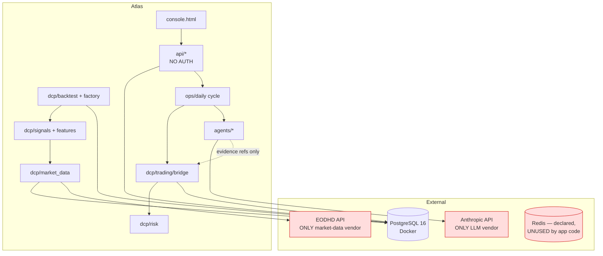
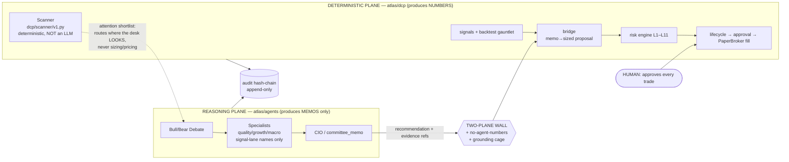

# 20 — Appendix

## A. Glossary

| Term | Meaning in Atlas |
|---|---|
| **Two-plane wall** | Hard architectural boundary: `atlas/dcp/**` (deterministic quant/execution) never imports `atlas/agents/**` (LLM reasoning); agents never touch `dcp.risk`/`dcp.execution`. Enforced by `tests/unit/test_boundaries.py`. |
| **No-agent-numbers** | Invariant: an LLM's output can never become a sizing/pricing/execution value. LLMs produce memos; a deterministic bridge produces numbers. |
| **Measured, never applied** | A research surface (health score, opportunity screen, learning loop, source-pick edge) that is computed and displayed but reaches no capital and changes no behavior. |
| **The bridge** | `atlas/dcp/trading/bridge.py` — turns a signed-strategy BUY memo into a sized, stop-derived, risk-checked proposal (ADR-0006). The only path from reasoning to a trade proposal. |
| **The gauntlet** | The strategy-approval test battery: 1000-path monkey null (p≤0.05), deflated Sharpe ≥0.9 at true lineage count, beat SPY total return (absolute), purged+embargoed walk-forward. |
| **Sleeve** | A capital budget assigned to a signed strategy family (`SLEEVE_BUDGET_FRACTION`). Post-ADR-0017: momentum 40%, PEAD 0%. |
| **The cage / grounding cage** | Runtime check that every numeric token in agent narrative appears verbatim in cited evidence; fails closed otherwise. |
| **Kill leg** | A recipe's pre-committed second trial on a later window; demote-only — a FAIL there is a strike even if the main window passed. |
| **Lineage** | The research line a trial counts against for the deflated-Sharpe multiple-testing penalty (ADR-0016); cannot be renamed to reset the count. |
| **PIT** | Point-in-time: only information knowable at the decision date is used (membership, prices, fundamentals). |
| **The cycle (T0–T9)** | The daily operating pipeline: ingest → verify chain → expire → settle → stops → snapshot → bands/cusum → reconcile → signals → desk → bridge → attribution → core → report → brief. One atomic checkpointed transaction/day. |
| **Demotion band** | ADR-0010 tripwire: DD −40% or 126-session excess −25pp → strategy latches to `suspended` (book to cash). |
| **Arming** | The (unbuilt) human control that would enable live trading; paper mode never requires it. |

## B. Acronyms
ADR — Architecture Decision Record · ADV — Average Daily Volume · CVaR — Conditional Value at
Risk (Expected Shortfall) · DCP — Deterministic Compute Plane (`atlas/dcp`) · DD — Drawdown ·
DSR — Deflated Sharpe Ratio · ETL — Extract/Transform/Load · FIFO — First-In-First-Out (lot
settlement) · GP/A — Gross Profits / Assets (quality factor) · NAV — Net Asset Value · PEAD —
Post-Earnings-Announcement Drift · PIT — Point-In-Time · SUE — Standardized Unexpected Earnings ·
TCC — (macOS) Transparency, Consent & Control (privacy sandbox) · TR — Total Return · TTL — Time
To Live · VaR — Value at Risk · WF — Walk-Forward · xsmom — Cross-Sectional Momentum.

## C. Repository statistics (verified 2026-07-20)

| Metric | Value |
|---|---|
| Production Python (`atlas/`) | ≈ 37,000 LOC across ~186 files |
| Tests | ≈ 36,500 LOC · **~1,515 passing** (pytest, incl. parametrized) · **~1,454** `def test_` functions · 215 files |
| Console UI | `atlas/dashboard/console.html`, ~2,264 lines (single file, inline JS/CSS) |
| Git history | 137 commits, 2026-07-11 → 2026-07-20 (≈10 days) |
| Alembic migrations | 34 (0001 → 0032+) |
| Signed ADRs | 17 |
| Architecture docs | 9 |
| Research reports | 22 |
| DB schemas | market, quant, trading, research, audit, learning, reporting, risk, fxlab (9) |
| Trial registry | 51 trials across 9 lineages |
| Validated strategies | 1 (`xsmom-pit-tr`, state=paper) |
| Test DB isolation | `atlas_test*` only, guarded; self-healing bootstrap |
| CI | `.github/workflows/ci.yml` — ruff + mypy + pytest on Postgres 16 |

### LOC by `atlas/dcp` subpackage
backtest 7,390 · market_data 4,777 · trading 3,435 · research 2,159 · signals 1,570 ·
factory 1,513 · reporting 1,146 · risk 1,123 · features 959 · learning 853 · scanner 334 ·
portfolio 239 · execution 172 · indicators 115.

## D. Folder structure

```
atlas/
├── core/            # config, injectable clock, audit hash-chain repo, db session
├── dcp/             # DETERMINISTIC PLANE (never imports agents)
│   ├── market_data/ # EODHD adapter, ingest, split-adjust, quality gates, calendars
│   ├── signals/     # momentum(live) trend meanrev breakout pead quality (mostly graveyard)
│   ├── features/    # PIT feature store: momentum, volatility, definitions
│   ├── factory/     # Research Factory: recipe grammar, catalog, gauntlet runner, families/
│   ├── backtest/    # engine, portfolio, validation, walk-forward, approval, registry, xsmom/pead/quality runs
│   ├── risk/        # L1–L11 engine, stress, factor-overlap, correlations, vol-target, breaker clearance
│   ├── trading/     # bridge (memo→proposal), lifecycle, exits, core_allocation(retired), settlement
│   ├── research/    # dossier: valuation models, health score, autopsy, opportunity screen (measured-never-applied)
│   ├── reporting/   # attribution, morning brief
│   ├── learning/    # calibration, drift, labeling (MEASURED, NEVER APPLIED)
│   ├── portfolio/   # NAV / holdings math
│   ├── scanner/     # candidate shortlist for the desk
│   ├── indicators/  # SMA/RSI/etc. primitives
│   └── execution/   # PaperBroker (next-open fills)
├── agents/          # REASONING PLANE (never imports risk/execution)
│   ├── roles/       # cio, committee, debate, specialists
│   ├── runtime/     # runner, grounding cage, model registry, budget breaker
│   ├── prompts/     # hashed templates (constitution + per-role)
│   ├── schemas/     # Pydantic — the no-agent-numbers enforcement
│   └── evals/       # memo-quality harness (tracked; WIP, not in the daily path)
├── ops/             # daily cycle, scheduler, analyze, ingest_picks, screen, recipes, alerts
├── api/             # FastAPI read surface + triggers (NO AUTH); routers/*
├── dashboard/       # console.html (live) + Streamlit pages (SUPERSEDED, still present)
├── tools/           # verify_chain, activate_universe, backfill_gics, repin_features, doctor, derive_bands
└── fxlab/           # sealed FX research sandbox (ADR-0008)
```

## E. Dependency graph (conceptual)


*Note the red single-points: one market-data vendor, one LLM vendor, and a Redis dependency
that is declared but not used by any application code (see `10_CODEBASE_OVERVIEW.md`).*

## F. Architecture diagram (the two planes + the wall)


*Two corrections vs. earlier drafts of this figure, both now reconciled to the code and to `02 §5.1`:
(1) the **Scanner is a deterministic DCP module** (`atlas/dcp/scanner/v1.py:15` "deterministic compute
plane"; it is **not** the dormant LLM `scanner_shortlist` role — see `09`), so it sits in the
DETERMINISTIC plane and merely feeds the desk's attention, and (2) the built desk order is
**debate → specialists → CIO** (`atlas/agents/desk.py:122,141` — debate first, specialists "AFTER the
debate, BEFORE the CIO," signal-lane only), **not** specialists-then-debate. The reasoning plane is
therefore **~3 LLM roles**, not six.*

## G. Cross-references
- Full weakness inventory: `16_KNOWN_LIMITATIONS.md`
- Decisions needing validation: `17_OPEN_QUESTIONS.md`
- The reviewer's question bank: `18_REVIEW_CHECKLIST.md`
- Document → source-file map: `19_FILE_INDEX.md`
- Shared factual baseline: `00_GROUND_TRUTH.md`
- Signed decisions: `docs/adr/0001..0017`; architecture: `docs/architecture/01..08`.
