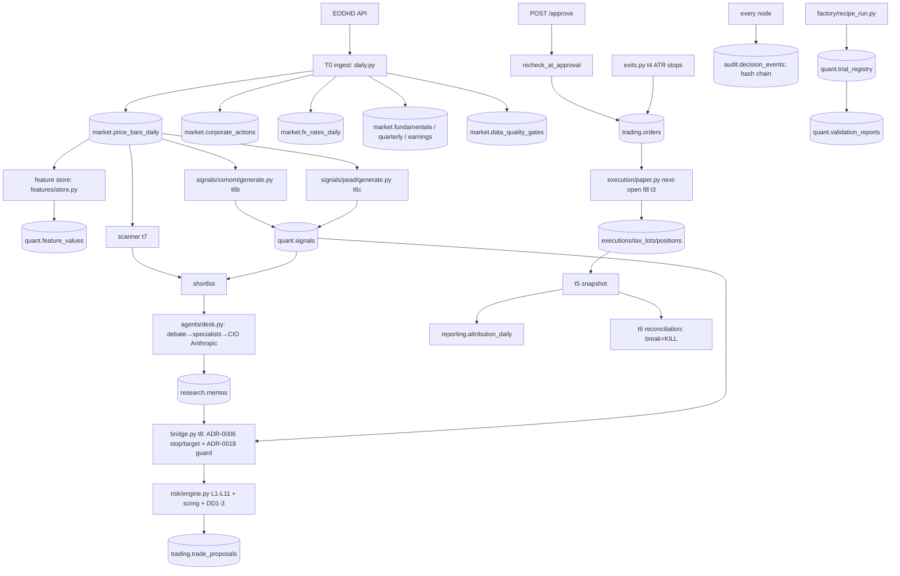

# Atlas — Existing Application: Comprehensive Independent Review

*Independent technical, quantitative and operational review of the existing Atlas equity-research / stock-selection application. This is NOT the Atlas Next rebuild; no Atlas Next architecture was introduced. No remediation was implemented. No push/merge/tag/live-trade occurred.*

---

## 1. Executive verdict

**Overall: RESEARCH RESULTS NOT YET TRUSTWORTHY.**

Atlas is an unusually disciplined paper-trading research system: a clean two-plane architecture, fail-closed risk engine at 100% branch coverage, an append-only audit chain, injectable time in most paths, honest self-documentation, and 1,585 passing tests. Its own governance already downgraded the flagship (`xsmom-pit-tr` → `research_shadow`, ADR-0018) and holds the book at 100% cash.

This review **confirms that downgrade was correct and finds the picture is somewhat worse than the fund's own account**. The untrustworthiness is driven by concrete, verified defects, not vibes:

- **A point-in-time contamination in the "definitive" validation panel** (Critical, F-001): names contribute bars from outside their index-membership era or from a *different company* that reused the ticker — because there is **no issuer identity** and only one membership spell per ticker.
- **Two mechanical backtest arithmetic errors** (F-003 entry-day double-count; F-004 impossible stop fills) that inflate returns and understate drawdowns across the single-instrument lane, reproduced against the real engine.
- **An overstated Deflated Sharpe** (F-005: the code substitutes the minimum-possible trial variance `1/T`), on top of the already-below-gate honest DSR (~0.85 < 0.90).
- **Currency-mismatched alpha** (F-006): an AUD book graded against a USD benchmark.
- **Reproducibility is not achievable**: in-place bar overwrites destroy the inputs past runs saw (F-007), no dependency lockfile, ~30 wall-clock calls, and the documented `make replay` writes fixtures into the production DB (F-017).

None of the 36 High findings the panel raised were refuted on adversarial re-check; one was raised to Critical. The strong parts are genuinely strong (risk enforcement, tie-breaking determinism, liquidity fail-closed, next-open fill honesty in *production*, India-cost avoidance) — but the research evidence chain has enough verified holes that its numbers cannot yet be trusted for capital decisions.

**The system is a credible research platform with correct instincts and a broken evidence chain. It is not yet trustworthy for stock-selection results, and is far from real-capital ready — consistent with, and stronger than, its own ADR-0018 conclusion.**

---

## 2. Repository & commit reviewed

| | |
|---|---|
| `git remote -v` | `origin https://github.com/jkaryampudi/atlas.git` |
| `git branch --show-current` | **`p1-strategy-artifact`** *(expected `p0-research-shadow` per the brief; see note)* |
| `git rev-parse HEAD` | **`d65e0b1db67100de9c89de462481994b07e3cda2`** |
| `git status --short` | *(clean at HEAD; untracked `atlas/agents/evals/` + 3 test files present, **excluded** from verdicts)* |
| Repository name | `atlas` (the brief named `xsmom-pit-tr`, which is a *strategy family*, not the repo) |

**Deviation from the brief (recorded per instruction):** the brief expected repo `xsmom-pit-tr` on branch `p0-research-shadow`. The open repository is `atlas`; the checked-out branch is `p1-strategy-artifact`. **Production application code on `p1-strategy-artifact` is byte-identical to `p0-research-shadow`/`main` (@ `54c55a8`)** — the only delta on `p1-strategy-artifact` is one added design document under `REVIEW_PACKAGE/` (a future-phase artifact, **out of scope** and not reviewed). All findings therefore apply equally to `p0-research-shadow`. The working tree was **not modified** by this review other than the five review documents it was asked to create under `REVIEW_PACKAGE/`.

---

## 3. Commands run and actual results

All commands were actually executed at `d65e0b1` against the local Postgres dev stack.

| Command | Exit | Result |
|---|---|---|
| `pytest -q` | **0** | **1585 passed, 0 failed, 0 skipped**, 1 warning, 84.8s (Postgres reachable, so the integration suite RAN — see §21 for the CI-skip risk) |
| `ruff check .` | **0** | All checks passed |
| `ruff check atlas tests` | **0** | All checks passed |
| `mypy` | **0** | Success — no issues in **132 source files** (strict on `atlas/core`+`atlas/dcp`+`atlas/fxlab`) |
| `make doctor` | **0** | python 3.14.4 ✓, venv ✓, db container ✓, `ATLAS_DATABASE_URL` ✓, 44 tables ✓, EODHD key present ✓ |
| `make verify-chain` | **0** | **audit chain OK: 1,889 events verified** |
| `make cov-risk` | **0** | **100.00% branch coverage** on `atlas/dcp/risk` (483 stmts / 118 branches) |
| CI (`.github/workflows/ci.yml`) | — | ruff→mypy→pytest with a real `postgres:16` service + `alembic upgrade head` landing on `(head)`. Actions tag-pinned (`@v4`/`@v5`); **CI Python is 3.12, local runtime is 3.14.4** (env drift). |
| DB mutation probes (P1-P7, disposable `atlas_test`) | — | see §19; DB restored afterward |

**Environmental blockers:** none for the local run. The 3-agent verification shortfall (see below) was an Anthropic session-rate limit, not an environment issue; those three findings were verified by hand instead.

---

## 4. Architecture & data-flow map

Two planes separated by an AST import wall (`tests/unit/test_boundaries.py`): the deterministic **compute plane** `atlas/dcp/**` (ingestion, features, signals, backtest, risk, trading, execution, portfolio, reporting) and the LLM **reasoning plane** `atlas/agents/**`. Orchestration is a 17-node **T0–T9b daily cycle** run as **one checkpointed transaction per calendar day** (`atlas/ops/daily.py` + `atlas/core/workflow.py`), fired by an **in-process asyncio scheduler** inside the FastAPI process (`ATLAS_INPROC_SCHEDULER=1`, 23:30 UTC cycle, 00:30 UTC `pg_dump`). The console (`/console`, port 8001) is the sole control surface.

**Implemented & exercised (live DB evidence):** 2.47M bars (2010→2026-07-17), 29,058 dividends + 317 splits, 4,377 FX rows, 8,351 quality gates, 1,890 audit events, 85 memos, 26 proposals, 30 risk checks, 51 registered trials across 9 lineages, 426,991 feature values, 61,041 quarterly fundamentals, 60,762 earnings surprises, 7 workflow runs.

**Dormant / planned (explicit):** `quant.backtests` (0 writers, 0 rows — results live in `trial_registry`+`validation_reports`+`docs/reports`); `price_bars_daily.adj_close` (0/2.47M non-null — deliberate raw-store/adjust-on-read); `learning.*`, `memo_outcomes`, `breaker_clearances` (0 rows — machinery wired, nothing matured); `trading.executions/positions/tax_lots` **0 rows — the paper book is 100% cash A$100,000 across all 7 snapshots**; live trading absent by design (`system` router hardcodes `armed:False`); launchd dead (TCC); redis declared-unused; sentiment analyst deferred; candidate signal modules are research-only. **Strategy state (DB):** `xsmom-pit-tr` = `research_shadow`; `pead-sue-tr` = `paper` @ sleeve 0.00; `trend_rs_vol` = `validated` (never promoted); core allocation retired (ADR-0017).

---

## 5. Point-in-time & temporal integrity — **FAIL**

The highest-priority area, and the one with a Critical finding. Atlas gets the *structural* look-ahead controls right in several places (backtests receive `bars[:i+1]`; PEAD `effective_index` maps after-market filings to the next session; ingest fetch windows are past-only; splits apply only with `action_date <= session`) — but the *data substrate* violates PIT in ways that reach the validation evidence:

- **F-001 (Critical):** the `pit-sp500` panel splices bars from outside a name's membership era and, via ticker reuse, from a different company (no issuer identity; one membership spell per ticker).
- **F-007:** `ON CONFLICT DO UPDATE` rewrites historical bars in place with no knowledge-time and no raw retention — a provider revision silently changes what past decisions saw.
- **F-008:** vendor future-dated earnings "actuals" (67 rows with `report_date > fetched_at`) stored as immutable facts → direct look-ahead.
- **F-009:** mixed split-basis EPS after any post-fetch split.
- **M14/M15:** the desk evidence read derives its own "as-of" from the newest stored bars (not decision time); the scorecard grades on price-return excess (ADR-0009 class).
- **M17:** `is_active`/`sector_gics` are single current values mutated in place — a current classification applied to historical observations (latent; no current backtest joins them historically, but the exposure exists).

**Verdict: FAIL.** The look-ahead *logic* is often correct; the *stored data* is not point-in-time, and one contamination reaches the definitive validation panel.

---

## 6. Survivorship bias — **PASS WITH CONDITIONS**

The hard part is done right: the PIT backtest lane is **genuinely survivorship-aware** — early-ending (delisted) series are *kept* (73 delisted names with real member-era bars in the panel), and a held name whose series ends is force-liquidated at its final close (S4). This is materially better than most retail backtests.

Conditions: (a) early-window membership is reconstructed at only ~68% with the *entire* missing mass being departures → a residual survivor tilt in the validation universe (M1); (b) one membership spell per ticker mis-handles re-entrants (M2/M16); (c) the membership snapshot is destructive delete-then-insert with no content hash → not reproducible (M3); (d) the **deployed** signal universe is present-day `is_active` names — survivorship-shaped for live selection (distinct from the backtest); (e) the zero-gap completeness rule drops distress-halted names (FRC/SBNY) from the panel (M27).

---

## 7. Security-master & identity — **FAIL**

The root cause behind F-001/F-002/S2/S3. A security's identity is `UNIQUE(symbol, exchange)`; there is **no ISIN/CUSIP/SEDOL/FIGI anywhere** (grep: 0 hits). Vendor fetch is by symbol; `symbol_change` exists only as a CHECK value with no writer/reader/rows. Consequences: a ticker change breaks lineage; a reused ticker splices a different company's bars onto the old UUID with zero detection; the bridge doesn't verify a cited signal belongs to the memo's instrument (M7/M20). **Verdict: FAIL** — identity is the weakest structural layer and it propagates into PIT and survivorship correctness.

---

## 8. Market data — **PASS WITH CONDITIONS**

Prices are stored raw with split-adjustment and total-return derived on read (a defensible convention, honestly documented). Fail-closed strengths: quality gates redden on missing symbol-days (S9/S22); L10 liquidity fails closed on unknown ADV. Conditions: overwrite-based upsert with no raw retention or revision detection (F-007/M22); corporate actions are first-write-wins so vendor corrections are ignored forever; vendor "splits" feed carries non-split factors applied blindly (F-014); no price-sanity gate (CBE 34,000× series undetected, M29); dividends never refreshed nightly (F-015). **Repeated ingestion is overwrite-based, not idempotent-append** — original provider data is not reproducible.

---

## 9. Corporate actions — **PASS WITH CONDITIONS**

Implemented: splits (with correct direction — spot-checked) and cash dividends, with a single undifferentiated `action_date`. Look-ahead is handled (splits apply only when `action_date <= session`, S19). Missing/weak: reverse splits, special/stock dividends, rights, spin-offs (only partially captured — uncompensated price drops enter the panel as real losses, M28), M&A, delistings (terminal value = final close, optimistic, M30), symbol/exchange changes, return of capital. Announcement vs effective date is not modeled (one date). **Numerical spot checks** confirmed split-factor direction and TR reinvestment on a real dividend; the double-counting risk is in *earnings-basis* (F-009), not price adjustment.

---

## 10. Fundamentals — **PASS WITH CONDITIONS**

The structured fact stores enforce PIT anchors in the right direction in places (`0026` drops `filing_date <= period_end` fail-closed; PEAD uses filing/report dates). But: **F-008** future-dated actuals; **F-009/M8** split-basis drift; **F-010** cross-currency ADR field mixing; **M9** restatement first-write-wins with the original filing date; **M10** peer pools use current `is_active`/`sector` and an 8-day-deep store. Availability is *mostly* anchored on filing/report dates rather than `period_end` alone (good) — but the future-dated-actual hole is a genuine PIT break.

---

## 11. Features & factors — **PASS WITH CONDITIONS**

Inventory: feature store (`momentum_12_1`, SUE, `low_vol_252`); deployed signal math (`xsmom/v1.py`: LOOKBACK 252 / SKIP 21 / TOP_N 10 / SEASONING 252); factory RecipeSpec catalog; research scoring stack (`health_score`, `stock_models`, `valuation_models`, `source_picks`). Strengths: content-hashed feature source (`code_sha` refuses divergence); deterministic tie-breaks; NaN/inf structurally hard to produce (0 NaN in 426,991 values, verified). Defects: **F-010** cross-currency corruption of health/valuation scores; **M24** `mom_12_1` source pick is actually 12-0 (mislabeled, 50 picks snapshotted); **M25** no winsorisation/sanity bounds; the deployed xsmom ranks on split-adjusted **price** closes while the family is named `-tr` (documented in ADR-0018, but the generator docstring still overclaims, M53).

---

## 12. Scoring & stock selection — **PASS WITH CONDITIONS**

Two lanes: a quant signal lane (xsmom → bridge → risk → orders) and a research/desk lane (scanner → LLM memo → proposal). Determinism is strong: pinned `(-formation_return, symbol)` tie-break shared by validated and deployed paths (S12 PASS); the agent lane cannot produce sizing numbers (schema-enforced). Weights are **predefined equal-weight** (not optimised) — good. Defects: **F-012** no monthly sell-side rebalance in the deployed sleeve (diverges from validated); **M18** 5 India ADRs in live ranking absent from the validated universe; **M19** no min-coverage floor at rebalance (a partial-ingest month-end freezes a distorted top-5). No clean research/validation/production config separation.

---

## 13. Backtesting engine — **FAIL**

Two verified mechanical arithmetic errors in the single-instrument engine: **F-003** the entry-day return is double-counted on next-day exits (`>` vs `>=` at `engine.py:96/100`); **F-004** gap-through-stop exits fill *at the stop price* (`engine.py:86-87`), an unobtainable price — the *production* broker is correct (`min(stop, open)`), so the backtest is more optimistic than live. Both reproduced against the real `run_backtest`. Cost model is a flat 5bps commission + 5bps slippage side-signed (identical in backtest and paper — consistent, S21), but FX conversion cost is unmodeled. Delisting returns are *included* (good) but at an optimistic final-close terminal value. **These are result-invalidating: reported single-lane returns are inflated and drawdowns understated.**

---

## 14. Performance metrics — **PASS WITH CONDITIONS (metrics), feeding a FAIL backtest**

**F-005:** Deflated Sharpe substitutes `V[SR]=1/T` (the minimum possible) for the empirical cross-trial variance — the DSR is overstated by construction, compounding the honest below-gate value (~0.85). **F-006:** alpha differences an AUD book against a USD SPY total-return series — FX-polluted. Annualisation (252), tie-breaks, and drawdown logic are otherwise sound. Reported returns are **net of the 5/5bps cost model** but the metric *names* overstate (`-tr` family ranks on price returns; scorecard "SPY-relative excess" is price-return both legs). Risk-free rate is assumed 0 (so "Sharpe" is really an information-ratio-to-cash).

---

## 15. Statistical validity & overfitting — **PASS WITH CONDITIONS (leaning FAIL)**

Discipline exists (register-before-run in the factory, lineage-scoped DSR per ADR-0016, null-model gate, purged walk-forward). But: **F-021** the WF gate counts absolute-positive folds, not folds beating the benchmark (a bull-beta strategy passes); **F-023** lineage tags are self-declared outside the factory (DSR deflation gameable); **F-022** the ADR-0018 re-promotion gate has a legacy conditional hole; **F-024** `pead-sue-tr` is authoritative `paper` on failed-kill evidence; **M40** no mechanically-reserved OOS holdout — all 23 momentum-lineage trials reuse one 2012-2026 window; **M45** no sensitivity analyses in code; **M43** no per-trial code pin, `dataset_version`/`hypothesis` NULL on 43/51 rows (ADR-0018 finding 3 still open). Backtest performance is **not** proof of future returns and the multiple-testing controls are partially bypassable.

---

## 16. Risk management — **PASS WITH CONDITIONS**

The strongest subsystem. L1-L11 + DD1/DD2/DD3 + sizing at **100% branch coverage**; FAIL is terminal with no override path (verified — no bypass flag); every rule always evaluates (no short-circuit); fail-closed on unknown ADV/missing stop/degenerate correlation/NAV≤0; kill-on-reconciliation-break. Conditions: **F-011** the §12 momentum overlay is dead (`MUTANT_no_such_state`); **M35** no execution-time re-check or price collar at fill; **M36** STRESS/FACTOR/VOL not re-evaluated at approval; **M37** §7 stress is one-scenario-deep with rate betas 0 and an unreachable gate; **M38** FactorCaps/stress/vol caps are code constants outside the dual-confirm governance that L1-L11 enjoy; **M39** limit_set v2 still grants SPY/INDA a 0.60 cap post-core-retirement.

---

## 17. Paper-trading & execution readiness — **PASS WITH CONDITIONS**

Verdict: **paper-trading ready with material conditions; not controlled-live ready.** The lifecycle is genuinely robust — next-session-open fills with honest shortfall, FIFO lots, ATR stops with `min(stop, open)`, reconciliation=kill, idempotent settle, single-transaction daily atomicity. But: **F-016** zero API authentication on state-mutating endpoints incl. approval; **F-025** the scheduler is a single unsupervised process and cycles were missed 2026-07-16/19/20; a failed cycle leaves no durable record (M56) and re-spends the LLM budget (M57); **M54** 16/18 voided proposals emitted no `proposal.voided` audit event (invariant-4 already violated in live data). The book is 100% cash, so no capital is at risk today.

---

## 18. Reproducibility & determinism — **FAIL**

Within one environment, reruns reproduce at metric precision (seeded RNG, deterministic tie-breaks, injectable clock in most paths — S25). Across time/environments it does **not**: **F-007** in-place bar/FX overwrites destroy the inputs past runs saw; **M43/ADR-0018-#3** no per-trial code pin, `dataset_version` NULL on most rows; **M47/M49** no dependency lockfile (floor ranges only) and Python 3.14.4 runtime vs the 3.12 pin; **M48** ~30 wall-clock calls in `atlas/` despite invariant-6, with no conformance test (already violated at `ingest_picks.py:97`); **F-017** `make replay` writes fixtures into the prod DB. Past research results **cannot** be reconstructed or independently verified from retained artifacts — the ADR-0018 non-reproducibility finding is confirmed open.

---

## 19. Database integrity — **PASS WITH CONDITIONS**

Schema is well-formed (UUID PKs, FKs, uniqueness, sensible indexes), transactions are scoped, SQL is parameterised (no injection found — all `text()` uses `:params`). The audit hash chain is real and detects payload tampering and interior deletion. **Direct probes on disposable `atlas_test`** (restored afterward):

| Probe | Result |
|---|---|
| P1 triggers in DB | **0** — no DB-level immutability anywhere |
| P3 owner UPDATE of an audit payload | **succeeded** — INSERT-only grant does not bind the owner role the app connects as |
| P4 `verify_chain` after payload tamper | **DETECTED** (payload hash mismatch) ✓ |
| P5 `verify_chain` after **tail** deletion | **NOT detected** — chain valid & shorter (**F-020**) |
| P6 `verify_chain` after **interior** deletion | **DETECTED** (prev_hash link mismatch) ✓ |
| P7 owner UPDATE of a historical price bar 100→250 | **succeeded, silent** — no trigger, no content hash, `verify_chain` doesn't cover `market.*` |

Conditions: **F-019** the chain hash omits `entity_type`/`entity_id`/`actor_*`; **F-020** tail truncation blind spot; **F-018** ABBA advisory-lock deadlock; **M50** append-only is application convention only; **M51** bar/FX upserts rewrite history dropping `quality_flags`/`ingested_at`; **M52** the single-transaction cycle defeats checkpoint-resume.

---

## 20. Security — **PASS WITH CONDITIONS**

No secrets tracked (`.env` gitignored; no `sk-`/key literals in source); no `pickle`/`eval`/`shell=True`/`verify=False`; SQL parameterised; CI actions tag-pinned; conftest refuses any non-`atlas_test` DB. But: **F-013** the live EODHD key travels in the URL and leaks into the audit chain + logs via `raise_for_status()`; **F-016** zero API authentication; **M46** no Host-header/CORS/CSRF hardening (DNS-rebinding reaches the loopback API from a browser); **M47** unpinned dependencies with no lockfile. The only current access control is the 127.0.0.1 bind (ADR-0018's own framing) — adequate for a single-operator laptop, inadequate for anything beyond it.

---

## 21. Test quality — **PASS WITH CONDITIONS**

1,585 genuine, mostly outcome-asserting tests; audit tamper + deletion is tested; goldens pin numeric outputs; fixtures are sha256-pinned (memo eval corpus); property tests exist. Real gaps: **M31** ~745 tests (the entire integration + constitution suites) **silently skip when Postgres is unreachable**, and CI has no zero-skip enforcement (locally they ran because PG was up; a PG-less CI would go green having tested almost nothing structural); **M32** grant-based immutability is never exercised as the connecting role (so P3/P7 above were never caught); **M33/M48** invariant-6 has no conformance test and is already violated; **M34** the two-plane-wall test is blind to relative/dynamic imports; **F-020** tail-truncation is untested; no test hand-verifies backtest arithmetic (which is why F-003/F-004 survived). Several tests would pass even if the protection they claim were broken.

---

## 22. Documentation vs code — **PASS WITH CONDITIONS**

Documentation is unusually honest (ADR-0018 candidly downgrades the flagship). Key discrepancies:

| Documented claim | Actual | Status |
|---|---|---|
| Deployed generator: "THE RECIPE, unchanged from the validated run" (`generate.py:12-16`) | Deployed ranks on price returns; top-5 vs validated top_n=10; extra India ADRs | **DOES NOT MATCH** |
| CLAUDE.md "1515 passing" | 1,585 passing at HEAD | **PARTIALLY** (count stale) |
| "Injectable time, never `datetime.now()` — tests enforce" | ~30 wall-clock calls in `atlas/`; no enforcing test | **DOES NOT MATCH** |
| "Every backtest registers a trial" | Holds in the factory; non-factory runners register-after-run; engine unguarded | **PARTIALLY** |
| ADR-0009 approval bar = beat SPY **total** return | Scorecard/attribution grade on **price**-return excess in places; AUD-vs-USD | **PARTIALLY** |
| "Deterministic replay → gate=green" | True in a test context, but `make replay` targets the prod DB | **PARTIALLY** |
| Audit "append-only" | Application convention; physically mutable by the owner role; tail-truncatable | **PARTIALLY** |
| Risk L1-L11 enforced (Doc 04) | True and 100%-covered; but §12 overlay dead, §7 stress one-deep, caps as constants | **PARTIALLY** |
| ADR-0017 core retired | True in code; limit_set v2 still grants SPY/INDA 0.60 | **PARTIALLY** |

---

## 23. Adversarial-scenario results (25)

**PASS (6):** S11 liquidity (L10 fail-closed + ADV cap), S12 identical scores (pinned tie-break), S14 timezone (UTC-anchored), S20 India costs (structurally avoided via ADRs), S23 zero/negative denominator (explicit None), plus S25 same-commit rerun reproduces within one environment.

**HIGH-severity actual behaviour (6):** S1 provider revision silently rewrites history (F-007); S2 ticker change breaks lineage (F-002); S3 ticker reuse splices a different company (F-002); S10 backtest engine fills gapped stops at the stop price (F-004 — *production* is correct); S18 historical DB row update only partly detected (F-019/F-020); S19 corporate action look-ahead handled but no post-effective reconciliation for held names.

**MEDIUM (11):** S4 delisting (backtest good, live unresolved), S5 after-close filing (correct mechanism), S6 amendment (first-write-wins), S7 late constituent download (strong + honest, but not reproducible), S8 no price on rebalance day (fail-closed), S9 suspension (protected but stateless), S15 duplicate records (silent last-wins), S16 partial-commit retry (DB atomic, LLM spend not), S17 raw file modified (features hashed, prompts/seeds not), S22 security disappears (fail-closed), S24 NaN/inf (structurally hard, no write-boundary guard). **LOW (2):** S13 row order (well-defended), S21 US costs (FX cost missing).

Full per-scenario expected/actual/evidence/severity/control is in `ATLAS_FINDINGS_REGISTER.md` and the scenario appendix.

---

## 24. Prioritised findings

**Critical:** F-001 (PIT panel wrong-era/wrong-issuer contamination).
**Top High:** F-002 (no issuer identity) · F-003/F-004 (backtest arithmetic) · F-005 (DSR 1/T) · F-006 (currency-mismatched alpha) · F-007 (in-place bar overwrite) · F-008 (future-dated earnings actuals) · F-013 (API key in audit chain) · F-016 (zero API auth) · F-020 (audit tail-truncation) · F-021 (WF gate not benchmark-relative) · F-024 (pead authoritative on failed kill).
Full register: `ATLAS_FINDINGS_REGISTER.md`.

---

## 25. Final readiness verdict

| Dimension | Verdict |
|---|---|
| Code quality | **PASS WITH CONDITIONS** |
| Data integrity | **FAIL** |
| Point-in-time correctness | **FAIL** |
| Survivorship-bias control | **PASS WITH CONDITIONS** |
| Quantitative methodology | **PASS WITH CONDITIONS** |
| Backtest credibility | **FAIL** |
| Risk controls | **PASS WITH CONDITIONS** |
| Reproducibility | **FAIL** |
| Paper-trading readiness | **PASS WITH CONDITIONS** |
| Real-capital readiness | **FAIL** |

**Overall: RESEARCH RESULTS NOT YET TRUSTWORTHY.**

The system's engineering discipline is real and its governance already reached the right conclusion about its flagship. But the *research evidence chain* — data identity, point-in-time substrate, backtest arithmetic, the DSR statistic, currency consistency, and reproducibility — has enough independently-verified defects that its stock-selection outputs cannot yet be trusted for capital decisions. The remediation roadmap (`ATLAS_REMEDIATION_ROADMAP.md`) sequences the fixes; the first increment is the backtest-arithmetic correction (P0), because it is small, self-contained, hand-verifiable, and gates the credibility of every number downstream.
